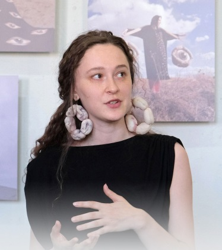
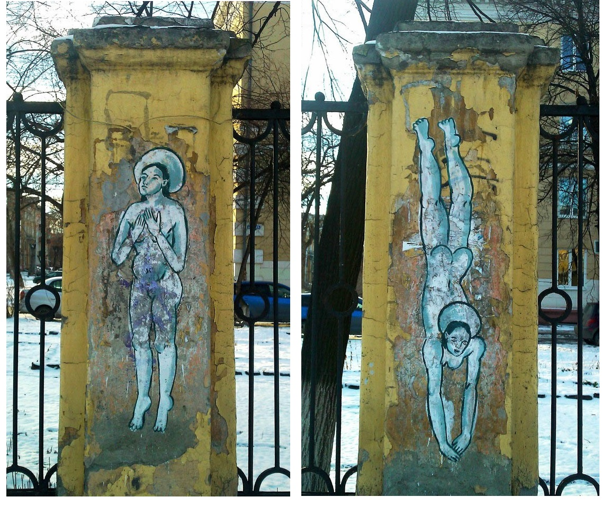
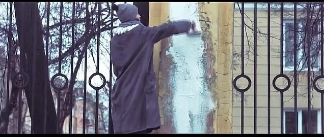
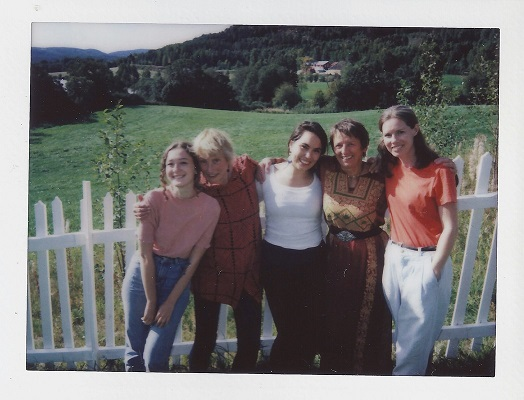

# Горшенина Алиса

Дата рождения: 1994  
Место рождения: с. Якшина, Свердловская область  
Стили и направления: фольклор, модерн-арт  
Страница в интернете: <https://alicehualice.com>

## Черновик биографии

Родилась в с. Якшина, Свердловская область. Отец Алисы, по профессии механизатор, был художником-любителем; он самостоятельно выучился живописи маслом и писал космические абстракции, рисовал и ваял фантастических существ. Алиса начала активно рисовать еще в детстве, отчасти, из-за отсутствия в деревне других развлечений. Родители решили отправить дочь в художественную школу после того, как обнаружили на обоях гуашевую «фреску» с изображением египетских богов. Как пишет Анна Толстова, и жизнь в деревне, и увлечение Древним Египтом оказали влияние на творчество художницы ([Наперекор Бажову. Алиса Горшенина: женские корни волшебной сказки](https://www.kommersant.ru/doc/6666335)).

Из воспоминаний о детстве: 

> Мы [дети] наряжались, красились и пели колядки: "Пришла коляда, отворяй ворота!"

> Уже тогда в деревне не хватало работы, мужчины любили прикладываться к бутылке. Бывало, что урожай не поспеет – и все голодные.

> У меня, наверное, довольно банальная история. Она начинается в детстве. Меня и старшую сестру родители с детства называли художницами, потому что у нас папа-художник. Правда, у него нет художественного образования, он рисовал «для себя». Нам, можно сказать, внушили мысль о том, что у нас есть художественный ген, который передается из поколения в поколение. Я в это активно поверила: у меня было ощущение, что я родилась уже наделенная способностью рисовать. Но это было не на пустом месте. Мы действительно много времени занимались творческими вещами: ставили театральные постановки, бесконечно рисовали. Я это связываю с тем, что наше детство прошло в маленькой деревне. Там было мало людей: сейчас осталось около 200 человек, в детстве было в 2 раза больше. У нас не было никаких развлечений, и мы себя развлекали, как могли. В деревне было немного детей, но качели были одни, и мы вставали в 6 утра и за них дрались каждое утро. В общем, для меня искусство изначально было способом занять себя. Что-то сделать, чтобы мне было нескучно.

В шестилетнем возрасте с семьей переехала в Нижний Тагил. О жизни в городе отзывалась негативно, называла его «городом с мертвой энергетикой», посвятила ему цикл работ «Уральская кома».
По словам девушки, за этим словосочетанием стоит особое ощущение задавленности местом, испытать которое могут только те, кто родился на Урале. Возможно, такое восприятие связано и со школьным детством, которое у Горшениной было непростым. «С пятого по девятый класс я чувствовала себя белой вороной, школа была для меня кошмаром, – вспоминает она. – Одноклассники надо мной издевались, и ладно бы били за мои убеждения или за то, что я хорошо учусь. Меня травили за кудрявые волосы, и это осталось со мной до сих пор: я чувствую себя некомфортно, если ничего не сделала с волосами и вышла из дома. Все остальное простила. В десятом классе я начала краситься и выпрямлять волосы – и меня приняли. И когда это произошло, я вернулась к своему прежнему образу».

> Я представляю мой город как нечто зеленое, но в железном панцире — Тагил сочетает в себе природное и промышленное.

> ...К сожалению я не по наслышке знаю о домашнем насилии, в моей семье есть родственники, которые познакомили меня с этим явлением. Одна история не выходит из моей головы вот уже больше пятнадцати лет. В шестом классе я чудом избежала смерти от рук родного дяди. Тогда мы жили с ним под одной крышей. Его жена (моя тётя) умерла, отравившись палёной водкой, и у них остался несовершеннолетний сын. Поскольку его родители не были официально женаты, мама решила оформить опекунство, чтобы обеспечить ему лучшую жизнь. Так две семьи оказались в одной квартире. Часто случалось, что, приходя из школы, мы с дядей оказывались дома вдвоём. У него были серьёзные проблемы с алкоголем, хотя он пытался их побороть. Однажды я делала уроки, когда он вернулся с работы. Он выглядел спокойным и сразу прошёл на кухню. Спустя минут десять я услышала странные звуки, заглянула и увидела его, сидящего среди пустых бутылок из под водки. Он мычал что-то невнятное и смотрел на меня с какой-то дикой злостью. Я схватила телефон и убежала в дальнюю комнату, понимая, что он может быть опасен. Я затаилась и прислушивалась ко всему, что он говорит. В какой-то момент он начал кричать, называл меня сукой, говорил что убьёт меня, если я расскажу всё маме. Потом я услышала как открывается выдвижная полка, где хранились вилки, ложки и ножи. Я поняла, что если не постараюсь убежать сейчас, то дальше может быть поздно. За секунды я выбежала из комнаты, пересекла зал, промчалась мимо кухонного дверного проёма и увидела, что он стоит там с ножом в руках. Я выскочила в коридор, открыла входную дверь и выбежала в подъезд. Очнулась уже на улице, в паре кварталов от дома, стоя в пижаме и тапках, со сжатым в руке телефоном. Я пришла на работу к маме и всё ей рассказала.

(https://storynavigation.com/user/alicehualice)

2011-2016 Учеба на Художественно-графическом факультете НТГСПА (сейчас Факультет Художественного образования НТГСПИ).

Первоначально художница планировала двигаться в направлении графики, рисования иллюстраций. Идея начать работать с тканью пришла Алисе на третьем курсе. Соседки по общежитию делали русских народных кукол и забыли на ее кровати пакет с тряпочками, которые использовались для их изготовления. Алиса решила сшить из тряпочек голову того персонажа, которого она в данный момент рисовала. Держа в руках результат, Алиса поняла, что открыла что-то новое, и текстиль стал основным направлением ее творчества.

2013-2016 Арт-группа SECONDHAND

Арт-группа SECONDHAND, идеологами которой являются три молодых тагильских художника, включая Алису Горшенину, появилась в 2013 году. Её ценностью стали отжившие своё вещи - видоизменяясь, они становились частью различных творческих проектов, экспозиций. По словам Алисы, на худграфе преобладало классическое образование, и современному искуству уделялось мало внимания. На третьем курсе из-за этого Алисе стало скучно, что и привело к идее создания арт-группы.

> Коллектив появился, когда я училась на худграфе. Тогда преподаватели нам постоянно рассказывали, как было круто раньше — арт-группы, тусовки. Моих одногруппников это особо не интересовало — многие хотели просто закончить институт и после преподавать. А я и два моих друга хотели создавать искусство. Мы вместе организовывали выставки в Нижнем Тагиле. В самом начале нашего пути мы сделали несколько мероприятий, благодаря которым поняли, насколько в нашем городе насыщенная арт-среда.

Сентябрь 2015 - Участие в III Уральской индустриальной биеннале

Наиболее заметным событием в жизни группы стало участие в III Уральской индустриальной биеннале в сентябре этого года: на выставке «Ремейк» появилась «Шарлотта» Алисы (ремейк на известную работу американского скульптора Луизы Буржуа), а в кинотеатре «Красногвардеец» - тотальная инсталляция квартиры, выполненная из старых ненужных вещей. (https://mstrok.ru/news/v-nizhnem-tagile-na-iii-uralskoj-industrialnoj-biennale-mobilizirovali-realnost.html)

> Индустриальное в моей практике присутствовало, когда я будучи студенткой стала участницей группы SECONDHAND. Мы просуществовали недолго — всего 3 года. В нашем городе проходил фестиваль, и организаторы фестиваля предоставили в пользование художникам заброшенное здание, чтобы мы могли осуществить свои проекты. Это был огромный старый кинотеатр, мы создали в нем имитацию заводского цеха и назвали его УЗПИ — «Уральский завод производства искусства». Мы придумали легенду, по которой этот завод, занимавшийся экспериментами с новыми материалами, оказался нерентабельным. В инсталляции повсюду лежали сломанные произведения искусства. Это была игра, но при этом проект отражал критическое отношение ко всему индустриальному. [...]
>
> Мы [...] случайным образом узнали об Уральской индустриальной биеннале и решили, что хотим в ней поучаствовать. Это интересная история. Отбор уже закончился, но мы подумали, что очень смелые, сели в машину и поехали в Екатеринбург. Нашли организаторов, сказали: «Мы арт-группа, хотим участвовать в биеннале». Они были шокированы, сказали, что у нас есть время до конца дня, чтобы прислать концепт. Мы быстро поехали из Екатеринбурга назад в Тагил и всю ночь готовили проект. Для него мы и заявили себя как арт-группа SECONDHAND. В итоге нас взяли.

(https://vladey.net/ru/news/168)

Октябрь 2015 - Семь святых дев худграфа

В октябре 2015 года произошло крайне значимое событие, с которого начинается известность нашей героини как скандальной художницы. У здания Худграфа на проспекте Мира есть забор, который находится в собственности города, а не института. Для ремонта городского имущества необходимо решение администрации города, поэтому часто этот забор находился в плохом состоянии. Сейчас, в 2026 году, он отремонтирован, но в описываемый период штукатурка, покрывающая столбы забора, во многих местах отваливалась. Алиса, которая тогда училась на четвертом курсе, решила подарить своему факультету хранительниц в виде обнажённых святых. «Я решила, что худграф у нас это будет храм творческий, а святые девы – его хранительницы. Они встречаются не только в христианстве, а во многих религиях. Семь дев – это такие мученицы за худграф, художницы, - поясняла Алиса Горшенина. - Мне очень нравится обнажённое женское тело, я считаю, что оно само по себе выглядит эстетично. Умиротворённые позы, тут они спортивные, танцующие… Мы использовали такие стены, которые на фиг никому не нужны, они все в ошмётках, страшные».

Фрагмент росписи "Семь святых дев худграфа", 2015

По первоначальному замыслу это должен был быть триптих "Ода худграфу"; из трех работ удалось воплотить две: роспись арки с изображением парящих обнажённых женщин и "Семь святых дев худграфа" на столбах забора. Именно это название получило широкую известность. На автора обрушилась резкая критика: на факультет начали приходить разгневанные местные жители и, угрожая пойти в администрацию города, требовали немедленно убрать «богохульные картинки». Историю создания этой работы Алиса описывала так:

> Я рисовала днём, не скрывалась, разговаривала с прохожими. Помню только интерес, никто не говорил ничего плохого. Я закончила и уехала в родную деревню Якшина, чтобы снять фотопроект. Вдруг позвонили с худграфа и сказали, чтобы я немедленно стёрла рисунки. Я объяснила, что не могу — поезд ходит раз в день, он уже уехал. Потом в институте рассказали, что люди приходили жаловаться. Сказали закрасить работу. Я позвала друга снять видео и записала дурацкое обращение, где глупо и эмоционально рассуждаю, что со мной поступили несправедливо. Мы выложили его в интернет. У дев над головами были нимбы, это и стало основой для обвинений. Говорили, что я сделала работу с умыслом, чтобы поднять шумиху и заявить о себе.
> 
> Дальше начался вальс событий: вызов в полицию, круглые столы, на которых меня отчитывали, угрозы в соцсетях и постоянный стресс. Меня поддерживали только родители и несколько преподавателей, я очень благодарна им. Меня не отчислили, хотя декан написала заявление в полицию. Мы договорились с участковым, что я закрашу рисунки на арке и больше не будет претензий. Я не смогла закрасить сама, за меня это сделал папа. Ещё года три любая новость обо мне сопровождалась сноской, что я та богохульная девчонка, которая испортила репутацию худграфа. Отношения с местным зрителем, как мне кажется, так и не наладились.

«Прохожие обвиняли и в богохульстве, и порче городского имущества, кто-то был возмущён голыми телами. Как сказал наш декан, я испортила лицо худграфа, - рассказывала Алиса. - Дело в том, что худграф давно мечтает о ремонте этих столбов и они считают, что, после того что я там нарисовала своих дев, ремонта им не видать. В общем, мне сказали немедленно всё закрасить, иначе меня ждёт отчисление. Как я ни пыталась узнать, каким образом связано моё уличное искусство с обучением, так мне никто и не ответил».

- https://draco-argento.livejournal.com/333103.html
- https://mstrok.ru/news/obnazhyonnye-svyatye-devy-hudgrafa-v-centre-nizhnego-tagila-zakrasheny.-avtora-obvinili-v-bogohulstve-video.html

Алиса Горшенина закрашивает стенную роспись, 2015

Декан факультета Наталья Кузнецова давать оценку поступкам студентки не стала, заметив только, что Алисе тем самым удалось обратить внимание общественности на ужасное состояние всего фасада худграфа. «Есть в этой ситуации бесспорный факт: Алиса активизировала эту проблему с обшарпанными столбами и арками. Фасад итак был испорчен, это наша головная боль. Забор принадлежит муниципалитету, конечно, жалко, что в самом центре Тагила он так плачевно выглядит», - рассказала АН «Между строк» Наталья Кузнецова. (https://mstrok.ru/news/hudgraf-pedakademii-prokommentiroval-skandalnye-risunki-obnazhyonnyh-svyatyh-dev-v-centre-nizhnego-tagila.html)

Андрей Санников, поэт и политический деятель из Екатеринбурга, который резко отрицательно оценивает творчество Алисы, в подкасте [Национальный вопрос](https://radiokp.ru/podcast/nacionalnyy-vopros/735472) на радио "Комсомольская правда" обосновал, почему эта работа оскорбляла чувства верующих:

> Скажу, что это за семь святых дев, над кем она издевалась. Дело в том, что в начале IV века были сильнейшие гонения на христиан, и 7 дев христианских были приговорены к казни. А так как римляне были людьми интеллигентными, культурными, законопослушными, у них не полагалось казнить девственниц. Поэтому девственниц надо было, извините, сначала лишить девственности. Специально приглашенные люди, когда пришли лишать девственности этих 7 святых дев, они увидели, что это старухи седые, застыдились и убежали. И тогда римляне, для того чтобы одновременно и казнить, и законодательство не нарушать, привязали камни к их шеям, связали этих святых женщин и утопили. Вот Горшенина этих святых женщин вниз головой голыми нарисовала на столбах худграфа.

Эти древнеримские события описываются в источнике [Страдание святаго мученика Феодота и с ним семи дев: Фаины, Клавдии, Матроны, Текусы, Иулии, Александры и Евфрасии](https://ru.wikisource.org/wiki/Жития_святых_по_изложению_свт._Димитрия_Ростовского/Май/18#549) (книга "Жития святых по изложению свт. Димитрия Ростовского").

Скандальная история этой уличной росписи широко освещалась в прессе. Алиса вспоминала, что тогда ей тяжело было заходить в общественный транспорт: ее везде узнавали, говорили гадости. В соцсетях также появлялось много гневных сообщений в ее адрес. Кое-кто из друзей Алисы пытался "пристроиться" к ее скандальной славе, игнорируя ее чувства и переживания. Это заставило ее почувствовать "глобальное одиночество". Среди тех, кто выступал в защиту Алисы, была основательница галереи «Кубива» Ксения Кошурникова. Она написала в соцсетях:

> Для всех, кто мне пишет и спрашивает про Алису: отличные рисунки! И понятно, что стрит-арт не вечен, и я вообще бы не подключилась к этому обсуждению, и мне противно всё это. Но я хочу заступиться, раз уж худграф засунул язык в жопу вместе с преподавателями, как и всегда впрочем... Но я заступалась за каждого студента... Если вы помните. И сейчас я не понимаю, из-за чего вся эта буча, грозящая отчислением, что это за собрание? Я не понимаю, чему верующие оскорбились? И ваше отношение к картинкам, моё отношение к этим картинкам не важно, суть не в этом, выразительные они или нет. По мне, так очень удачно она вписала фигуры в профанную среду колонны. И это действие Алисы не имело намерения устроить скандал

(<https://v-tagile.ru/novosti-nizhnego-tagila/obshchestvo/v-pamyat-vsem-pogibshim-proizvedeniyam-iskusstva-tagilskie-khudozhniki-vozlozhili-traurnye-venki-k-mestu-gibeli-semi-svyatykh-dev-khudgrafa-foto>)

Новости об этом скандале дошли и до других стран. По информации в [архиве Анны Киященко](https://www.pixnoy.com/post/6821482040184324211019/), один мужчина из Нью-Йорка попросил Алису перевести стрит-арт в живопись и купил ее за 500$.

Чувство подавленности, возникшее у Алисы после этой истории, стало основой проекта "Уральская кома", в ходе которого художница устраивала перформансы с тряпичными масками в различных местах: в электропоезде, в заброшенных зданиях, возле гаражей. Перформанс с Пучей в электричке мне представляется едва ли не самой значимой работой Алисы; в нем есть что-то такое, что хорошо отражает суть жизни на Урале. Тогда у Алисы были мысли уехать из города, однако, какая-то связь с этим местом помешала ей сделать это. Позднее у Алисы появилась возможность путешествовать, побывать в Москве и за границей, и она поняла, что самое походящее место для нее - именно в Нижнем Тагиле. Одним из преимуществ нашего города перед большими городами Алиса называла близость природы: можно пройти пешком 10 минут, и ты уже на природе. Хотя самые сильные чувства Алиса испытывала не к Тагилу, а к родной деревне, идею вернуться туда она отметала как невозможную.

Период 2016 - 2021. Участие в выставках и проектах

Июль 2016: Картина для бара "Гора" (<https://russianartarchive.net/ru/catalogue/document/F6068>)

С 2016 по 2021 год ничего скандального с Алисой не происходило. Она принимала участие в различных проектах и выставках, как российских, так и международных, некоторые из них довольно значительные. Рассмотрим некоторые из них. 

В 2017 и в 2020 участвовала в Триеннале российского современного искусства в музее "Гараж".

2018: Персональная выставка "Уральская шкура" в одном из павильонов ВДНХ, в рамках победы в программе "Взлёт на ВДНХ".

Август 2018: Участие в резиденции Sondre Green, для художниц работающих с текстилем, в Норвегии. Организация Norwegian Textile Artists пригласила её на месяц в художественную резиденцию, которая ежегодно открывает двери для талантливых мастеров. Это был первый случай участия художницы из России за всю историю проекта.

«В заявке нужно было прислать описание проекта, который я хочу реализовать в резиденции. Проекты для меня сложная вещь — я так никогда не работаю. Никаких идей заранее нет в моей голове. Поэтому я решила рискнуть и написала, что моё пребывание в резиденции и есть мой проект, своего рода эксперимент. Так как я работаю с уральской локацией, мне было важно понять, что я могу сделать, находясь далеко от места, которое, как я думала, на меня сильно влияет», — рассказала Алиса Горшенина корреспонденту «Афиши МС» (https://mstrok.ru/news/hudozhnica-iz-nizhnego-tagila-stala-pervoy-rossiyankoy-priglashyonnoy-v-izvestnuyu-art).

Резиденция расположена в доме на берегу озера живописной фермы рядом с норвежским городом Норесунд. Инициатором проекта является художник Кристин Линберг, которая хотела создать творческую площадку для развития текстильного искусства и налаживания связей между художниками-текстильщиками со всего мира. Принимающая сторона оплачивает участникам перелёт и проживание. Алиса признавалась, что плохо владеет английским языком, поэтому со своими соседками общалась с помощью онлайн-переводчиков и собственных рисунков. У каждой художницы была своя мастерская. За продуктами Алиса ездила до ближайшего магазина на велосипеде.

В резиденции Sondre Green, 2018

2019: Получила грант Музея «Гараж» для художников, работающих в сфере актуального искусства. Вошла в лонг-лист премии «Кандинского».

Сентябрь 2019. Выставка «Русское инородное»

В сентябре 2019 Алиса организовала собственную выставку «Русское инородное» в родной деревне Якшина.  Выставка состояла из текстильных инсталляций, которые художница разместила на улицах, во дворах, на домах и в домах. Из пустых проемов окон заброшенных изб на местных жителей и гостей, приехавших из Нижнего Тагила, Екатеринбурга и Москвы, смотрели огромные глаза, у покосившегося колодца их встречала загадочная фигура, напоминающая невесту, а на берегу реки Ирбит маячила еще одна – мрачная, в черном сюрреалистичном платье, с помятым старушечьим лицом. Колорита всему происходящему добавляли сами якшинцы – их на сегодняшний день осталось около двухсот. «Больше всего я боялась реакции земляков, – рассказывает Алиса. – Мои работы не всегда легко понять. К счастью, все, кто присутствовал, остались довольны». По словам художницы, простые жители деревни лучше, чем опытные искусствоведы, поняли ее работы.

Горшенина говорила, что после этой выставки многое в ее восприятии родной деревни перевернулось: 

> Я увидела, что Якшина – живая, что земля не остыла и все продолжается. Мы приехали заранее, чтобы монтировать выставку, и случайно попали на праздник урожая в местный клуб. Я участвовала во всех конкурсах! Люди продолжают жить, несмотря ни на что, и получать удовольствие от того, что находятся здесь. Они не виноваты в том, что деревни больше никому не нужны.

(https://www.thesymbol.ru/fashion/geroi/chto-nuzhno-znat-o-25-letney-uralskoy-hudozhnice-alise-gorsheninoy)

Смысл названия выставки Алиса объясняла так:

> Для России деревня - это что-то инородное. Забытое, никому не нужное. Но при этом оно до сих пор существует, и на это нельзя закрывать глаза. Когда я туда приезжаю, я не могу понять, что не так. Там до сих пор есть люди, они не собираются умирать. У меня там живет тетя, она делает евроремонт. То есть жизнь продолжается. Но при этом как будто вся страна - и правительство - закрывают глаза.

2020: Участие в выставке "Русская сказка. От Васнецова до сих пор" в Новой Третьяковке, персональная выставка "самоискусствление" в музее ART4 (https://borsch.gallery/bauktsion/alisa-gorshenina)

В 2021 году проект художницы «Русское инородное» был выдвинут на 13-ю Премию Кандинского в номинации «Молодой художник. Проект года».

В конце 2021 года на шестой Уральской биеннале Алиса и другие художницы и экоактивистки объединились и высказали организаторам критику по поводу выбора цирка как одной из площадок. Протестующие пытались привлечь внимание к проблеме эксплуатации животных в цирках. Мало кто поддержал этот протест, и после этого Алису перестали приглашать на крупные российские выставки.

2022: Штраф за дискредитацию Вооруженных сил России

В 2022 году художницу оштрафовали на 35 тыс. рублей за дискредитацию Вооруженных сил России. Дело было заведено из-за антивоенной акции: девушка стояла на улице с белой розой и лентой, содержащей надписи против военного конфликта (https://www.gazeta.ru/social/2025/04/26/20938946.shtml).

Первый штраф Горшениной выписали весной 2022 года. Изначально ей вменили «участие в одиночном пикете с использованием агитационного материала» (20.2 КоАП РФ), но затем переквалифицировали дело на статью «о дискредитации ВС РФ» (20.3.3 КоАП РФ). Девушка поднялась на Лисью гору с белой розой, на которой была подвязана лента с антивоенным лозунгом на чувашском и татарском языках (https://dzen.ru/a/aIodp7mt1g47jqFJ)

2023 - Выставка «Пугало стояло в центре вспаханного поля»

Судебные процессы вокруг Горшениной выходят за рамки ее онлайн-активизма. Художница регулярно участвовала в выставках, в том числе в «Ельцин-центре». В 2023 году в центре прошла выставка Горшениной, названная «Пугало стояло в центре вспаханного поля». Критики, включая известного кинорежиссера Никиту Михалкова, обвиняли художницу в демонстрации опасной тенденции, когда искусство размывает границы между нормой и крайностями.
«Основная часть экспозиции — выпотрошенные чучела и сшитые органы человека. Можно над этим бесконечно смеяться, но на самом деле это очень опасная тенденция, когда абсолютно все в буквальном смысле — например, мусор — может считаться искусством», — обрушился тогда с критикой на художницу кинорежиссер.
Не последнюю роль в скандале сыграло ее сотрудничество с группой Pussy Riot (признаны иностранными агентами). В одном из клипов, над которым группа работала совместно с Горшениной ("Swan lake"), говорилось о растаптывании останков бойцов специальной военной операции (СВО), а также о поджоге Останкинской телебашни. (https://dzen.ru/a/ZXA_XwVHbEnYjcK0)

Январь 2024 - Приняла участие в съемках документального сериала «Тонкой нитью», посвященного культуре народов России, режиссер - Соня Горленко. Алисе посвящена пятая серия, «Алиса в Коми» (https://tagilcity.ru/news/2024-01-08/tonkoy-nityu-hudozhnitsa-iz-tagila-snyalas-v-seriale-pro-narodnuyu-kulturu-rossii-3147032?utm_source=yandex.ru&utm_medium=organic&utm_campaign=yandex.ru&utm_referrer=yandex.ru).

В 2024 году был отменён мастер-класс Горшениной для мам в Ельцин Центре, посвящённый Дню защиты детей. Причиной стали жалобы от общественного движения «Зов народа», «Комитета по защите семьи, вопросам отцовства, материнства и детства», а также содружества ветеранских организаций «За други своя» (https://dzen.ru/a/aIodp7mt1g47jqFJ)

2025 - Выставка "Эхо" в Hamuncenter, Норвегия (https://hamsunsenteret.no/en/the-hamsun-centre/the-exhibition/Gorshenina).

Апрель 2025 - Арест

Суд в Екатеринбурге арестовал художницу Алису Горшенину на 10 суток за демонстрацию запрещенной символики в социальных сетях, а также за пропаганду нетрадиционных сексуальных отношений и дискредитацию российской армии. Этот арест стал продолжением ее конфликтов с властями, связанных с активизмом и участием в громких акциях и выставках, в том числе в «Ельцин-центре». По данным уральских СМИ, в ее социальных сетях нашли значок «радужный эмодзи» (https://www.gazeta.ru/social/2025/04/26/20938946.shtml). Вот что сама Алиса писала об этом:

> 24 апреля я пришла в отдел полиции на составление административного протокола, как выяснилось позже протокол был не один, а три: ч. 1 ст. 20.3.3 КоАП РФ «публичные действия, направленные на дискредитацию использования ВС РФ», ч 3. ст. 6.21 КоАП РФ «пропаганда нетрадиционных сексуальных отношений», и ч. 1 ст. 20.3 КоАП РФ «публичная демонстрация экстремистской символики» - по этой статье предусмотрен арест до 15 суток.
> По итогу меня задержали, ночь с 24 на 25 апреля я провела в подвале отдела полиции в Нижнем Тагиле, до сих пор не могу забыть это.
> Утром 25 апреля меня отвезли на суд в Екатеринбург, все судебные процессы проходили в этом городе, поскольку материал для протоколов был обнаружен здесь.
> По результатам первого суда мне назначили административный арест 10 суток. С 25 апреля по 4 мая я сидела в местном спецприёмнике, сутки, которые я провела в подвале и отделе полиции Нижнего Тагила были зачтены в срок.
> Не уверена, что хочу сейчас говорить что либо о спецприёмнике, поэтому скажу кратко цитатой из личного дневника, который я вела все эти дни - «это не невыносимое место, но находиться здесь невыносимо». [...]
>
> По делу о дискредитации мне присудили штраф в 45 000₽, по делу о «пропаганде нетрадиционных отношений» 100 000₽. [...]
> Пока я сидела, мой дорогой муж объявил сбор, и собранных денег хватит, чтобы покрыть все расходы, в том числе услуги адвоката и оплату штрафов...

(https://www.pixnoy.com/post/6724352734674168232360)

Алиса считает, что причиной были ее публикации в социальной сети, а с клипом "Swan lake" обвинения никак не связаны.

Июль 2025 - Отъезд из России

Известная художница из Нижнего Тагила Алиса Горшенина покинула Россию. Об этом она написала в своих соцсетях (https://dzen.ru/a/aIodp7mt1g47jqFJ)

> …это, безусловно, один из худших раскладов, который только можно было вообразить. Для меня это большое горе, которое невозможно выразить словами. Реальность больно колется со всех сторон, и я ничего не могу с этим сделать. Проговорю ещё раз, потому что знаю, найдутся люди, которые станут меня поздравлять, для меня отъезд из России - горе. Я до сих пор не осмыслила это, не приняла, не смирилась. Да, невозможно игнорировать то, что происходило со мной в последние годы - давление, доносы, отмены, штрафы, суды, допросы, угрозы, подвал, спецприёмник, но я как-то справлялась, пока была такая возможность, сейчас и её нет и мне очень больно. [...]
>
> Сейчас в моём распоряжении чемодан летних вещей и небольшие запасы денег, которые я откладывала на ремонт своей любимой квартиры в Нижнем Тагиле. Я живу так уже несколько месяцев, и этого надолго не хватит… В ближайшие дни я опубликую пост со ссылками на все галереи, где можно приобрести мои работы, а пока вы можете посмотреть то, что можно купить лично у меня, в актуальных сторис и на сайте

После этого живет в Тбилиси, Грузия.

Декабрь 2025 - получила французскую визу таланта, начала искать европейские проекты для сотрудничества.

**Творчество**

Художница создает текстильные работы, маски, коллажи, рисует, фотографирует, работает с керамикой и занимается анимацией. Но особая любовь у нее все-таки к текстилю. При помощи ткани она творит собственные мифы, создает скульптуры, при этом рассказывая свою личную историю. Тагильчанка известна не только в нашем городе, но и по всему миру. Ее работы участвовали в экспозициях 3-й и 4-й Уральской индустриальной биеннале, выставлялись на ВДНХ и в Новой Третьяковке, а также на многих международных выставках (https://dzen.ru/a/aIodp7mt1g47jqFJ)

Является постоянной участницей проектов Уральского филиала ГСЦИ ("Всё не то чем кажется", "Бажов-фест", "Неслучайные связи", "Местные", "Приручая пустоту").

Работает в соответствии с авторской концепцией «самоискусствления» — сближения жизни с искусством. Редекорируя найденные объекты, она создает язык персональных символов, в котором особенно важную роль играет уральская идентичность художницы. Горшенина работает с практикой ряжения, техниками декоративно-прикладного искусства и мифологиями. Работы Алисы Горшениной входят в коллекцию музея «Эрмитаж-Урал».

По мнению Анны Толстовой, главной героиней работ Алисы является сама художница, которой, "несмотря на программную автопортретность, удается придать личной мифологии универсальный характер".

**Личная жизнь**

В 2017 вышла замуж за Сергея Власова, художника и музыканта (https://russianartarchive.net/ru/catalogue/document/F6245).

Страница ВКонтакте: <https://vk.com/hualice>

Источники: 
- https://www.thesymbol.ru/fashion/geroi/chto-nuzhno-znat-o-25-letney-uralskoy-hudozhnice-alise-gorsheninoy
- https://borsch.gallery/bauktsion/alisa-gorshenina
- https://vladey.net/ru/artist/alisa-gorshenina
- https://mstrok.ru/news/seychas-prishlo-vremya-zhenshchin-hudozhnic-alisa-gorshenina-o-bespolom-iskusstve-lyubvi-k
- https://www.kommersant.ru/doc/6666335
- [Интервью с Викторией Мусвик "Алиса Горшенина. Я максимально серьезно отношусь к фотографии"](https://experiment.gallery/viewing-rooms/alisa-gorshenina-intervyu-2/)
