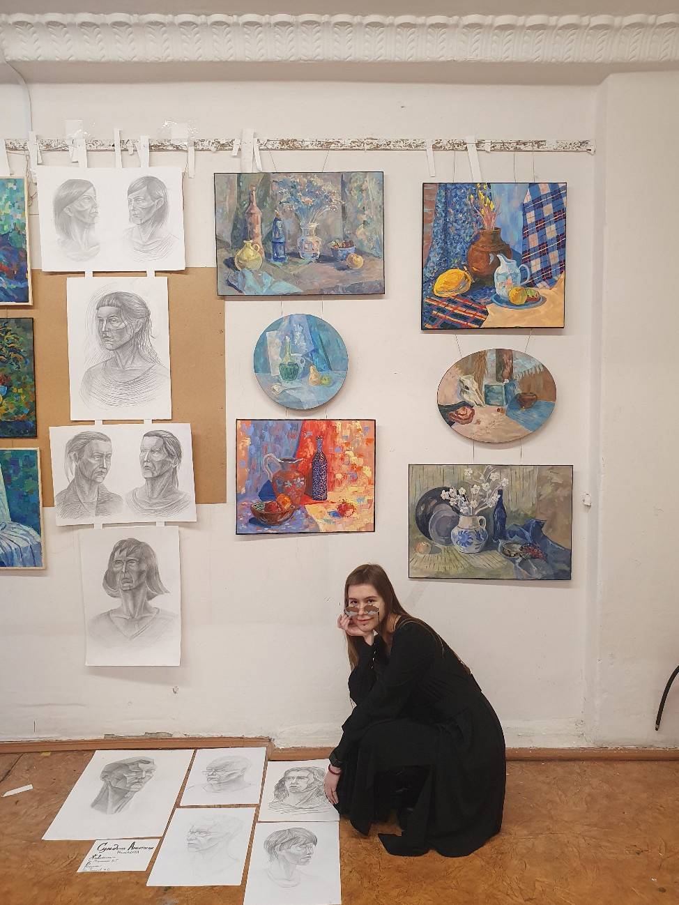
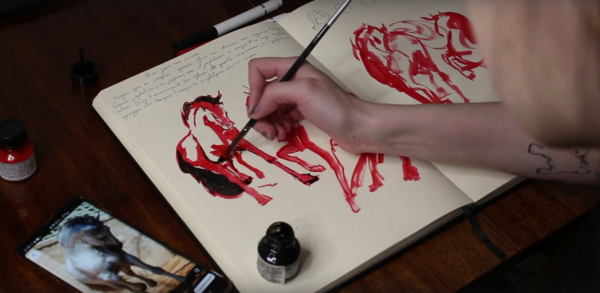
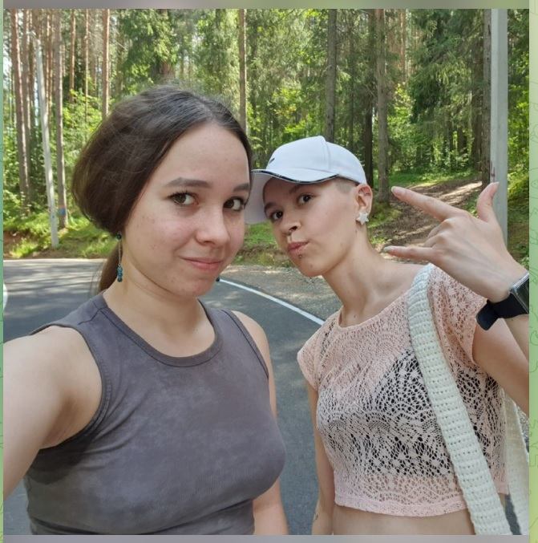
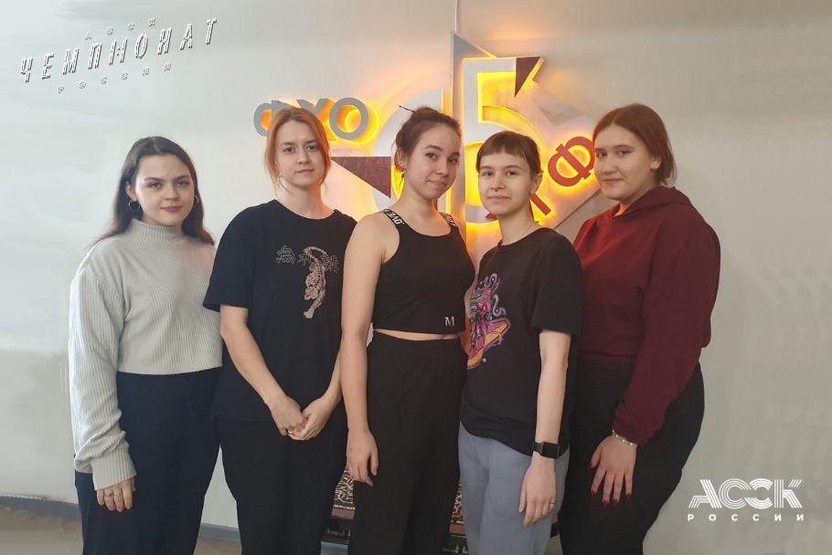
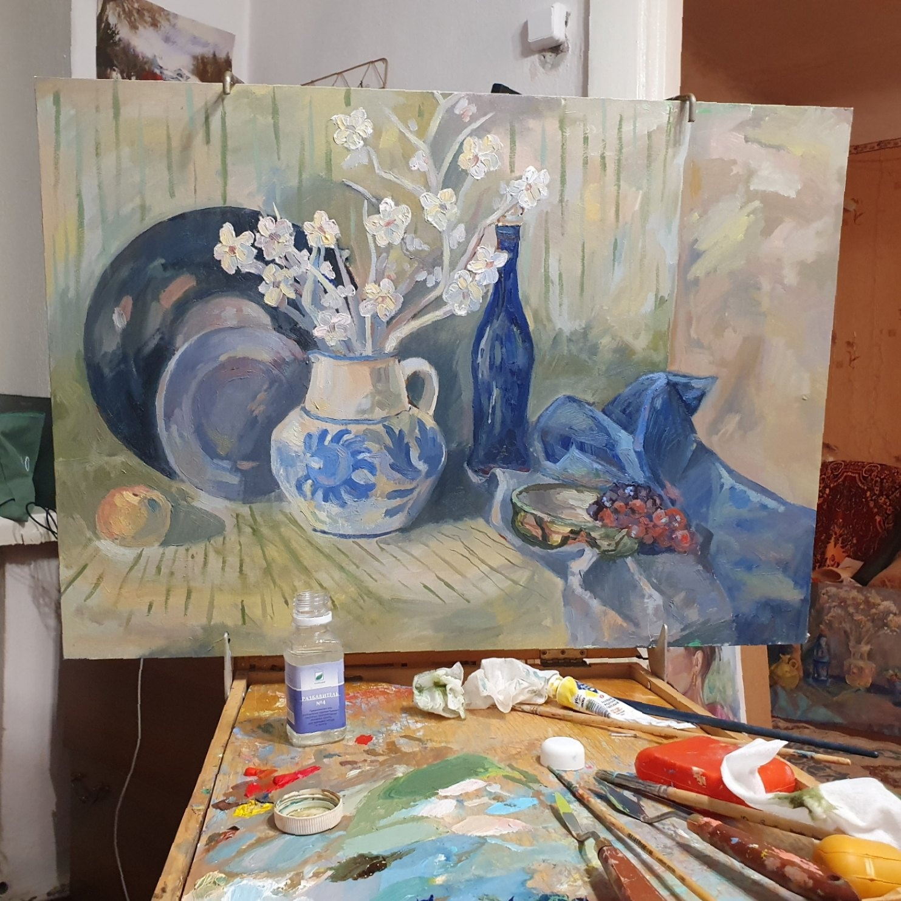

# Арнаутова Анастасия Александровна
## Черновик биографии


Страницы в интернете:
- https://t.me/s/otvalmaski
- https://vk.com/mental_mask

Родилась в октябре 2004 г. в Краснотурьинске.

Анастасия писала, что отца у нее не было. 

О семье: 

> Все больше задумываюсь о том, что у нас может получиться семейный рабочий состав театра: я-художник декоратор/костюма, средняя сис Анчоус- актриса (ходит в театралку), младший бро Санек- хореограф (ходит на бальные танцы), самая мини Лиза пока ищет себя. Семья гуманитариев.

2022 г. - поступила на ФХО НТГСПИ (Изобразительное искусство и дизайн). Живет на съемной квартире на Руднике им. III Интернационала.


Комната Анастасии на Руднике

2023 г. - исполняла обязанности физорга в НГСПИ.

2023: Поездка на пленэр в Баранчинский с Виталиной Чураковой, Ангелиной Новоположской, Светланой Апретовой и Елизаветой (фамилия неизвестна).

https://www.youtube.com/watch?v=8A0ScOMRgq0

Я сделал стенограмму этого видео не из-за важности работ, выполненных на этом пленэре, а скорее из-за того, что оно дает представление о том, как художницы общаются между собой. Также оно дает кое-какую информацию о личности Виталины.

```
(В электропоезде)
Лина: (Позирует для фото)
Аста: Я видео снимаю
Лина: А... Oh my... Мы едем в Баранчу
Аста: Мы еще не доехали...
Лина: Это наш сопроводитель, которая нас выведет и которая ответственна за наши неудобства вообще... 
Лина: (Показывает на Лизу)
Аста: (Виталине) Ваши слова насчет поездки?
Вита: Я надеюсь, мы не потеряемся.
Аста: Ну, надежда умирает последней.

(На горе в окрестностях поселка Баранчинский, дует сильный ветер)
Света: Приехали за город рисовать, вот девченки... Аста посмотри, поздоровайся.
Аста: (Машет рукой) Всем привет!
Света: Виталина, Ангелина. Вот мы. Тут у нас Баранчинская, там где-то... коровы где? Вон там они, маленькие. Это телята. 
Света: Там тоже дельше коровы, камера, скорее всего, не передает. Вот так вот, на пленэр приехали.
(Лина позирует для фото)
Аста: Я видео снимаю
Лина: Почему не уведомляете?
Аста: Ха-ха-ха! О, козы.
Аста: (Снимает вид леса на горизонте) Супер лук!

(На реке)
Света: Вы набрали воды?
Лина: Да.
Света: Отлично!
Лина: Ты снимаешь?
Света: Да
Лиза: (Передразнивает) Я снимаю!
Света: Ха-ха-ха! Я тоже набираю водицу. Красота в глазах смотрящего.
Лиза: Я знаю, что я красивая.
Лина: Я самая пи...я!
Света: Ха-ха-ха

(На обеде)
Аста: С кого начнем обзор по дню? У нас обед. (Свете) Давай! Ваши впечатления, ощущения?
Света: Речка чистая...
Аста: Ноги мокрые...
Света: Ха-ха-ха
Лина: Ну так мы присели разок.
Света: Да все хорошо... 
Лина: Ваше здоровье! (Отпивает)
Света: Работа идет, передаю слово моим коллегам.
Лина: Спасибо!
Аста: Лина реально как какой-то прошаренный пленэрщик
Лина: Вы знаете, как выживший какой-то в лесу, я люблю такие темы, потому что я и на пикник хочу вас затащить в лесу.
Аста: А это че, по твоему? (Показывает шоколадный батончик Picnic) Демо версия?
Лина: Демо версия. Ну, чисто, пикник.
Аста: Пока полгруппы не придет, полной версии не будет.
Лина: Короче, вообще все четко, едим бутики.
Аста: Ха-ха-ха
Лина: Лиза целует ланч-бокс, потому что он этого достоин.
(Все смеются)
Лина: Он нас спасет в это время.
(...)
Аста: Продолжаем. Кому слово следующему?
Лина: Я передаю Виталине, потому что я очень довольна, все нравится.
Вита: Супер, я довольна, что меня вытащили порисовать... Я не рада, что меня заставили рисовать.
Аста: Две крайности.
Вита: Ха-ха-ха. А рисовать это... Не, все круто!
Лиза: Сегодня... Ха-ха-ха
Аста: Дорогой дневник...
Лиза: Сегодня я впервые в своей жизни experience...
(Все смеются)
Лиза: Experienced this beutiful nature... Ха-ха-ха.
Аста: Так, обзор по дню. (Снимает себя в капюшоне на фоне окружающей природы). 
Аста: Я конечно похоже на...
Лиза: Бомжа?
Аста: Нет, на яблоко, ха-ха-ха. Обзор по работам. Что мы сделали до перерыва?
Аста: (Показывает картину, прикрепленную к этюднику) Оно отлетает и держится на скотче, во всех смыслах. Жаль изоленты нету.
Аста: (Показывает картину) Почему не gory? Tagil?
Лиза: Это Баранча.
Аста: Я тебе больше скажу, в Гугле, в Яндексе, когда ты вбиваешь "Баранчинское", там дополнительно пишется, что это Нижний Тагил.
Лиза: Че?
Аста: Ну типа то, что неподалеку.
Лиза: (Твердо) Это поселок Баранчинский!
Аста: Блин, все это спрятано. Обзор по дню, по перерыву окончен, я хочу есть.

Аста: Снимаем реакцию на васаби
(Виталина пробует)
Аста: Причем на картинке там прям нормально обвалено, я не знаю.
Вита: О, прикольно! Мне нравится.
Аста: Да она просто обманывает.
Вита: Не, серьезно, кстати.
Аста: Ха-ха-ха
Лина: Мне, б..., нравится.
Вита: Я люблю васаби.
(Лина пробует)
Лина: ... не, послевкусие прикольное.
Лиза: Вкус арахиса классный.
Лина: В принципе пойдет.
Света: Щас найду самую, вот... 
Аста: Заваленную?
Света: Заваленную (Пробует)
Лина: Не рассасывай, не надо...
(Все смеются)
Света: Знаете, я покупала Нори, обваленные в васаби, но там жопа была
Лина: Чья?
Света: Все хорошо.
Света: (Передает Лизе) Пахнет как?
Лина: Як пахнэ?
(Все смеются)
(Лиза пробует, отходит, брызгает в рот водой)
Аста: Ха-ха-ха
Света: Снимай, снимай!
Лина: Освежитель воздуха...
Аста: Да Лиз, не все так плохо.
Лиза: Ну, на вкус как чеснок, я ненавижу чеснок.
Лина: Да, кстати, я хотела тебе сказать об этом.
Аста: Давайте, последний. 
Аста: Мне теперь страшно это пробовать, потому что с этим вообще... "Норм", и Лиза - "Эээ".
Аста: Я сейчас к Лизе добавлюсь. (Пробует)
Аста: Хотя... 
Лина: Да не, нормально. Послевкусие
Аста: Мне это напоминает наоборот, сухарики с хреном. Но я не люблю арахис.
Аста: (Пробует еще, смеется) Не, штука прикольная.
Вита: Кто хочет больше?
Аста: Я такой штукой заниматься не буду.
Лина: Ну, вода есть.
Вита: У меня там целый литр.
Света: Раз, два, три. (Виталина, Лина и Света пробуют)
Аста: Я сейчас понимаю Лизу. Я на них смотрю, и че-то как-то вот так...
(Света морщится, остальные смеются)
Аста: Света... Этим смешно, Лина - хомяк...
Света: Сидим на горе все еще. Прошло уже время пол первого.
Света: Солнышко, вот оно, над головой. Рисуем, я их рисую, а они меня, надеюсь.
Света: Дует ветер, все сдувает. Кто-то сдулся уже, сидит как может
Света: (Снимает Лину, которая рисует, сидя на земле)
Света: (Асте) Как ваше ничего?
Аста: Замечательно, а ваше?
Света: Ни...я
Аста: Кхм-кхм
Света: (Снимает коробку с водой, в которой плавают насекомые)
Света: Плавают жуки... Или нет?
Света: (Снимает Виталину за работой)
Вита: Работу чуть не сдуло, вот так улетела...

Света: Нам сейчас деревенские дети тут...
(Виталина залезает на дерево)
Аста: Виталина, я тебя умоляю!
Лиза: Скорая сюда не доедет
Света: К слову, высота два метра, тут ветка отломится... Виталина, держись за что-нибудь!
Света: Слушай, тут не очень мягко, не падай!
Света: Сезон Виталины на деревьях объявляю открытым.
Вита: Весело!
Света: Слазей давай, весело ей

Света: Хожу в лесу, собираю грибы и тут от меня убегает птичка
Света: Ой, его не видно, он такой маленький
(Снимает птицу, похожую на дрозда)
Света: А че ты такой маленький? Да, птица? Такой маленький, смотри.

Аста: Включение. Как ваше настроение?
Лина: Да ваще... Я готова здесь жить! Еще бы еда не кончалась...
Аста: Виталина?
Вита: (Показывает палец, поднятый вверх)
Аста: Полазила, довольная
Вита: Да, я стерла все руки
Лина: Я пересрала сто раз
Лиза: (С пакетом на голове) Я чувствую себя космонавтом

Света: Перешли из березового леса вон там в сосновый. Вон там девченки расположились за кустом... Не видно. 
Света: А Виталина убежала в лес, я пошла ее искать.
Света: Вот в этой яме, там типа вот яма, там 100% медведь спал.
Света: Догнала Виту, вот она, наконец-то. Никуда какать не села, слава Богу. И мы нашли шалаш.
Вита: (Трогает рукой шалаш)
Света: Да не ломай ты, господи. Вот тут яма для запасов... А здесь костер был.
Света: Тут спать. Тут я понимаю уже воняет в лесу.
Света: Вернулись с Виталиной. Лиза сидит в мусорном пакете, ест.
Лиза: Это дождевик
Света: Девченки тут сидят, и скоро у нас будет гроза. 
Света: Вот сейчас солнце светит, а там гроза идет, и гремит уже все.

(На перроне)
Аста: По сегодняшнему дню отчет.
Лина: Знаете, я чувствую себя мегакрутой, потому что я сделала 4 работы и за вчера, и за сегодня!
Вита: Мне не дали погулять по лесу, я расстроена...
Лина: (Гладит Виталину по голове) Мы беспокоимся.
Аста: Зато живая!
Аста: Свете не дали посмотреть Тик-Ток.
Света: Я была уставшая с утра, потом у меня был прилив бодрости.
Света: Потом, когда я поняла, что у меня ни одна работа не получилась, у меня этот прилив бодрости абсолютно иссяк... Сейчас я хочу домой.
Лиза: Мне мама позвонила, а у меня голос грустный был. 
Лиза: Мне это не понравилось, но, скорее всего, все в порядке.
Лина: Я че у всех все плохо, я не поняла?! Я одна тут такая... 
Аста: Не переживай, не ты одна, нас двое. (Снимает себя, смеется)
Света: Такая ноздря, знаешь.
Аста: А сколько я? Я сделала пять работ.
Лина: (Показывает гусеницу на ладони)
Аста: Билет на гусеницу поменяла.
Света: Это зюзя! (Смеется)
```

2024 г.

- В феврале 2024 г. участвовала в выставке-конкурсе "Арт-дуэль" в Екатеринбурге. "В целом по результатам голосования «победила дружба». Выставка от ХГФ получила одобрение членов профессиональной комиссии и баллы за «атмосферу и целостность представленной экспозиции»." (https://vk.com/wall-4891369_8002)
- Участвовала в выставке "Вдохновляйся! Действуй!" в Доме художника.
- Лагерная практика: Северянка 1 смена 08.06-21.06
- Ноябрь 2024 г.: Участвовала в форсайт-сессии «Вожатый. Компетенции будущего», где ее команда заняла 1 место (https://www.ntspi.ru/events/5/80958/?sphrase_id=73859).
- Сменила фамилию и отчество с Сульдина Анастасия Константиновна на Арнаутова Анастасия Александровна (фамилия прабабушки).


На выставке-конкурсе "Арт-дуэль", 2024 г.


На выставке "Вдохновляйся! Действуй!", 2024 г.

2024-2025 гг. - имела отношения с неизвестным парнем, которые завершились неудачно. Анастасия ждала его из армии, а он в определенный момент перестал активно с ней общаться.

Из видео в Телеграм:

> Я уже в который раз пытаюсь перезаписать эту историю, потому что я ухожу то в лес, то по дрова, или история о том, как за один вечер бросить все мысли о бывшем. Ведь вся моя жизнь - анекдот, попытки найти настоящую любовь - просто сплошная драма. Я люблю ушами, и нассать в уши мне как нехер делать. Какой вывод сегодня сделала я себе о всех вот этих вот крайних отношениях. По сути, действий было предпринято каких-либо практически ноль с той стороны. Были постоянные обещания, какие-то слова просто в никуда, которые подкреплены ничем, и опять же любимый холод, ура, который буквально тебя начинает сводить с ума. 10 из 10, в каком-то смысле потом еще начинается газлайтинг, а вот образ, который остался, такой добрый, теплый, где тебя принимают. На словах, пускай, но тебя принимают, вау, кто-то посторонний, помимо твоей семьи, он оставался фоном, и мне было тяжело как-то двигаться вперед, пускай, что-то там где-то прошлое, я даже работу посвятила этому своему бывшему. Сегодня как раз был разговор с психологиней насчет моей агресии и насчет того, что по сути это какой-то мере является газлайтингом. Все, сессия окончена, я не агрессивная, оказывается это нормальная реакция, когда тебе что-то не нравится и ты встаешь в позу и проявляешь свой характер. Я поняла, что мне в очередной раз нассали просто в уши, потому что я удобная. Типа "А, ты идешь в армию, хорошо, типа я ждать не буду, точнее не обещаю, но мы попытаемся". Хорошо, да, все таки я сделаю исключение, одену на себя розовые очки и разобью их сама себе линзами, которые я разобью сама себе в глаза. Потому что начинаешь сходить с ума, ну короче там, держи тебе там подарок на Новый Год, я всегда тебя выслушаю, я постоянно на телефоне, я тебя жду. А потом ты видишь, как появляются какие-то кружки в канале, ты видишь, что появляется человек в сети, но тебе ничего не пишет. И возникает дохерища вопросов, на что тебе дают ответ либо там "Все хорошо", супер сухой и непонятный, начинает человек путаться в показаниях своих, либо вообще просто игнор. Ура, круто, классно, и я сейчас понимаю, что я была удобной, чисто для того, чтобы у человека было меньше стресса из-за того, что он уходит в армию и есть тот, кто его ждет. Потом чувства просто пропали, о котором мне ничего не сказали. Вывод сей басни таков: не нужно плакать по чечикам, которые просто что-то говорят, обещают, но при этом нихера не делают, например, не могут тебе отправить письмо их армии - боже, это так сложно - не могут тебе позвонить, написать "С добрым утром", а идут выкладывать кружочки в канал, где занимаются всякой херней. Ну короче, я снова прошляпилась, я наконец-то уже это признала, и можно жить дальше! Шлем нахер всех таких тюбиков и не нужно тратить на них свои нервы.

Март 2025 г. - Пыталась подрабатывать моделью на своем факультете, но и здесь нашу героиню преследовали неприятности. Работать было тяжело, так как в аудитории было холодно, и студенты постоянно заходили в аудиторию по середине занятия. Кроме того, некоторые рисущие стали без разрешения скидывать ее фотографии тем, кто не ходил на занятия.

Из видео в Телеграм:

> Я хотела написать пост о том, что у меня очень сильно горит очко, но букв настолько много, что мне проще записать кружки, которые никто не посмотрит, либо посмотрит 3 человека, либо они разошлются по всем небольшим, так скажем, участникам нашей подгруппы, чтобы обсудить этот вопрос. Кто-то скажет, что я вообще охерела, кто-то меня поддержит и так далее, но не важно. Мне главное вылить свое говно, потому что у меня сегодня настолько очко сгорело, это... хоть стой, хоть падай.
> Начинаем с предыстории: я согласилась в своей подгруппе постоять моделью, обнаженной, потому что никто, собственно, не соглашается, кто-то стесняется, для кого-то это неудобно, пятое-десятое. ОК, мне насрать, постою за копейки. Я понимаю, что нужно делать задание всем, у меня это задание просто уберут. ОК, как бы, вроде бы я не в минусе. Человек я вечно опаздывающий, поэтому у меня еще вначале спросили, а ты не будешь опаздывать? Ни разу, блядь, не опоздала, в отличие от моих любимых одногруппников. И знаете почему у меня так горит, меня рисуют три человека полноценно, из двенадцати нахуй. С другой стороны, блин, да радуйся, что тебя рисует меньше человек, да нихуя подобного. Потому что потом подходя все остальные и начинается хождение по мукам, блядь. Ты стоишь нахуй полуголый, в одних трусах, холодно, блядь, тебе в спину дует, обогреватель нихуя не греет, у тебя нога затекает, еще все сука туда-сюда, дверь открыли, посмотрели, пятое-десятое. Еб твою мать, что за балаган, блядь.
> Или мы все-таки находимся в учебном, блядь, заведении, и все-таки нужно придти чуть-чуть пораньше на пару, чтобы выложить масло, подготовить палитру, краски, халат надеть, нет, нужно приехать уже тогда, когда началась пара. Сегодня, блядь, два человека на паре за три минуты до звонка. Что насчет остальных? А нахуй нам надо! Мне далеко ехать, так мне тоже нахуй далеко ехать с Рудника. Я в 7:45 специально выхожу, потому что потом ты хуй уедешь. Либо на забитом 34-м, если он дай Боже появится, а так следующий автобус только в 8:50 двойка. Будь моя воля, я бы на ней ездила, потому что на ней 25 минут, в отличие от других автобусов, которые едут 40. А что? Почему студентам можно опаздывать, блядь, а мне нет? Ну типа, а что? Все равно я типа приеду эти полчаса тоже, все равно они будут туда-сюда ходить, искать мольберты, блядь. Искать, сука, свое масло, искать палитры, выкладывать. А ты стоишь нахуй полуголый, в этой незакрытой аудитории, и что? Уважение к друг другу есть? О, бля, нихуя. Это первый аспект, который меня сегодня прям так... ух нахуй. Это просто, я считаю некрасиво, вы можете иметь любое мнение, мне на это похуй, это мой канал, высираю что хочу и обсираю что хочу.
> А теперь перейдем к тому, из-за чего у меня очко сгорело, блядь, не знаю сколько раз. Я значит, добрая душа, разрешила себя сфотографировать. Ну потому что, во-первых, ракурсы постоянно меняются, позы постоянно меняются, какие-то более удачные, какие-то нет, плюс ко всему, чтобы потом была возможность дома дописать. Все прекрасно понимают, нет, надо было нахуй переотправлять мои фотографии кому-то другому, кого на парах не было, без моего разрешения. Мне абсолютно похуй, что мы являемся одной подгруппой, одной группой, так давайте в общий чат сразу блядь кидать, а что? Этика у нас не существует, зачем она нам, нам же надо делать задания. А спросить у меня русским языком написать "Аста, можно?" - ты же разрешишь, нахуй нам спрашивать? Я просто, блядь... У меня просто слов нет! Разошли десятерым друзьям, получи, сука, бонус. Или что, это так работает? Вот мне неприятно, блядь. Мне неприятны эти вот, сука, хождения по мукам, когда туда-сюда все шмонаются, а ты стоишь блядь, по сути твое время оплачивается блядь, я сяду нахуй и все, смысл мне стоять? Я простывшая, блядь, стою. Потому что холодно нахуй, и эти часы все равно нужно отрабатывать, так как есть люди, которые пишут. Я делаю себе перерывы каждые десять минут, потому что нахуй никому не надо, что я стою. Я даже когда перерывы делаю, все тоже отдыхают. Вместо того, чтобы писать фон, разбираться с массами, разбираться тем, с чем у тебя есть возможность. Либо, когда я стою, кто-то делает перерывы или уходит, блядь, в туалет на 20 минут.
> Вот честно, будь моя воля, я бы написала жалобу куратору и декану. Но я знаю, что от этого нихуя не изменится, потому что у нас не институт блядь, а просто какое-то сборище балагана, мусорная помойка. На пары не ходишь, а у тебя все равно будет по живописи или рисунку 4, если рисуешь более-менее. И смысл что-либо делать? Его нет. А те люди, которые там переотправляют мои фотографии второй модели без разрешения? Вот за свои я могу сказать, что если на просмотре увижу хоть одну такую работу, ждите там дорисованных усов, разрезов, пятого-десятого. Всего у одного человека есть разрешение на домашку писать меня, у остальных ее нет.
> Те, кто сейчас оскорбился, обиделся, что ну вот, у меня там проблемы, мы не в равных условиях всегда. А мы всегда не будем в равных условиях, кто-то работает, кто-то еще там занят чем-то, в чем блядь проблема написать мне и спросить, можно я тебя напишу по фотографии? Если ответ "Нет", значит нет, ну теперь уже. Открывайте свой ебучий Pinterest, раз уж вы такие занятые, и рисуйте оттуда. Не надо делать вид, что вы там "ходили на пары", рисую одногруппников, выполняю классное задание. Нет, все, акция окончена.
> Если б мне было интересно выслушивать чьи-то сторонние мнения, противоположные, о том, что всем нужно выполнять работы, Аста, кто-то более занятой, кто-то менее занятой, пятое-десятое, да мне похуй. Мне объективно похуй, честно, в лицо могу сказать. Просто я не хочу выяснять никаких отношений, разборов полетов, вот это вот слушать, что мы не в равных условиях, вот я там работаю. Если вам сложно написать мне и спросить разрешения, или попросить прощения сегодня, когда это все вскрылось, а с хуя ли мне должно быть просто вот это все принимать, типа это ОК, это норма? Для меня это дикость, это тоже мое мнение, так что, пошло все в пизду.
> И вдогонку насчет опозданий, типа что ну ладно, ну посидишь ты там на полчасика подольше просто так постоишь, но тебе же от этого легче, на полчаса меньше что-то там делать. Так я ради этого блядь, просто полчаса посидеть, встаю раньше, выхожу раньше, трачу свое время, трачу свои силы, ради чего? Ради того, чтобы просто посидеть полчасика? Эти полчасика я и дома могу посидеть. А что, у меня еще на следующей неделе все-таки есть эти пары. Давайте я буду просто не приезжать нахуй, и дома посижу, вы там с фотографии рисуйте. А че, ну классно же? И мне проще, вам проще. Но это касается тех, кто блядь, ходит хуй через хуй.

2025, о рисовании тушью (из видео https://vk.com/arrrrrnaut?from=groups&z=video-213873622_456239019%2Fvideos-213873622%2Fpl_-213873622_-2):

> Для техники скетчинга мне нравится использовать тушь + кисть, не перо, иначе я буду скрипеть зубами, беситься, потому что перо может уйти куда-то не туда. Плюс ко всему ты на это тратишь куда больше времени, пытаешься прорисовать линии, а в данном упражнении, так скажем, важней пятно и в принципе пластика, динамика силуэта, нежели каких-то отдельных его частей. Впоследствии будет заметно, что первая работа у меня очень сильно отличается от последующих, такая более вычерченная, страх сделать какую-то неправильную линию, страх куда-то не туда увести кисточку. Впоследствии разрисовываешься, и твои работы становятся более живые. Второй, третий скетч мне понравились больше всех, я их даже оформила. Четвертый, прошу прощения, не влез у меня по композиции, жопа коня отрезалась, и как бы ни к селу ни к городу. Поэтому он тоже мне не особо понравился. 
>
> Прелесть таких рисуночков в том, что во-первых ты разрисовываешься, во-вторых перестаешь бояться чистого листа, потому что может что-то не получиться, и в принципе из того, что получилось, можно сделать еще лучше конфетку, еще лучше ягодку, как-то доработать это впоследствии в цифровой графике, живописи, не знаю, не шарю за это... Доработала я все это именно в цифровом варианте, просто перевела в различные режимы, не знаю... Вот все эти технические моменты, это не про меня... Добавила пару линий, что-то стерла, сделала рамочку. Это мой максимум как бы, но работа стала выглядеть лучше. Как можно заметить, я сначала делаю подложку из красного цвета, посветлее, основные пятна, которые будет более проще - т.е. проще, без "более", ОК да? Все-так 70 с чем то баллов по русскому должны себя оправдывать? У меня с ним очень плохо, я не знаю, как сдала на эти баллы... Похвасталась спустя три года, да. Ну в общем-то, собственно черным я залила какие-то более крупные пятна: гриву, тени, дорабатывать дополнительные элементы, которые мне хотелось выделить, оторвать какие-то детали, например голову от туловища, чего я не делала цветом, тенью на момент покраски красным. Вот, здесь главное не зацикливаться на деталях, смотреть именно на силуэт, попытаться передать характер коня, персонажа именно через силуэт, а также какие-то небольшие детали, элементы как динамика например, живопись... Все, я уже тут заговариваюсь... Живописности, живости - ну вы поняли короче, да? Я больше не умничаю.
>
> Зачем я вообще рисую этих коней? Каждый год для своей мамы я рисую персональные календари, 2026 год попадает на год красной огненной лошади. Чаще всего, каждый год я делаю это все в последний момент, в декабре, в лучшем случае начинаю в ноябре, но кто мы такие? Наверное уже за календарей пять нужно понять, что сани готовить нужно летом, иначе будет гореть не только жопа с дедлайнами, но и в принципе все: гори сарай, гори и хата. Поэтому решила я начать все-таки весной и попрактиковаться на рисовании этих самых лошадей, чтобы лучше понимать стилизацию, как лучше все сделать, потому что в этому году календарь будет нарисован тушью. Собственно, красные + черные чернила я выбрала для скетчинга те, которые не жалко, которые у меня валяются уже который год. Оригиналы скорее всего будут уже написаны, нарисованы... Надо было посмотреть на этикетку [...] У кого там уходили распадающиеся чернила? Малевич, вот, вспомнила! [...] Почему Малевич, а не Кахимир? Кахимир мне не нравятся тем, что начинают блестеть когда высыхают, и тушь, а не чернила, ну в общем, свои тараканы в голове. [...] Хотелось бы выпустить небольшую партию этих календарей и все-таки продать в этом году. Возможно, это еще одна причина, по которой я делаю это все заранее, ибо никто не будет покупать календарь в декабре за пару дней до Нового Года [...]

Июнь 2025. Критиковала организацию просмотров на ФХО: дату просмотра перенесли в последний момент, мало места для вывешивания работ, требуют оформления работ только ради того, чтобы на них две минуты посмотрели. Заявляла, что из-за этих проблем равнодушно относилась к подготовке работ для этого просмотра.



На просмотре


На пленэре



За работой, 2025 г.

**Личность**

В период обучения в НТГСПИ Анастасия испытывала психологические проблемы (тревожность, страх смерти, вспышки агрессии), обращалась с этим к психологу. Это было вызвано, видимо, проживанием одной в чужом городе, а также проблемами в учебе и в личной жизни. С некоторыми одногруппниками имела конфликты, с другими, например Виталиной Чураковой, была в хороших отношениях (они вместе ездили в Краснотурьинск). Именно Анастасия подала Виталине идею создать группу ВКонтакте и выкладывать в ней репродукции своих работ.



C Виталиной Чураковой в Краснотурьинске

С матерью, видимо, она также в хороших отношениях. Известно, что когда Анастасия болела, мать приезжала в Тагил поддержать ее.

**Интересы**

Помимо живописи, занимается изготовлением кукол. В июне 2025 нашла на съемной квартире сломанную швейную машинку, которую ей удалось починить и использовать для изготовления простых изделий (куклы она, видимо, шьет все же вручную).

Публикует в интернете видео о своей жизни, подвергая их продвинутому монтажу (накладывает изображения, субтитры). Именно благодаря им нам открываются детали ее жизни и скандальные подробности о событиях на ФХО.

Музыка: группы Дурной Вкус, Диктофон

Спорт: Ходила в бассейн. В 2024 вместе с Виталиной участвовала в соревнованиях АССК НТГСПИ по волейболу в составе команды "Раритет" (https://vk.com/photo-187984395_457247460).



С волейбольной командой, 2024 г.

## Каталог работ


Нюта, 2025. Бумага для акварели, гуашь, формат А4

https://t.me/OTVALMASKI/1931


На веранде. Пасмурно, 2025. Бумага для акварели, гуашь, формат А4

https://t.me/OTVALMASKI/1930


Птица, 2025. Тушь, кисть, бумага для акварели, 11,5×16 см

https://vk.com/market/product/ptitsa-213873622-11260721?z=photo-213873622_457239483%2Fmarket-213873622_11260721

Выставлялась на продажу за 1 200 р.


Диперсонализация и тревога, 2025. Ватман, распадающиеся чернила, кисть, белый карандаш, белая гелевая ручка, 50×70 см

https://vk.com/arrrrrnaut?z=photo-213873622_457239440%2Fwall-213873622_319

Диперсонализация и тревога - отражение состояния в период крайних отношений авторки и их завершения на момент января-марта 2025.

Ещё в отношениях начинаешь буквально сходить с ума по человеку, которого выбрал сам и добровольно надел на себя "розовые очки" поверив в любовь как в сказке с счастливым концом. Но с развитием отношений осознаешь, что это совершенно незнакомый и чужой человек. Начинаешь сомневаться о том, можно ли ему доверять и искренен ли он. Ведь изначально так легко доверилась, а сейчас наступил какой-то холод и недоговаривание. Начинаешь ловить диперсонализацию о вопросах "кто я?", что есть это "я?" и начинаешь видеть свою жизнь от 3 лица и скоротечности жизни и ее бессмысленности. Все это 24/7 на фоне дневных дел, а ночью во снах-кошмарах. Главный персонаж работы - обноженная многоглазая девушка, прикрывающаяся рукой. Отсутствие одежды как символ честности, но закрытая поза говорит о том, что есть страх показать себя настоящую. Множество глаз как попытка быть везде: в мыслях и переживаниях о другом человеке, своих чувствах, обществе, кторое тебя окружает. Получается одновременно везде и нигде. Рога - тяжесть и масивность всего того, что происходит в голове. Кровавые подтеки - боль от этого давления, а перья - редкие проблески спокойствия в этом хаосе.

Человеческий и олений черепа - прошлые жизнь главной героини, симбиоз двух существ. Олень чувствителен к тому, что происходит вне, а человек - личностным переживаниям.

Глаз на фоне - лицо общества, оно может не замечать тебя как единицу, твои проблемы, но его присутствие всегда будет иметь свой вес давление, что вызывает большую тревогу.
Но каждый увидит здесь свое - в этом и есть прелесть искусства.

От составителя: Есть некоторое сходство с гравюрой Дюрера "Меланхолия" - мрачное настроение, сидящая женщина, наличие в композиции странных предметов. Непонятно, образовано ли название с помощью греческой пристаки "ди-", или это искажение слова "деперсонализация"? Директор галереи SMART Gallery Наталья Хацела высказывала мысль, что художники могут создавать демонстративно некрасивые работы, чтобы выразить негативные эмоции (https://gallerysmart.ru/o-kompanii/blog/azbuka-nachinayushhego-kollekczionera/pochemu-xudozhniki-pishut-nekrasivyie-kartinyi.html). Некоторые работы Анастасии, кажется, вписываются в эту концепцию (в данном случае демонстративно некрасивые элементы - лицо героини и подтеки крови на фоне).


Конь, 2025. Тушь

https://vk.com/arrrrrnaut?z=photo-213873622_457239446%2F95a5e95a2eb33875f0


Девушка в объятиях близкого человека, 2025

https://vk.com/arrrrrnaut?z=photo-213873622_457239392%2F4d0cafe5f105551253

Центр композиции - девушка в объятиях близко ей человека. Глаза ее закрыты, выражая доверие к нему. На это указывает и то, где они находятся – кровать - место сна, состояние в котором все животные имеют наибольшую уязвимость. Зажённые огоньки на фоне создают атмосферу вечера. А это значит, что это самое время для пробуждения всех мыслей и переживаний, накатывающих с новой силой. От этого, несмотря на все спокойствие и комфортность окружения девушка ушла в свои переживания - изображённые на покрывале. Они как эмоции чуть виднеются среди общей массы фактуры, но не заявляют о себе, как произнесенные слова вслух.


(Агнец), 2024

https://vk.com/arrrrrnaut?z=photo-213873622_457239391%2Fce01f5a38e7bd6465a


Питомец, 2024

https://vk.com/arrrrrnaut?z=photo-213873622_457239381%2Fbe0aec62d63f872a54


Преследующее прошлое, 2024

https://vk.com/arrrrrnaut?z=photo-213873622_457239377%2F6bf72141cc6886a4cd


Побудь со мной еще, пожалуйста, 2024

https://vk.com/wall-213873622?offset=20&own=1&z=photo-213873622_457239316%2F13d06013a9617d9115


Чужие амбиции, 2024

https://vk.com/wall-213873622?offset=20&own=1&z=photo-213873622_457239314%2F7d448927264be87bea


Портрет матери, 2024

https://vk.com/wall-213873622?offset=20&own=1&z=photo-213873622_457239305%2F4336d4bf88238a4545



(Натюрморт), 2024

https://vk.com/wall-213873622?offset=20&own=1&z=photo-213873622_457239296%2F9f110a80531ed432f7


(Портрет женщины), 2024. Мозаика

https://vk.com/photo-213873622_457239331?rev=1


Декоративный натюрморт, 2023. Масло, темпера, 60×60 см

https://vk.com/market/product/dekorativny-natyurmort-213873622-10981409?z=photo-213873622_457239423%2Fmarket-213873622_10981409

Декоративный натюрморт маслом с объемными элементами. Торцы покрашены черной темперой.


Нежный череп, 2023. Холст, масло, темпера, 40×50 см

https://vk.com/market/product/nezhny-cherep-213873622-10980007?z=photo-213873622_457239409%2Fmarket-213873622_10980007

Натюрморт маслом на холсте размером 40×50. Торец холста покрашен черной темперой. Подойдет в интерьер для любителей совмещать несовместимое.

Выставлялась на продажу за 4 500 р.


(Пейзаж), 2023

https://vk.com/photo-213873622_457239163?rev=1


Дверной проем, 2022. Тушь, кисть, перо, ватман, 20×28,5 см

https://vk.com/market/product/dvernoy-proyom-213873622-10981344?z=photo-213873622_457239419%2Fmarket-213873622_10981344

Выставлялась на продажу за 3 000 р.


(Чайный сервиз), 2022

https://vk.com/wall-213873622?offset=100&own=1&z=photo-213873622_457239083%2Fwall-213873622_34


Суета, 2022

https://vk.com/wall-213873622?offset=100&own=1&z=photo-213873622_457239067%2Fwall-213873622_27


Час волшебства, 2022

https://vk.com/wall-213873622?offset=100&own=1&z=photo-213873622_457239034%2Fwall-213873622_9


Кошмары, 2019

https://t.me/OTVALMASKI/1859

---

В чем смысл этого? Когда она станет известной художницей, возможно, эти записи будут иметь историческое значение.

Составление начато в мае 2025 г.
