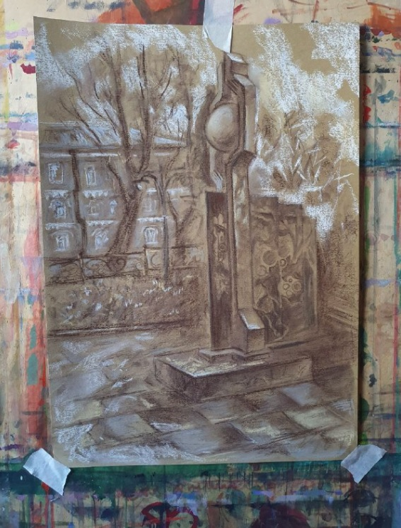
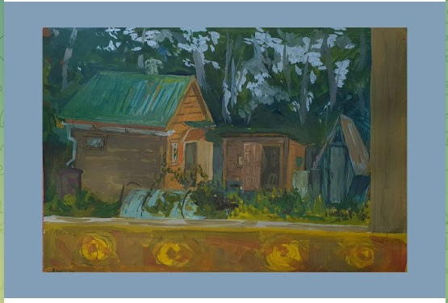
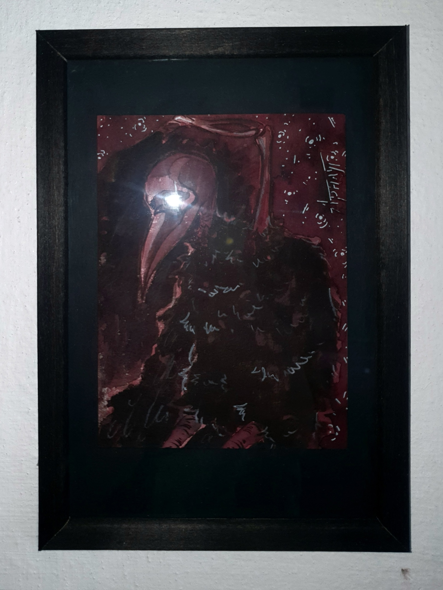
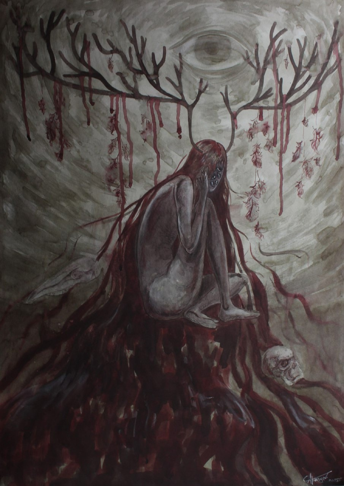
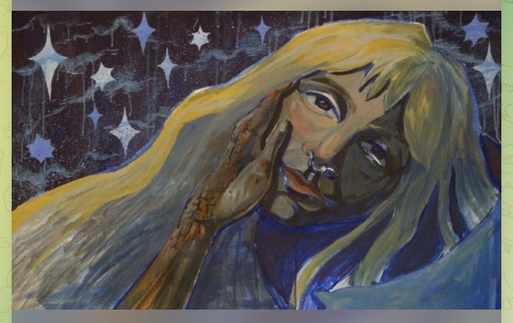
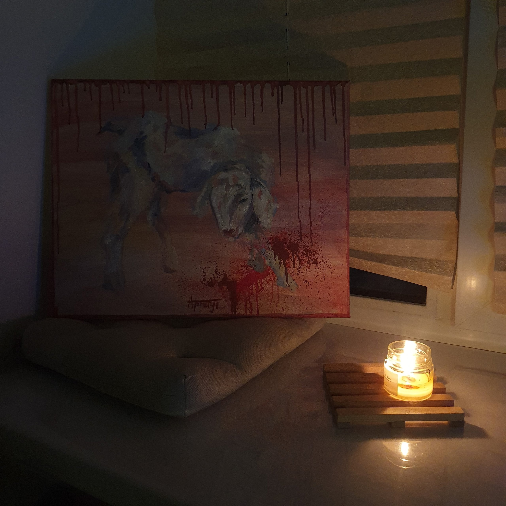
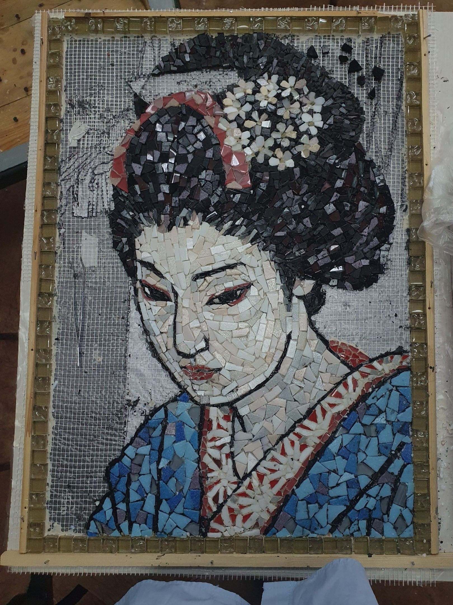
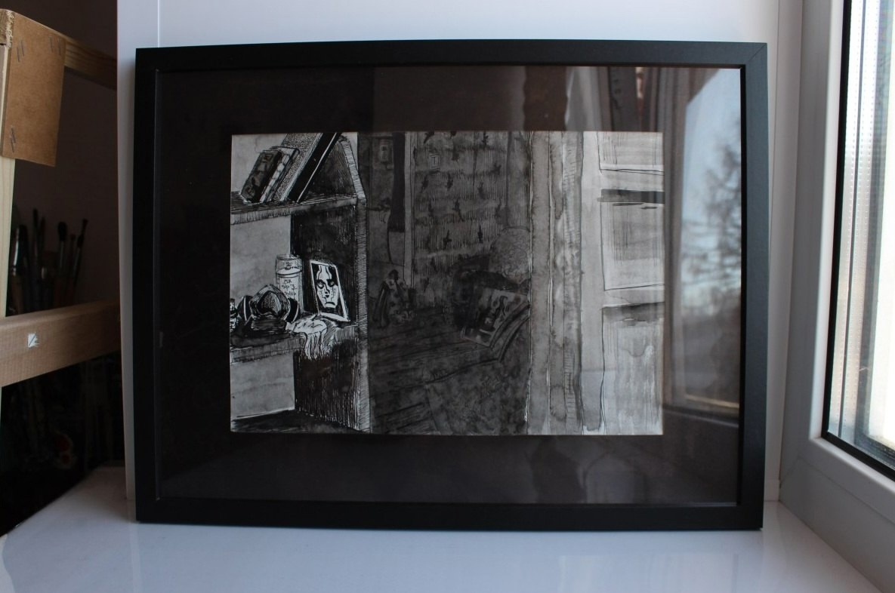
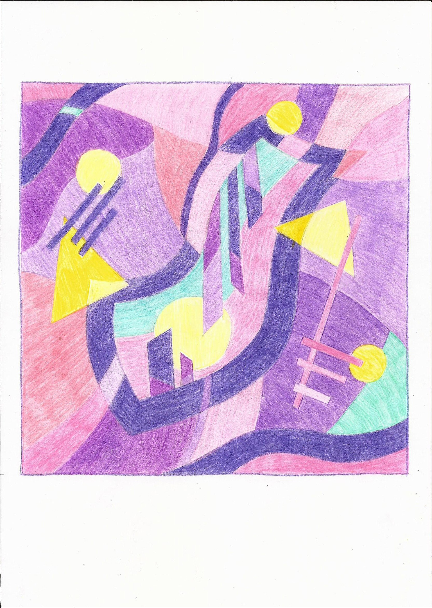

# Арнаутова Анастасия Александровна

Дата рождения: Октябрь 2004  
Место рождения: Краснотурьинск  
Страница в интернете: https://vk.ru/arrrrrnaut  

## Каталог работ

(Лодочная станция), 2025

https://t.me/OTVALMASKI/2022

Изображено: [Лодочная станция, г. Верхняя Тура](https://yandex.ru/maps/org/pristan/188796301859/?ll=59.808731%2C58.356466&z=12)

От составителя: Написана на основе этюда, выполненного на пленэре в Верхней Туре в сентябре 2025.

(Древо памяти города-завода), 2025

https://t.me/OTVALMASKI/2009

Изображено: [Древо памяти города-завода, г. Верхняя Тура](https://yandex.ru/maps/org/drevo_pamyati_goroda_zavoda/23692959873/?ll=59.818635%2C58.359337&z=16)

От составителя: Написана на основе этюда, выполненного на пленэре в Верхней Туре в сентябре 2025.

Нюта, 2025. Бумага для акварели, гуашь, формат А4

https://t.me/OTVALMASKI/1931

На веранде. Пасмурно, 2025. Бумага для акварели, гуашь, формат А4

https://t.me/OTVALMASKI/1930

Птица, 2025. Бумага для акварели, тушь, кисть, 11,5×16 см

https://vk.com/market/product/ptitsa-213873622-11260721?z=photo-213873622_457239483%2Fmarket-213873622_11260721

От составителя: Выставлялась на продажу за 1 200 р.

Диперсонализация и тревога, 2025. Ватман, распадающиеся чернила, кисть, белый карандаш, белая гелевая ручка, 50×70 см

https://vk.com/arrrrrnaut?z=photo-213873622_457239440%2Fwall-213873622_319

Диперсонализация и тревога - отражение состояния в период крайних отношений авторки и их завершения на момент января-марта 2025.

Ещё в отношениях начинаешь буквально сходить с ума по человеку, которого выбрал сам и добровольно надел на себя "розовые очки" поверив в любовь как в сказке с счастливым концом. Но с развитием отношений осознаешь, что это совершенно незнакомый и чужой человек. Начинаешь сомневаться о том, можно ли ему доверять и искренен ли он. Ведь изначально так легко доверилась, а сейчас наступил какой-то холод и недоговаривание. Начинаешь ловить диперсонализацию о вопросах "кто я?", что есть это "я?" и начинаешь видеть свою жизнь от 3 лица и скоротечности жизни и ее бессмысленности. Все это 24/7 на фоне дневных дел, а ночью во снах-кошмарах. Главный персонаж работы - обноженная многоглазая девушка, прикрывающаяся рукой. Отсутствие одежды как символ честности, но закрытая поза говорит о том, что есть страх показать себя настоящую. Множество глаз как попытка быть везде: в мыслях и переживаниях о другом человеке, своих чувствах, обществе, кторое тебя окружает. Получается одновременно везде и нигде. Рога - тяжесть и масивность всего того, что происходит в голове. Кровавые подтеки - боль от этого давления, а перья - редкие проблески спокойствия в этом хаосе.

Человеческий и олений черепа - прошлые жизнь главной героини, симбиоз двух существ. Олень чувствителен к тому, что происходит вне, а человек - личностным переживаниям.

Глаз на фоне - лицо общества, оно может не замечать тебя как единицу, твои проблемы, но его присутствие всегда будет иметь свой вес давление, что вызывает большую тревогу.
Но каждый увидит здесь свое - в этом и есть прелесть искусства.

От составителя: Есть некоторое сходство с гравюрой Дюрера "Меланхолия" - мрачное настроение, сидящая женщина, наличие в композиции странных предметов. Непонятно, образовано ли название с помощью греческой пристаки "ди-", или это искажение слова "деперсонализация"? Директор галереи SMART Gallery Наталья Хацела высказывала мысль, что художники могут создавать демонстративно некрасивые работы, чтобы выразить негативные эмоции (https://gallerysmart.ru/o-kompanii/blog/azbuka-nachinayushhego-kollekczionera/pochemu-xudozhniki-pishut-nekrasivyie-kartinyi.html). Некоторые работы Анастасии, кажется, вписываются в эту концепцию (в данном случае демонстративно некрасивые элементы - лицо героини и подтеки крови на фоне).

Конь, 2025. Тушь

https://vk.com/arrrrrnaut?z=photo-213873622_457239446%2F95a5e95a2eb33875f0

Девушка в объятиях близкого человека, 2025

https://vk.com/arrrrrnaut?z=photo-213873622_457239392%2F4d0cafe5f105551253

Центр композиции - девушка в объятиях близко ей человека. Глаза ее закрыты, выражая доверие к нему. На это указывает и то, где они находятся – кровать - место сна, состояние в котором все животные имеют наибольшую уязвимость. Зажённые огоньки на фоне создают атмосферу вечера. А это значит, что это самое время для пробуждения всех мыслей и переживаний, накатывающих с новой силой. От этого, несмотря на все спокойствие и комфортность окружения девушка ушла в свои переживания - изображённые на покрывале. Они как эмоции чуть виднеются среди общей массы фактуры, но не заявляют о себе, как произнесенные слова вслух.

(Девушка на фоне звездного неба), 2025. Грунтованный лист, темпера

https://t.me/OTVALMASKI/1582

От составителя: Репродукция незаконченной работы. Эта картина была закончена в последний день перед просмотром в июне 2025; затем она украшала стену в комнате Анастасии.

(Агнец), 2024

https://vk.com/arrrrrnaut?z=photo-213873622_457239391%2Fce01f5a38e7bd6465a

Питомец, 2024

https://vk.com/arrrrrnaut?z=photo-213873622_457239381%2Fbe0aec62d63f872a54

Преследующее прошлое, 2024

https://vk.com/arrrrrnaut?z=photo-213873622_457239377%2F6bf72141cc6886a4cd

**Надпись**

*Содержание работы:* Как печально, что я был к тебе не готов. Как печально, что ты так готова ко мне...

**Надпись**

*Подпись; Правый нижний угол:* 27.06.24 M_MB

Побудь со мной еще, пожалуйста, 2024

https://vk.com/wall-213873622?offset=20&own=1&z=photo-213873622_457239316%2F13d06013a9617d9115

Чужие амбиции, 2024

https://vk.com/wall-213873622?offset=20&own=1&z=photo-213873622_457239314%2F7d448927264be87bea

Портрет матери, 2024

https://vk.com/wall-213873622?offset=20&own=1&z=photo-213873622_457239305%2F4336d4bf88238a4545

(Натюрморт), 2024

https://vk.com/wall-213873622?offset=20&own=1&z=photo-213873622_457239296%2F9f110a80531ed432f7

(Портрет женщины), 2024. Мозаика

https://vk.com/photo-213873622_457239331?rev=1

Декоративный натюрморт, 2023. Масло, темпера, 60×60 см

https://vk.com/market/product/dekorativny-natyurmort-213873622-10981409?z=photo-213873622_457239423%2Fmarket-213873622_10981409

Декоративный натюрморт маслом с объемными элементами. Торцы покрашены черной темперой.

От составителя: Выставлялась на продажу за 3 500 р.

Нежный череп, 2023. Холст, масло, темпера, 40×50 см

https://vk.com/market/product/nezhny-cherep-213873622-10980007?z=photo-213873622_457239409%2Fmarket-213873622_10980007

Натюрморт маслом на холсте размером 40×50. Торец холста покрашен черной темперой. Подойдет в интерьер для любителей совмещать несовместимое.

От составителя: Выставлялась на продажу за 4 500 р.

(Пейзаж), 2023

https://vk.com/photo-213873622_457239163?rev=1

Дверной проем, 2022. Ватман, тушь, кисть, перо, 20×28,5 см

https://vk.com/market/product/dvernoy-proyom-213873622-10981344?z=photo-213873622_457239419%2Fmarket-213873622_10981344

От составителя: Выставлялась на продажу за 3 000 р.

(Чайный сервиз), 2022

https://vk.com/wall-213873622?offset=100&own=1&z=photo-213873622_457239083%2Fwall-213873622_34

Суета, 2022

https://vk.com/wall-213873622?offset=100&own=1&z=photo-213873622_457239067%2Fwall-213873622_27

Час волшебства, 2022

https://vk.com/wall-213873622?offset=100&own=1&z=photo-213873622_457239034%2Fwall-213873622_9

Кошмары, 2019

https://t.me/OTVALMASKI/1859

## Галерея

На пленере в Верхней Туре, 2025

## См. также

- [Черновик биографии](bio.md)

