# Овчинникова Анастасия Анатольевна

Дата рождения: Апрель 2000  
Место рождения: Невьянск  
Подпись: Asya Less (c 2025), ЛН (2020-2024), Лесная нимфа (до 2020)  
Страница ВКонтакте: [asyalesss](https://vk.com/asyalesss)  

## Каталог работ

*Страница 1 из 3* [Следующая](asyaless2.md) [В конец](asyaless3.md)

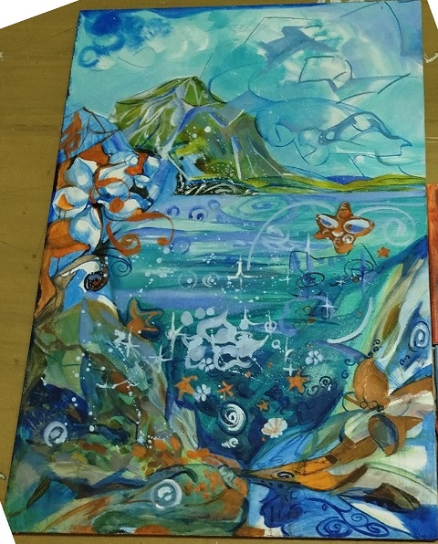

Крымский залив, 2025

<https://vk.com/asyalesss?w=wall-149859040_2573>

Тип: Картина  
Жанр: Пейзаж

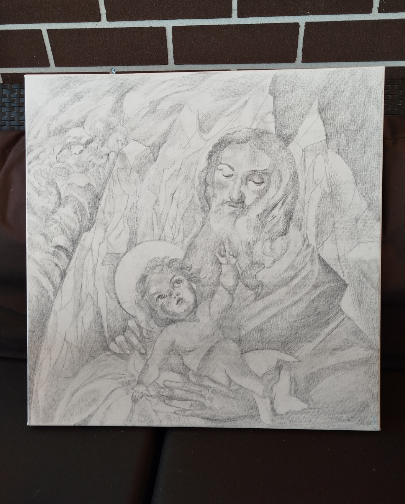

Первое касание, 2025. Холст на подрамнике, карандаш, лак, 50x50 см

<https://vk.com/asyalesss?from=groups&z=photo-149859040_457241682%2F1e2b53930271e26851>

Тип: Рисунок  
Жанр: Религиозный

Здесь мы можем наблюдать искреннее устремление дитя к батюшке, взор которого устремлён в низ, на него. Отец полон терпения и глубокой любви, которая оберегает младенца. Томное могущество большой фигуры заполняет пространство полотна, в то время как скалы среднего плана оберегают семейный союз от надвигающейся бури, что служит оберегом, поскольку высший замысел оберегает союзников и не даёт им оторваться друг от друга.

[Более поздняя аннотация: ] Дорогой зритель, перед тобой неканонический сюжет, отображающий внутреннее состояние планеты Земля перед землятресением. Сюжет на 50% является копией картины испанского безвестного живописца Клементе де Торрес с названием «Иосиф, держащий на руках ребёнка Христа» 1700 годы, где Иосиф по священным писаниям приходился Христу семейным и земным отцом, оберегающим очаг природы и гармонии в ней. Здесь именно отец явился пред нами как прообраз защиты и стати, пребывая в роли супруга Девы Марии.
То есть данная картина является поп-искусством и продуктом вдохновения «испанского стыда», в то время как эмоции и чувства всё сделали за вас! Академизм подкупает зрителя словно наилучший исход графической композиции для абстрактного взаимодействия с работой.
И это на сегодня лучшее, что я когда-либо делала…

Анастасия: "...Эту картину я нарисовала в момент кризиса, когда я поняла, что я походу никогда не начну самостоятельную жизнь, и буду иждивенкой еще неизвестно сколько, минимум 4 года. Тогда, собственно, и начался мой путь, когда я приняла эту мысль как данность."

От составителя: Первоначальное название: "Приглашение". Выставлялась на продажу за 4000 р.

Связанная работа: [Клементе де Торрес. Святой Иосиф с младенцем Христом](https://collections.hermitage.ru/entity/OBJECT/32674?avtor=1666&index=0); Государственный Эрмитаж, г. Санкт-Петербург; ГЭ-331

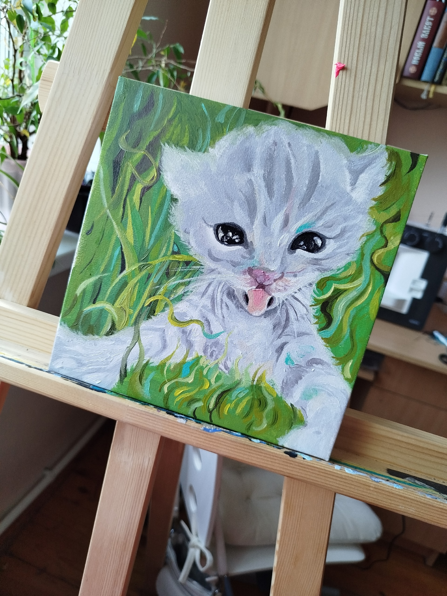

(Котенок), 2025

<https://vk.com/photo-149859040_457241677>

Тип: Картина  
Жанр: Анималистика

От составителя: Выставлялась на продажу за 400 р.

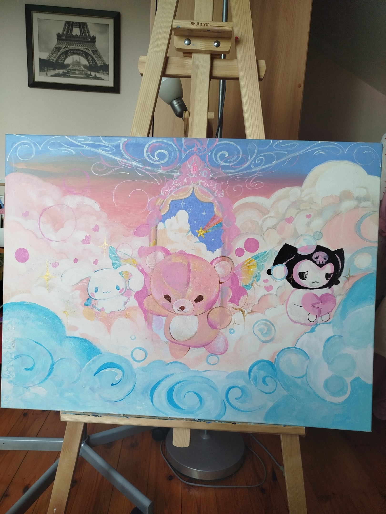

(Плюшевые игрушки), 2025

<https://vk.com/asyalesss?z=photo-149859040_457241676%2Fc65f241d8ce7693b00>

Тип: Картина

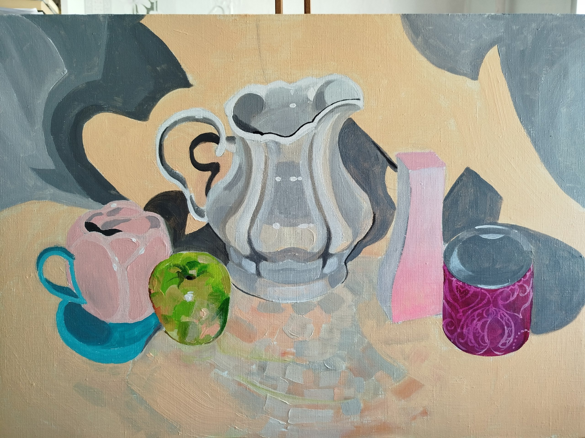

(Натюрморт с кувшином), 2025

<https://vk.com/photo-149859040_457241670?rev=1>

Тип: Картина  
Жанр: Натюрморт

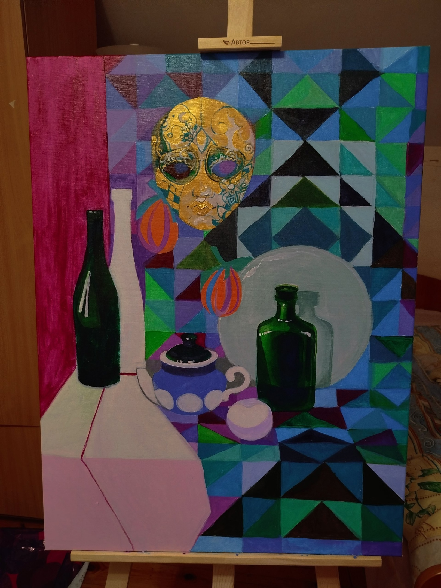

Натюрморт, 2025

<https://vk.com/wall-149859040?own=1&z=photo-149859040_457241613%2Fwall-149859040_2411>

Тип: Картина  
Жанр: Натюрморт

Да здравствует скучный натюрморт который дался мне с большим трудом и слезами. Пишу его с сентября [2024 г.]
Что ты знаешь о гармонично подобранной по литре оттенков треуголльничков

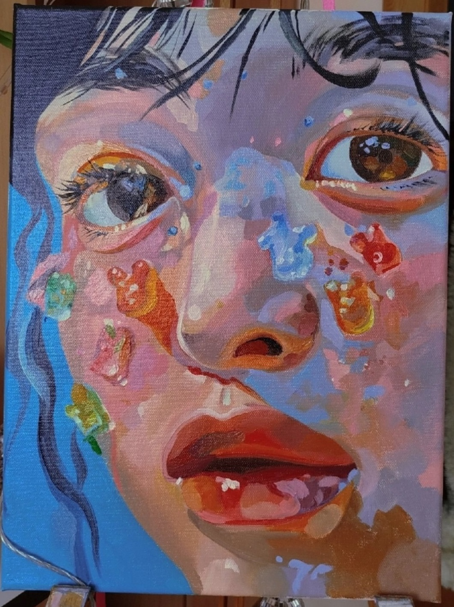

С мармеладками на глазах, 2024. Холст на подрамнике, масло, 60х40 см

<https://vk.com/wall-149859040?own=1&z=photo-149859040_457241626%2F47b51de543bc819849>

Тип: Картина

Яркие летние лучи солнца отражаются в мармеладках на лице, создавая ощущение благоговения. Взгляд дитя наполняет добротой и любовью.
Хотите добавить сочности и стиля в ваш интерьер?
Это кусочек иного мира, сочетающий в себе насыщенные цвета, отражающие глубину и взрыв внутренних чувств.
Идеальный выбор для тех, кто ценит тенденции и хочет украсить свой дом или офис чем-то действительно эксклюзивным.

Анастасия: "Эта работа много для меня значит, я бы продала за миллион"

От составителя: В 2025 г. выставлялась на продажу в магазине "Фабрика финтифлюшек" за 15 000 р.

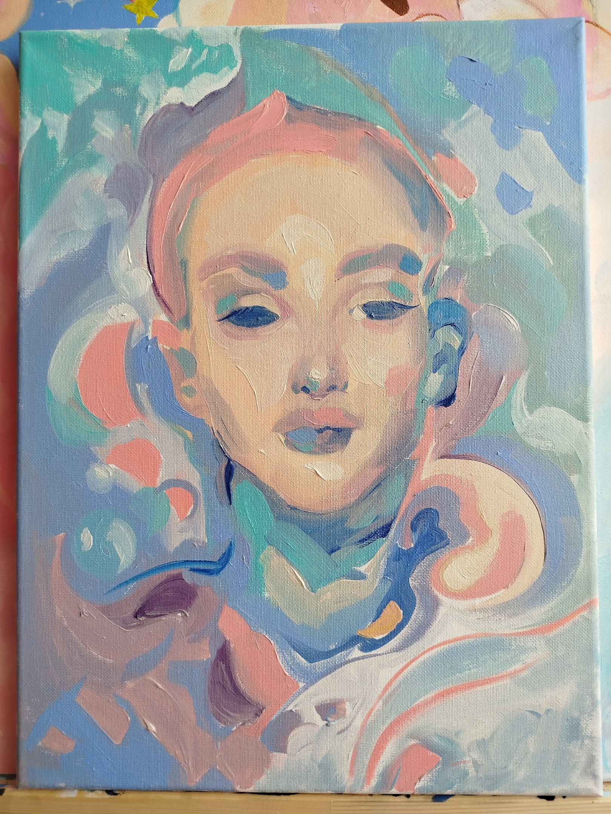

Голубая, 2024

<https://vk.com/market/product/golubaya-149859040-11011864?z=photo-149859040_457241654%2Fmarket-149859040_11011864>

Тип: Картина

Перед тобой, дорогой друг, прекрасная незнакомка с сине-голубой аурой, бралая берюзовые отливы.
Картина наделена светлой энергетикой и подарит твоему пространству загадку.

От составителя: В 2025 г. выставлялась на продажу за 1 500 р.

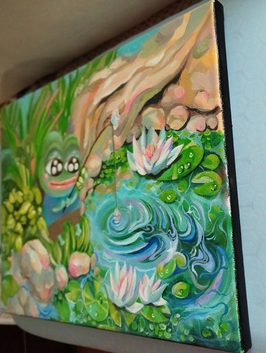

(Лягушка), 2024

<https://vk.com/wall-149859040?own=1&z=photo-149859040_457241635%2F319a6c670b57cdbdc1>

Тип: Картина  
Жанр: Анималистика

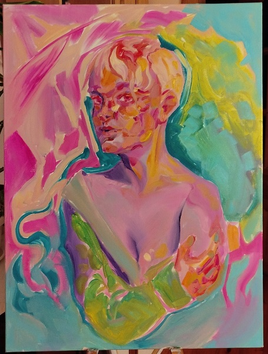

(Портрет), 2024

<https://vk.com/wall-149859040?own=1&z=photo-149859040_457241563%2Fd526dac7c3e01f72d6>

Тип: Картина  
Жанр: Портрет

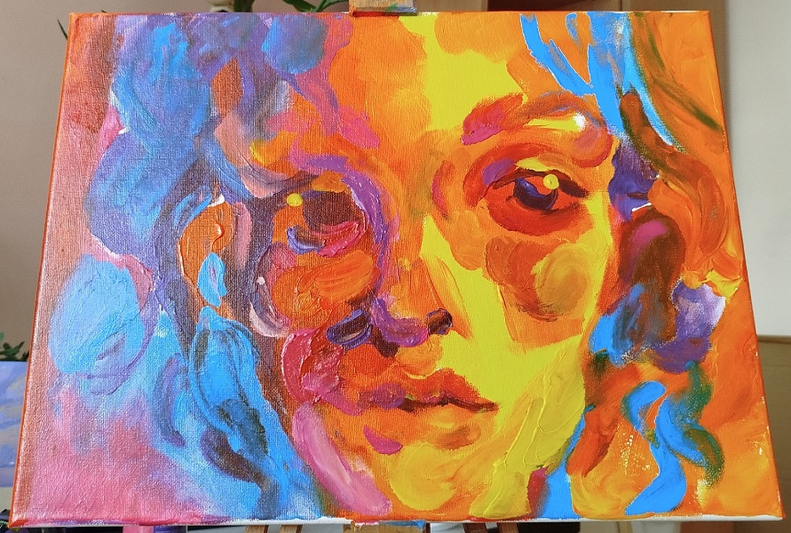

(Портрет женщины с голубыми волосами), 2024. Акрил

<https://vk.com/wall-149859040?own=1&z=photo-149859040_457241562%2F6bdb0bbcc2b711f524>

Тип: Картина  
Жанр: Портрет

Анастасия: "Обожаю акрил и писать пальцем"

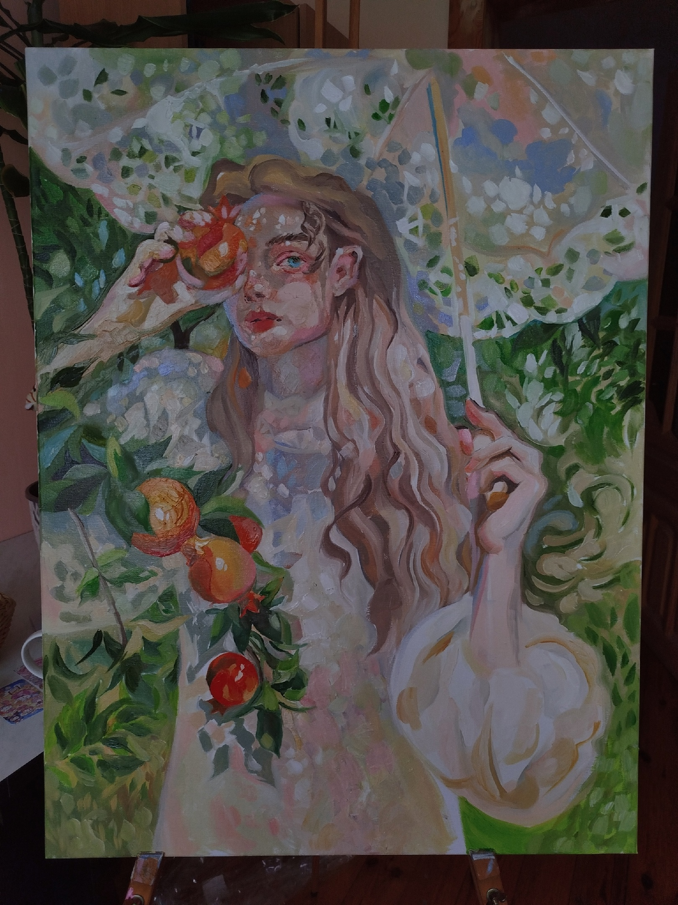

Ева - девочка с зонтиком, 2024. Холст, масло, 70x50 см

<https://vk.com/wall-149859040?own=1&z=photo-149859040_457241552%2Fc4219440cec9c83389>

Тип: Картина

История сюжета картины, то есть ее секрет заключается в истории одной юной леди, которая родилась на юге России, в Краснодарском крае. В ее руках гранат, напоминающий домик для Пикачу из старого мультфильма...
Кружевные одежды, гипюровый зонт и прохладный южный день. Яркая сырость морская где-то далеко-далеко! Но так свежо

От составителя: Эта картина Анастасии мне нравится больше всех. Характерные черты - сказочный растительный фон и "воздушные" жесты героини.

В 2026 выставлялась на продажу в магазине "Фабрика Финтифлюшек" за 5000 р.

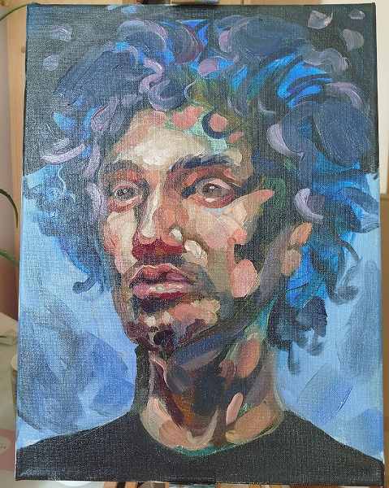

Фрик, 2024

<https://vk.com/wall-149859040?offset=40&own=1&z=photo-149859040_457241556%2Fwall-149859040_2376>

Тип: Картина

От составителя: Выставлялась на продажу

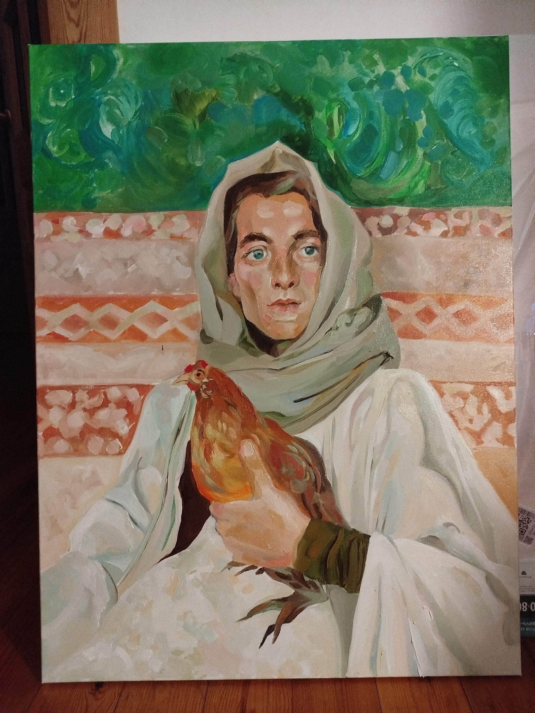

(С курицей), 2024

<https://vk.com/wall-149859040?own=1&z=photo-149859040_457241548%2Fwall-149859040_2366>

Тип: Картина

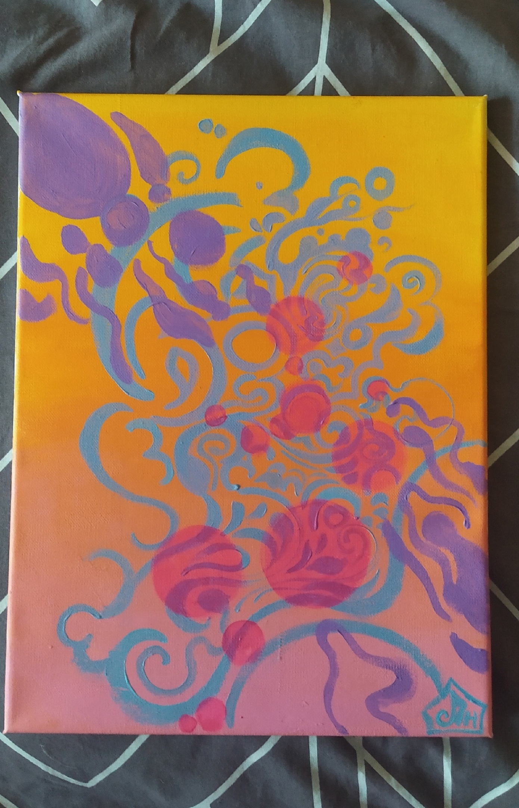

(Узор), 2024

<https://vk.com/wall-149859040?offset=60&own=1&z=photo-149859040_457241477%2Ff0b2df145116e6e875>

Тип: Картина  
Жанр: Абстрактный

Анастасия: "Эту картину я нарисовала, когда мне мой мужчина начал изменять. После того я поняла, что это не мой мужчина, и в целом у меня моего, так сказать, мужчины никогда в жизни и не было. Хо! Разочарование века..."

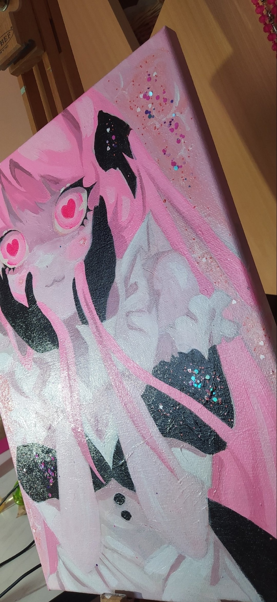

Няша-горничная, 2023. Акрил

<https://vk.com/wall-149859040?offset=80&own=1&z=photo-149859040_457241445%2Fe3027e11fdc5d456ef>

Тип: Картина

Выставляю на продажу в аниме-магазинчик вот такую няшу-горничную.
Розовый акрил - флуоресцентный, то есть картинка будет светится при специальном освещении.
Не видно на фото, но розовый неоновый

От составителя: Выставлялась на продажу в магазине "Фабрика финтифлюшек" за 2000 р.

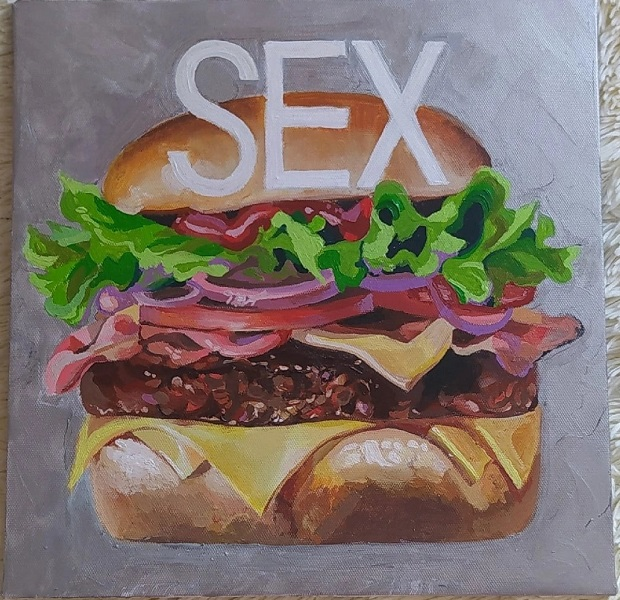

(Мем с бургером), 2023. Масло, 30х30 см

<https://vk.com/wall-149859040?offset=80&own=1&z=photo-149859040_457241444%2Fwall-149859040_2226>

Тип: Картина

От составителя: Написана на заказ и отправлена в Южноуральск, Челябинская обл.

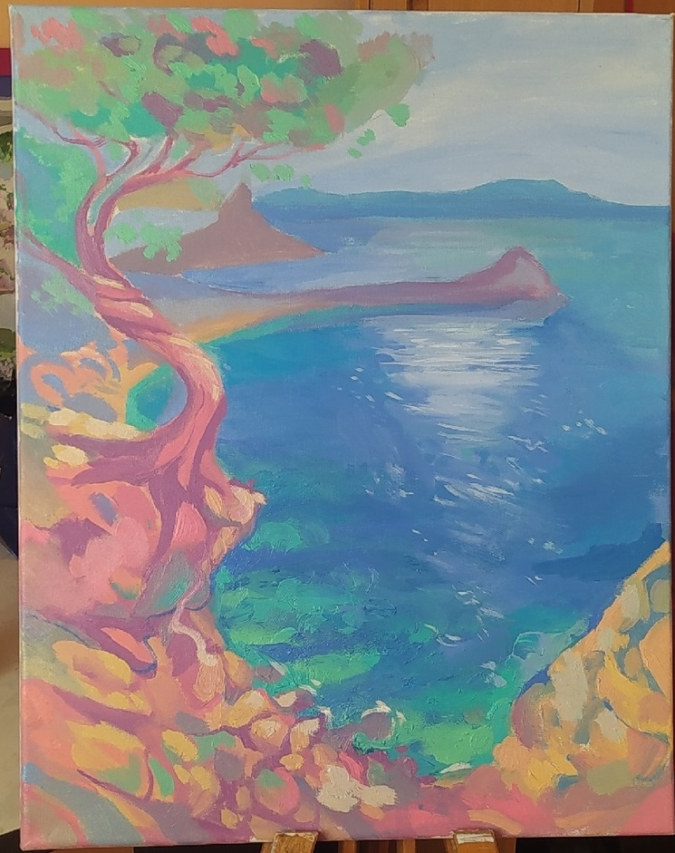

Фантазийный пейзаж, 2023

<https://vk.com/wall-149859040?offset=80&own=1&z=photo-149859040_457241424%2Fb8755933b7c5e13ace>

Тип: Картина  
Жанр: Пейзаж

Кусочек Крыма. Написала родителям за денежку. Цените свой труд и не стесняйтесь брать деньги. Твоё время и силы очень дороги

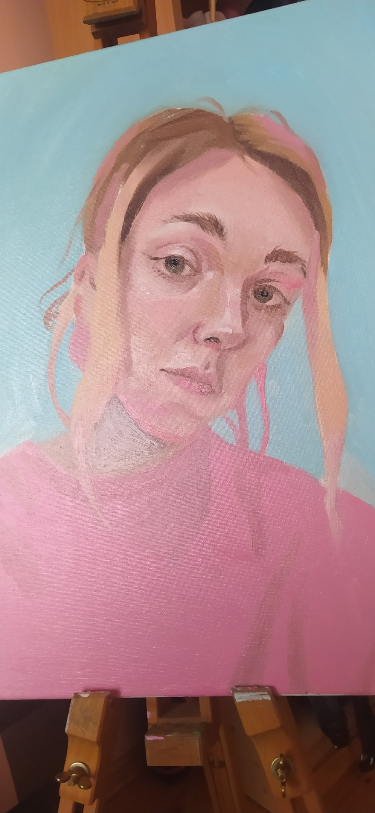

Автопортрет, 2023

<https://vk.com/wall-149859040?offset=80&own=1&z=photo-149859040_457241407%2Fwall-149859040_2193>

Тип: Картина  
Жанр: Портрет

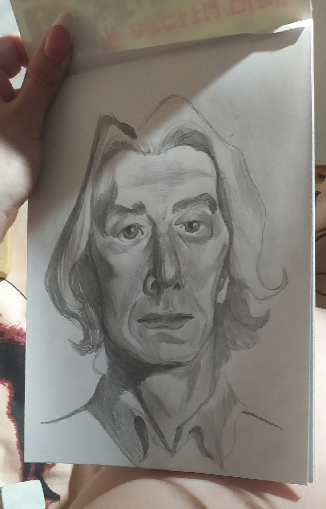

Шарж на Рефата Мамутова, 2023

<https://vk.com/wall-149859040?offset=160&own=1&z=photo-149859040_457241377%2Fwall-149859040_2150>

Тип: Рисунок

*Страница 1 из 3* [Следующая](asyaless2.md) [В конец](asyaless3.md)

## Галерея

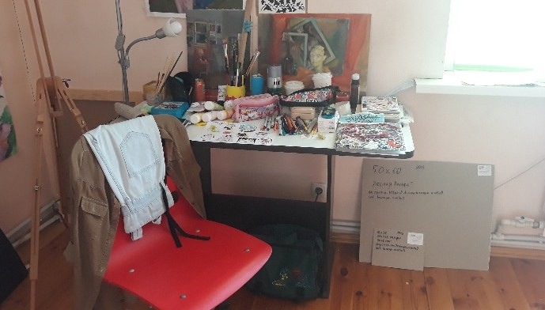

Рабочее место

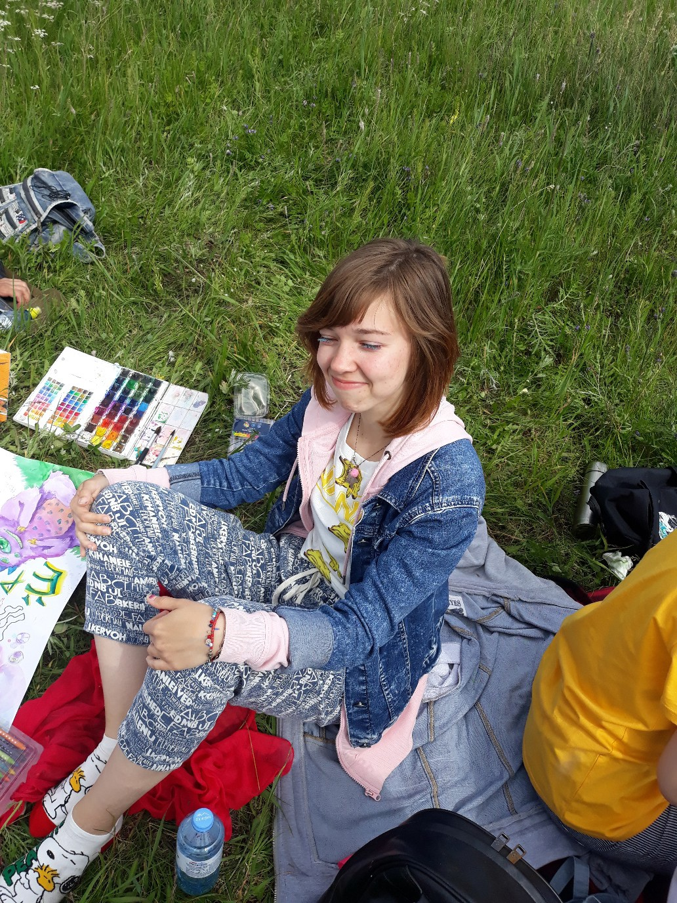

На пленэре

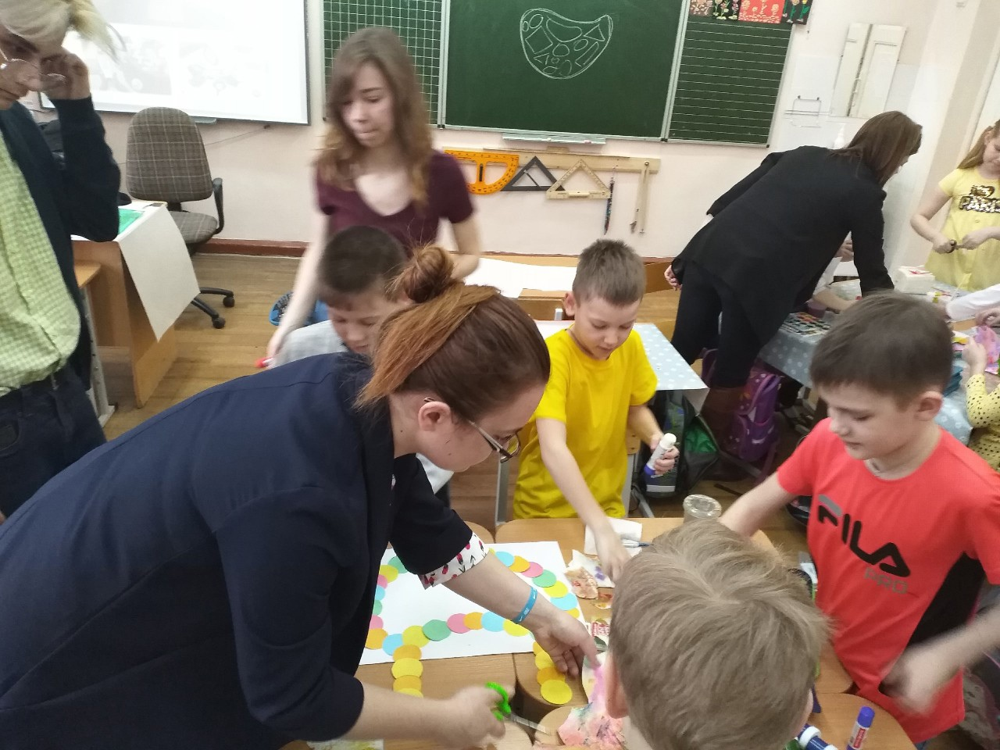

На педагогической практике

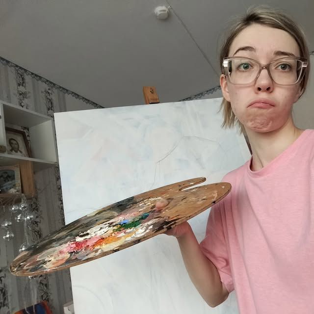

На рабочем месте

## См. также

- [Черновик биографии](bio.md)

