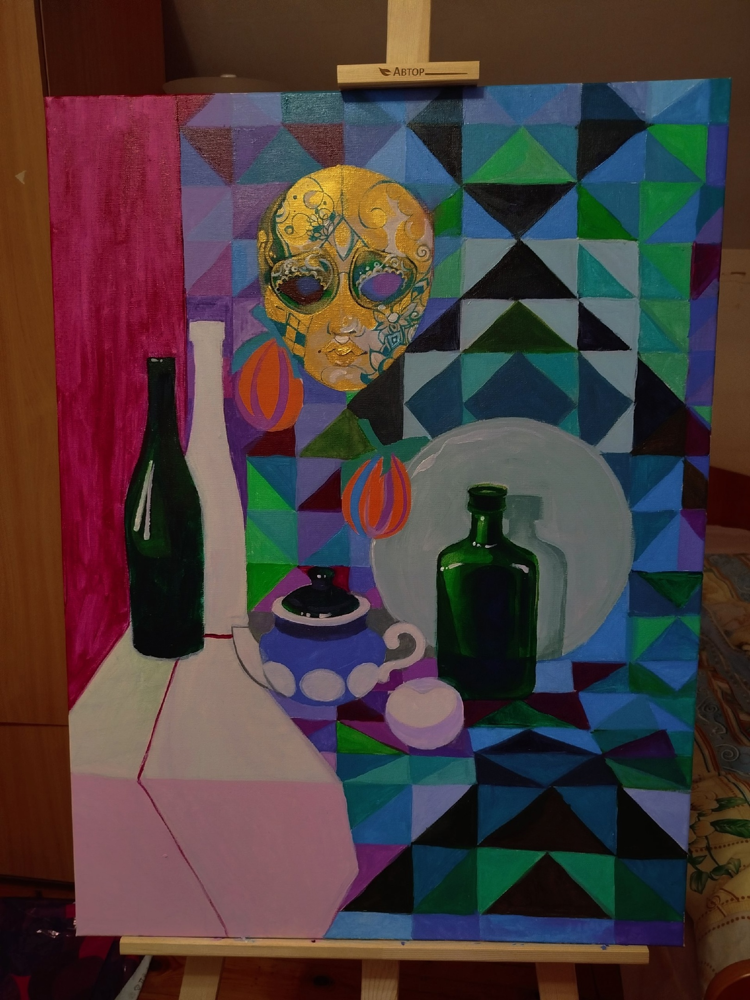
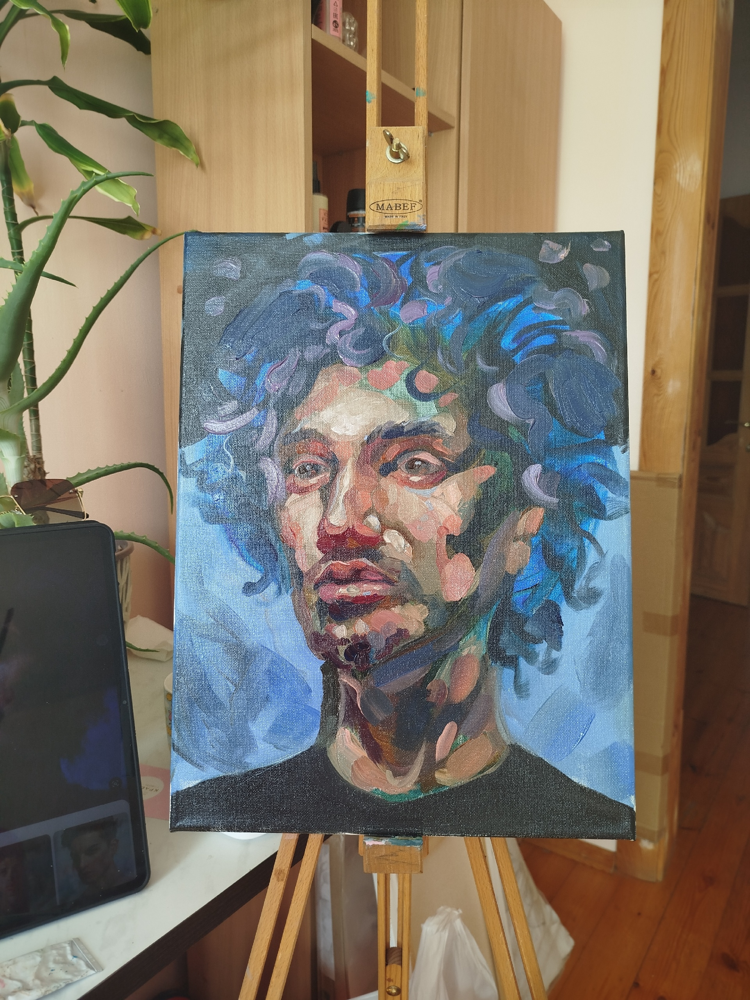
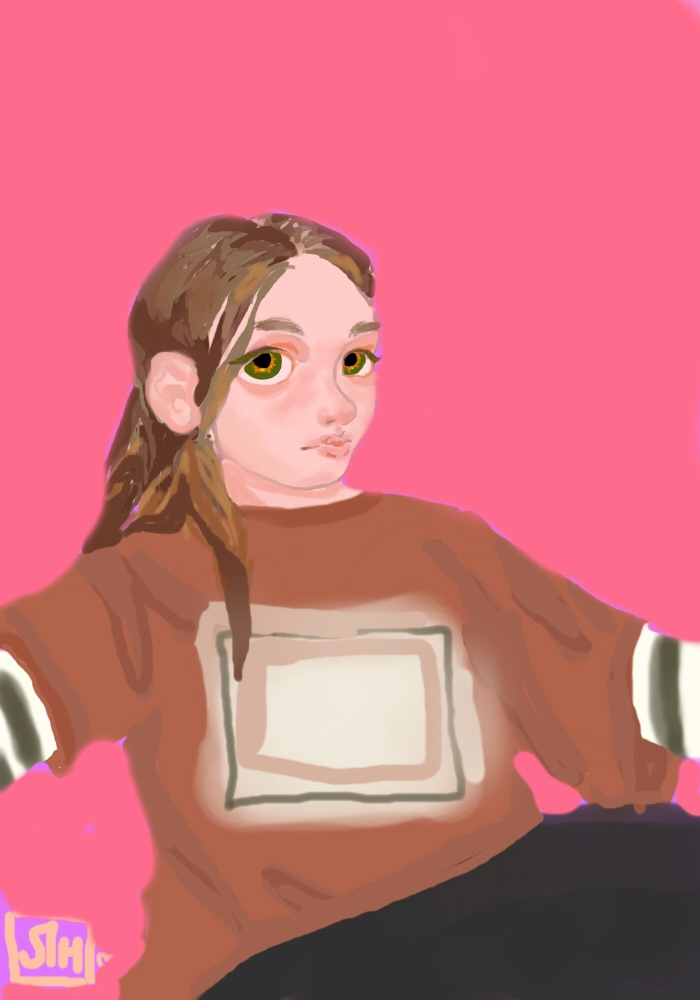
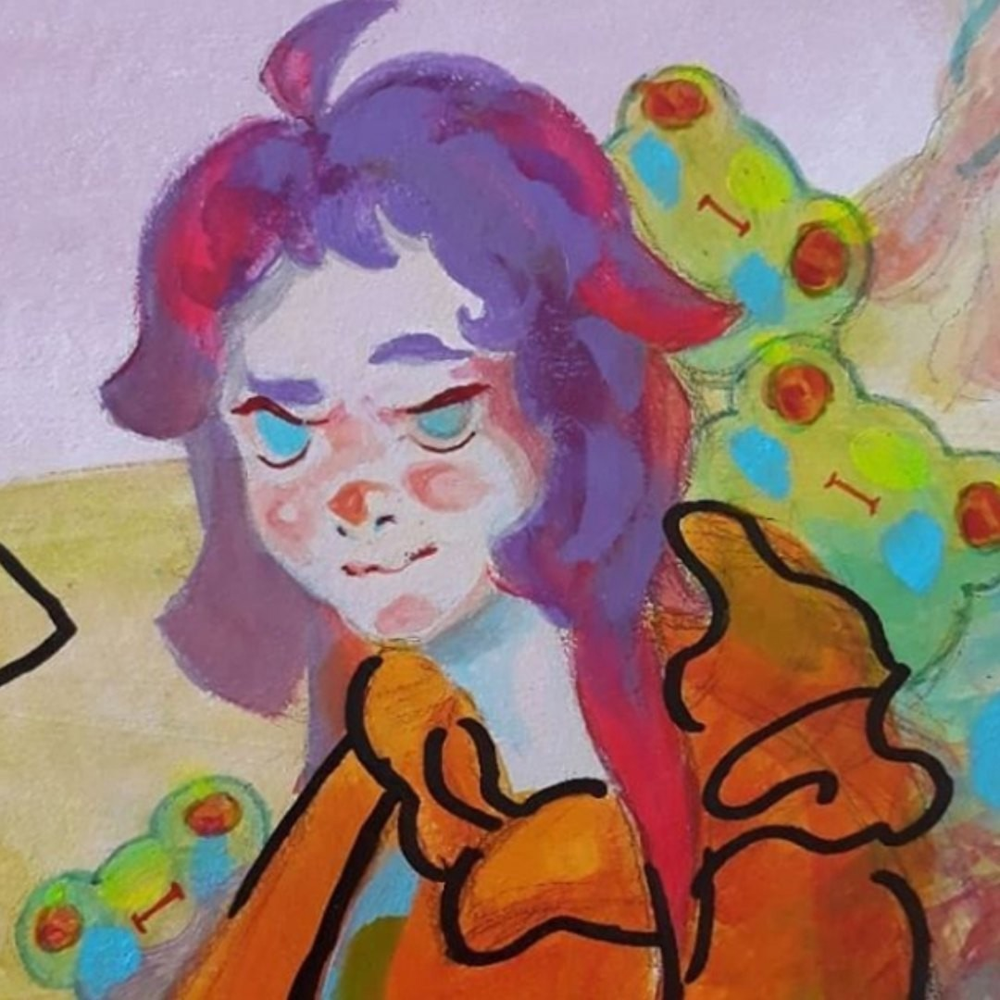
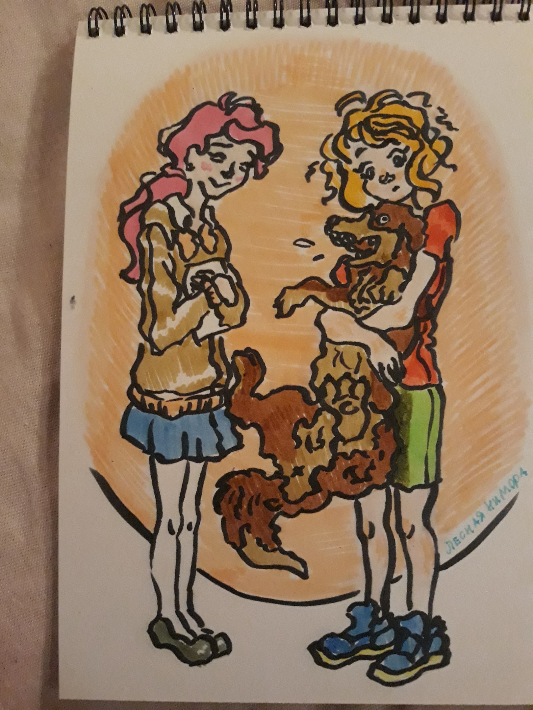

# Овчинникова Анастасия Анатольевна

Дата рождения: Апрель 2000  
Место рождения: Невьянск  
Страница в интернете: https://vk.com/asyalesss  

## Каталог работ

Приглашение, 2025. Холст на подрамнике, карандаш, лак, 50x50 см

https://vk.com/asyalesss?from=groups&z=photo-149859040_457241682%2F1e2b53930271e26851

Здесь мы можем наблюдать искреннее устремление дитя к батюшке, взор которого устремлён в низ, на него. Отец полон терпения и глубокой любви, которая оберегает младенца. Томное могущество большой фигуры заполняет пространство полотна, в то время как скалы среднего плана оберегают семейный союз от надвигающейся бури, что служит оберегом, поскольку высший замысел оберегает союзников и не даёт им оторваться друг от друга.

От составителя: Выставлялась на продажу за 4000 р.

(Котенок), 2025

https://vk.com/photo-149859040_457241677

От составителя: Выставлялась на продажу за 400 р.

(Плюшевые игрушки), 2025

https://vk.com/asyalesss?z=photo-149859040_457241676%2Fc65f241d8ce7693b00

(Натюрморт с кувшином), 2025

https://vk.com/photo-149859040_457241670?rev=1

Натюрморт, 2025

https://vk.com/wall-149859040?own=1&z=photo-149859040_457241613%2Fwall-149859040_2411

Да здравствует скучный натюрморт который дался мне с большим трудом и слезами. Пишу его с сентября [2024 г.]
Что ты знаешь о гармонично подобранной по литре оттенков треуголльничков

С мармеладками на глазах, 2024. Холст на подрамнике, масло, 60х40 см

https://vk.com/wall-149859040?own=1&z=photo-149859040_457241626%2F47b51de543bc819849

Яркие летние лучи солнца отражаются в мармеладках на лице, создавая ощущение благоговения. Взгляд дитя наполняет добротой и любовью.
Хотите добавить сочности и стиля в ваш интерьер?
Это кусочек иного мира, сочетающий в себе насыщенные цвета, отражающие глубину и взрыв внутренних чувств.
Идеальный выбор для тех, кто ценит тенденции и хочет украсить свой дом или офис чем-то действительно эксклюзивным.

Анастасия: "Эта работа много для меня значит, я бы продала за миллион"

От составителя: В 2025 г. выставлялась на продажу в магазине "Фабрика финтифлюшек" за 15 000 р.

Голубая, 2024

https://vk.com/market/product/golubaya-149859040-11011864?z=photo-149859040_457241654%2Fmarket-149859040_11011864

Перед тобой, дорогой друг, прекрасная незнакомка с сине-голубой аурой, бралая берюзовые отливы.
Картина наделена светлой энергетикой и подарит твоему пространству загадку.

От составителя: В 2025 г. выставлялась на продажу за 1 500 р.

(Лягушка), 2024

https://vk.com/wall-149859040?own=1&z=photo-149859040_457241635%2F319a6c670b57cdbdc1

(Портрет), 2024

https://vk.com/wall-149859040?own=1&z=photo-149859040_457241563%2Fd526dac7c3e01f72d6

(Портрет женщины с голубыми волосами), 2024. Акрил

https://vk.com/wall-149859040?own=1&z=photo-149859040_457241562%2F6bdb0bbcc2b711f524

Анастасия: "Обожаю акрил и писать пальцем"

(Девушка с зонтом), 2024

https://vk.com/wall-149859040?own=1&z=photo-149859040_457241552%2Fc4219440cec9c83389

От составителя: Эта картина Анастасии мне нравится больше всех. Характерные черты - сказочный растительный фон и "воздушные" жесты героини.

Фрик, 2024

https://vk.com/wall-149859040?offset=40&own=1&z=photo-149859040_457241556%2Fwall-149859040_2376

От составителя: Выставлялась на продажу

С курицей, 2024

https://vk.com/wall-149859040?own=1&z=photo-149859040_457241548%2Fwall-149859040_2366

descriptive

(Узор), 2024

https://vk.com/wall-149859040?offset=60&own=1&z=photo-149859040_457241477%2Ff0b2df145116e6e875

Няша-горничная, 2023. Акрил

https://vk.com/wall-149859040?offset=80&own=1&z=photo-149859040_457241445%2Fe3027e11fdc5d456ef

Выставляю на продажу в аниме-магазинчик вот такую няшу-горничную.
Розовый акрил - флуоресцентный, то есть картинка будет светится при специальном освещении.
Не видно на фото, но розовый неоновый

От составителя: Выставлялась на продажу в магазине "Фабрика финтифлюшек" за 2000 р.

(Мем с бургером), 2023. Масло, 30х30 см

https://vk.com/wall-149859040?offset=80&own=1&z=photo-149859040_457241444%2Fwall-149859040_2226

От составителя: Написана на заказ и отправлена в Южноуральск, Челябинская обл.

Фантазийный пейзаж, 2023

https://vk.com/wall-149859040?offset=80&own=1&z=photo-149859040_457241424%2Fb8755933b7c5e13ace

Кусочек Крыма. Написала родителям за денежку. Цените свой труд и не стесняйтесь брать деньги. Твоё время и силы очень дороги

Автопортрет, 2023

https://vk.com/wall-149859040?offset=80&own=1&z=photo-149859040_457241407%2Fwall-149859040_2193

Шарж на Рефата Мамутова, 2023

https://vk.com/wall-149859040?offset=160&own=1&z=photo-149859040_457241377%2Fwall-149859040_2150

(Закат), 2023

https://vk.com/wall-149859040?offset=180&own=1&z=photo-149859040_457241374%2Fdd0d335ea3e8e64980

Небо, 2023

https://vk.com/wall-149859040?offset=220&own=1&z=photo-149859040_457241347%2Fwall-149859040_2053

(Дерево), 2023

https://vk.com/wall-149859040?offset=220&own=1&z=photo-149859040_457241345%2Fwall-149859040_2052

(Русалка), 2022

https://vk.com/wall-149859040?offset=420&own=1&z=photo-149859040_457241116%2F89dba8bef10f9353b2

(Дом), 2021

https://vk.com/wall-149859040?offset=420&own=1&z=photo-149859040_457240982%2F03160809214a323338

Линейный набросок интерьера, 2021

https://vk.com/wall-149859040?offset=420&own=1&z=photo-149859040_457240966%2F52ee6f78d1ab398afb

Девушка в динамичной позе, 2021. Цифровая картина

https://vk.com/wall-149859040?offset=420&own=1&z=photo-149859040_457240871%2F4701a72a73864b8dcc

Работа получилась такой, что ты не можешь получить полного удовлетворения от изображения, из-за того что девушка занимает динамичную позу и ты, как бы, ждешь от неё каких-то движений дальнейших, но их нет. Этот взгляд интригует и хочется увидеть её полное лицо, хочется чтоб она встала прямо, хочется узнать её лучше, но она замерла в позе, которая не дает тебе понять кто перед тобой.

(Церковь), 2021

https://vk.com/wall-149859040?offset=420&own=1&z=photo-149859040_457240812%2F345c0ae1cb01226d9c

(Дачи), 2021. Акварель, гуашь, карандаши

https://vk.com/wall-149859040?offset=420&own=1&z=photo-149859040_457240806%2Fd6a0946f7040496aed

Рыбка, 2021

https://vk.com/wall-149859040?offset=540&own=1&z=photo-149859040_457240726%2F58f4098f1db654ae32

Эмоции, 2021

https://vk.com/wall-149859040?offset=540&own=1&z=photo-149859040_457240725%2Fb04423afb3defd6b86

Пришло понимание картин без конкретных образов. Пришло, когда захотелось самой пописать без заданной темы, на издыхании. И лишь когда Я закончила работу, Я поняла всю её суть.

Очень не хотелось бы романтизировать, но
День назад Я терялась от того, что меня переполняли эмоции, которые Я не знала куда деть. Впервые в жизни я от плохого морального состояния начала наоборот что-то делать. Как итог : сегодня Я решила дополнить работу и сделать её более цельной. От чего вышло нечто иное. В работе оказалось есть даже особенность для меня самой. Она заключается в том что писалась она вчера на пике грусти. Хорошо что она была благостная и Я смогла даже вовремя эмоции перенаправить в нужное русло. Мне давно не было так, как вчера. Ну а сегодня у меня наоборот все было настолько хорошо, настолько это возможно. Поэтому я начала уже дополнять светлым и приятным.
Как оказалось, работа не имеет определенного характера, что не есть хорошо для композиционного центра, как по-мне, нету главного.
Пользуясь случаем, наверно можно сказать такую вещь, что в тяжёлые времена никогда нельзя терять надежду на лучшее. Пока есть надежда - есть все шансы, просто нужно время. И всегда после тяжёлых времён найдется то хорошее, что придет и перекроет всё напрочь. Но
Почему Я не перекрыла полностью все светлым и не установила конкретику с композициионным центром - потому что если я решила отразить своё состояние здесь, значит Я приму любую себя. (У меня было много переживаний раньше, по-поводу собственных эмоций, настало время это исправить и принять себя)

Рассуждая здесь, открыто
Я начала понимать что эта работа сама мне даёт ответы на мои вопросы. Она дала мне посмотреть на себя, а вернее, на своё состояние со стороны, и даже сподвигла меня на такие мысли, как
Наше общество привыкло говорить о том что нужно быть воспитанным, вежливым и самодостаточным. Но никого не учат быть настоящим. Всех учат быть правильными. Как итог : люди врут. Врут всем вдруг. В том числе и себе самому. Люди путаются в том, что они испытывают даже к себе, не то что к жизни. Таким образом мы получаем народ, который не умеет нормально общаться. Не умеет говорить в лицо элементарные вещи, не умеет правильно демонстрировать свои эмоции и чувства, стесняется их и боится. Всем нам очень трудно, все мы постоянно запутаны и напряжены. И это напряжение растет и приводит к болезням, неврозам и прочей шелухе. Подумать только, но если действительно подумать, то можно просто ради интереса попробовать говорить всё в лицо. 

"Всмысле в лицо? Но ведь тогда всё будут обижаться на мои слова. Это не красиво" - ответ : если ты хороший человек, с правильными мыслями, то когда ты будешь говорить всё что думаешь о людях, там ничего плохого не прозвучит, ибо ты будешь говорить по-делу. Ключевой момент - говорить всё, значит и приятные вещи тоже, но так же правду, не лесть. Только то, что действительно хочется сказать. Эти сдерживания эмоций привели к тому что люди просто не знают как реагировать на комплименты. Это такая редкость в наши дни.

Эмоции - чуть ли не самая важная составляющая нашей жизни. Именно благодаря им наша жизнь такая яркая и интересная. Любая эмоция нужна, любая эмоция важна, просто нужно уметь перенаправлять эмоции в нужное русло. Это слишком важная тема для меня, потому что я устала от того, что люди боятся искренности
И своей, и даже чужой.
С недавних пор Я научилась говорить что думаю, что чувствую
и именно это сделало меня счастливой сегодня.

Композиция, 2021. Гуашь

https://vk.com/wall-149859040?offset=540&own=1&z=photo-149859040_457240643%2F8ff61d18b020da2fcc

(Овощи в корзине), 2020. Холст на картоне, масло, 20х30 см

https://vk.com/wall-149859040?offset=540&own=1&z=photo-149859040_457240520%2Fwall-149859040_1251

Эта работа была сделана летом. Не без ошибок, я бы и сейчас исправила, но суть работ всегда в другом, если они делаются не на оценку. Важен не результат, а сам посыл и те эмоции, которые может вызвать работа. Хорошая работа та, что начата с чистой головы, с чистых мыслей, отталкиваясь от высоких чувств. И при всём несовершенстве, я вижу что-то теплое, нежное, непоколебимое и невинное.

Преодолевая расстояния, 2020. Цифровая картина (Photoshop)

https://vk.com/wall-149859040?offset=720&own=1&z=photo-149859040_457240360%2Fd25532a7812c54ebe7

От составителя: Выставлялась на конкурс vktalents_artlife

(Портрет девушки), 2020

https://vk.com/wall-149859040?offset=760&own=1&z=photo-149859040_457240330%2Fd12516e5aa27f763ce

От составителя: Сделана на заказ

(Сказочный лес), 2020

https://vk.com/wall-149859040?offset=760&own=1&z=photo-149859040_457240339%2Fwall-149859040_1115

(Растение в банке), 2020. Акварель

https://vk.com/wall-149859040?offset=780&own=1&z=photo-149859040_457240310%2Fcbe410c3a27f496f5a

Карамельный мужчина, 2020

https://vk.com/wall-149859040?offset=780&own=1&z=photo-149859040_457240263%2Fc5c07229d2932a60b2

(Лесная нимфа), 2020. Цифровая картина

https://vk.com/wall-149859040?offset=780&own=1&z=photo-149859040_457240172%2Fwall-149859040_992

(Природа), 2020

https://vk.com/wall-149859040?offset=780&own=1&z=photo-149859040_457240116%2Fwall-149859040_920

(Девушка с лягушками), 2019

https://vk.com/wall-149859040?offset=780&own=1&z=photo-149859040_457239917%2Ffea89b13bf633f78ea

(Цветы), 2019

https://vk.com/wall-149859040?offset=780&own=1&z=photo-149859040_457239889%2F81abff8417f643d702

Портрет брата, 2019

https://vk.com/wall-149859040?offset=780&own=1&z=photo-149859040_457239878%2Fd80cc99585e8238be4

Этюд, 2019

https://vk.com/wall-149859040?offset=780&own=1&z=photo-149859040_457239870%2Fe06e6f6bb0f4c0dcb6

Портрет одногруппницы, 2019

https://vk.com/wall-149859040?offset=780&own=1&z=photo-149859040_456239407%2Faf284477419bd25b76

(Фрукты), 2018

https://vk.com/wall-149859040?offset=1140&own=1&z=photo-149859040_456239282%2F3102eec90e28fca4a0

(Девушки с собакой), 2018

https://vk.com/wall-149859040?offset=1140&own=1&z=photo-149859040_456239260%2Fa4db164d46bef3711b

(Дома), 2017

https://vk.com/wall-149859040?offset=1140&own=1&z=photo-149859040_456239022%2Fwall-149859040_3

(Портрет мужчины), 2017

https://vk.com/wall-149859040?offset=1140&own=1&z=photo-149859040_456239072%2F1f1c268f8842978b7b

Воин освободитель, 2014-2015. Карандаш

https://vk.com/wall-149859040?offset=780&own=1&z=photo-149859040_457239882%2Fwall-149859040_711

Местонахождение: Дом пионеров, г. Невьянск  

Sword Art Online - Kirito, 2013

https://vk.com/wall-149859040?offset=160&own=1&z=photo-149859040_457241399%2Fwall-149859040_2174

## Галерея

Рабочее место

На пленэре

На педагогической практике

На рабочем месте

## См. также

- [Черновик биографии](bio.md)

