# Овчинникова Анастасия Анатольевна

Дата рождения: Апрель 2000  
Место рождения: Невьянск  
Подпись: Asya Less (c 2025), ЛН (2020-2024), Лесная нимфа (до 2020)  
Страница ВКонтакте: [club239492125](https://vk.com/club239492125)  

## Каталог работ

[В начало](asyaless.md) [Предыдущая](asyaless.md) *Страница 2 из 3* [Следующая](asyaless3.md) [В конец](asyaless3.md)

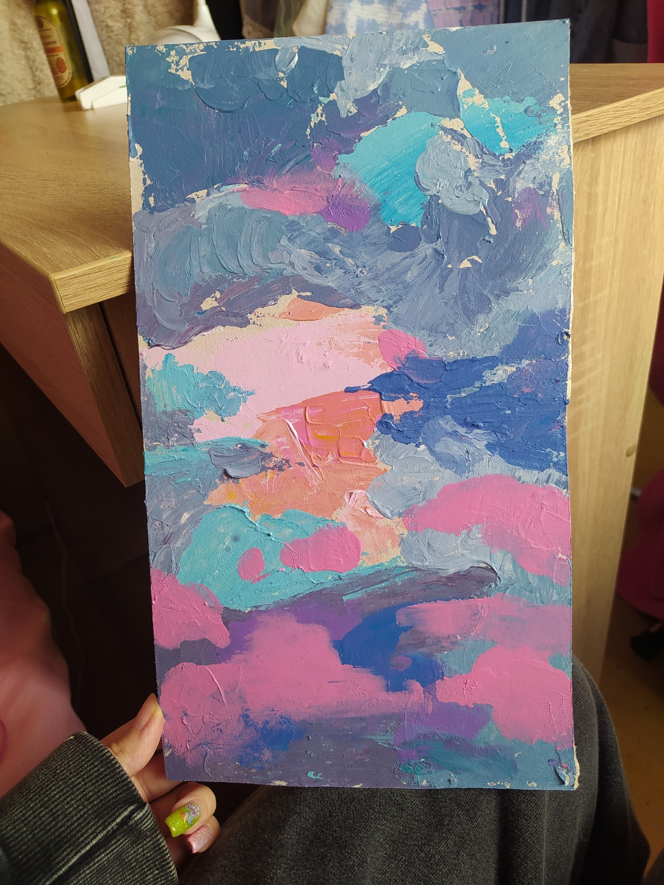

Небо, 2023

<https://vk.com/wall-149859040?offset=220&own=1&z=photo-149859040_457241347%2Fwall-149859040_2053>

Тип: Картина

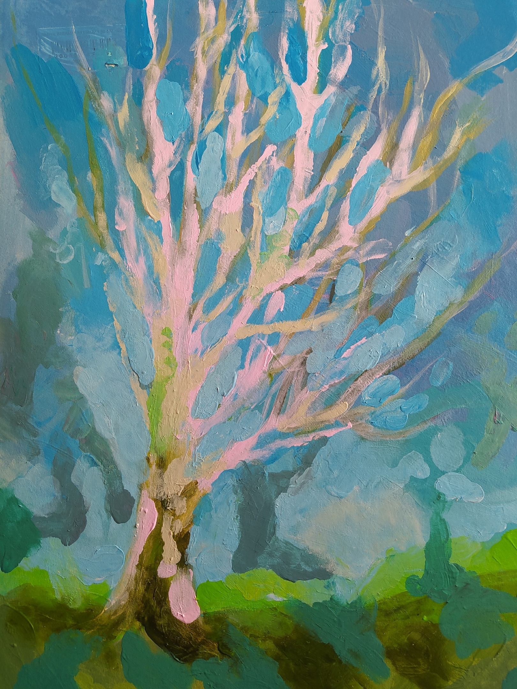

(Дерево), 2023

<https://vk.com/wall-149859040?offset=220&own=1&z=photo-149859040_457241345%2Fwall-149859040_2052>

Тип: Картина  
Жанр: Пейзаж

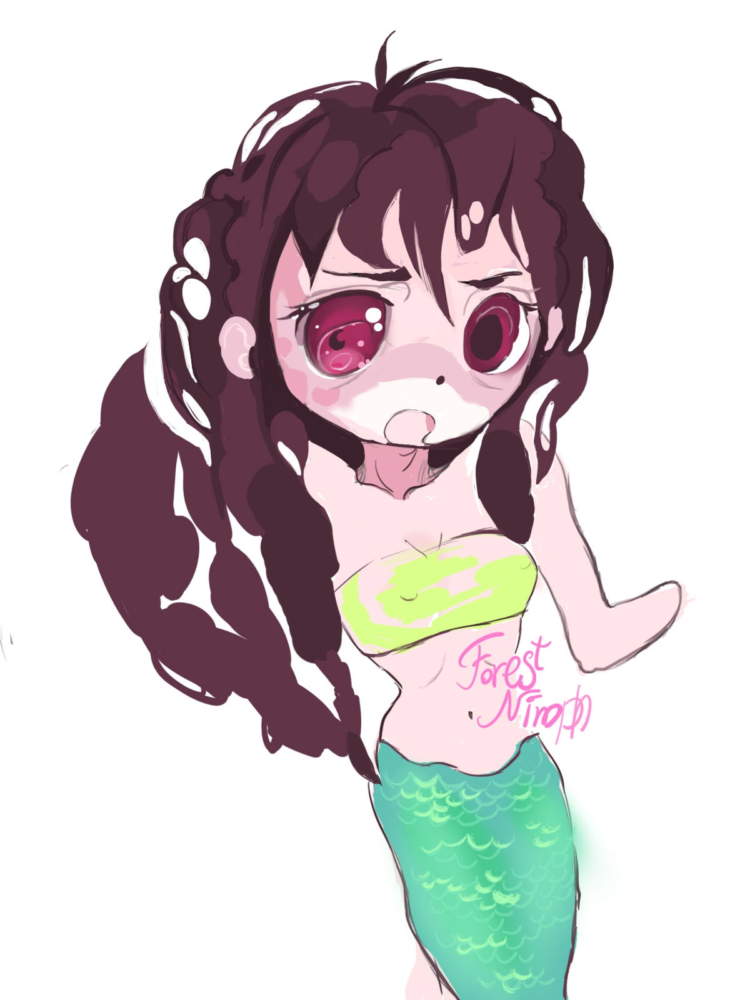

(Русалка), 2022

<https://vk.com/wall-149859040?offset=420&own=1&z=photo-149859040_457241116%2F89dba8bef10f9353b2>

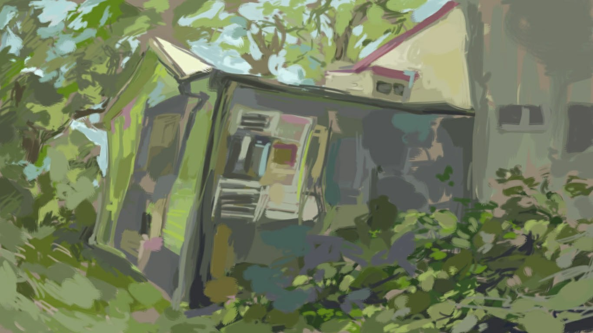

(Дом), 2021

<https://vk.com/wall-149859040?offset=420&own=1&z=photo-149859040_457240982%2F03160809214a323338>

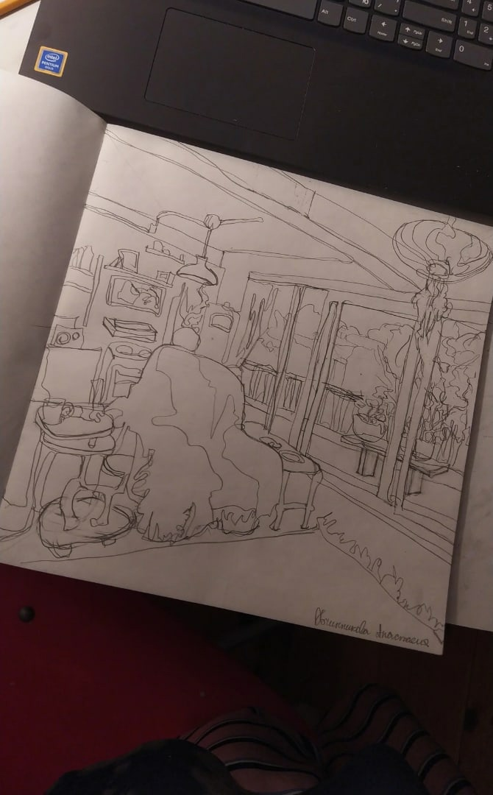

Линейный набросок интерьера, 2021

<https://vk.com/wall-149859040?offset=420&own=1&z=photo-149859040_457240966%2F52ee6f78d1ab398afb>

Тип: Рисунок

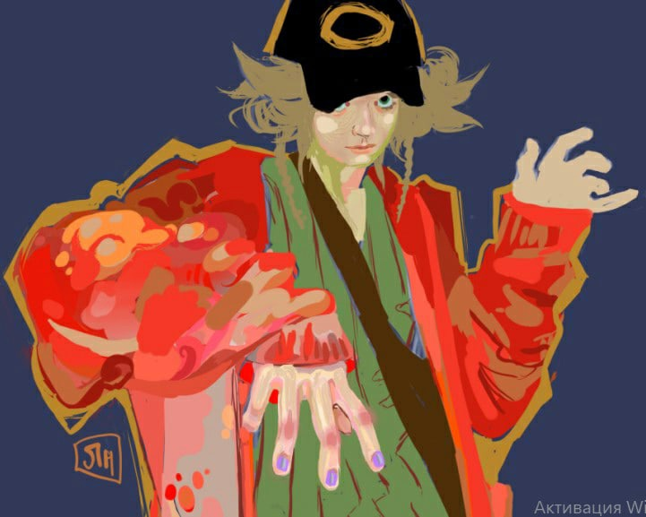

Девушка в динамичной позе, 2021. Цифровой рисунок

<https://vk.com/wall-149859040?offset=420&own=1&z=photo-149859040_457240871%2F4701a72a73864b8dcc>

Тип: Цифровой рисунок

Работа получилась такой, что ты не можешь получить полного удовлетворения от изображения, из-за того что девушка занимает динамичную позу и ты, как бы, ждешь от неё каких-то движений дальнейших, но их нет. Этот взгляд интригует и хочется увидеть её полное лицо, хочется чтоб она встала прямо, хочется узнать её лучше, но она замерла в позе, которая не дает тебе понять кто перед тобой.

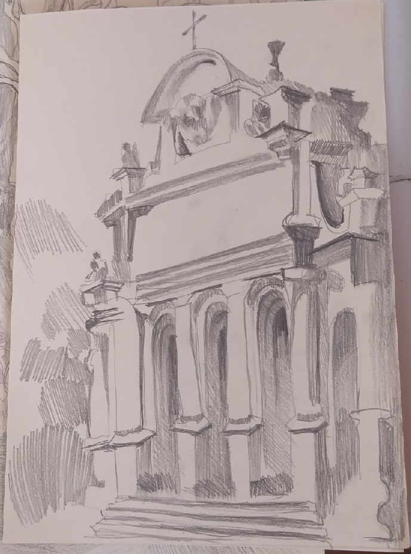

(Церковь), 2021

<https://vk.com/wall-149859040?offset=420&own=1&z=photo-149859040_457240812%2F345c0ae1cb01226d9c>

Тип: Рисунок  
Жанр: Городской пейзаж

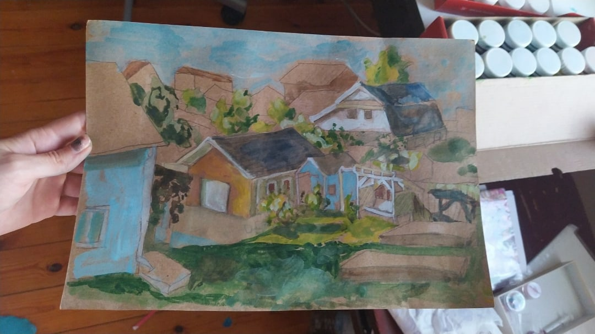

(Дачи), 2021. Акварель, гуашь, карандаши

<https://vk.com/wall-149859040?offset=420&own=1&z=photo-149859040_457240806%2Fd6a0946f7040496aed>

Тип: Картина

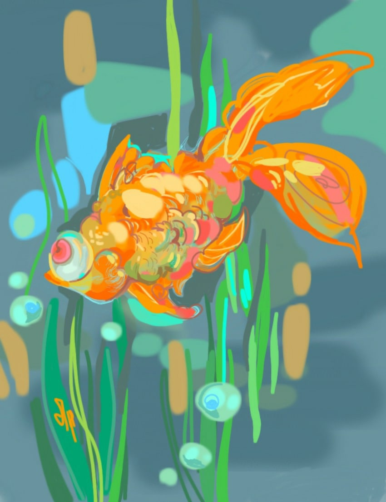

Рыбка, 2021

<https://vk.com/wall-149859040?offset=540&own=1&z=photo-149859040_457240726%2F58f4098f1db654ae32>

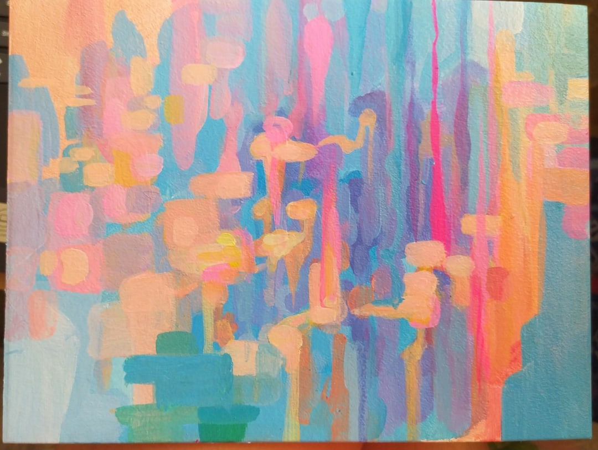

Эмоции, 2021

<https://vk.com/wall-149859040?offset=540&own=1&z=photo-149859040_457240725%2Fb04423afb3defd6b86>

Тип: Картина  
Жанр: Абстрактный

Пришло понимание картин без конкретных образов. Пришло, когда захотелось самой пописать без заданной темы, на издыхании. И лишь когда Я закончила работу, Я поняла всю её суть.

Очень не хотелось бы романтизировать, но
День назад Я терялась от того, что меня переполняли эмоции, которые Я не знала куда деть. Впервые в жизни я от плохого морального состояния начала наоборот что-то делать. Как итог : сегодня Я решила дополнить работу и сделать её более цельной. От чего вышло нечто иное. В работе оказалось есть даже особенность для меня самой. Она заключается в том что писалась она вчера на пике грусти. Хорошо что она была благостная и Я смогла даже вовремя эмоции перенаправить в нужное русло. Мне давно не было так, как вчера. Ну а сегодня у меня наоборот все было настолько хорошо, настолько это возможно. Поэтому я начала уже дополнять светлым и приятным.
Как оказалось, работа не имеет определенного характера, что не есть хорошо для композиционного центра, как по-мне, нету главного.
Пользуясь случаем, наверно можно сказать такую вещь, что в тяжёлые времена никогда нельзя терять надежду на лучшее. Пока есть надежда - есть все шансы, просто нужно время. И всегда после тяжёлых времён найдется то хорошее, что придет и перекроет всё напрочь. Но
Почему Я не перекрыла полностью все светлым и не установила конкретику с композициионным центром - потому что если я решила отразить своё состояние здесь, значит Я приму любую себя. (У меня было много переживаний раньше, по-поводу собственных эмоций, настало время это исправить и принять себя)

Рассуждая здесь, открыто
Я начала понимать что эта работа сама мне даёт ответы на мои вопросы. Она дала мне посмотреть на себя, а вернее, на своё состояние со стороны, и даже сподвигла меня на такие мысли, как
Наше общество привыкло говорить о том что нужно быть воспитанным, вежливым и самодостаточным. Но никого не учат быть настоящим. Всех учат быть правильными. Как итог : люди врут. Врут всем вдруг. В том числе и себе самому. Люди путаются в том, что они испытывают даже к себе, не то что к жизни. Таким образом мы получаем народ, который не умеет нормально общаться. Не умеет говорить в лицо элементарные вещи, не умеет правильно демонстрировать свои эмоции и чувства, стесняется их и боится. Всем нам очень трудно, все мы постоянно запутаны и напряжены. И это напряжение растет и приводит к болезням, неврозам и прочей шелухе. Подумать только, но если действительно подумать, то можно просто ради интереса попробовать говорить всё в лицо. 

"Всмысле в лицо? Но ведь тогда всё будут обижаться на мои слова. Это не красиво" - ответ : если ты хороший человек, с правильными мыслями, то когда ты будешь говорить всё что думаешь о людях, там ничего плохого не прозвучит, ибо ты будешь говорить по-делу. Ключевой момент - говорить всё, значит и приятные вещи тоже, но так же правду, не лесть. Только то, что действительно хочется сказать. Эти сдерживания эмоций привели к тому что люди просто не знают как реагировать на комплименты. Это такая редкость в наши дни.

Эмоции - чуть ли не самая важная составляющая нашей жизни. Именно благодаря им наша жизнь такая яркая и интересная. Любая эмоция нужна, любая эмоция важна, просто нужно уметь перенаправлять эмоции в нужное русло. Это слишком важная тема для меня, потому что я устала от того, что люди боятся искренности
И своей, и даже чужой.
С недавних пор Я научилась говорить что думаю, что чувствую
и именно это сделало меня счастливой сегодня.

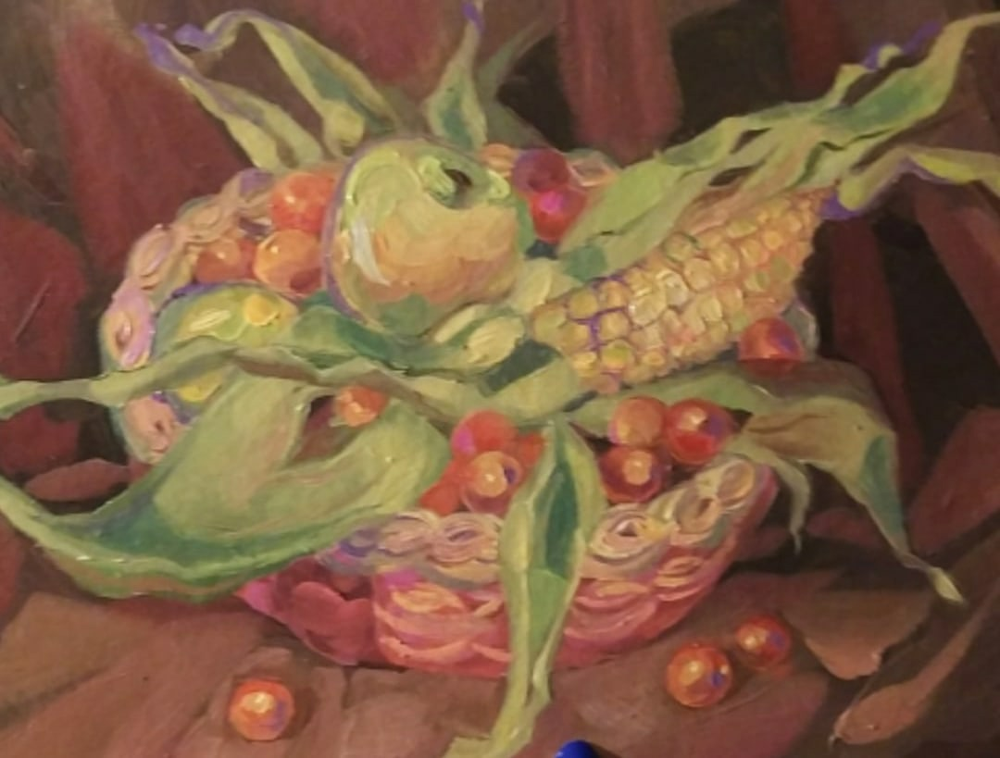

(Овощи в корзине), 2020. Холст на картоне, масло, 20х30 см

<https://vk.com/wall-149859040?offset=540&own=1&z=photo-149859040_457240520%2Fwall-149859040_1251>

Тип: Картина  
Жанр: Натюрморт

Эта работа была сделана летом. Не без ошибок, я бы и сейчас исправила, но суть работ всегда в другом, если они делаются не на оценку. Важен не результат, а сам посыл и те эмоции, которые может вызвать работа. Хорошая работа та, что начата с чистой головы, с чистых мыслей, отталкиваясь от высоких чувств. И при всём несовершенстве, я вижу что-то теплое, нежное, непоколебимое и невинное.

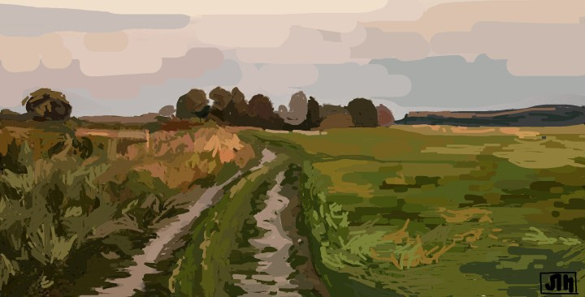

Преодолевая расстояния, 2020. Цифровой рисунок (Photoshop)

<https://vk.com/wall-149859040?offset=720&own=1&z=photo-149859040_457240360%2Fd25532a7812c54ebe7>

Тип: Цифровой рисунок  
Жанр: Пейзаж

От составителя: Выставлялась на конкурс vktalents_artlife

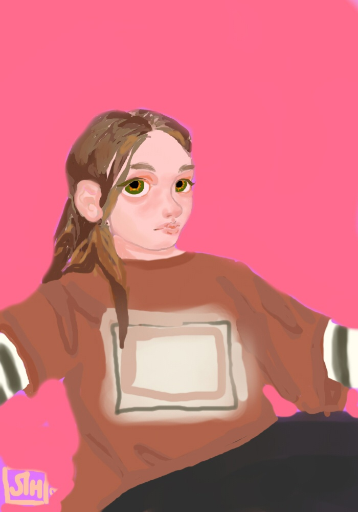

(Портрет девушки), 2020

<https://vk.com/wall-149859040?offset=760&own=1&z=photo-149859040_457240330%2Fd12516e5aa27f763ce>

Жанр: Портрет

От составителя: Сделана на заказ

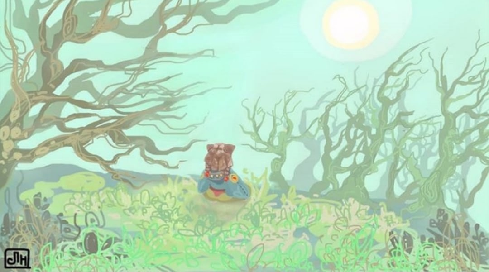

(Сказочный лес), 2020

<https://vk.com/wall-149859040?offset=760&own=1&z=photo-149859040_457240339%2Fwall-149859040_1115>

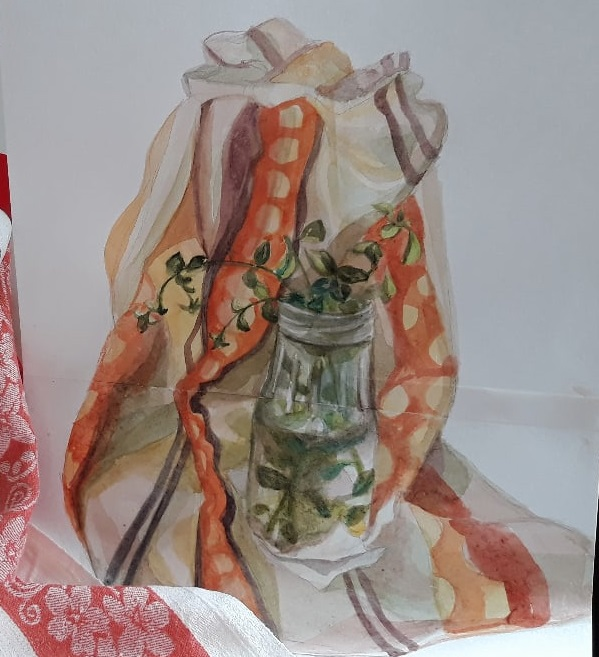

(Растение в банке), 2020. Акварель

<https://vk.com/wall-149859040?offset=780&own=1&z=photo-149859040_457240310%2Fcbe410c3a27f496f5a>

Тип: Картина  
Жанр: Натюрморт

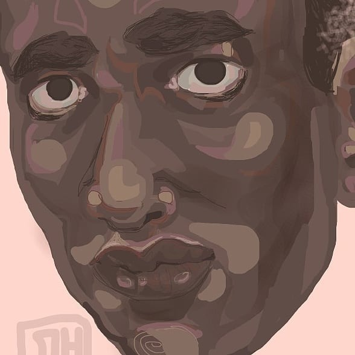

Карамельный мужчина, 2020

<https://vk.com/wall-149859040?offset=780&own=1&z=photo-149859040_457240263%2Fc5c07229d2932a60b2>

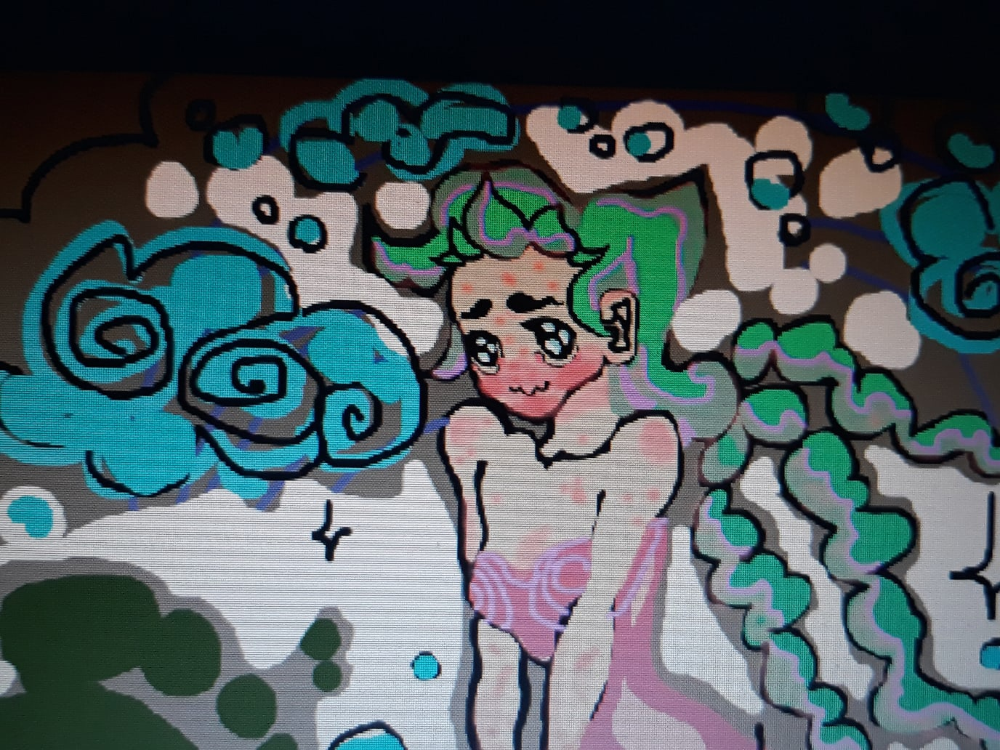

(Лесная нимфа), 2020. Цифровой рисунок

<https://vk.com/wall-149859040?offset=780&own=1&z=photo-149859040_457240172%2Fwall-149859040_992>

Тип: Цифровой рисунок

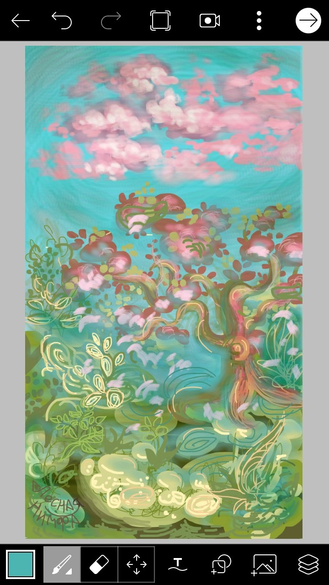

(Природа), 2020

<https://vk.com/wall-149859040?offset=780&own=1&z=photo-149859040_457240116%2Fwall-149859040_920>

Тип: Цифровой рисунок

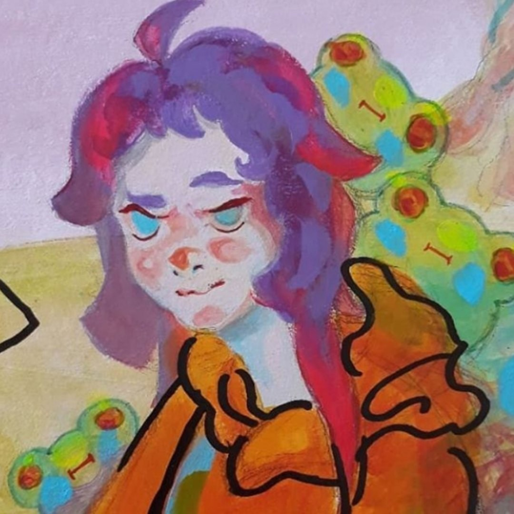

(Девушка с лягушками), 2019

<https://vk.com/wall-149859040?offset=780&own=1&z=photo-149859040_457239917%2Ffea89b13bf633f78ea>

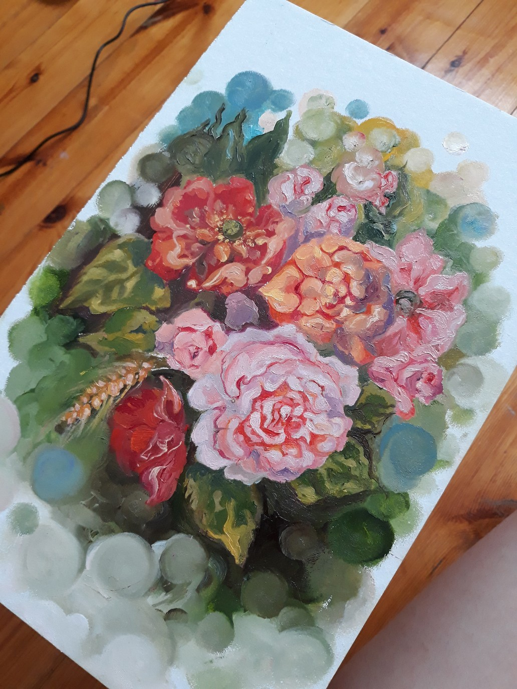

(Цветы), 2019

<https://vk.com/wall-149859040?offset=780&own=1&z=photo-149859040_457239889%2F81abff8417f643d702>

[В начало](asyaless.md) [Предыдущая](asyaless.md) *Страница 2 из 3* [Следующая](asyaless3.md) [В конец](asyaless3.md)

## См. также

- [Черновик биографии](bio.md)

