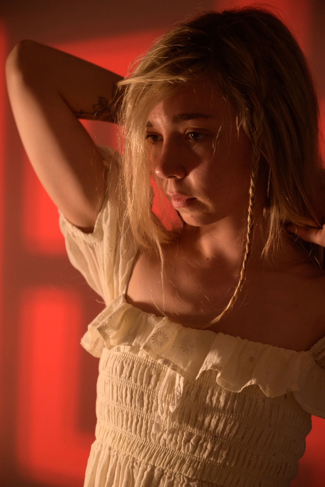

# Овчинникова Анастасия Анатольевна

Дата рождения: Апрель 2000  
Место рождения: Невьянск  

Страницы в интернете:
- <https://vk.com/asyalesss>
- <https://storynavigation.com/user/asya.less>

## Черновик биографии

Уже в 5 классе школы рисовала на заказ для одноклассников. Когда это заметили учителя, ее вызывали на разговор к директору.

О детстве:

> Сколько себя помню, я постоянно пыталась познать себя и свою роль в этом мире. Всегда. С самого рождения я всегда чувствовала себя крупицей этого гигантского мира, где я, в свою очередь, имею более гигантский потенциал чем планета Земля.
> Будучи маленьким ребёнком я уже считала себя мудрым мыслителем и философом который пытается познать непостежимое. Всё что меня всегда интересовало больше всего это то, как устроен этот мир. Интуитивно я всегда понимала что мой внутренний мир - это та же вселенная что внешний мир, только мой отличается тем, что я сама им способна управлять и решать, чем себя наполнить.
> Отсюда у меня сформирована привычка к саморефлексии и хорошая наблюдательность, эмпатия.
>
> [...] В моем детстве отсутствовал зрительный контакт, обнимашки, улыбки, добродушие и открытость, общения не было от слова совсем. Не смотря что базовые потребности были закрыты, был только холод и избегание. Помню, что я постоянно не понимала что чувствует тот или иной член моей семьи в данную минуту, и чем я могу помочь. Но я ребенок, а ребенку, особенно маленькому > не понятны проблемы взрослых.

В 2016-2020 училась в Уральском колледже прикладного искусства и дизайна (филиал ФГБОУ ВО «РГХПУ им. С.Г.Строганова»), специальность "Художественная роспись по металлу".

В 2016 жила около перекрестка Ленина-Мира в центре Нижнего Тагила.

2019-2020: Организовывала совместные выезды на природу с другими студентами-художниками, в ходе которых совместно создавались картины: https://vk.com/wall-149859040_1063 , https://vk.com/wall-149859040_341

В 2020 г. поступила на ФХО НТСПИ, специальность "Изобразительное искусство и дизайн".

2024: Поездка в Крым.

2025: Поездка в Краснодар.

10.09.2025: Участвовала в I окружном Форуме рабочей молодежи (https://ntagil.org/molodost/news/286757)

О творчестве (2024-2025):

> Люблю творчество за то, что оно вскрывает всех, кто с ним соприкасается. служит зеркалом, отражающим внутренний мир смотрящего: его страхи, систему убеждений и комплексы.
> Всё – пустота. каждый видит то, чем сам наполнен. и отношение к увиденному формирует в меру своих болей.
> Творчество не может быть плохим или хорошим. Если творчество не оставляет тебя равнодушным, оно выполнило свою основную задачу. Вызвало эмоции. Заставило тебя проживать то, из чего ты соткан. то, для чего ты вообще здесь.
> Ты возьмешь из него то, что хочешь сам. Оно повлияет на тебя так, как ты ему разрешишь.
> 
> Творчество прозрачно. Оно не определяет того, кто его делает. творчество для потребителя. именно потребитель наполнит его своим смыслом.

По воспоминаниям Анастасии, в детстве она имела проблемы с низкой самооценкой, была замкнутой и погруженной в себя. В 18 ей удалось преодолеть проблему низкой самооценки путем занятий спортом и ограничений в питании, она стала больше общаться с людьми.

**Интересы**

Помимо живописи, занимается изготовлением украшений из полимерной глины, мягких игрушек.

*Составление начато 18.05.2025*
