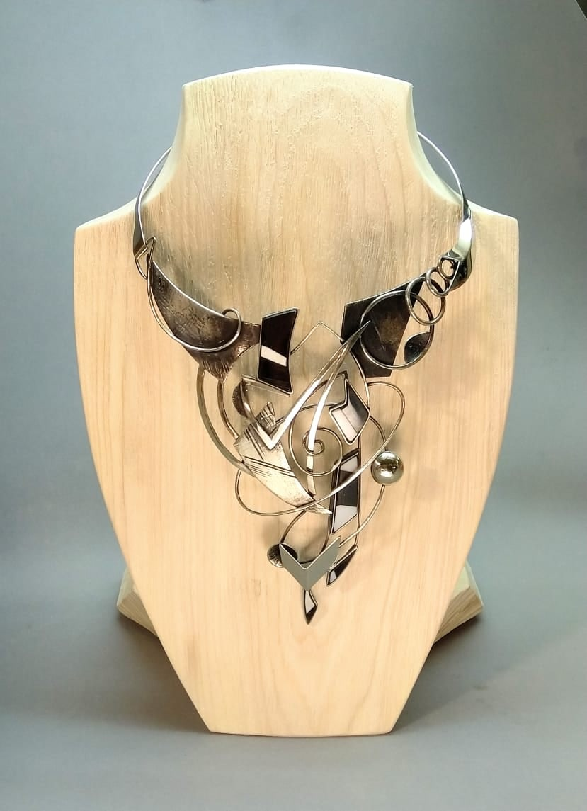
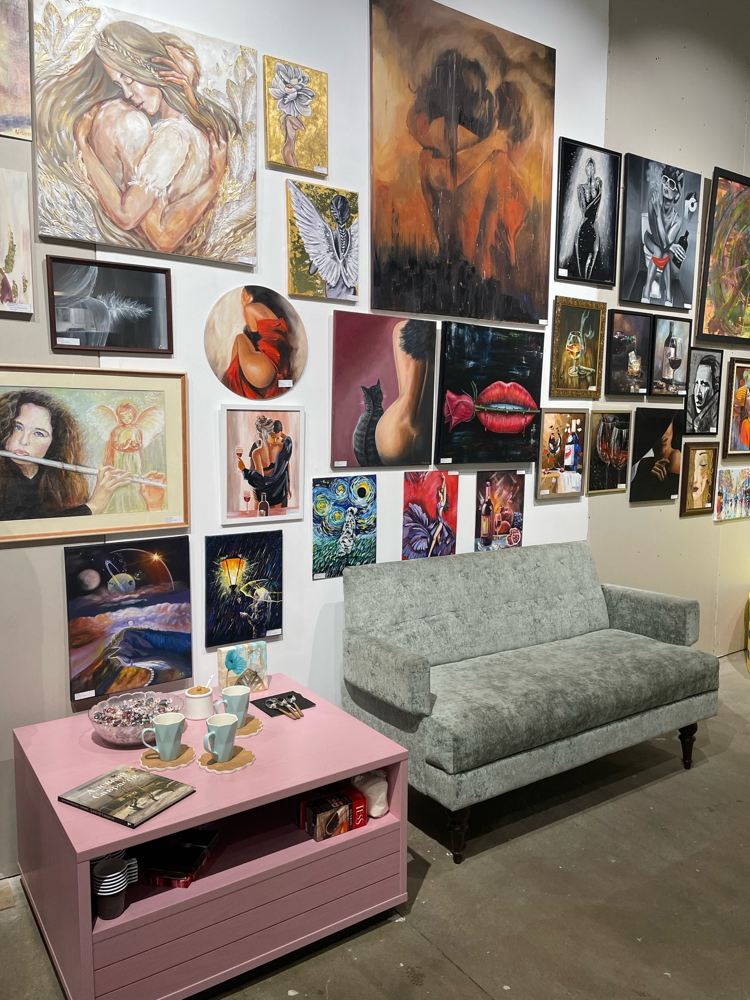
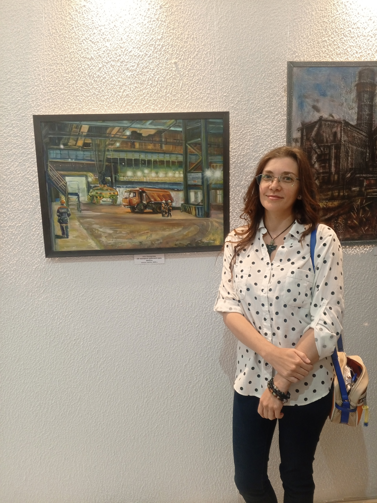

# Франт Анна
## Черновик биографии

Настоящее имя: Солдатова Анна Андреевна.

Страница в интернете: https://vk.com/filkins

Родилась 9 апреля 1989 года.

Мать занималась росписью подносов. Училась в Нижнетагильском колледже искусств, затем в Иваново (колледж), Шуя (институт). Учителем был Александр Шамков (реализм), писали морские пейзажи. В 2016-2020 училась на ФХО НТГСПИ, бакалавриат по специальности "Педагогическое образование". Тема дипломной работы - "Проектирование и изготовление ювелирного изделия". Работала преподавателем по игре на гитаре, куратором картинной галереи, делала маникюр.

Ювелирное украшение, изготовленное Анной для дипломной работы

2020 г.: Сборник стихов "Фабула" (https://ridero.ru/author/frant_soldatova_anna_pwj_l/)

2020-2021: занималась организацией выставок в Краеведческой библиотеке музея-заповедника "Горнозаводской Урал".

2021-2022: Проводила занятия по рисованию в Artlab School NT.

2022 г.: работала риэлтором в агентстве Юриэлт.

Награда конкурса Luxembourg Art Prize.

Выставка "Живи ярко" в Анапе.

Директор ArtSpaceDepo. Арт-Пространство DEPO было открыто в апреле 2023 г. По воспоминаниям Анны, идея о необходимости создания арт-пространства пришла ей после просмотра фильма "Модильяни" в 17 лет. В 2023 году к этой же идее пришли Елена Александровна Качалова, управляющая ТРЦ DEPO, и Екатерина Борисовна Кайлова, создатель арт-пространства. Подруга Анны случайно позвала ее на выставку в недавно открытом арт-пространстве. Анна привезла на нее свою большую картину "Тигр", после этого ее пригласили на роль директора. На выставке арт-пространства выставляются на продажу картины, а также открытки, закладки, мини постеры, украшения ручной работы; экспозиция обновляется каждые 3-4 месяца. В начале вход на выставку для посетителей был платным, позднее его сделали бесплатным. Детские работы участвуют в выставках наравне со взрослыми. В арт-пространоство также приглашают выступать музыкантов, поэтов.
Анна считает, что ArtSpaceDepo - в первую очередь место для взаимодействия творческих людей, чтобы они могли знакомиться, проходить к новым совместным проектам, для развития амбиций. Но это также и место, куда можно придти отдохнуть, послушать музыку, посмотреть красивый интерьер с картинами. На 2025 г. в галерее более более 1500 предметов искусства, более 500 участников.

В ArtSpaceDepo

Июль 2025. Работала на пленэре в конвертерном цехе НТМК, затем на территории Демидовского завода (https://vk.com/wall-38909878_10678). Выставка "Территория": https://museum-nt.ru/news/calendar/detail.php?ELEMENT_ID=9745

Сентябрь 2025. Участвовала в выставке в музее ЕВРАЗ НТМК (https://vk.com/wall35705684_10557).

На выставке в музее ЕВРАЗ НТМК, 2025

Выступала в качестве вокалистки в джаз-группе The Beavers и блюз-рок группе Big Trouble. В музыке самым близким для себя стилем Анна считает рок, но также интересуется джазом, классической музыкой.

Источники:
- https://vk.com/filkins
- https://rutube.ru/video/66a5b4570cd292d6b9f27287dd8ce474/
- https://www.culture.ru/events/4871282/vystavka-rabot-anny-frant-zhivi-yarko
- https://dzen.ru/video/watch/6888d93d1d8fbe5e4b8061a8

Составление начато 23.06.2025
