# Франт Анна

Дата рождения: Апрель 1989  
Место рождения: Нижний Тагил  
Подпись: Франт  
Страница в интернете: <https://vk.com/filkins>  

## Каталог работ

Мой любимый Горный техникум, 2025. Холст, масло, 60х80 см

<https://vk.com/filkins?z=photo35705684_457262570%2Fwall35705684_10490>

Изображено: [Нижнетагильский горно-металлургический колледж имени Е.А. и М.Е. Черепановых](https://ntgmk.ru/ru)

От составителя: Выставлялась на продажу за 2000₽.

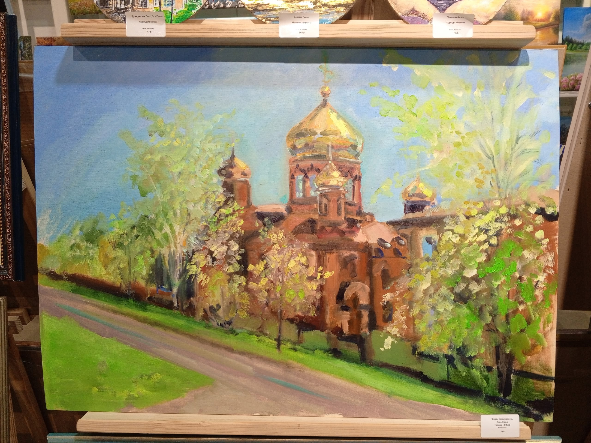

Сквозь первую зелень, 2025. Холст, масло, 50х80 см

<https://vk.com/filkins?z=photo35705684_457262572%2Fwall35705684_10490>

Изображено: [Скорбященский женский монастырь, Вознесенский храм, г. Нижний Тагил](https://ntobitel.cerkov.ru/voznesenskij-xram)

От составителя: Выставлялась на продажу за 2000₽

В середине рабочего дня. МНЛЗ, 2025. Холст, масло

<https://vk.com/filkins?z=photo35705684_457262433%2Fwall35705684_10472>

Изображено: Нижнетагильский Металлургический Комбинат

История:  
- 2025: Участвовала в выставке [Выставка в музее ЕВРАЗ НТМК](https://vk.com/wall35705684_10557)

DEPOша, 2025

<https://vk.com/wall35705684?z=photo35705684_457262031%2Fwall35705684_10314>

3D-рисунок на территории рядом с ТРЦ DEPO

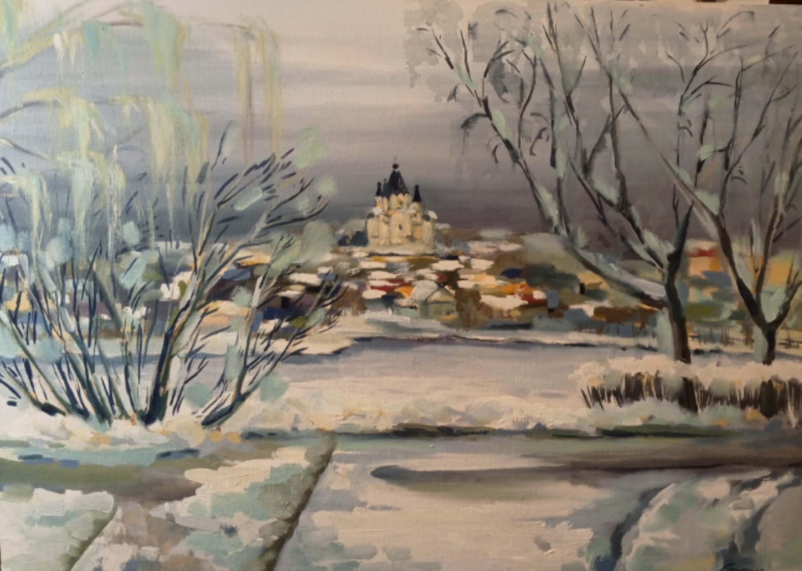

Вид на храм Александра Невского, 2025. Холст, масло, 70х50 см

<https://vk.com/wall35705684?z=photo35705684_457261941%2F53e9ecd14317f7b89c>

Изображено: [Храм Александра Невского, г. Нижний Тагил](https://anevsly-ntagil.cerkov.ru)

От составителя: Выставлялась на продажу за 5000₽

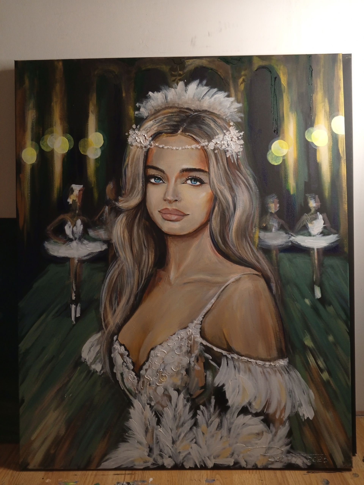

Мэри, 2025. Холст, акрил, 80х100 см

<https://vk.com/wall35705684?z=photo35705684_457261642%2Fwall35705684_10209>

От составителя: Написана на заказ по фото

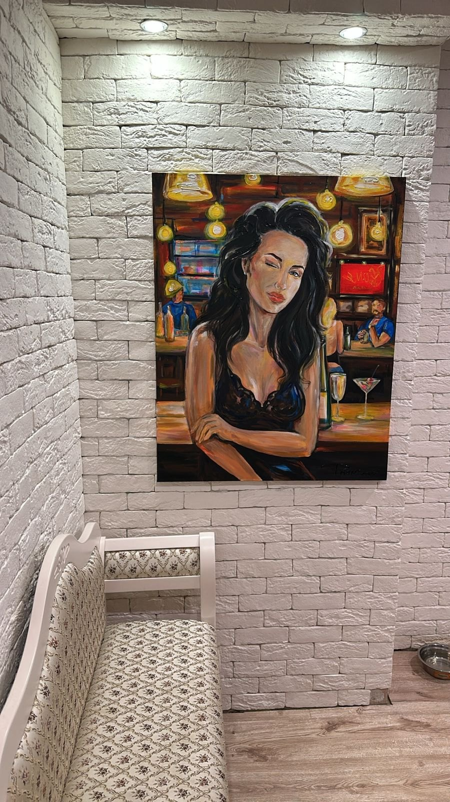

Портрет в стиле Нейро "Юлия", 2025. Холст, акрил, 80х100 см

<https://vk.com/wall35705684?offset=160&z=photo35705684_457261572%2Fwall35705684_10192>

От составителя: Написана на заказ

Питер, 2025. Планшет, акрил, 83х140 см

<https://vk.com/club218867577?z=photo-218867577_457240771%2Falbum-218867577_304558656%2Frev>

История:  
- 2025: Выставлялась на продажу в ArtSpaceDepo за 25 000 ₽

Дубай, 2025. Планшет, акрил, 170х140 см

<https://vk.com/club218867577?z=photo-218867577_457240770%2Falbum-218867577_304558656%2Frev>

История:  
- 2025: Выставлялась на продажу в ArtSpaceDepo за 50 000 ₽

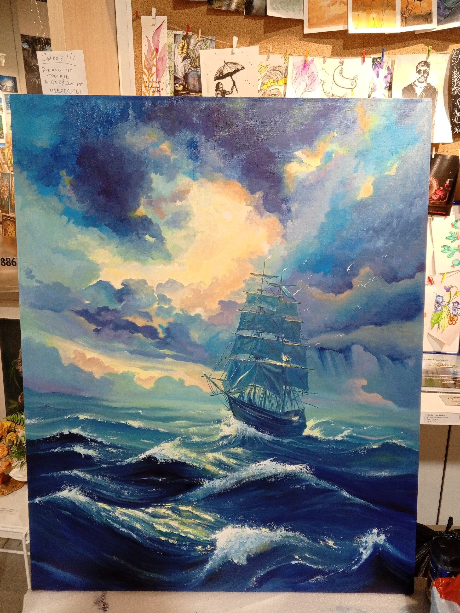

На всех парусах, 2024. Холст, масло, 80х100 см

<https://vk.com/wall35705684?offset=160&z=photo35705684_457260608%2Fa89d263117da21ff4f>

От составителя: Была продана за 40000₽

Тотем, 2024. Холст, акрил, 40х60 см

<https://vk.com/wall35705684?offset=160&z=photo35705684_457259793%2Fbe81315f45894a08f6>

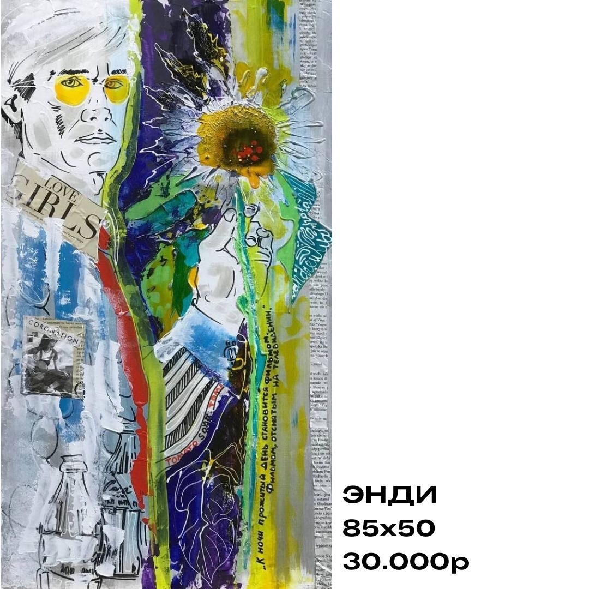

Энди, 2024. 85х50 см

<https://vk.com/wall35705684?offset=300&z=photo-76927552_457240908%2Fwall-76927552_1568>

Энди Уорхолл - один из самых загадочных и интересных новаторов для меня. В этой картине мой отзыв на его видение, его жизнь, истории и то, как он вполотил свои мечты в жизнь. В этом мы похожи.

От составителя: Работа содержит фрагменты, намекающие на произведения Энди Уорхолла: Бутылка Coca Cola, надпись Tomato Soup - "Банки с супом Кэмпбелл", надпись Love Girls - предположительно фильм "Девушки из Челси", надпись Coronation - предположительно "Серия портретов королев".

Выставлялась на продажу за 30 000 р.

История:  
- 2024: [Выставлялась в галерее "Белый квадрат", г. Анапа](https://vk.com/wall35705684?w=wall35705684_9933)

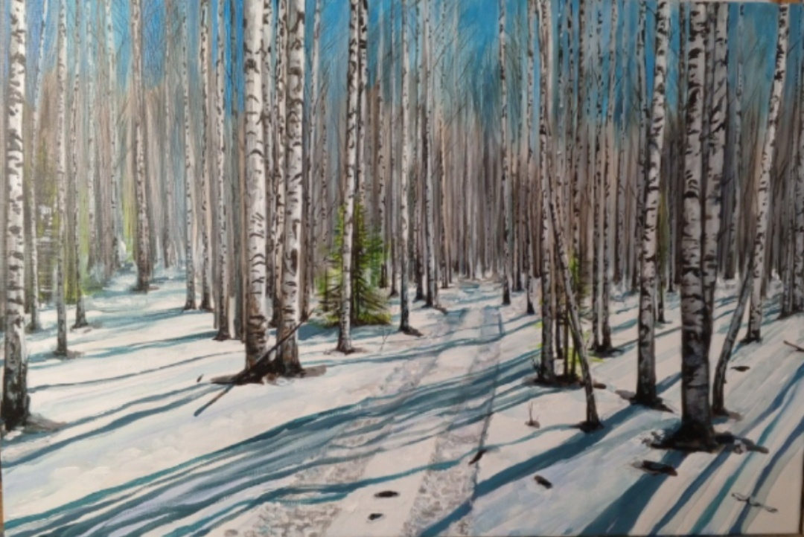

Березовая роща, 2024. Холст, акрил, 40х60 см

<https://vk.com/wall35705684?offset=300&z=photo35705684_457259453%2Fwall35705684_9834>

От составителя: Написана на заказ по фото

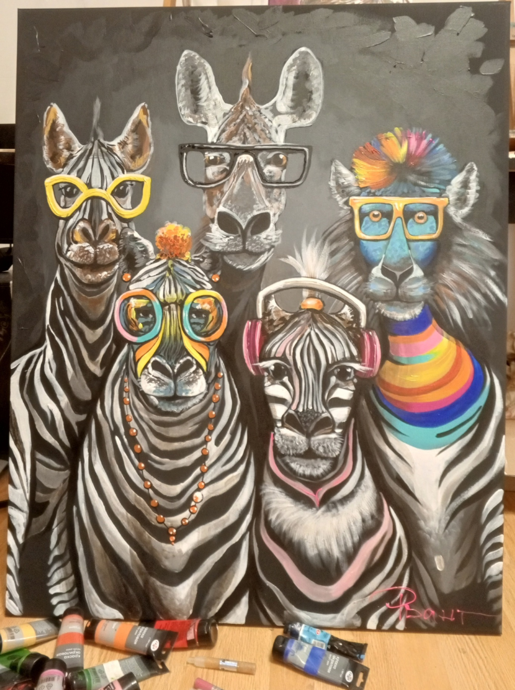

Семейка полосатых, 2024. Холст, акрил, 80х100 см

<https://vk.com/wall35705684?offset=300&z=photo35705684_457258889%2Ffab3ae423bb55c583d>

От составителя: Является вариантом популярного тиражируемого сюжета "Веселые зебры", основанного на картине Wendy Wu "Zebras family tree" (https://2-wendy-wu.pixels.com/featured/zebras-family-tree-wendy-wu.html)

В 2025 был сделан авторский повтор этой картины для заказчика из Екатеринбурга (https://dzen.ru/a/aSGXqpqUkThsGgIl)

История:  
- 2024: Выставлялась в ArtSpaceDepo

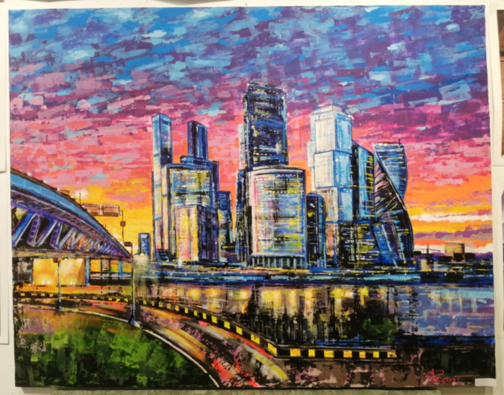

Моskва, 2024. Планшет, акрил, 140х160 см

<https://vk.com/wall35705684?offset=300&z=photo35705684_457258500%2Fwall35705684_9597>

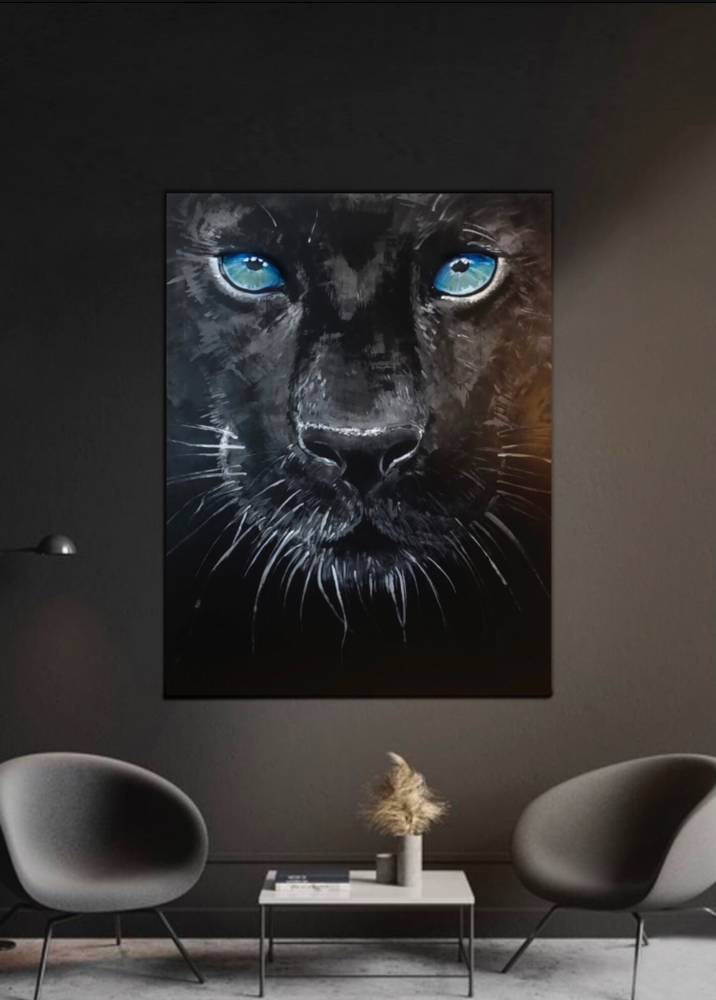

Пантера, 2024. Планшет, акрил, 140х170 см

<https://vk.com/wall35705684?z=photo-224678814_456240219%2Fwall-224678814_85>

История:  
- 2024: Выставлялась на продажу в ArtSpaceDepo за 50 000 ₽

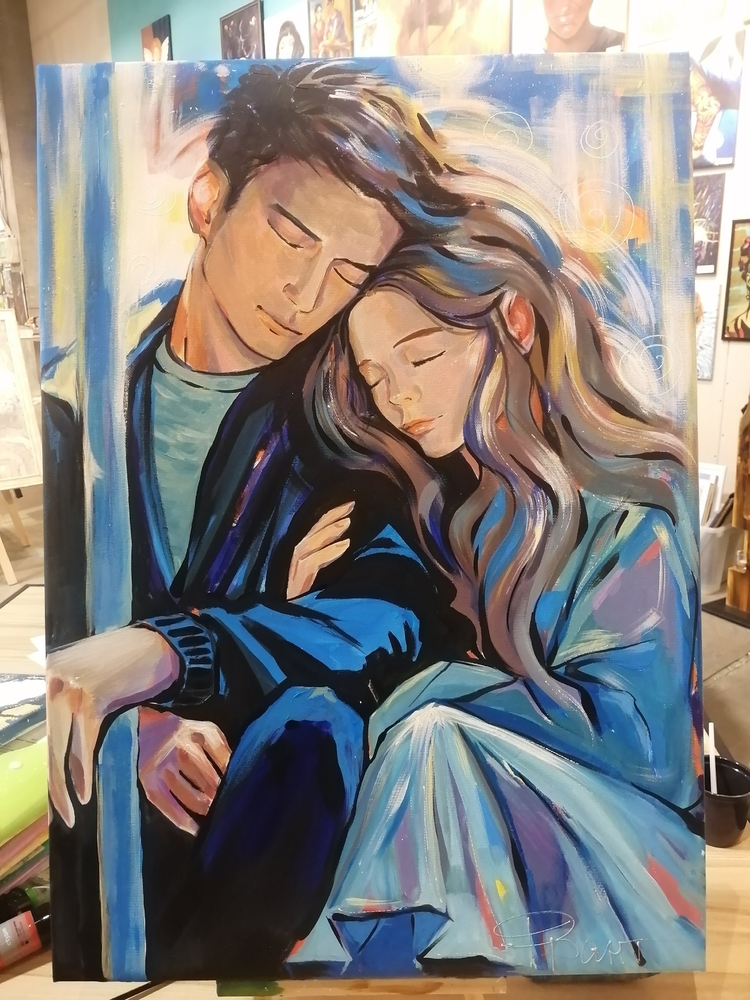

Всё равно куда... Только с тобой!, 2024. Холст, акрил, 50х70 см

<https://vk.com/wall35705684?offset=300&z=photo35705684_457258487%2F2e28309055e5ed18e3>

Шлем Аида, 2023. Планшет, акрил, 101х121 см

<https://vk.com/wall35705684?z=photo-224678814_456240220%2Fwall-224678814_85>

История:  
- 2023: Выставлялась на продажу в ArtSpaceDepo за 6 000 ₽

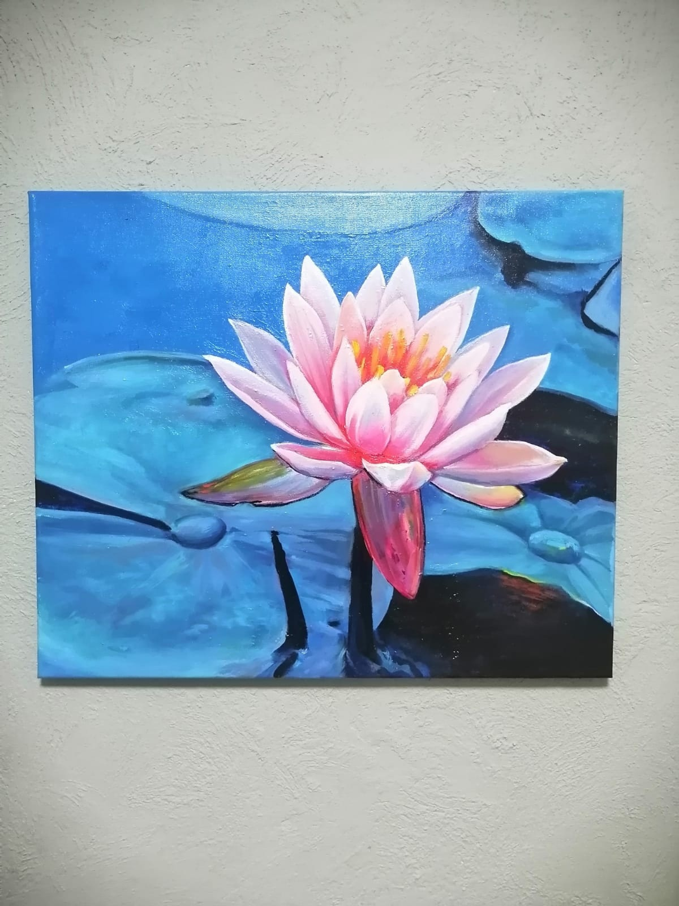

Розовое на голубом, 2023. Холст, масло, 44х53 см

<https://vk.com/albums-218867577?z=photo-218867577_457239420%2Fphotos-218867577>

История:  
- 2023: Выставлялась в ArtSpaceDepo

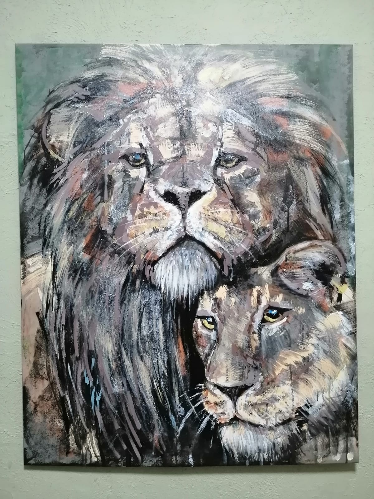

Пара, 2023. Холст, акрил, 80х100 см

<https://vk.com/albums-218867577?z=photo-218867577_457239419%2Fphotos-218867577>

История:  
- 2023: Выставлялась в ArtSpaceDepo

Весенний цвет, 2023. Холст, масло, 44х53 см

<https://vk.com/photo-218867577_457239405>

История:  
- 2023: Выставлялась в ArtSpaceDepo

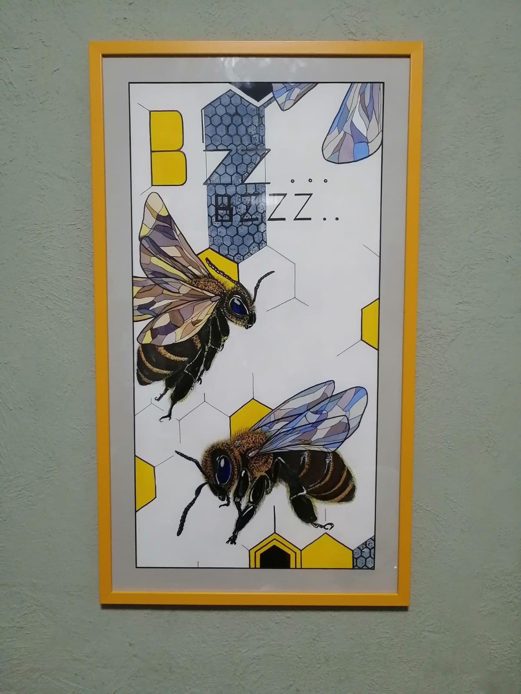

Космические пчелы, 2023. Графика, смешанная техника, багет со стеклом, 45х79 см

<https://vk.com/photo-218867577_457239406>

История:  
- 2023: Выставлялась в ArtSpaceDepo

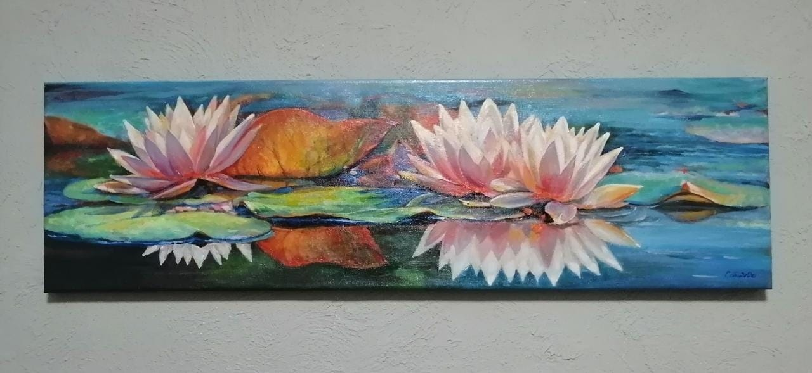

Лилии в полдень, 2023. Холст, масло, 24х83 см

<https://vk.com/photo-218867577_457239407>

История:  
- 2023: Выставлялась в ArtSpaceDepo

Букет, 2023. Холст, акрил, золото, 40х50 см

<https://vk.com/photo-218867577_457239410>

История:  
- 2023: Выставлялась в ArtSpaceDepo

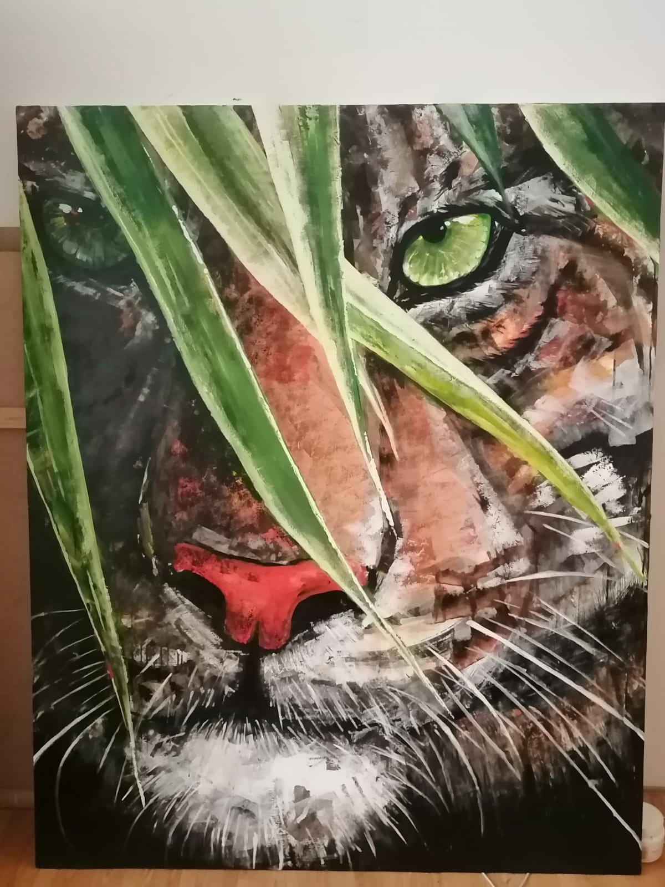

Добыча, 2023. ДВП, акрил, 135х167 см

<https://vk.com/photo-218867577_457239411>

История:  
- 2023: Выставлялась в ArtSpaceDepo

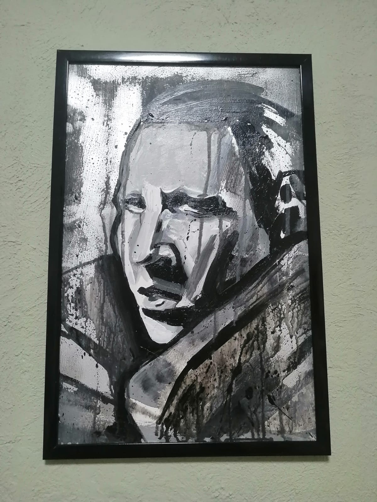

Мистер М. М., 2023. ДВП, акрил, серебро, багет, 32х49 см

<https://vk.com/photo-218867577_457239413>

История:  
- 2023: Выставлялась в ArtSpaceDepo

Нарциссы, 2023. Холст на картоне, масло, багет, 31х41 см

<https://vk.com/photo-218867577_457239415>

История:  
- 2023: Выставлялась в ArtSpaceDepo

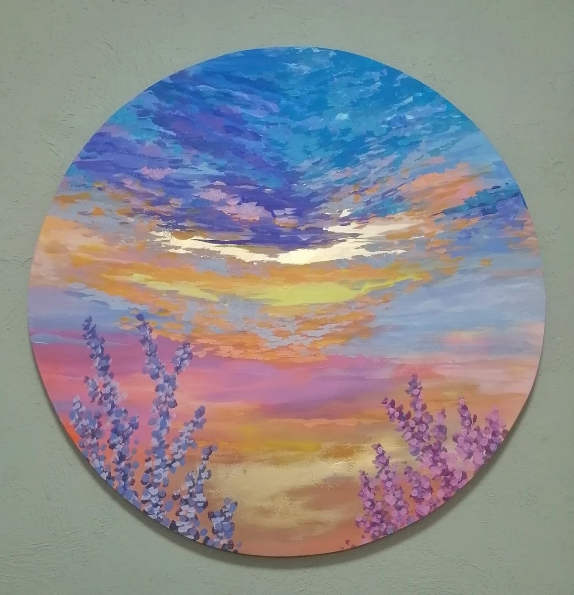

Привет из краснодара!, 2023. ДВП, акрил, золото, 79,5х79,5 см

<https://vk.com/albums-218867577?z=photo-218867577_457239913%2Fphotos-218867577>

Идея с фотографии Рождественской А.А.

История:  
- 2023: Выставлялась в ArtSpaceDepo

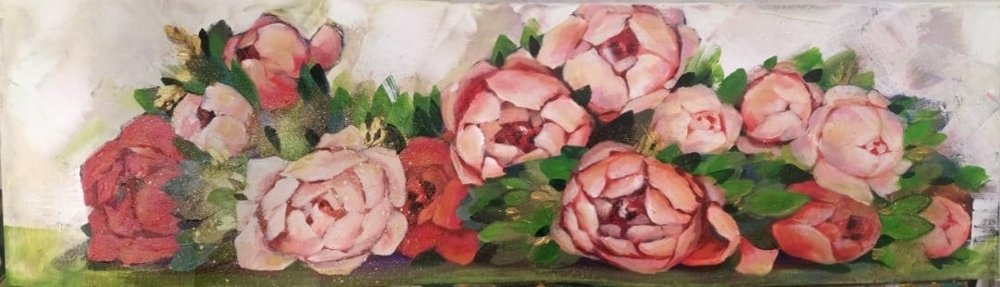

Пионы, 2023. Холст, акрил, золото, 28х83 см

<https://vk.com/albums-218867577?z=photo-218867577_457239912%2Fphotos-218867577>

История:  
- 2023: Выставлялась в ArtSpaceDepo

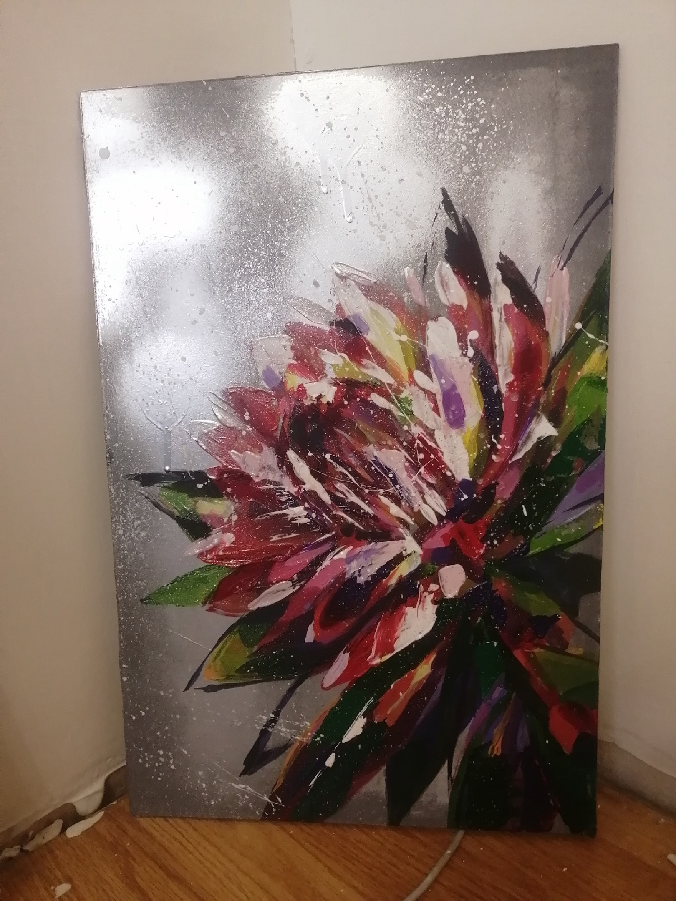

Сухоцвет, 2023. ДВП, акрил, серебро, 30х47 см

<https://vk.com/albums-218867577?z=photo-218867577_457239755%2Fphotos-218867577>

История:  
- 2023: Выставлялась в ArtSpaceDepo

Огромные Анютины глазки, не ирисы, 2023. ДВП, акрил, золото, 30х47 см

<https://vk.com/albums-218867577?z=photo-218867577_457239754%2Fphotos-218867577>

История:  
- 2023: Выставлялась в ArtSpaceDepo

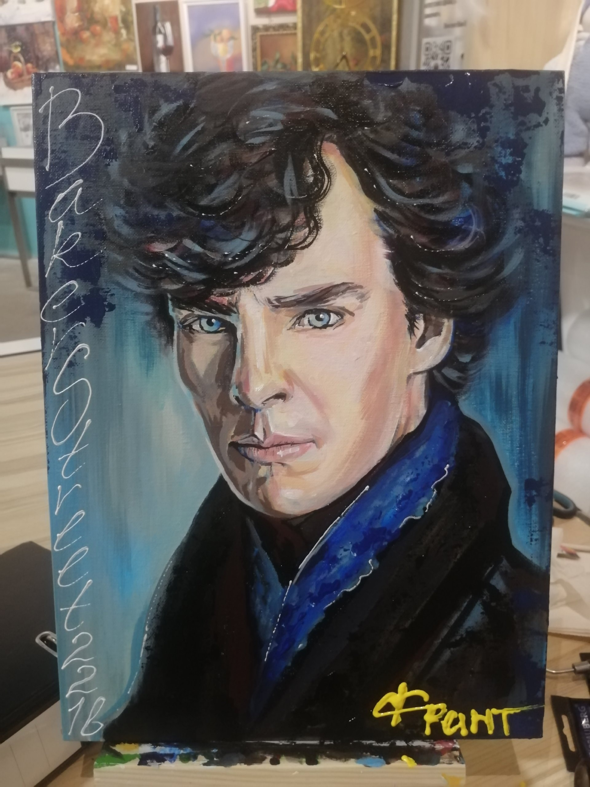

Мистер Холмс, 2023. Холст, акрил

<https://vk.com/wall35705684?offset=300&z=photo35705684_457258420%2F2df574bebeb4f164e0>

Изображено: Актер Бенедикт Камбербэтч в роли Шерлока Холмса

От составителя: Написана на заказ

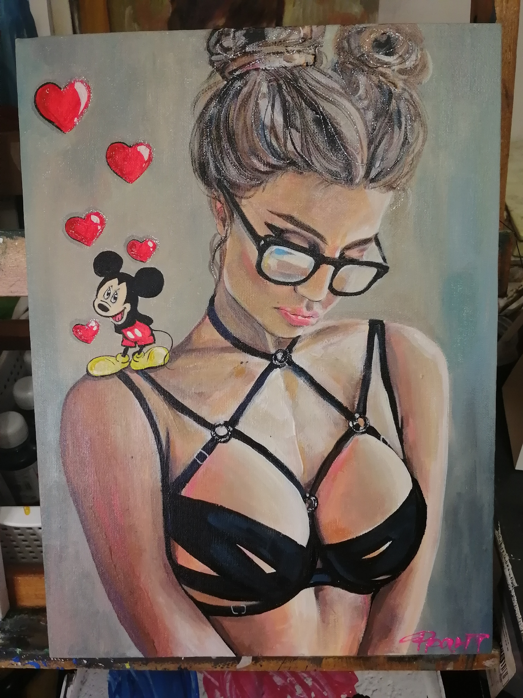

Love, 2023. Холст, акрил, 30х40 см

<https://vk.com/wall35705684?offset=550&z=photo35705684_457258101%2Faeff032f6bd7b99b69>

От составителя: Выставлялась на продажу за 7000 р.

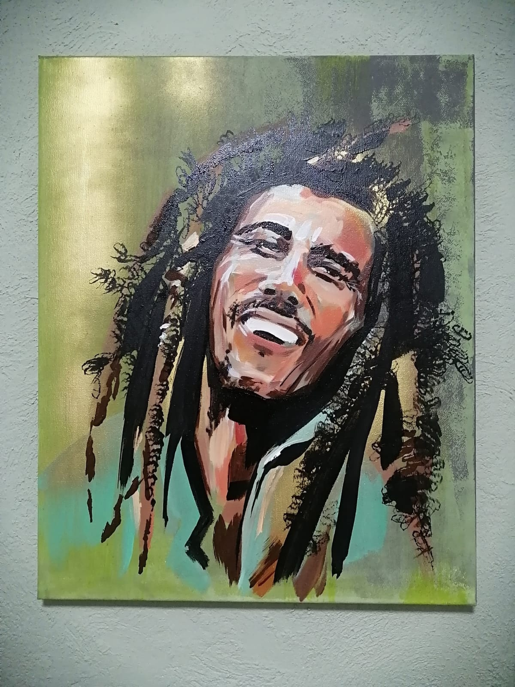

Боб, 2022. Холст, акрил, золото, 40х50 см

<https://vk.com/photo-218867577_457239409>

Это первая картина, в которой я постаралась абстрагироваться от внешнего мира, углубиться в свое внутреннее состояние и достать что-то свое. Свое отношение к этой личности и тому, что он привнес в этот мир. Эта работа была началом освоения акрила и его взаимодействия с другими красками, поиск приемов и технологий.

Изображено: Боб Марли

История:  
- 2023: Выставлялась в ArtSpaceDepo
- 2024: [Выставлялась в галерее "Белый квадрат", г. Анапа](https://vk.com/wall35705684?w=wall35705684_9933)

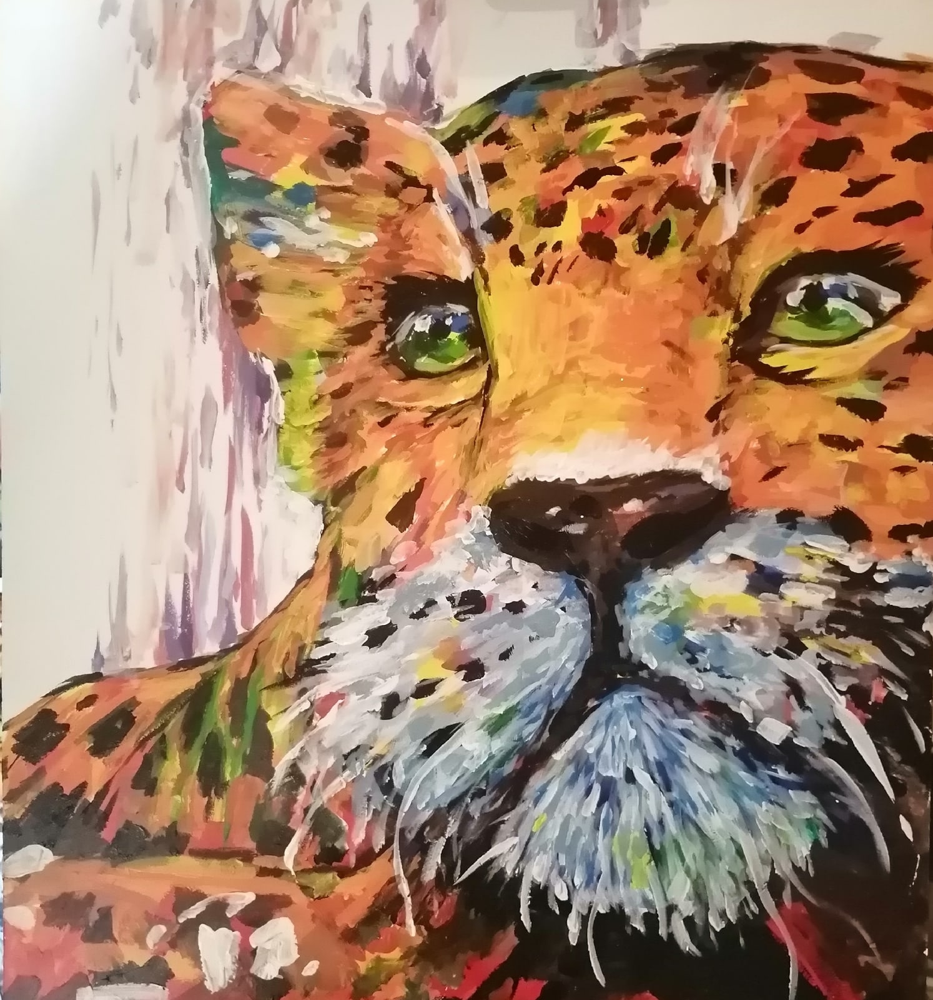

Киса, 2022. ДВП, акрил, 47х50 см

<https://vk.com/wall35705684?offset=820&z=photo35705684_457257027%2Fb22533516b26c799e2>

Salvadore, 2022. Холст на картоне, акрил, 35х45 см

<https://vk.com/wall35705684?offset=820&z=photo35705684_457257011%2F28345e5a08128a6c96>

Изображено: Сальвадор Дали

От составителя: Выставлялась на продажу за 5000 р.

Ещё одна Фрида, 2022. ДВП, акрил, золото, багет, 32х49 см

<https://vk.com/photo-218867577_457239412>

История:  
- 2023: Выставлялась в ArtSpaceDepo

Монро, 2022. ДВП, акрил, золото, багет, 52х49 см

<https://vk.com/photo-218867577_457239414>

Мерилин - нетленный кумир огромного количества людей. Вдохновляющая, богинеподобная актриса и икона стиля. Она была несравненной, и ее судьба была полна тайн и противоречий.

От составителя: По воспоминаниям Анны, один из зрителей заметил, что блеск картины имитирует вид кинопленки, хотя она намеренно не пыталась достичь этого эффекта.

История:  
- 2023: Выставлялась в ArtSpaceDepo
- 2024: [Выставлялась в галерее "Белый квадрат", г. Анапа](https://vk.com/wall35705684?w=wall35705684_9933)

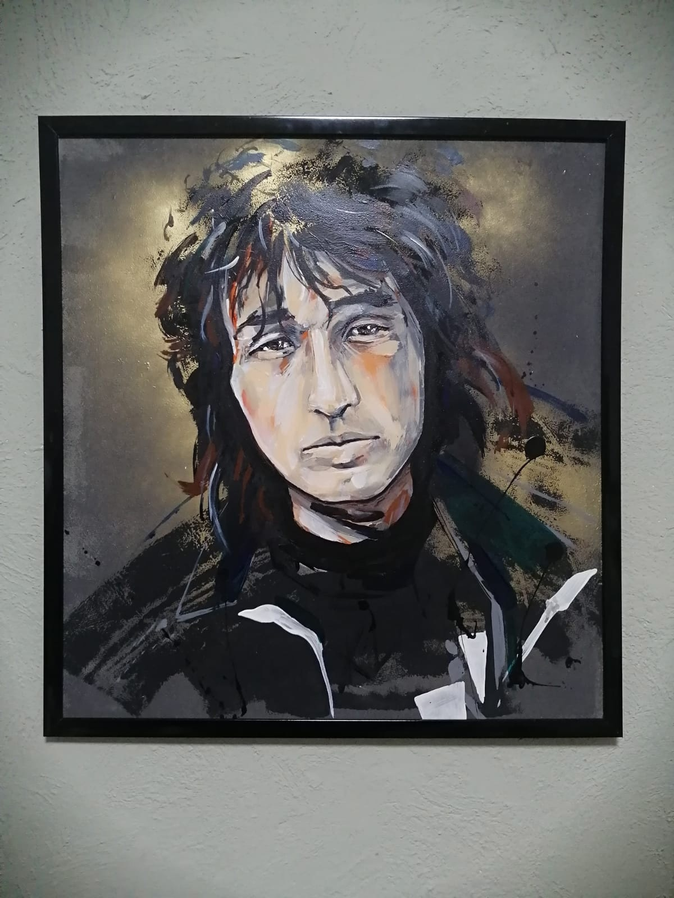

Ну что, живой?, 2022. ДВП, акрил, золото, багет, 49х52 см

<https://vk.com/albums-218867577?z=photo-218867577_457239416%2Fphotos-218867577>

Изображено: Виктор Цой

История:  
- 2023: Выставлялась в ArtSpaceDepo

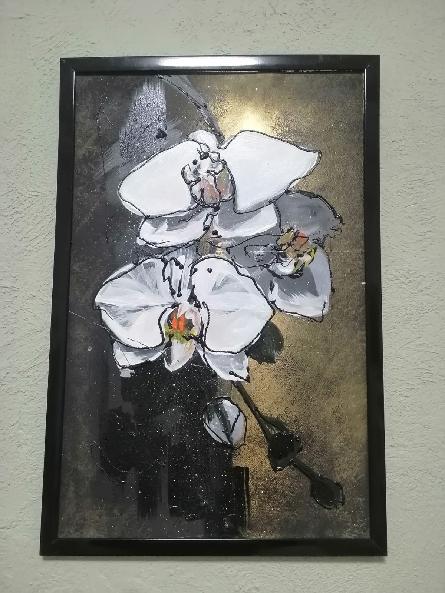

Орхидея, 2022. ДВП, акрил, золото, багет, 32х49 см

<https://vk.com/albums-218867577?z=photo-218867577_457239417%2Fphotos-218867577>

История:  
- 2023: Выставлялась в ArtSpaceDepo

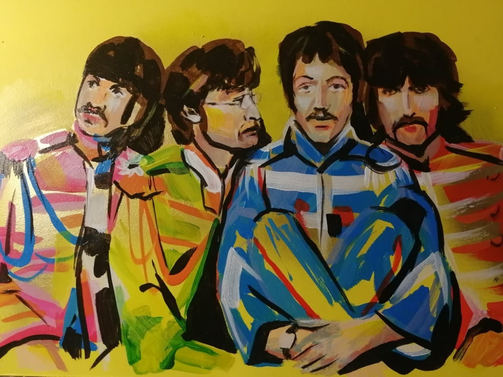

Битлы, 2022. ДВП, акрил, 30х47 см

<https://vk.com/wall35705684?offset=980&z=photo35705684_457256864%2F3367c1b7723c3ba6b5>

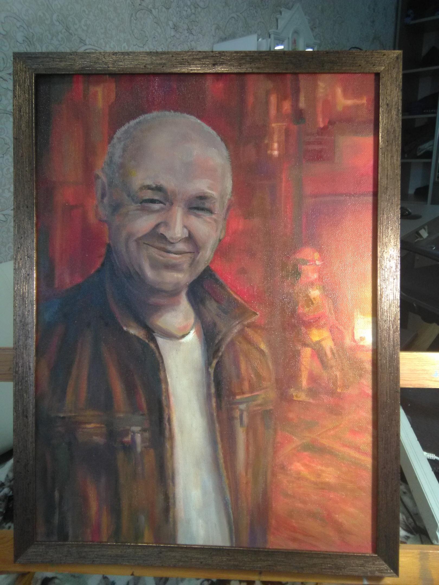

(Портрет), 2019

<https://vk.com/wall35705684?offset=1620&z=photo35705684_456245320%2Fwall35705684_6812>

От составителя: Написана на заказ по фото

Натюрморт с подсолнухом, 2019. Бумага, смешанная техника, графика, стекло, багет, 55х71 см

<https://vk.com/photo-218867577_457239408>

История:  
- 2023: Выставлялась в ArtSpaceDepo

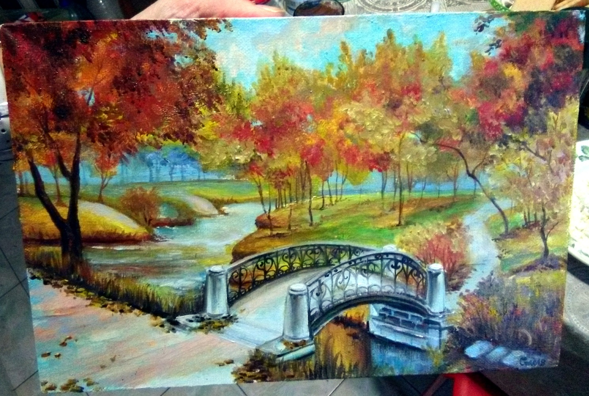

(Пейзаж с мостом), 2018. Масло, формат А4

<https://vk.com/wall35705684?offset=1760&z=photo35705684_456243493%2F9daa44923decffc4f1>

Сладкая парочка в стиле Марвел, 2018. Холст, масло

<https://vk.com/wall35705684?offset=1760&z=photo35705684_456242842%2Fwall35705684_6046>

От составителя: Написана на заказ за 3000 р.

Утро на рыбалке, 2018. Холст на картоне, масло, 40х50 см

<https://vk.com/wall35705684?offset=1880&z=photo35705684_456240908%2Fwall35705684_5501>

От составителя: Выставлялась на продажу в Фотосалоне "Рембыт"

(Фонтан), 2017

<https://vk.com/wall35705684?offset=1760&z=photo35705684_456239734%2Fwall35705684_4782>

Изображено: Фонтан на набережной возле Драматического театра, г. Нижний Тагил

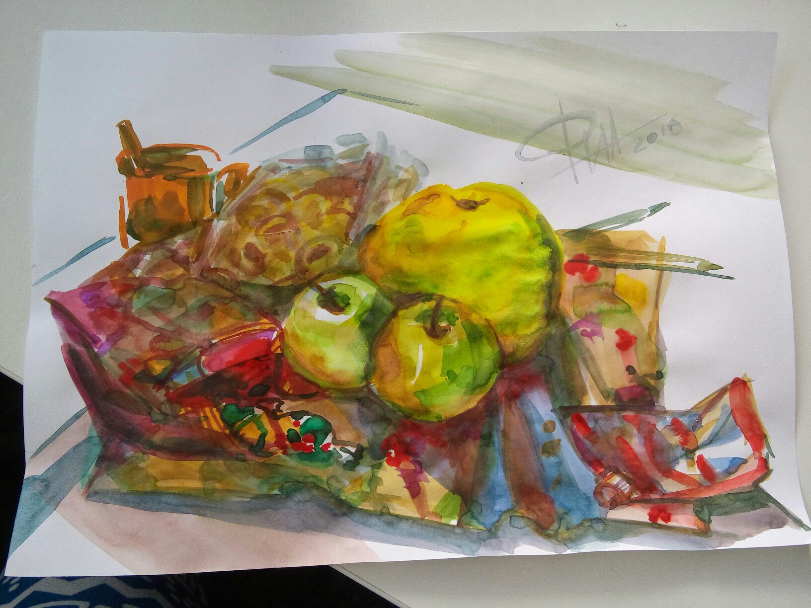

(Натюрморт с фруктами), 2016

<https://vk.com/wall35705684?offset=1860&z=photo35705684_413514338%2Fwall35705684_3807>

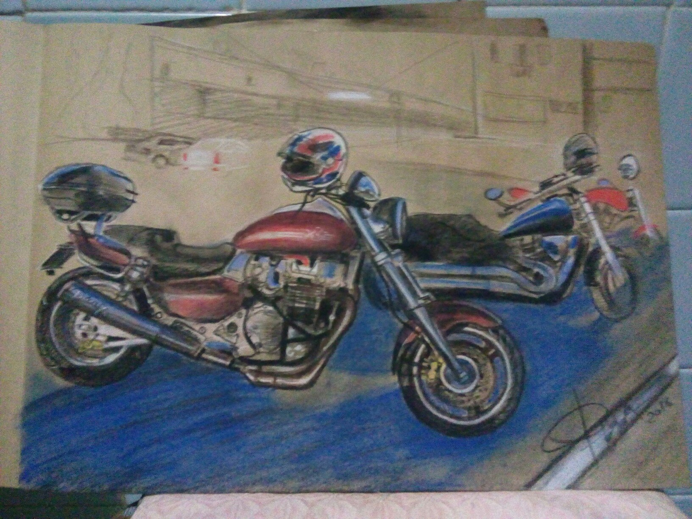

Байки, 2016. Пастель

<https://vk.com/wall35705684?offset=1860&z=photo35705684_411471813%2F3866b2542419d5e4ae>

Портрет с тотемным животным, 2014. Пастель в раме под стекло, формат А1

<https://vk.com/wall35705684?offset=2040&z=photo35705684_333796381%2F4838bb6ee081e1051b>

От составителя: Написана на заказ

## Галерея

С группой The Beavers

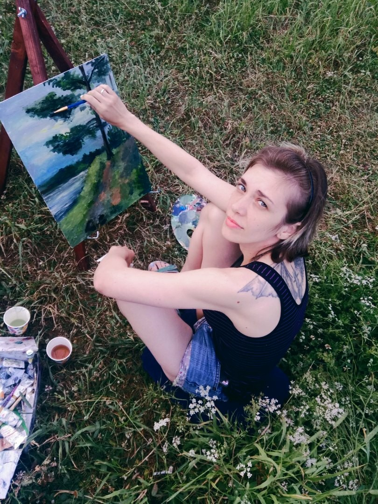

На пленэре

На просмотре

За работой, 2024

## См. также

- [Черновик биографии](bio.md)

