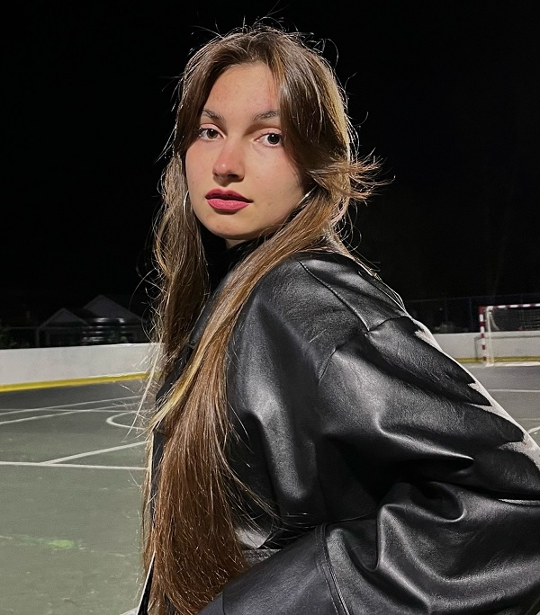
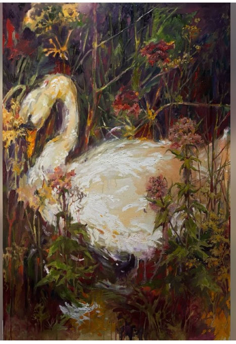
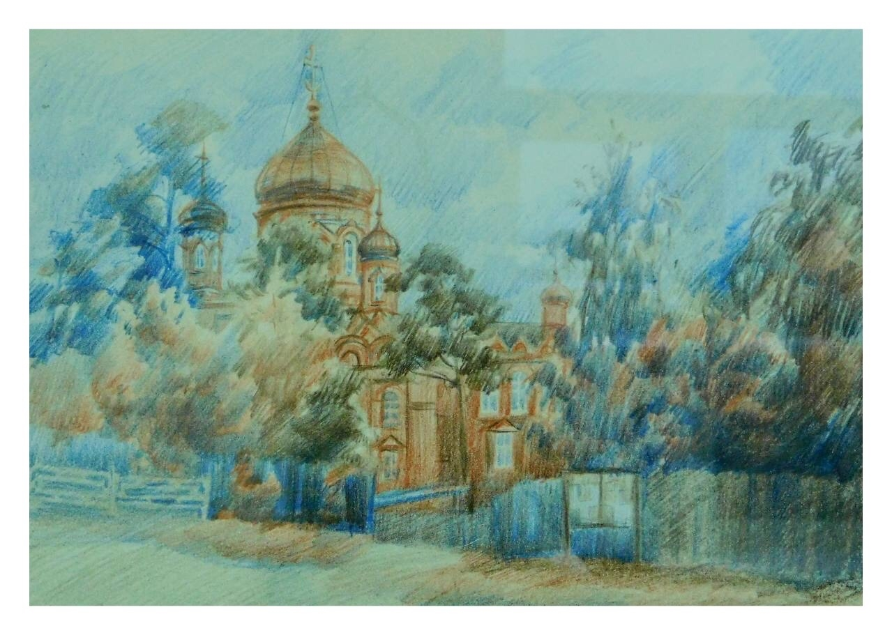
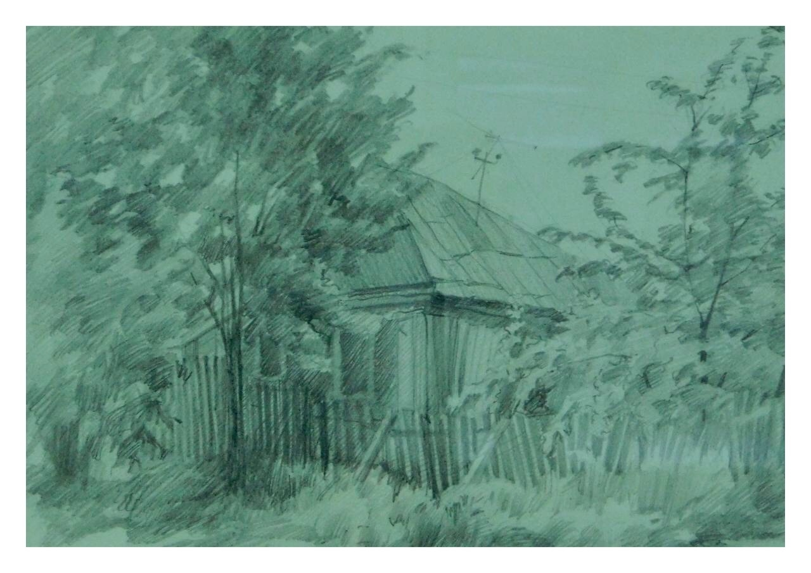
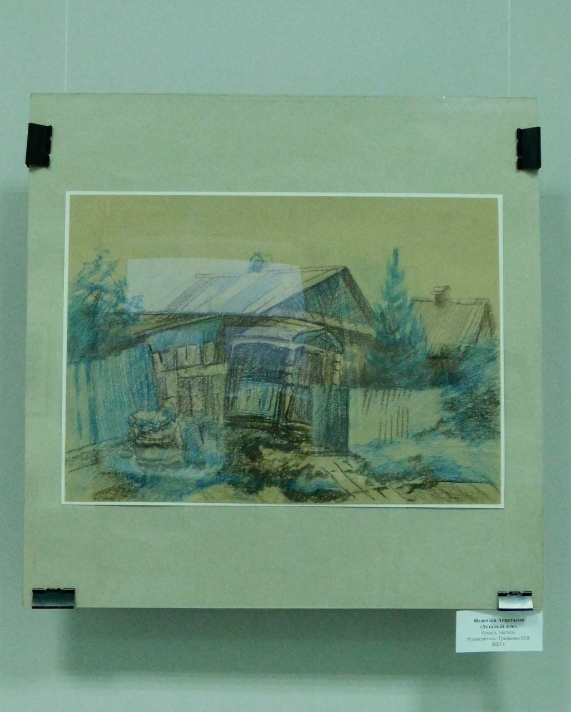
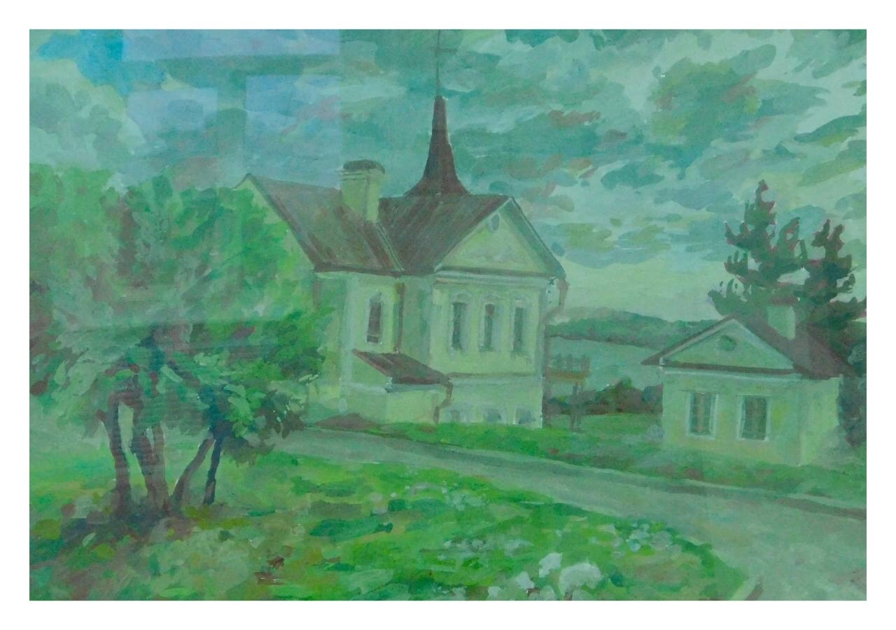
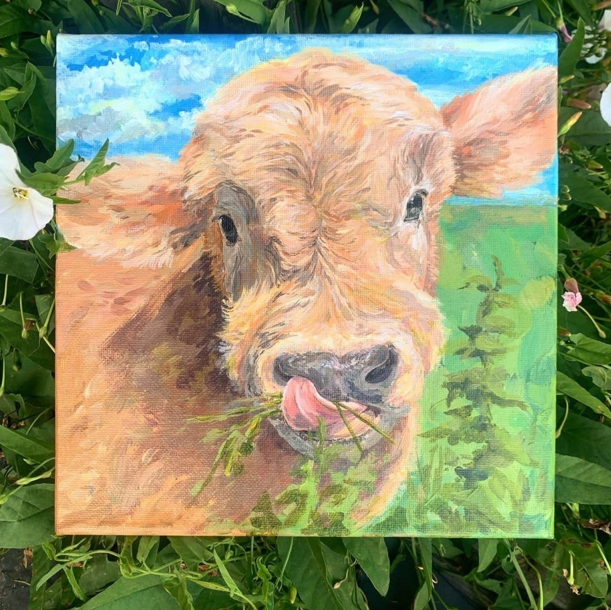
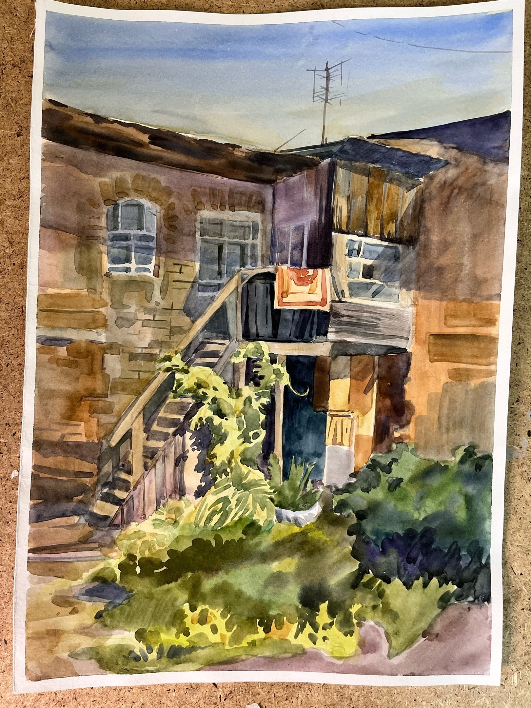
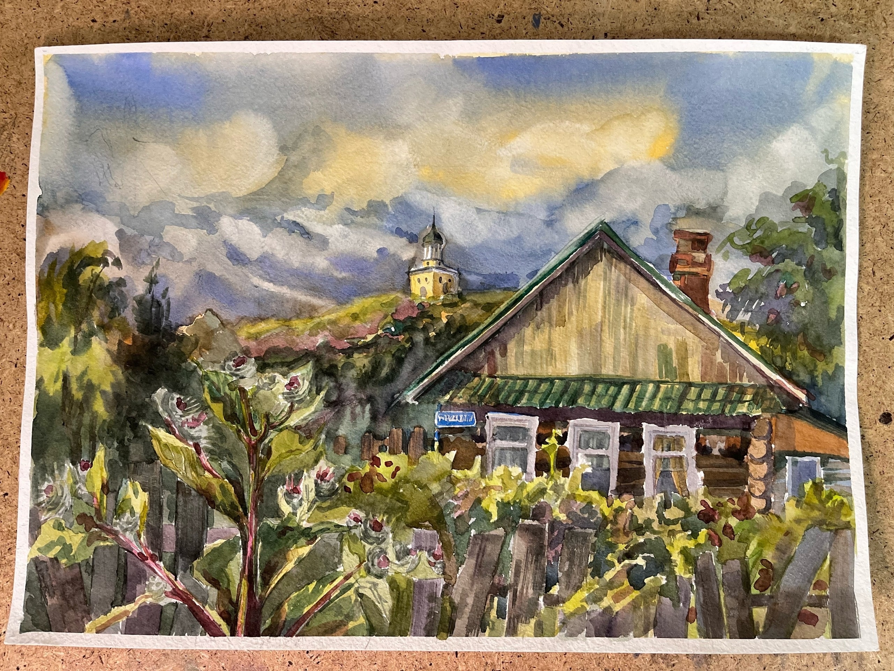
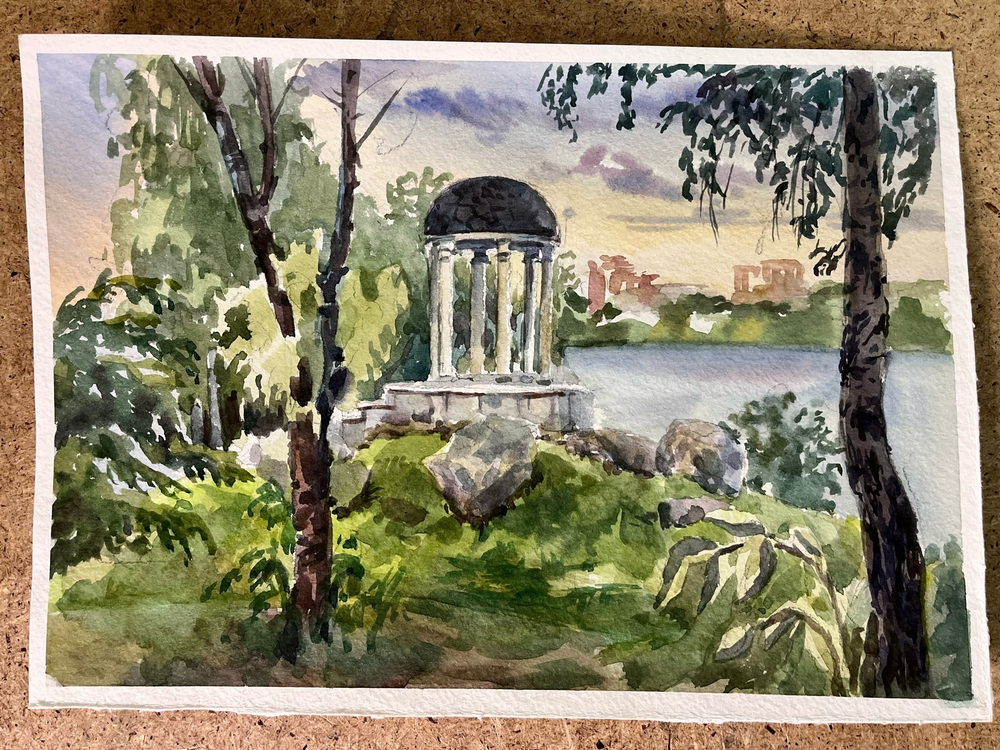

# Феденёва Анастасия Васильевна

Страница в интернете: <https://t.me/s/gozamnoi>  

## Каталог работ

Гриша, 2025. Холст на подрамнике, масло, 60x90 см

<https://t.me/gozamnoi/651>

Пока училась 3 года на худграфе, не могла просто сесть и написать что-то для себя, не по учебному заданию, а действительно для себя.
В последние августовские вечера просто захотелось взять кисть и масло.
Картина «на одном дыхании»: я просто делала, как чувствовала, рисовала, что хотела и как хотела.
И это были хорошие вечера в мастерской.

Почему «Гриша»? Григорий - романтичная натура!
Честно, я не знаю ни одного Гриши, но это имя кажется каким-то и безобидным, и робким, и милым, и трепетным, нежным и романтичным. В этой картине есть авторский смысл, который рождался по мере мазка и каждой детали [...]

Скорбященский монастырь, 2023. Бумага, акварельные карандаши

<https://vk.com/wall-4891369_7842?z=photo-4891369_457261443%2Fwall-4891369_7842>

Изображено: [Скорбященский женский монастырь, Вознесенский храм, г. Нижний Тагил](https://ntobitel.cerkov.ru/voznesenskij-xram)

История:  
- 2023: Участвовала в выставке студенческих работ "60 мгновений лета"

Зарисовка, 2023. Бумага, графитный карандаш

<https://vk.com/wall-4891369_7842?z=photo-4891369_457261444%2Fwall-4891369_7842>

История:  
- 2023: Участвовала в выставке студенческих работ "60 мгновений лета"

Усталый дом, 2023. Бумага, пастель

<https://vk.com/wall-4891369_7842?z=photo-4891369_457261445%2Fwall-4891369_7842>

История:  
- 2023: Участвовала в выставке студенческих работ "60 мгновений лета"

Холодно, 2023. Бумага, гуашь

<https://vk.com/wall-4891369_7842?z=photo-4891369_457261446%2Fwall-4891369_7842>

История:  
- 2023: Участвовала в выставке студенческих работ "60 мгновений лета"

Теленок, 2023. Холст на подрамнике, акрил, 20х20 см

<https://vk.com/albums-218867577?z=photo-218867577_457240127%2Fphotos-218867577>

История:  
- 2023: Выставлялась в ArtSpaceDepo

Дворик, 2023. Акварель, 29.7х42 см

<https://vk.com/albums-218867577?z=photo-218867577_457240126%2Fphotos-218867577>

История:  
- 2023: Выставлялась в ArtSpaceDepo

п. Монетный, Лето, 2023. Акварель, 29.7х42 см

<https://vk.com/albums-218867577?z=photo-218867577_457240124%2Fphotos-218867577>

История:  
- 2023: Выставлялась в ArtSpaceDepo

п.Монетный, Вечер прошел, 2023. Акварель, 21х29.7 см

<https://vk.com/albums-218867577?z=photo-218867577_457240121%2Fphotos-218867577>

История:  
- 2023: Выставлялась в ArtSpaceDepo (не продавалась)

