# Феденёва Анастасия Васильевна

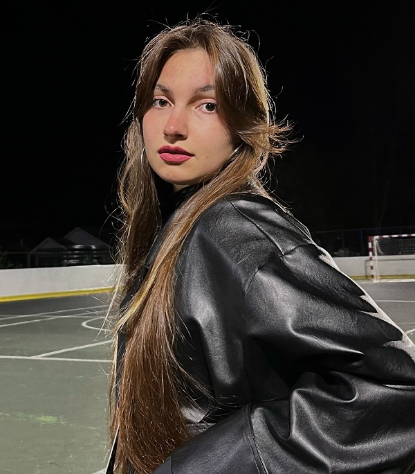

Дата рождения: Около 2004  
Страница в интернете: <https://vk.com/a.fedenyova>  

## Каталог работ

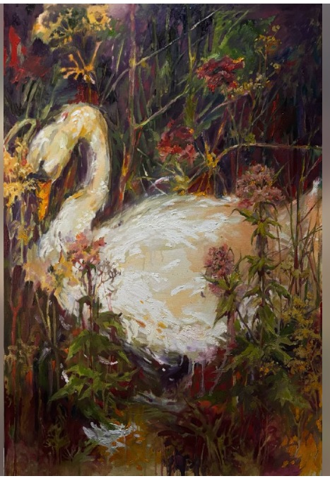

Гриша, 2025. Холст на подрамнике, масло, 60x90 см

<https://t.me/gozamnoi/651>

Тип: Картина

Пока училась 3 года на худграфе, не могла просто сесть и написать что-то для себя, не по учебному заданию, а действительно для себя.
В последние августовские вечера просто захотелось взять кисть и масло.
Картина «на одном дыхании»: я просто делала, как чувствовала, рисовала, что хотела и как хотела.
И это были хорошие вечера в мастерской.

Почему «Гриша»? Григорий - романтичная натура!
Честно, я не знаю ни одного Гриши, но это имя кажется каким-то и безобидным, и робким, и милым, и трепетным, нежным и романтичным. В этой картине есть авторский смысл, который рождался по мере мазка и каждой детали [...]

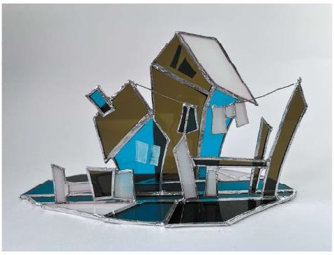

Двор, 2024. Стекло, 30x15x12 см

<https://disk.yandex.ru/i/VXklez3N33W_Sw>

Тип: Декоративное изделие

История:  
- 2024: [Заняла 2 место на II всероссийском конкурсе учебно-творческих работ студентов "Искусство реальности"](https://vk.com/wall-4891369_8045)

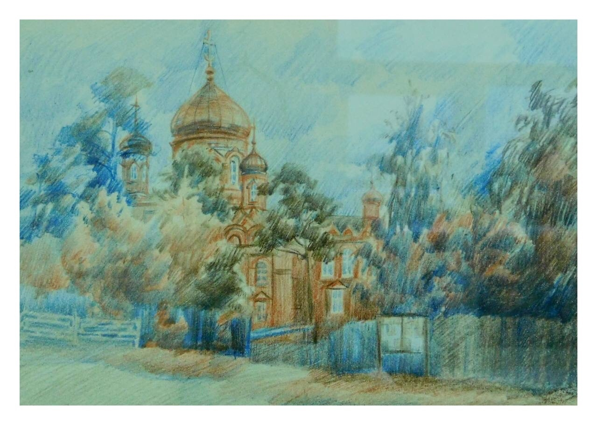

Скорбященский монастырь, 2023. Бумага, акварельные карандаши

<https://vk.com/wall-4891369_7842?z=photo-4891369_457261443%2Fwall-4891369_7842>

Изображено: [Скорбященский женский монастырь, Вознесенский храм](https://ntobitel.cerkov.ru/voznesenskij-xram), Нижний Тагил ([57,90° с.ш.; 60,00° в.д.](https://yandex.ru/maps/?pt=59.997993%2C57.895367&z=16))

История:  
- 2023: Участвовала в выставке [Выставка студенческих работ "60 мгновений лета"](https://vk.com/wall-4891369_7782); Место: ФХО НТГСПИ

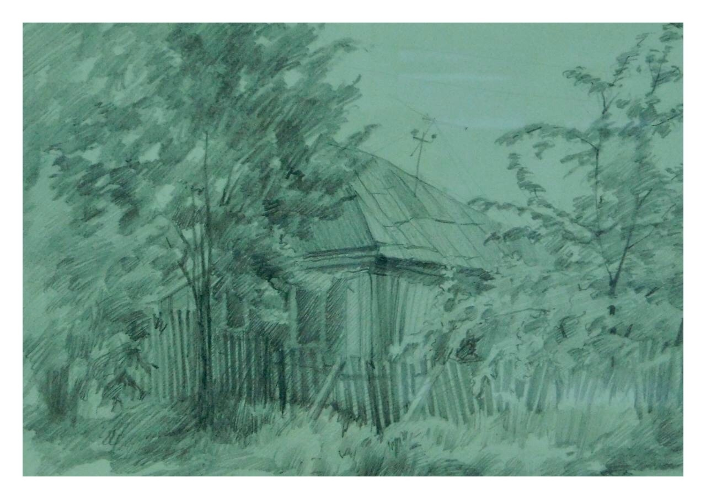

Зарисовка, 2023. Бумага, графитный карандаш

<https://vk.com/wall-4891369_7842?z=photo-4891369_457261444%2Fwall-4891369_7842>

Тип: Рисунок

История:  
- 2023: Участвовала в выставке [Выставка студенческих работ "60 мгновений лета"](https://vk.com/wall-4891369_7782); Место: ФХО НТГСПИ

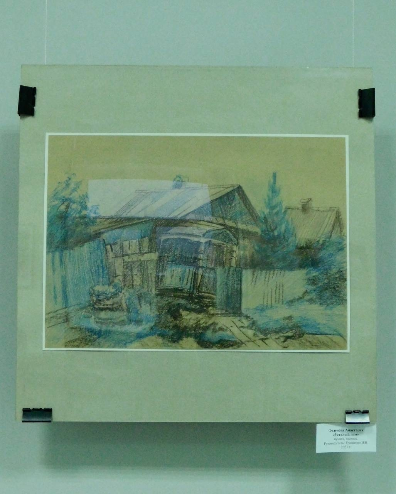

Усталый дом, 2023. Бумага, пастель

<https://vk.com/wall-4891369_7842?z=photo-4891369_457261445%2Fwall-4891369_7842>

История:  
- 2023: Участвовала в выставке [Выставка студенческих работ "60 мгновений лета"](https://vk.com/wall-4891369_7782); Место: ФХО НТГСПИ

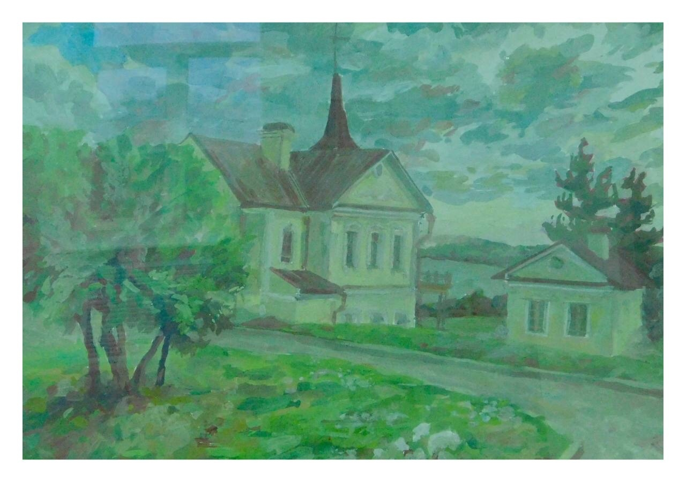

Холодно, 2023. Бумага, гуашь

<https://vk.com/wall-4891369_7842?z=photo-4891369_457261446%2Fwall-4891369_7842>

Тип: Картина

Изображено: [Демидовская дача](https://museum-nt.ru/content/visit/museum/museum.php?ELEMENT_ID=122), Нижний Тагил ([57,90° с.ш.; 59,99° в.д.](https://yandex.ru/maps/?pt=59.990006%2C57.903364&z=16))

История:  
- 2023: Участвовала в выставке [Выставка студенческих работ "60 мгновений лета"](https://vk.com/wall-4891369_7782); Место: ФХО НТГСПИ

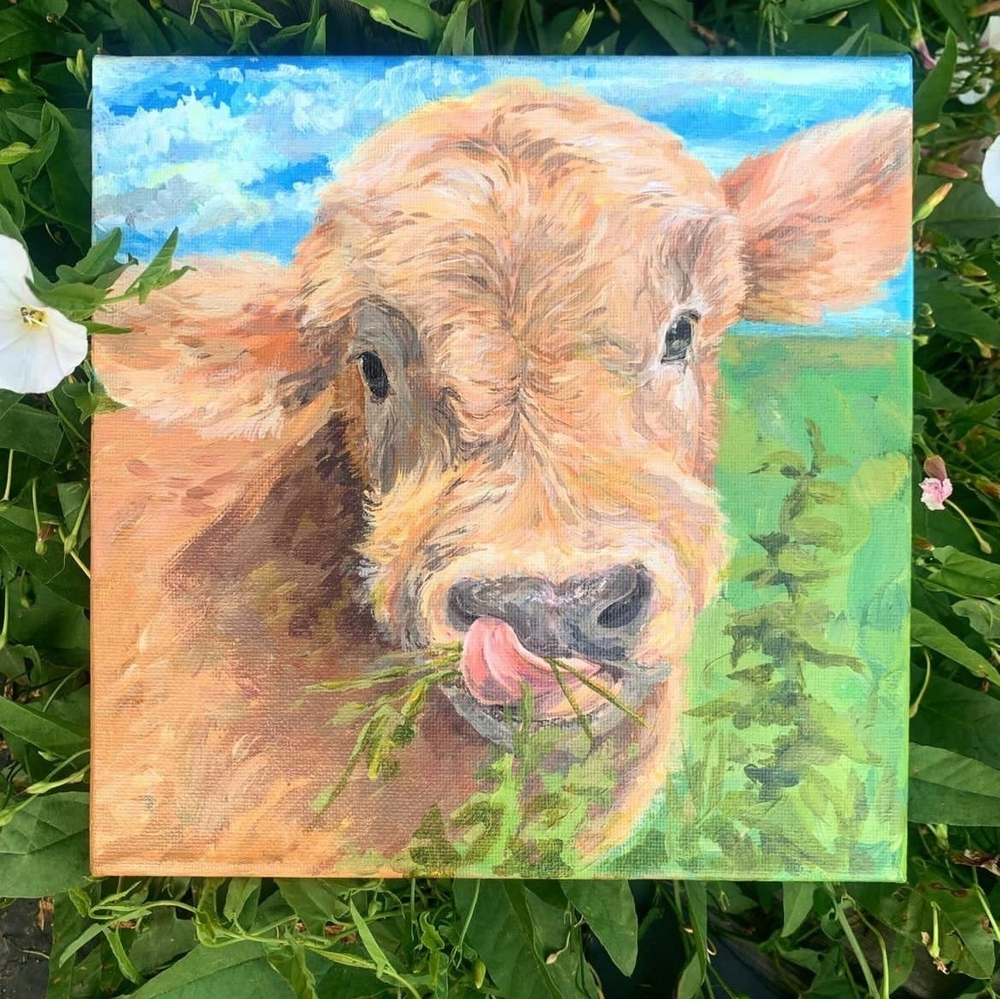

Теленок, 2023. Холст на подрамнике, акрил, 20х20 см

<https://vk.com/albums-218867577?z=photo-218867577_457240127%2Fphotos-218867577>

Тип: Картина

История:  
- 2023: Выставлялась в ArtSpaceDepo

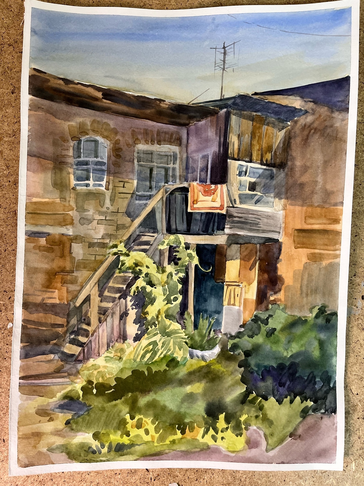

Дворик, 2023. Акварель, 29.7х42 см

<https://vk.com/albums-218867577?z=photo-218867577_457240126%2Fphotos-218867577>

Тип: Картина

История:  
- 2023: Выставлялась в ArtSpaceDepo

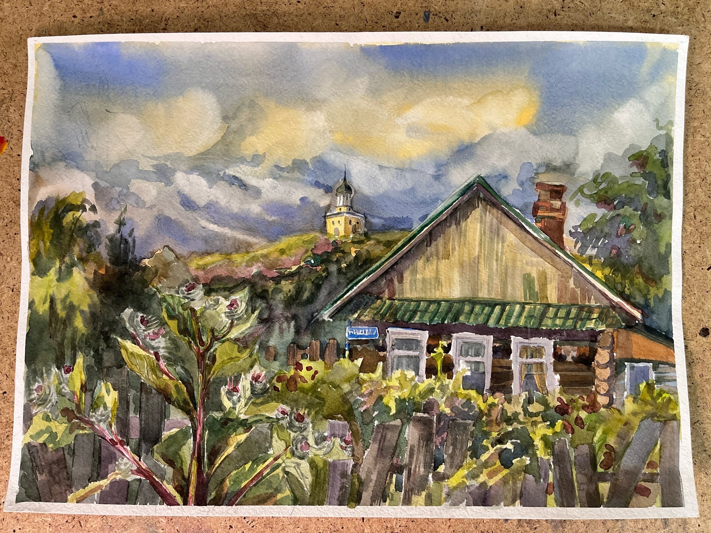

п. Монетный, Лето, 2023. Акварель, 29.7х42 см

<https://vk.com/albums-218867577?z=photo-218867577_457240124%2Fphotos-218867577>

Тип: Картина

История:  
- 2023: Выставлялась в ArtSpaceDepo

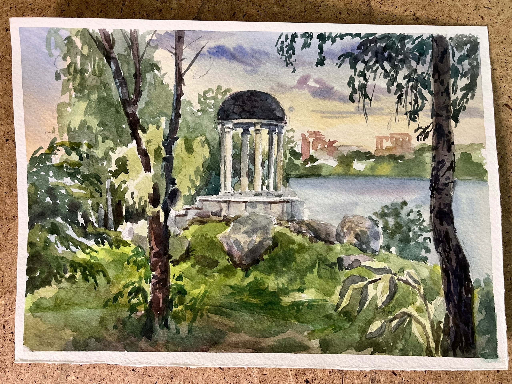

п.Монетный, Вечер прошел, 2023. Акварель, 21х29.7 см

<https://vk.com/albums-218867577?z=photo-218867577_457240121%2Fphotos-218867577>

Тип: Картина

История:  
- 2023: Выставлялась в ArtSpaceDepo (не продавалась)

## Краткая биография

Страницы в интернете: https://vk.com/a.fedenyova, https://t.me/s/gozamnoi, https://storynavigation.com/user/fedsiaa

В 2022 поступила на ФХО НТГСПИ (Изобразительное искусство и дизайн). Играла в Форуме-театре "Диалог".

Около января 2024 начала заниматься татуировками, с февраля работает в студии [DOM Tattoo](https://vk.com/club41318000).

Согласно отчету НТГСПИ, в 2024 участвовала во II Всероссийском конкурсе учебно-творческих работ студентов [Искусство реальности](https://vk.com/wall-4891369_8063). Результаты:
- Диплом участника в номинации "Графика"
- Диплом участника в номинации "Декоративно-прикладное искусство"
- Диплом II степени в номинации "Декоративно-прикладное искусство. Стекло"

В феврале 2024 участвовала в выставке-конкурсе "Арт-Дуэль" в Екатеринбурге. Подробнее см. в [разделе об Анастасии Арнаутовой](../arnaut/bio.html).

В марте 2026 ездила на фестиваль Sverdlovsk Tattoo Fest в Екатерибурге (участвовали другие мастера из DOM Tattoo).
  

