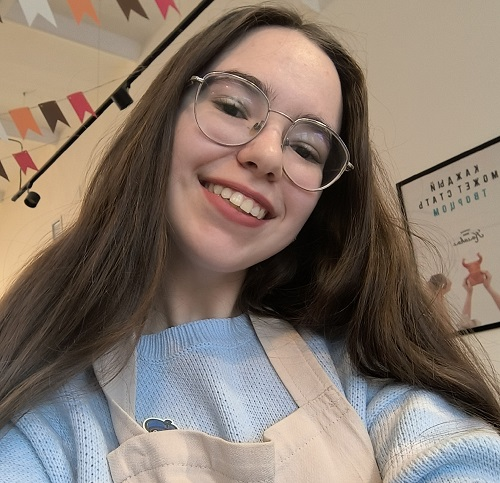
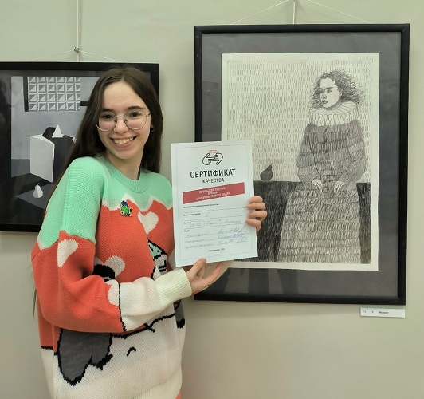

# Ангелина Новоположская
## Черновик биографии



Дата рождения: Июль 2004

Страницы в интернете: 
- <https://linasnimi.wfolio.pro>
- <https://vk.com/linaplenka>
- <https://t.me/s/linakvakva>

2023 - Картина была украдена с выставки в ArtSpaceDepo. Так как картина не продавалась, по договору администрация галереи не могла возместить стоимость работы деньгами; вместо этого они возместили ее материалами.

Лето 2023 - Ездила на пленэрную практику в поселок Баранчинский с Анастасией Арнаутовой и другими одногруппницами. Подробнее эта поездка описана в [разделе об Анастасии](../arnaut/bio.html).

Февраль 2024 - Участвовала в выставке-конкурсе [Арт-Дуэль](https://uole-museum.ru/smiabout/art-duel-v-kraevedcheskom-muzee-informatsionno-prosvetitelskaya-gazeta-vremya/) в Екатеринбурге.  Подробнее см. в [разделе об Анастасии Арнаутовой](../arnaut/bio.html).



На Арт-Дуэли, 2024

Март 2024 - Выставка [Не художник, а творец](https://vk.com/fho_tho?w=wall-4891369_8055) на ФХО НТГСПИ. На этой выставке Ангелина представила серию фотографий Виталины Чураковой в японском стиле ("Кицунэ") и серию совместных фотографий с Никой Костроминой в масках лисиц ("Страшные сказки").

Июнь 2024 - Практика в цирке

Июль 2024 - Вожатская практика в лагере Солнечный со Светланой Апретовой, Никой Костроминой, Натальей Томиловой и Елизаветой Рубан. Ангелина сняла об этом подробное видео (<https://vk.com/wall-216017454_128>); оно хорошо раскрывает личность героини, а также дает много информации о том, как проходит практика у студенток-художниц. Вот подробная стенограмма:

> Всем привет. Я безумно рада новому влогу, надеюсь, вы тоже. Он готовился очень тщательно, с огромными эмоциями, переживаниями, воспоминаниями, и это маленькая жизнь в загородном лагере "Солнечный" в роли вожатого. Она была невероятно интересной, трудной, с позитивными и негативными какими-то моментами; но, конечно, больше было позитива и счастья от того, что... Я вожатая! Я работаю с детьми! И у меня получается, это невероятно важно, и я хочу сохранить воспоминания о лагере не только в своем сердце, своей голове, но и в этом видео; в рассказе о том, как же это все было, что было предпринято для того, чтобы туда поехать. Хочется начать, конечно же, с того, что подготовка была тщательной, нам выдавали уже направления, какой у нас будет отряд, что нужно сакцентировать, на чем... Какие рубрики должны быть в отрядном уголке. Мы проходили медицинские обследования, и все это длилось довольно-таки долго, около двух недель, и эта подготовка, она заставляла меня конечно попереживать еще больше, но... я справилась, и наш заезд состоялся 24 июня. Детки приезжали уже 25-го в 10 часов утра. Мы очень быстро доделывали различные свои дела в плане... У каждого ребенка в нашем отряде должен был быть какой-то или бейджик, или, не знаю, мелалька, какое-то именно отрядное обозначение, что вот мы... У меня отряд назывался "Непоседы", мы "Непоседы", и его имя, чтобы быстрее всем познакомиться, освоиться. Это невероятно важно, и мы все это доделывали и старались успеть. Естественно, мы это все успели и встречали ребят.
> 
> [24 июня в лагере] Я уже в лагере! Обалдеть просто... Я никак не думала, что уже вот-вот это случится, надеюсь, что смена пролетит также быстро. Но здесь очень красиво. [Снимает хвойный лес.] Сейчас пройдусь, прогуляюсь по местности, что где находится. Успела уже поплакать, если честно, день просто отстойный, ужасный день. Дело не в том, что сегодня заезд, а в том, что... у меня случились очень неприятные события прямо перед отъездом и мне от этого очень тяжело сейчас, от того, что я не дома. Я уже заселилась в свой корпус. Для меня лагеря вообще травматичная история, я надеюсь, что все пойдет как надо, ну, правда, без лишних каких-то нервотрепок, потому что я уже не выдерживаю немножко... Мне хватит одного нервного срыва сегодня. Но здесь хорошо.. без детей [Смеется].
> 
> На самом деле, я очень жду, когда уже начнется работа, когда ты вольешься в процесс и просто начнешь делать. Просто вспоминаю свои три поездки в лагерь и прямо... что-то знакомое. Сейчас перекушу, возможно, начну уже делать уголок. Чем больше я, возможно, сейчас успею, тем меньше мы будем не спать сегодня и ляжем пораньше. Ну, посмотрим. В принципе, все равно развлечь себя нечем пока что. Но я не знаю, на каком я этаже, потому что мне сказали, что второй, а руководитель сказал, что первый. Ну, в общем... не знаю. [Снимает солнце, проглядывающее между деревьями.] Очень красиво, солнышко падает. Ну, с Богом... 
> 
> Я очень довольна тем, как мы встретили ребят, но были определенные конечно трудности, потому что первый день, он... самый сложный, наверное, да. Потому что ребята, они... очень все закрытые, их необходимо постепенно раскрыть, но, чтобы познакомиться, я придумывала очень много различных игр, у нас была тщательная подготовка в этом. И все равно, их было как будто бы недостаточно, и была очень сильная сложность в том, что ребятки приходили в корпус по 5 человек; и пока 5 человек все уже познакомились, потом приходило еще 5, и... Было бы намного проще, если бы приходили все сразу, и интереснее. Но, это распорядки уже именно структуры лагеря, мы ничего не могли с этим поделать, но рабята правда старались знакомиться. Правда, были моменты, что им уже как бы надоедало играть в какие-то игры, хотелось посидеть в телефонах. И это нормально, потому что... сейчас именно и наше поколение, и это поколение, оно больше, да, зафиксировано на гаджетах, и хочется как-то... Просто не поучаствовать, а посидеть отдохнуть, я очень прекрасно это понимала, вот. Поэтому, не стоит этого пугаться, это нормально и все равно в итоге ребятки хорошо познакомились. Некоторые конечно еще потому забывали имена друг друга, но это не проблема, к середине смены обязательно все исправится и уже будет намного-намного и все будут себя комфортнее чувствовать.
> 
> [Снимает себя в черной шляпе] Сегодня я пират! Жду ребят на свой этап. Надеюсь, еще засняли, как мы выступали, но, посмотрим... Поставила конусы, будем проводить спортивные игры.

```
(Дети поют хором) 
Речка черная по лесу протекает, 
Сосны тянутся вершиной в небеса.
Приключения нас ждут и чудеса!
Здравствуй, солнечная детская планета
(...)

Дети: (Кричат хором) Пятый отряд лучший!

Лина: (Снимает ежа под металлической балкой) Он испугался вас
Дети: Ежик там сидит, если честно... Милаха
Лина: Да
Девочка: Второй раз в жизни ежика вижу
Лина: Ух ты!
Мальчик: А я - первый
```

> [Позднее] Голос просто охрип жестко. Готовиться к этому надо морально тоже, потому что голос уже на третий день даже, досвидос. Если не поставлен, не профессионален... Прошла целая, уже больше даже недели, лагеря, я стою на этапе с чехардой. Ко мне уже пришло два отряда. Я видимо смогу только записывать, когда на этапах стою, правда, у меня больше свободного времени просто нет. Сложно, очень сложно, но весело. Как бы, уже к детям привязываюсь, правда, какие бы они иногда не были непослушные... не знаю. Так приятно, когда они тебе дарят сладости, как-то тебя поддерживают, утешают и все в таком духе. Они начинают тобой дорожить, беспокоиться и считать, что ты самая лучшая для них. Мне кажется, ради этого конечно стоит почувствовать себя вожатой, хоть раз.
> 
> Я очень жду, когда мы начнем играть в пионербол, вот это вот все. Скорее всего, вожатые будут отдельно играть, между собой. Кошмар, просто... У меня все желтое сегодня [показывает карандаш и галстук]. Мне очень нравится, что у нас есть галстук. Завтра на выходной первый поеду, может от этого мне кажется, что все хорошо, все классно? Ну...
> 
> Мне все-таки кажется, что самым сложным является не только первый день заезда детей и знакомства, именно организационный этот период, но и период середины смены, именно привыкания детей друг к другу. Наверно, это и правда самое сложное, потому что ситуации бывают настолько разные, что... у нас просто не хватало опыта их даже в какой-то степени решить. Иногда это и напрямую нас касалось. Но тут больше, наверное, огромный совет себе я бы дала просто не отчаиваться, потому что с детьми необходимо очень много разговаривать. И я безумно рада, что мои детки шли всегда на контакт и понимали меня и мои тоже переживания по поводу различных каких-то ситуаций, которые и их тревожат. Потому что я не могла относится как-то равнодушно, ни в коем случае. И это необходимо напоминать и показывать, постоянно. Дети чувствуют, когда их любят, ценят и хотят помочь. Это самое важное в работе вожатого, потому что вожатый - это не только именно как развлекатель, человек, который придумывает какой-то досуг детям. Вожатый - это человек, который должен уметь практически все, если не все. Он должен уметь, как поддержать, и психологические различные аспекты с ребятами, так и уметь рисовать, уметь изобретать, уметь танцевать, шутить... Не знаю там, даже до такой степени, что вообще там и спортивно быть подготовленным. Это многогранная работа, очень многогранная. Если вам кажется, что вы умеете все, вожатый, именно должность вожатого, докажет вам обратное.
> 
> Было очень много ситуаций недопониманий, драк даже, и к этому тоже нужно быть готовым, что иногда дети просто друг другу не нравятся и они... Не нужно заставлять их дружить, это нормально. Это такое же небольшое общество, как и в целом вообще, которое нас окружает, и дети, они все очень разные. Очень разные... Даже если вам кажется, что вы поняли ребенка - невозможно, нет. Это такие миры, настолько глубокие, что иногда поражешься, как вообще в голову такое может взбрести. Тут важно, мне кажется, очень важное качество, которое должно быть у вожатого, это принятие. И понимание. Потому что с детьми только так. И огромное терпение.

```
(С детьми на улице)
Лина: Пятый отряд... 
Мальчик: Я в 9, он в 8
Девочка: Ангелина!
(Дети машут в камеру)
Лина: Да вы мои хорошие!
Девочка: Ну, Милана...
Мальчик: Меня забыли!
Лина: (Смеется) Не забыли
Мальчик: Я самый мелкий
Мальчик: Привет!
Девочка: Булочка с сосиской!
Девочка: ...Чай, бутерброд и пряники...

(Танцуют с Никой)
Лина: Вот это концерт!
Ника: Да...
Хором: ...Что желаешь расскажу...

(Снимает Лину в синей форме)
???: Лина у нас сегодня районный прокурор
Лина: Oh, my God!
???: А мы не спим
(Все смеются)
???: Это у нас 12 ночи после планерки
???: Когда нам сказали, что у нас завтра... Мы будем пиратами
Лина: Это так смешно! Мне нравится это вайб, знаете
Лина: Мы тут чисто что-то придумываем, что-то шалим
???: Наконец-то, слушай
Лина: Да, хорошо, что мы все вместе
```

> Эта смена запомнится мне также надолго из-за того, что мое день рождения, мое двадцатилетие, такая важная цифра, казалось бы, будет отмечена именно в лагерную смену моей практики. 12 июля у меня было день рождения, и... Я на самом деле вообще ничего не ждала от этого дня. Я просто... даже изначально забыла, что у меня будет день рождения, но потом, когда я уезжала 11 июля на выходной перед замятиным [?] днем, я поняла, что вот уже и 20. 20 лет - это и не мало, и не так много, но все же определенные плюсы и опыт уже есть. На самом деле, на эту тему уже отдельное видео даже можно будет снять, но... Мне бы хотелось рассказать, как он прошел, потому что... Этот день рождения стал самым запоминающимся и самым... необычным в моей жизни на данный момент, благодаря моим деткам, 5 отряду, и воспитательнице, коллеге Анне Павловне, спасибо ей огромное за поздравления и моим ребятишкам тоже. Все вместе они создали праздник, и мои подружки вожатые, естественно, тоже, самые первые. Мы отмечали мой день рождения прямо в вожатской, я привезла торт, мы поздравились. Было очень уютно. И на самом деле я вообще не ждала подарков от детей, тем более, только какие-то поздравления, я бы абсолютно не обиделась, потому что этот день... Он все равно, конечно, особенный, но я его планировала провести так же в рабочем режиме, но ребята решили иначе, и они... В секрете подготовили для меня целый квест по всему лагерю, где я должна была проходить различные спортивные испытания. Они сами это все придумали, составили.

```
(В вожатской)
(Поют хором, тихо:)
...На день рожденья испекли мы каравай, 
вот такой вышины, вот такой нижины,
вот такой ширины, вот такой ужины!
Каравай, каравай, кого любишь выбирай!

Лина: Я люблю всех! (Смеется) Особенно тортик... мы его съели уже
Все: С днем рождения!
Лина: Вот они, мои золотые. Всех люблю

(На улице)
Мальчик: ...Отрядом решили устроить тебе квест
Мальчик: Мы сделали тебе 6 этапов
Мальчик: Также за выполнение этапа мы будем тебе давать кусочек карты
Мальчик: Мы желаем тебе удачи
Лина: Спасибо, ребята
Девочка: А где карта?
Девочка: Тут по этапам
Лина: Ага, хорошо. Так, первый этап - линейка
Лина: Придумали... (Улыбается)
Мальчик: Это наша именинница!
Лина: (Машет рукой)
Девочка: И я с ней!
Девочка: Скажите что-нибудь (Протягивает Лине ветку как микрофон)
Лина: Я очень... в предвкушении сильном, ха-ха! Я не знаю...
Девочка: А вот скажите, вы любите пятый отряд?
Лина: Обожаю! Всем сердцем! Мои детки
Лина: Так, ну, первый этап... Сейчас я иду к Насте

Лина: Че-то устроили мне!
Девочка: ...По кружкам прыгать
Лина: По кружкам?
Девочка: Вот первый круг
Лина: Хорошо
Лина: Идем к беседке
Лина: (Смееется) Паникуют, че-то не то... Блин, классно, вообще!
Лина: Ну-ка, ребята! Че приготовили?
Мальчик: ...И ты должна отгадать, в каком стаканчике шишка
Мальчик: Опа-на! Шишка упала! Она здесь была
Мальчик: Смотри внимательно, Ангелина
Лина: Вот в этом
Лина: Так, детская площадка. Сейчас, посмотрим...
Девочка: Лина, тебе надо вот от этого расстояния попасть туда шишками
Лина: Все, хорошо, сейчас попаду
Девочка: О, ура, молодец!
Лина: Спасибо!
Лина: Так, теперь у нас пешеходный переход. Вон у меня девчонки стоят
Лина: Девчонки че-то придумали
Девочка: Здравствуйте, Ангелина
Лина: Здравствуйте
Девочка: ...Выполнять задания, да?
Лина: Да, конечно
Девочка: Я вам расскажу все...
Лина: Давай
Девочка: Я сейчас покажу, как надо
Девочка: Вот так-вот встаете (Показывает, как переходить дорогу с обручами)
Девочка: Самое главное, это сделать так три круга
Девочка: Потом вернуться обратно без круга, потом еще 2 раза...
Лина: А, хорошо, ладно
Лина: То есть, как у вас тогда было, да?
Девочка: Да
Лина: Такие этапы интересные! 
Лина: На самом деле, взятые еще наверно со всех вот этих квестов, которые мы в лагере делали
Лина: Сейчас мы идем к воротам, че-то приготовили...
Лина: Мне это так приятно! Сейчас расплачусь у ворот
Лина: Ой, сейчас еще упасть не хватало. Блин, офигеть просто!
Лина: Так приятно! Ну почему, такие золотцы прямо, вообще супер
Лина: Бегут туда. Бегут к воротам, видя, что я иду, быстрей побежали
Лина: Я их так люблю... 
Лина: Несмотря на все какие-то там конфликты, недопонимания
Лина: Блин, я счастлива! Меня дети любят, они мне приготовили подарок
Лина: Они заморочились, вчера даже после, этого, отбоя сидели, рисовали
Лина: Я им разрешила, чтобы время было придумать все
Лина: А, там шарики!

Дети: С днем рождения!
Лина: Да вы мои золотые! Спасибо, зайки!
Лина: Я сейчас расплачусь...
Лина: Шарики еще сделали, вот они куда пошли
Девочка: Ага
Мальчик: Но это еще не все, ты должна собрать карту...
Лина: Хорошо
```

> И самое важные слова, которые я услышала в конце смены, это то, что мы получили не только практику работы с детьми, но и их любовь. И я безумно счастлива, что это произошло со мной; и я очень люблю свой пятый отряд, своих первых детей, которых я смогла обрадовать, осчастливить, сделать что-то приятное, сблизиться с ними, узнать поближе, скучать по ним. Я надеюсь, что они тоже очень по мне скучают, как и я, и у меня даже сохранилось очень много подарков от них, каких-то мелочей, которые просто греют сердце настолько, что я... убеждаюсь, что я правда могу и хочу работать с детьми. Мне очень, очень дорого это время, проведенное с моими ребятами, и дорог каждый, абсолютно каждый. У меня даже вот здесь [показывает на стену] висит, да, я надеюсь, будет видно, висит мой портрет, который мне нарисовал мальчик Макар Замков. [На стене висит рисунок чернокожего человека в фиолетовой одежде, на портрет Ангелины совсем не похоже.] Я всех по именам абсолютно помню, по фамилиям, даже если на улице увидимся, я надеюсь, никогда никого не забуду. Я наклеила даже какие-то воспоминания в свой блокнотик, здесь огромные слова, которые огромные именно для меня; они очень для меня важны, что я лучшая вожатая и... что просто счастливы, что я у них есть. Это вообще, я сейчас расплачусь заново просто. Особенно я очень сильно плакала, когда мы с ребятами прощались, так сказать, на вожатском концерте, который мы вместе с вожатыми придумывали для своих детишек. Меня никогда так не обнимали и ценили, я просто... я была так счастлива в этот момент. Мне так не хотелось уезжать от них, потому что они мои дети. Мы столько прошли вместе, столько придумали, столько интересного узнали.
> 
> Я сохранила все, что у меня есть в коробочке вот такой вот, из под чая правда, но она очень удобная, потому что там есть отсеки с различными вот такими работами... Там был кружок выжигания по дереву, и у меня вот такой вот тут бобрик, лисенок, Наруто. Замечательные подарки, даже дарили ребята из других отрядов, из четвертого [показывает сердечко с надписью "Лина"]. Ну это просто прелесть, я не знаю [показывает желтого медвежонка]. Я так счастлива, различные записки, просто... секундочку. [Показывает открытку] "Ангелина, ты лучшая вожатая." Это стоит того, чтобы работать с ребятками, которые правда ценят. [Прижимает коробку к груди] Так хочу с ними всеми увидеться... Тут даже недавно встретила мальчика, который как раз таки нарисовал мой портрет в цирке, когда я работала гримером. Это такое классное ощущение, потому что, вы все равно пересекаетесь, видитесь, помните друг друга. Такое радостное чувство, невероятно просто! Люблю вас, 5 отряд, очень сильно! [Показывает сердце, сложенное из пальцев.] Я знаю, что точно посмотрит это видео Варя, это тебе, спасибо, что следишь за моим творчеством, очень приятно это все.
> 
> Если вдруг вы надумаете поехать вожатым, то готовьтесь к тому, что начальство... оно есть начальство, это везде. Это нормально абсолютно. Будет очень, в какие-то моменты, больно, в какие-то моменты плохо; и, возможно, дети будут вас поддерживать и держать на плаву, потому что, мои детки... Я очень благодарна, они правда старались поддерживать меня, понимать, быть рядом, и, самое главное, верить в себя и не отчаиваться, отстаивать себя, ни в коем случае не давать в обиду, стараться... не принимать близко к сердцу, а действовать, как ты считаешь нужным и правильным. Нужно доверять себе. Но никогда не будешь ко всему готовым, и это тоже нормально. Из-за этого переживать тоже не стоит слишком сильно. Потому что... я столькому научилась, это просто невероятный опыт! Как негативный, так и позитивный. Но знаете, я еще потом, после того, как приехала с лагеря, я еще просыпалась по утрам, думая, что мне надо детей вести на завтрак [Смеется]. Это настолько оседает в голове где-то, что очень трудно сразу влиться в обычную жизнь, потому что лагерь - это совсем другое. Вы прямо почувствуете, если вдруг поедете, это иной мир.
> 
> Понемножечку уже темнеет, пока мы тут снимаем, разговариваем с вами. Я невероятно счастлива, что встретилась со своими детьми, попробовала быть вожатой, почувствовать всю ту ответственность, которую можно вообще, вселенского масштаба, испытать. Поняла, что стрессоустойчива и в физическом, и в психическом плане очень сильно, и вам это очень пригодится. Если вы такой человек, я очень вам по доброму завидую. Этому стоит учиться: быть гибким, быть храбрым, быть сильным, смелым, очень смелым в отношении детей и себя. Намечается еще один интересный влог, поэтому очень интригую и... до скорых встреч!

Август 2024 - Сплав по Чусовой

Март 2025 - Неоконченная картина была повреждена вандалом

Январь 2026 - Работала в цирке аквагримером (https://t.me/linakvakva/2449)
