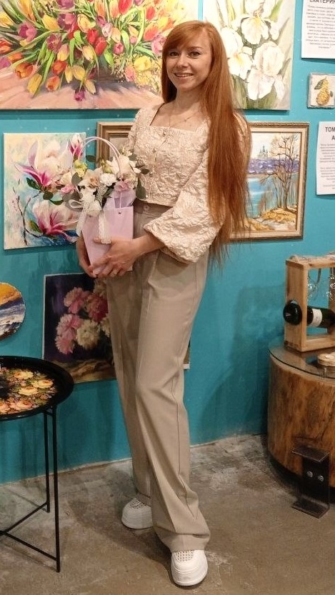

# Рудый Наталия Валерьевна
## Черновик биографии

Дата рождения: Январь 1989
Место рождения: Серов
Образование: Нижнетагильская Государственная Социально-Педагогическая Академия, 2011

Страницы в интернете: 
- <https://vk.com/nataly_art_rud>
- <https://vk.com/nataliia_kuznetsova>

Родилась в январе 1989 в городе Серов.

В 2005 г. закончила Серовскую детскую художественную школу имени С.П.Кодолова.

В 2006-2011 гг. училась на художественно-графическом факультете Нижнетагильской государственной педагогической академии. После этого училась в мастерской Костылева Сергея Анатольевича (преподаватель РАЖВиЗ, г. Пермь).

В 2015 году вступила в Союз художников России.

2016: Выставка "Свет малой родины" в Курганском областном культурно-выставочном центре (https://vk.com/wall-103472646_187)

В 2018 открыла творческую мастерскую «Ежевика», в которой занимается обучением начинающих художников.

2018: Персональная выставка в здании Администрации города Нижний Тагил. На выставке были в основном представлены пейзажи с видами уральской природы и города Нижний Тагил (https://vk.com/wall-103472646_273)

В 2019 получила стипендию Министерства культуры Свердловской области за вклад в развитие культуры города Нижнего Тагила и Свердловской области.

2020: Участвовала в «Демидов Фесте» в Черноисточинске. Персональная выставка «Краски Уральской земли», Музей ИЗО, г. Нижний Тагил.

2022: Диплом I степени на [всероссийской выставке-конкурсе в Оренбурге](https://vk.com/wall-103472646_330)

2024: Выставка «Повесть уральского лета» в Арт–галерее ООО «Газпром трансгаз Екатеринбург».

В августе-сентябре 2024 участвовала в I Межрегиональном пленэре «Урал. Культурное наследие» на территории этностоянки «Место силы Камень Олений», река Чусовая. Работы с него выставлялись в администрации города (https://vk.com/wall18580469_8270)

В июне 2025 вместе с Анной Франт работала на пленэре на территории НТМК (https://vk.com/wall18580469_8580)

В июле 2025 работала на пленэре на территории старого завода-музея (https://vk.com/wall18580469_8641)

Май 2026: [Выставка в администрации Ленинского района](https://tagilka.ru/116998-podarok-k-yubileyu-v-administraczii-leninskogo-rajona-otkryilas-vyistavka-kartin-na.html), на которой представлены городские пейзажи, в том числе виды на Лисью гору и храм Александра Невского.

Июнь 2026: Индустриальный пленэр на автозаводе "Урал", г. Миасс (https://vk.com/wall18580469_8835)

Участвует в выставках в Нижнетагильском музее изобразительных искусств, например "Вверх по вертикали" в 2019 (https://vk.com/wall-103472646_274).

Часто выезжает на пленэры по Среднему Уралу, например, была на реке Чусовой, в поселках Черноисточинск, Висим, Староуткинск, Уралец, Таватуй; в Верхотурье, в горах Конжаковского камня.

**Источники:**

- https://nashural.ru/culture/ural-characters/hudozhnik-nataliya-rudyj-nizhnij-tagil-prirodnye-pejzazhi-srednego-urala/
- http://shr-nt.ru/node/805

**Ссылки:**
- https://dhsh-serov.ekb.muzkult.ru/gallery/vistavka_rudiy_2021
- https://dhsh-serov.ekb.muzkult.ru/online_vistavki
- https://jotto8.ru/blog/intervju-s-hudozhnikom-pejzazhistom-natalej-rudyj
- https://natalyrud.in.gallerix.ru
- https://artnow.ru/ru/artists/3/37836/picture/0/0.html
- [Интервью программе "Факты в лицах", 2018](https://ok.ru/video/1221451122036)
