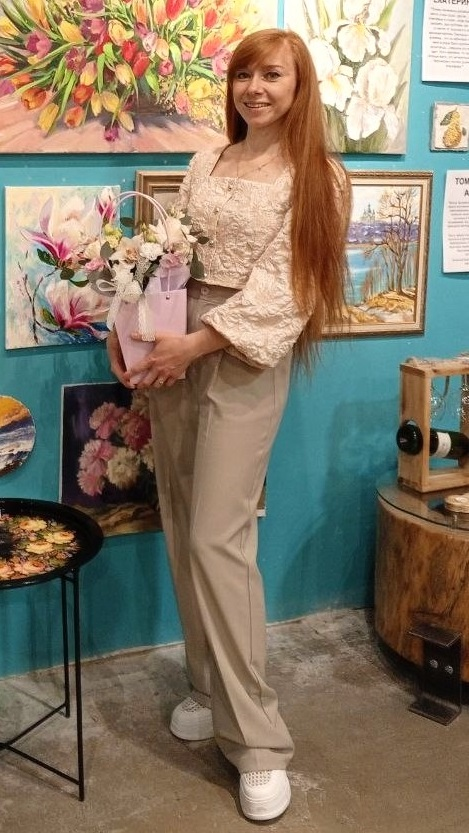

# Рудый Наталия Валерьевна
## Черновик биографии

Дата рождения: Январь 1989  
Место рождения: Серов  
Образование: Нижнетагильская Государственная Социально-Педагогическая Академия, 2011

Страницы в интернете: 
- <https://vk.com/nataly_art_rud>
- <https://vk.com/nataliia_kuznetsova>

Родилась в январе 1989 в городе Серов. Ее отец, Кузнецов Валерий Евгеньевич, по профессии — машинист поездов; мать Кузнецова Татьяна Адольфовна — телеграфистка. Уже в детстве у Наталии обнаруживается талант к рисованию, и в 6 лет родители отдают ее в изостудию во Дворце творчества юных. Но вскоре у девочки начинает развиваться искривление позвоночника из-за постоянной работы в неудобной позе, в результате чего она уходит оттуда и начинает заниматься танцами и спортом. Но интерес к рисованию остается: Наталия рисует школьные стенгазеты и делает за старшего брата домашнюю работу по изобразительному искусству. Однажды за такую работу учительница поставила брату двойку и сказала, чтобы мама больше не рисовала за него...

В 2001 Наталия понимает, что хочет вернуться к рисованию, и поступает в Серовскую детскую художественную школу имени С.П.Кодолова. Преподаватели организуют поездки на пленэр в горы Северного Урала; именно с этого времени у Наталии появляется любовь к рисованию природы. Наталия участвует в городских и областных конкурсах, в 2004 году она становится стипендиатом Главы города за «успехи в творчестве». В 2005 она заканчивает художественную школу. Преподаватель Лариса Ивановна Моргачёва советует ей поступать в художественный вуз и профессионально заниматься искусством. Она следует этому совету: год учится на подготовительных курсах, а затем подает документы в вуз.

В 2006 Наталия поступила на художественно-графический факультет Нижнетагильской государственной социально-педагогической академии. Живопись у нее преподает Игорь Владимирович Грищенко, который сочетает приемы реалистической и авангардной живописи. С ним Наталия также ездит на пленеры и совершенствуется в изображении пейзажей; на поездки студентов выделяют достаточно денег, которых в то время у академии хватает. На 4 курсе она начинает учиться в мастерской Сергея Анатольевича Костылева, который становится ее дипломным руководителем. Наталию привлекает его стиль, близкий к классическому реалистическому пейзажу, она хочет двигаться в этом же направлении. Темой ее дипломной работы были пейзажи окрестностей реки Чусовой: она пишет 4 композиции, основанных на натурных этюдах. Сейчас эти картины хранятся в фонде ФХО. В 2010 Наталия впервые участвует в выставках всеросийского уровня: в Смоленске, Катайске.

В 2011 году она заканчивает академию с красным дипломом, и начинает работать учительницей в школе №69, преподавая изобразительное искусство в 1-7 классах. Одновременно она продолжает обучение у Костылева. Через некоторое время Сергей Анатольевич переезжает в Пермь, где становится преподавателем РАЖВиЗ. Наталия занимает его освободившуюся мастерскую в Тагиле. Она продолжает свой путь в искусстве самостоятельно, но иногда советуется с бывшим руководителем, переписывась с ним через социальные сети. Одна из самых ранних известных работ Наталии, [Лунная Чусовая](https://in.gallerix.ru/natalyrud/expo/kartiny-na-prodazhu/lunnaya-chusovaya_1/) 2011 года, изображает лодки на фоне таинственнных окутанных туманом утесов и освещенной лунным светом реки.

В 2012-2013 годах Наталия путешествует по городам центральной России, где пишет природные пейзажи и виды на церкви. Наиболее удачная работа этого периода, [Златоглавая](2012_jmv2kBItLyIW7fzVVz.html), изображает вид с высокой точки на храм Покровского монастыря в Суздале. Золотые купола храма изображены на фоне реки, подсвеченной закатом в похожий золотой оттенок, а на переднем плане - суровый пейзаж со снегом и елью. Картина оставляет возвышенное впечатление; вероятно, это одна из лучших патриотических картин, когда либо написанных тагильскими художниками. Позднее Наталия передала ее в дар музею Нижнетагильского металлургического комбината, где она и находится сейчас.

В 2014-2015 девушка отправляется в Сибирь и изображает там природные пейзажи, в том числе вид на озеро Байкал. Среди ее уральских пейзажей этого времени - картина [Уральские просторы](2015-uralskie-prostory.html), которая изображает вид на реку с высокого утесистого берега. Она продолжает участвовать в выставках - на Урале, в Самаре, в Новосибирске; первые ее персональные выставки проходят в Нижнетагильском Доме Учителя и Серовском историческом музее. О серовской выставке выходит статья в журнале "Культура Урала" ([Раида Стрункина. Любовь к природе и книгам объединила две художественные выставки в Серовском историческом музее, 2015](https://vk.ru/wall18580469_3238)). Наталия так прокомментировала представленные картины:

> Я много езжу, восхищаюсь разнообразием российских просторов, но уральские пейзажи мне милее всех... Здесь моя душа. Урал прекрасен в любое время года. Надо всего лишь внимательнее вглядываться в его неброскую красоту. Наверное, художники для того и существуют, чтобы помочь людям по новому взглянуть на привычное...

Художница отправляет свои работы на всероссийский конкурс деятелей искусства «Тюменский звездопад» и получает диплом Лауреата 1 степени. В 2015 году она вступает в Союз художников России. В декабре 2015 Наталия делает свою первую стенную роспись: в баре "Руслан" она пишет девушку в красном платье, сидящую на пивной бочке во фривольной позе на фоне горного пейзажа.

2016: Выставка "Свет малой родины" в Курганском областном культурно-выставочном центре (https://vk.com/wall-103472646_187). На выставке было представлено 50 полотен, среди них - "Май на реке", "Осенние березки", "Сиреневый туман", "Отблески лета", "Лунная Чусовая", "Весенняя пора в Тагиле". Художник и путешественник Александр Оглоблин говорил об этой выставке (https://www.mngz.ru/russia-world-sensation/2227299-svet-maloy-rodiny.html):

> Я рад, что живопись не умирает, хотя фотографии все чаще заменяют изобразительное искусство. Приятно, когда молодые художники продолжают дело старших коллег, приятно видеть наши родные пейзажи.

В этом же году Наталия делает стенную роспись в гастропабе "Ленинград", на которой изображает лицо Сергея Шнурова в окружении достопримечательностей Санкт-Петербурга (https://vk.ru/wall-103472646_191).

В 2016 Наталия выходит замуж, ее мужем становится Роман Рудый. Около 2017 года у нее рождается дочь. Во время беременности Наталия прекращает писать масляными красками, лишь немного рисует пастелью и другими графическими материалами, так как считает, что химикаты могут повредить здоровью будущего ребенка. После рождения дочери она понемногу возвращается к живописи, работает дома, это помогало ей морально разгрузиться. Через 3-4 месяца она начала и выезжать на пленэр, маленькую дочь она при этом брала с собой - дочь спала в коляске, пока мать писала природу с натуры. Эти подробности известны благодаря [интервью](https://jotto8.ru/blog/intervju-s-hudozhnikom-pejzazhistom-natalej-rudyj), которое у художницы взяла в 2020 году Екатерина Крюкова.

В 2018 открыла творческую мастерскую «Ежевика», в которой занимается обучением начинающих художников. Название студии “Ежевика” появилось после того, как при ремонте помещения выбрали сиреневый цвет стен. В студии Наталия в основном учит масляной живописи, но иногда использует акрил и пастель.

2018: Персональная выставка в здании Администрации города Нижний Тагил. На выставке были в основном представлены пейзажи с видами уральской природы и города Нижний Тагил (https://vk.com/wall-103472646_273)

В 2019 получила стипендию Министерства культуры Свердловской области за вклад в развитие культуры города Нижнего Тагила и Свердловской области.

2020: Участвовала в «Демидов Фесте» в Черноисточинске. Персональная выставка «Краски Уральской земли», Музей ИЗО, г. Нижний Тагил.

2022: Диплом I степени на [всероссийской выставке-конкурсе в Оренбурге](https://vk.com/wall-103472646_330) за работу [Первая прогулка](https://vk.ru/wall18580469_5600) (2021, Бумага, пастель, 50х65 см).

2024: Выставка «Повесть уральского лета» в Арт–галерее ООО «Газпром трансгаз Екатеринбург».

В августе-сентябре 2024 участвовала в I Межрегиональном пленэре «Урал. Культурное наследие» на территории этностоянки «Место силы Камень Олений», река Чусовая. Работы с него выставлялись в администрации города (https://vk.com/wall18580469_8270)

В июне 2025 вместе с Анной Франт работала на пленэре на территории НТМК (https://vk.com/wall18580469_8580)

В июле 2025 работала на пленэре на территории старого завода-музея (https://vk.com/wall18580469_8641)

Май 2026: [Выставка в администрации Ленинского района](https://tagilka.ru/116998-podarok-k-yubileyu-v-administraczii-leninskogo-rajona-otkryilas-vyistavka-kartin-na.html), на которой представлены городские пейзажи, в том числе виды на Лисью гору и храм Александра Невского.

Июнь 2026: Индустриальный пленэр на автозаводе "Урал", г. Миасс (https://vk.com/wall18580469_8835)

Участвует в выставках в Нижнетагильском музее изобразительных искусств, например "Вверх по вертикали" в 2019 (https://vk.com/wall-103472646_274).

Часто выезжает на пленэры по Среднему Уралу, например, была на реке Чусовой, в поселках Черноисточинск, Висим, Староуткинск, Уралец, Таватуй; в Верхотурье, в горах Конжаковского камня.

**Источники:**

- https://nashural.ru/culture/ural-characters/hudozhnik-nataliya-rudyj-nizhnij-tagil-prirodnye-pejzazhi-srednego-urala/
- http://shr-nt.ru/node/805
- https://jotto8.ru/blog/intervju-s-hudozhnikom-pejzazhistom-natalej-rudyj
- https://vk.ru/wall-218867577_399
- https://dhsh-serov.ekb.muzkult.ru/online_vistavki

**Ссылки:**
- https://dhsh-serov.ekb.muzkult.ru/gallery/vistavka_rudiy_2021
- https://natalyrud.in.gallerix.ru
- https://artnow.ru/ru/artists/3/37836/picture/0/0.html
- [Интервью программе "Факты в лицах", 2018](https://ok.ru/video/1221451122036)
