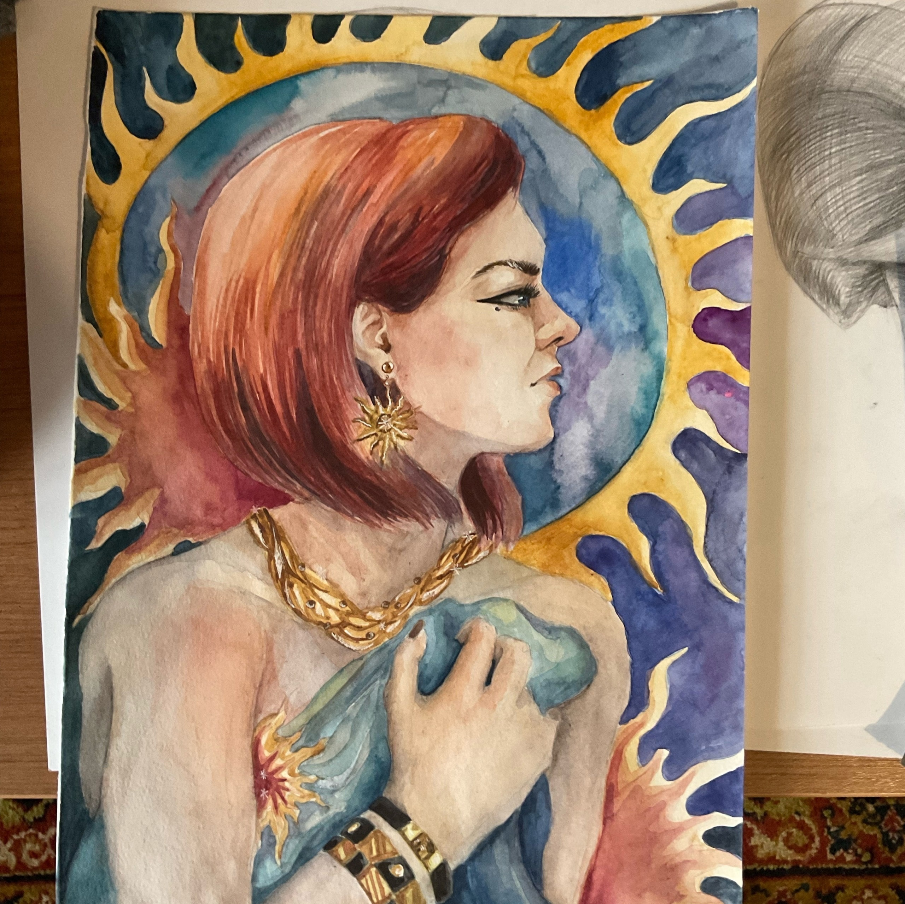
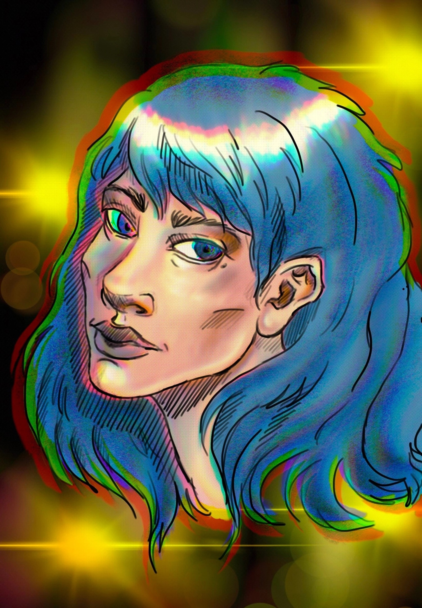
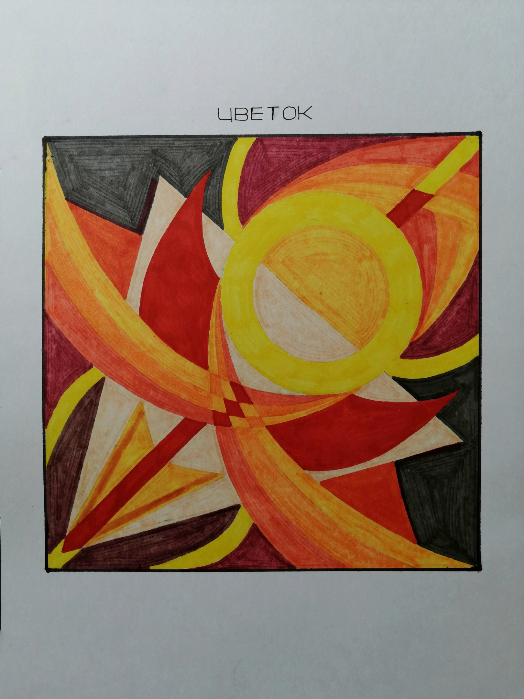
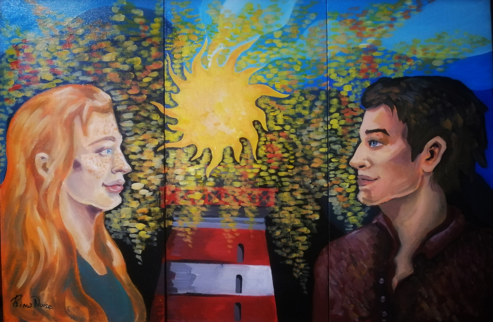
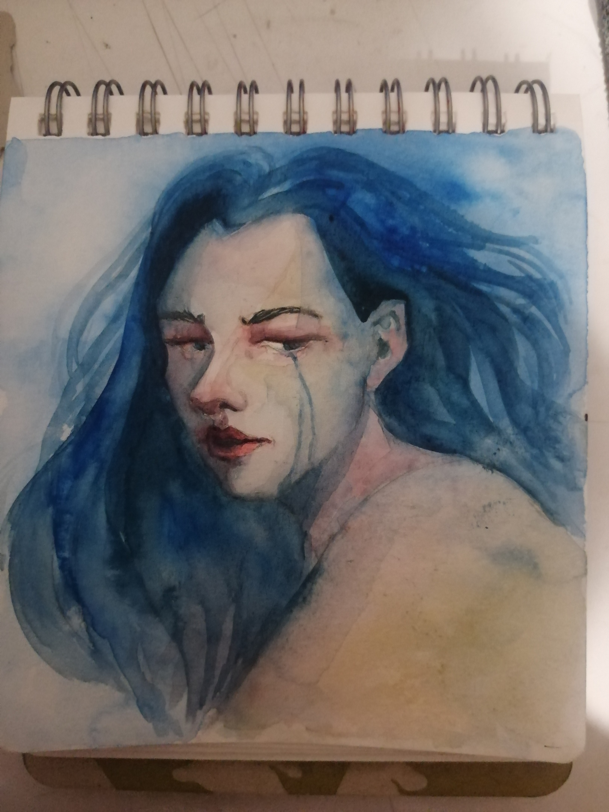
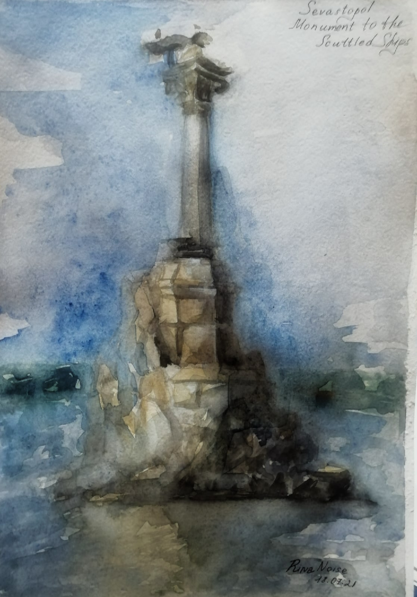
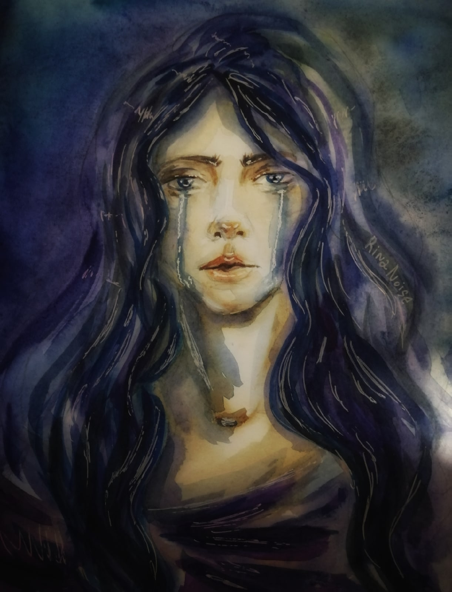

# Каранина Ирина Дмитриевна

- https://vk.com/rinsun2033
- https://vk.com/anarho_punk8grop
- https://t.me/s/RinaSun2033

Родилась 21 апреля 1999 г.

2017-2021: Училась в Уральском колледже прикладного искусства и дизайна (филиал ФГБОУ ВО «РГХПУ им. С.Г.Строганова»). Дипломная работа была связана с изготовлением изделий из стекла в технике "Фьюзинг".

В 2022 г. поступила на ФХО НТГСПИ (Изобразительное искусство и дизайн). С 2025 г. перевелась на заочное обучение.

## Каталог картин
Составление начато 17.06.2025

Драконье логово, 2024

https://vk.com/wall-225094823?z=photo-225094823_456239123%2Fwall-225094823_46

Написана в Крыму, на фестивале "Таврида Арт 2024"

Падение в бездну обучения, 2024. Хост без подрамника, Темпера, 30х30 см

https://vk.com/anarho_punk8grop?z=photo-79794560_457243239%2F8b7d44c8cc7397e2b3

Солнце, 2023. Акварель, Формат А3

https://vk.com/albums-218867577?z=photo-218867577_457239487%2Fphotos-218867577

Выставлялась в ArtSpaceDepo

Призраки прошлого, 2023. Тушь, 25х25 см
 
https://vk.com/albums-218867577?z=photo-218867577_457239486%2Fphotos-218867577

Выставлялась в ArtSpaceDepo

Цветы любви, 2023. Гуашь, Формат А5

https://vk.com/albums-218867577?z=photo-218867577_457239485%2Fphotos-218867577

Выставлялась в ArtSpaceDepo

(Натюрморт с кувшином и фруктами), 2023. Акварель, Формат А2

https://vk.com/albums-218867577?z=photo-218867577_457239484%2Fphotos-218867577

Выставлялась в ArtSpaceDepo

(Натюрморт с сухой травой), 2023. Акварель, Формат А2

https://vk.com/albums-218867577?z=photo-218867577_457239483%2Fphotos-218867577

Выставлялась в ArtSpaceDepo

(Натюрморт с кувшином и яблоком), 2023. Акварель, 50х60 см

https://vk.com/albums-218867577?z=photo-218867577_457239482%2Fphotos-218867577

Выставлялась в ArtSpaceDepo

Начало жизни и судьбы, 2023. Холст на подрамнике, акрил, контур, 24.5х29 см

https://vk.com/anarho_punk8grop?z=photo-79794560_457243234%2Fd5571e4148433feec0

Если бы ты только знал насколько иронична бывает с нами судьба..
Связывая одних за долго до самой жизни, по итогу разбрасывает в разные стороны, в надежде на то что они обретут что-то иное, чтобы в итоге отобрать и это..

(Женщина на фоне деревьев), 2023
 
https://vk.com/anarho_punk8grop?z=photo-79794560_457243202%2Fwall-79794560_7054

Парный портрет, 2023
 
https://vk.com/anarho_punk8grop?z=photo-79794560_457243201%2F8a7db70e48b0aa5407

Лягушка, 2023 

https://vk.com/anarho_punk8grop?z=photo-79794560_457243200%2Fwall-79794560_7049

(Деревья), 2023

https://vk.com/anarho_punk8grop?z=photo-79794560_457243188%2Fwall-79794560_7046

(Крыльцо), 2023 

https://vk.com/anarho_punk8grop?z=photo-79794560_457243190%2Fwall-79794560_7046

(Деревья на фоне неба), 2022 

https://vk.com/anarho_punk8grop?z=photo-79794560_457243097%2Fwall-79794560_6976

(Женщина с синими волосами), 2022. Цифровой рисунок

https://vk.com/anarho_punk8grop?z=photo-79794560_457243089%2Fwall-79794560_6969

Нелёгкий путь, 2022

https://vk.com/anarho_punk8grop?z=photo-79794560_457243086%2Fbd30159e8797cc6556

Нелёгкий путь, самому стать для кого-то чем-то большим, чем просто звездой в небе...
Однако, несмотря на трудный путь, это все равно становится большим счастьем.

Надежда умирает последней, 2022 

https://vk.com/anarho_punk8grop?z=photo-79794560_457243020%2Ff0404e33066d3e20a8

Цветок, 2022 

https://vk.com/anarho_punk8grop?z=photo-79794560_457243007%2Fwall-79794560_6899

Между нами пламя маяка, 2022

https://vk.com/wall-79794560?offset=160&own=1&z=photo-79794560_457242995%2Fb8411333c6a8e1bb44

Картина триплекс

Скованные, 2022. Акрил, поталь, 35х50 см

https://vk.com/wall-79794560?offset=160&own=1&z=photo-79794560_457242977%2F710ce06659795d5ac4

Дочь Солнца, 2022. Холст без подрамника, акрил, 21х30 см

https://vk.com/wall-79794560?offset=160&own=1&z=photo-79794560_457242966%2Fa5146b2495f5cf8503

Усталость, 2022

https://vk.com/wall-79794560?offset=160&own=1&z=photo-79794560_457242938%2F7037549ccea58e8be0

В глубине души, 2022. Акварель, 29.5х40 см

https://vk.com/wall-79794560?offset=200&own=1&z=photo-79794560_457242923%2Fa53df018f7f9ed1374

Портрет Натальи Запояско, 2022

https://vk.com/wall-79794560?offset=200&own=1&z=photo-79794560_457242919%2Fwall-79794560_6816

Два сердца, что удерживаются цепями обстоятельств, 2021

https://vk.com/wall-79794560?offset=160&own=1&z=photo-79794560_457242975%2Fdb9d9264c2cca9a93b

Дочь солнца и пламени, 2021

https://vk.com/wall-79794560?offset=200&own=1&z=photo-79794560_457242894%2Fa03a5e5d09ea27431f

(Ворон), 2021

https://vk.com/wall-79794560?offset=200&own=1&z=photo-79794560_457242892%2Fwall-79794560_6778

Омут, 2021

https://vk.com/wall-79794560?offset=200&own=1&z=photo-79794560_457242884%2F535c2d3f84f71ed751

Яблочки, 2021

https://vk.com/wall-79794560?offset=200&own=1&z=photo-79794560_457242885%2F7547f222178e8b7790

Памятник затопленным кораблям, 2021. Акварель в технике "по сырому"

https://vk.com/wall-79794560?offset=200&own=1&z=photo-79794560_457242866%2F0cd17169ccd7f71b0c

Пилигрим, 2021

https://vk.com/wall-79794560?offset=200&own=1&z=photo-79794560_457242850%2F4296f2955fe25aefd4

Портрет Юлии Евдокимовой, 2021

https://vk.com/wall-79794560?offset=200&own=1&z=photo-79794560_457242849%2Fc5ba6f67963c0f4689

Эскиз открытки к 300-летию Нижнего Тагила, 2021

https://vk.com/wall-79794560?offset=200&own=1&z=photo-79794560_457242774%2F593cf683436b853551

Автопортрет, 2020

https://vk.com/wall-79794560?offset=320&own=1&z=photo-79794560_457242753%2F96668bd370642cd79a

Разочарование, 2020

https://vk.com/wall-79794560?offset=320&own=1&z=photo-79794560_457242752%2Fdf37ba9935cf17b880

Разум и чувства, 2020

https://vk.com/wall-79794560?offset=320&own=1&z=photo-79794560_457242688%2F035f1ffdeeefb54d25

Страсть, 2020

https://vk.com/wall-79794560?offset=320&own=1&z=photo-79794560_457242650%2F250a7cbbd4581eafc4

Путь к свету, 2020

https://vk.com/wall-79794560?offset=320&own=1&z=photo-79794560_457242617%2F13e6009b57d8d7b6bd

Путь к свету через темноту. А свет - это любящее тебя сердце... Ключ от которого только у тебя..

Сонливость, 2020

https://vk.com/wall-79794560?offset=320&own=1&z=photo-79794560_457242499%2F9c3d3c4783288bb895

Берегите себя и своих близких, 2020

https://vk.com/wall-79794560?offset=320&own=1&z=photo-79794560_457242512%2Fa7b61ccefcc0f52e07

Икар и солнце, 2016

https://vk.com/wall-79794560_6350
