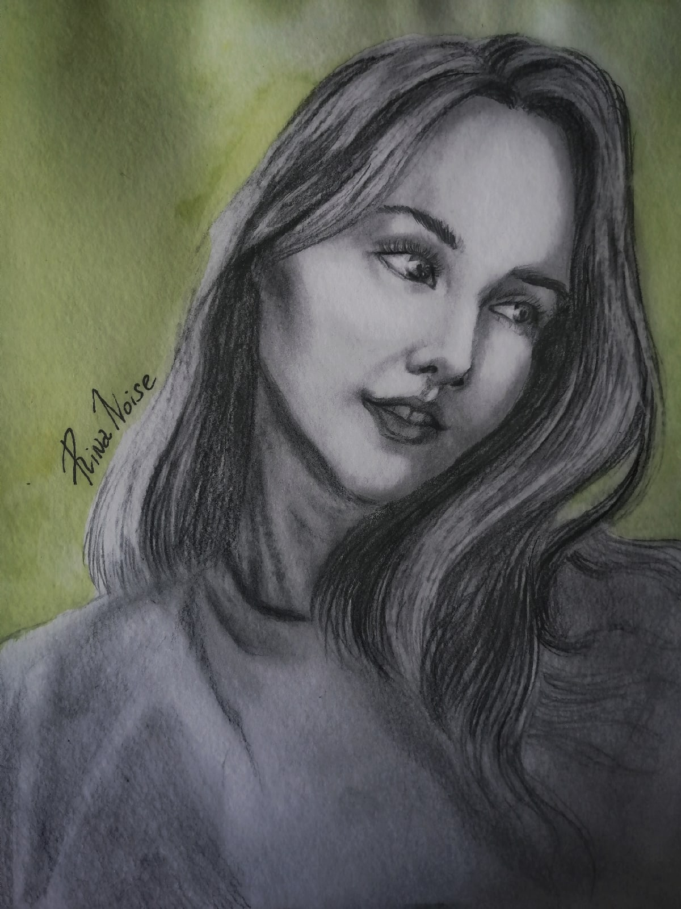
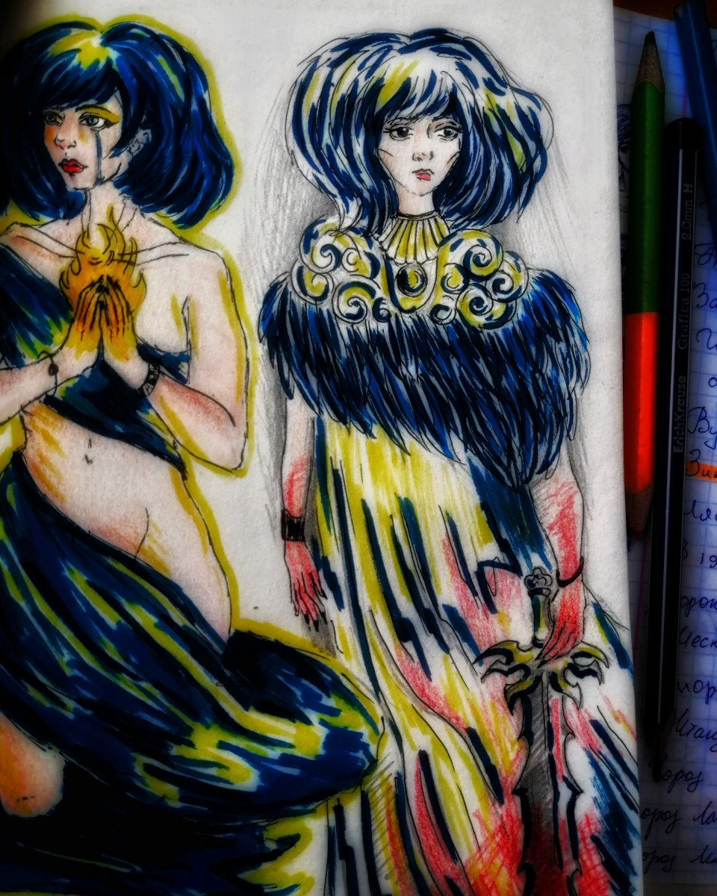
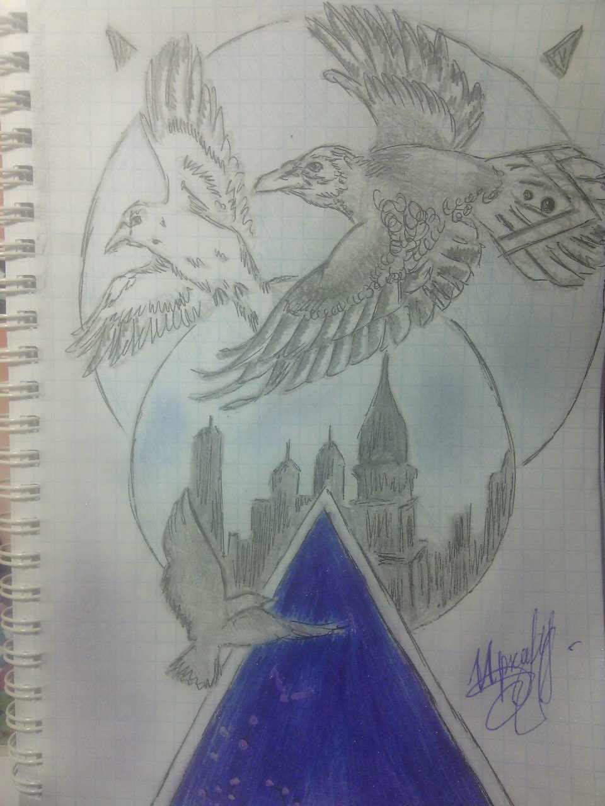

# Каранина Ирина Дмитриевна

Дата рождения: Апрель 1999  
Место рождения: Красноуральск  
Страница в интернете: https://vk.com/rinsun2033  

## Каталог работ

Безумная любовь, 2025. Холст на подрамнике, акрил, 60х80 см

https://vk.com/rinsun2033?w=wall-225094823_196

Эта работа.. очень значимая. В процессе её написания, я сумела переосмыслить её содержание. Эта картина, отражение моих прошлых отношений, которые длились 6 лет..

Не было в них исключительного зла. Все имеет свою основу. Человек меня бил. Временами был весьма жесток, что доходило даже до насилия, моральных, физических увечий.. Но так ли все однозначно?
Своим поведением я ничем не была лучше, своего "аппанента" с картины. Я была эгоистичной, временами навязчивой, временами агрессивной. Я тоже могла его ударить, при том за пустяк. Я не умела в то время грамотно выражать свои по настоящему сильные чувства.Я часто скандалила... Какой итог? Итог очевидный, он тоже был таким же, ярким, неуравновешанным, вспыльчивым. Мы стоили друг друга, потому как были очень похожи. Поэтому получили оба по заслугам. Я за свою скандальность огребала, он, за свое поведение лишился меня. Я ушла. Я сбежала..

И к сожалению, причинила ему боль, равноценную.
Нам, к сожалению,обоим это было необходимо и нужно, дабы научиться, дабы измениться, дабы что-то в жизни понять.
Извлечь уроки из того что мы делали, и что любовь это не "срастание" в одну единую личность, любовь это про принятие, про гармонию, про взаимовыручку и взаимоуважение.
Эти отношения показатель того, что мало быть похожими, важно эту похожесть использовать с умом, а мы бездумно тратили свои нервы, и по итогу оба остались.. с проблемами ментальными.
Это единственный человек, на которого я не держу обид, не держу злости. Потому что понимаю, что сама была такой как он. И надеюсь.. что он извлёк важные для себя уроки, так же, как их извлекла я..

Эта картина на самом деле очень дорога мне, как понимание, переосмысление себя и своих поступков, а также стала толчком для понимания того, что нужно беречь то что имеешь, и не причинять другому человеку возле себя боль.
Ну и конечно я против насилия. Никто не имеет права поднимать руку. Ни мужчина, ни женщина.
И конечно, терпеть такое не стоит, даже если очень сильно человека любишь.Потому что себя и свою безопасность нужно ставить выше.

Я не хочу вас слушать, 2025. Акрил флюорисцентный и люминесцентный, 60х80 см

https://vk.com/rinsun2033?z=photo-225094823_456239430%2Fwall-225094823_184

Картина посвящена оскорблениям, которые я за свою жизнь слышала от окружающих, одноклассников, посторонних людей, в том числе от близких людей, а также некогда очень любимого мной человека. Наверное, слова близких чаще всего задевали мое сердце, и это своего рода крик..! о нежелании мной все это более слушать.

Картина написана в качестве протеста на буллинг, потому как, я не заслуживала таких слов в свою сторону, как и другие жертвы буллинга!
По большому счету, буллят неуверенные в себе индивиды, которые таким образом пытаются поднять самозначимость в своих собственных глазах, и в глазах окружающих людей, потому что на другое проявление себя у них не хватает внутренних сил или желания.
Картина светится в темноте, но не полностью. Светятся только фразы унижений, и слабое "не хочу", как демонстрация того, насколько могут ранить слова, оставив огромный отпечаток и кучу комплексов. Некие "плохие мысли" рождающиеся перед сном, и когда человек остаётся один на один с собой и своими мыслями.
Данная серия картин не будет "радужной". Название ей будет: Невысказанные чувства.

В серии планируется 7 работ, из которых 2 уже написаны.
В планах сделать эскизы на мои новые идеи. Я хотела бы поднять вопрос о насилии, в том числе сексуальном, с которым мне, увы, пришлось столкнуться в прошлом, а так же тему принуждения, в связи с чем произошло ужасное предательство. Мне важно это отразить, потому что уже не вижу иных способов прожить эти ситуации...
Эта серия, своего рода терпения для меня, помогающая возможно пережить то, с чем мне довелось столкнуться в прошлом.

Ты глух. Но мне есть что тебе сказать, 2025. Акрил, 40х50 см

https://vk.com/rinsun2033?z=photo-225094823_456239400%2Fwall-225094823_173

Вопреки всему понимания достичь очень сложная штука. И вот поэтому родилась эта работа. Она посвящена моему любимому. Он не всегда хочет меня слышать, хотя на самом деле в моей голове океан мыслей, которые я очень хочу до него донести, чтобы он их услышал и понял... чтобы принял меня такой, какая я есть.

Драконье логово, 2024

https://vk.com/wall-225094823?z=photo-225094823_456239123%2Fwall-225094823_46

От составителя: Написана в Крыму, на фестивале "Таврида Арт 2024"

Падение в бездну обучения, 2024. Холст без подрамника, Темпера, 30х30 см

https://vk.com/anarho_punk8grop?z=photo-79794560_457243239%2F8b7d44c8cc7397e2b3

Солнце, 2023. Акварель, Формат А3

https://vk.com/albums-218867577?z=photo-218867577_457239487%2Fphotos-218867577

История:  
- 2023: Выставлялась в ArtSpaceDepo

Призраки прошлого, 2023. Тушь, 25х25 см

https://vk.com/albums-218867577?z=photo-218867577_457239486%2Fphotos-218867577

История:  
- 2023: Выставлялась в ArtSpaceDepo

Цветы любви, 2023. Гуашь, Формат А5

https://vk.com/albums-218867577?z=photo-218867577_457239485%2Fphotos-218867577

История:  
- 2023: Выставлялась в ArtSpaceDepo

(Натюрморт с кувшином и фруктами), 2023. Акварель, Формат А2

https://vk.com/albums-218867577?z=photo-218867577_457239484%2Fphotos-218867577

История:  
- 2023: Выставлялась в ArtSpaceDepo

(Натюрморт с сухой травой), 2023. Акварель, Формат А2

https://vk.com/albums-218867577?z=photo-218867577_457239483%2Fphotos-218867577

История:  
- 2023: Выставлялась в ArtSpaceDepo

Начало жизни и судьбы, 2023. Холст на подрамнике, акрил, контур, 24.5х29 см

https://vk.com/anarho_punk8grop?z=photo-79794560_457243234%2Fd5571e4148433feec0

Если бы ты только знал насколько иронична бывает с нами судьба..
Связывая одних за долго до самой жизни, по итогу разбрасывает в разные стороны, в надежде на то что они обретут что-то иное, чтобы в итоге отобрать и это..

(Женщина на фоне деревьев), 2023

https://vk.com/anarho_punk8grop?z=photo-79794560_457243202%2Fwall-79794560_7054

Парный портрет, 2023

https://vk.com/anarho_punk8grop?z=photo-79794560_457243201%2F8a7db70e48b0aa5407

Лягушка, 2023

https://vk.com/anarho_punk8grop?z=photo-79794560_457243200%2Fwall-79794560_7049

(Деревья), 2023

https://vk.com/anarho_punk8grop?z=photo-79794560_457243188%2Fwall-79794560_7046

(Крыльцо), 2023

https://vk.com/anarho_punk8grop?z=photo-79794560_457243190%2Fwall-79794560_7046

Домик в деревне, 2023. Бумага, линер

https://vk.com/wall-4891369?offset=340&own=1&z=photo-4891369_457261463%2Fwall-4891369_7851

История:  
- 2023: Участвовала в выставке студенческих работ "60 мгновений лета"

Однажды в солнечный день улыбался ты, 2023. Бумага, гуашь

https://vk.com/wall-4891369?offset=340&own=1&z=photo-4891369_457261464%2Fwall-4891369_7851

История:  
- 2023: Участвовала в выставке студенческих работ "60 мгновений лета"

Нет роднее места, 2023. Бумага, линер

https://vk.com/wall-4891369?offset=340&own=1&z=photo-4891369_457261465%2Fwall-4891369_7851

История:  
- 2023: Участвовала в выставке студенческих работ "60 мгновений лета"

Одиночество, 2023. Бумага, пастель

https://vk.com/wall-4891369?offset=340&own=1&z=photo-4891369_457261466%2Fwall-4891369_7851

История:  
- 2023: Участвовала в выставке студенческих работ "60 мгновений лета"

У дома, 2023. Черная ручка

https://vk.com/albums-218867577?z=photo-218867577_457239205%2Fphotos-218867577

История:  
- 2023: Выставлялась в ArtSpaceDepo

Старый завод, 2023. Черная ручка, А4

https://vk.com/albums-218867577?z=photo-218867577_457239204%2Fphotos-218867577

История:  
- 2023: Выставлялась в ArtSpaceDepo

(Дерево), 2023. Акварель, белая ручка, А4

https://vk.com/albums-218867577?z=photo-218867577_457239190%2Fphotos-218867577

История:  
- 2023: Выставлялась в ArtSpaceDepo

Возлюбленный, 2023. Холст в багете, А4

https://vk.com/albums-218867577?z=photo-218867577_457239147%2Fphotos-218867577

История:  
- 2023: Выставлялась в ArtSpaceDepo (не продавалась)

Учитель, 2023. Холст в багете, А4

https://vk.com/albums-218867577?z=photo-218867577_457239147%2Fphotos-218867577

История:  
- 2023: Выставлялась в ArtSpaceDepo (не продавалась)

Два Влюбленных, 2023. Акварель, маркеры, белая ручка, А4

https://vk.com/albums-218867577?z=photo-218867577_457239089%2Fphotos-218867577

История:  
- 2023: Выставлялась в ArtSpaceDepo

Сильнее судьбы, 2023. Холст без подрамника, акрил, контур, 35х50 см

https://vk.com/albums-218867577?z=photo-218867577_457239085%2Fphotos-218867577

История:  
- 2023: Выставлялась в ArtSpaceDepo

Взгляд вселенной, 2023. Акрил, поталь, 15х15 см

https://vk.com/albums-218867577?z=photo-218867577_457239084%2Fphotos-218867577

История:  
- 2023: Выставлялась в ArtSpaceDepo

(Деревья на фоне неба), 2022

https://vk.com/anarho_punk8grop?z=photo-79794560_457243097%2Fwall-79794560_6976

(Женщина с синими волосами), 2022. Цифровой рисунок

https://vk.com/anarho_punk8grop?z=photo-79794560_457243089%2Fwall-79794560_6969

Нелёгкий путь, 2022

https://vk.com/anarho_punk8grop?z=photo-79794560_457243086%2Fbd30159e8797cc6556

Нелёгкий путь, самому стать для кого-то чем-то большим, чем просто звездой в небе...
Однако, несмотря на трудный путь, это все равно становится большим счастьем.

Надежда умирает последней, 2022

https://vk.com/anarho_punk8grop?z=photo-79794560_457243020%2Ff0404e33066d3e20a8

Цветок, 2022

https://vk.com/anarho_punk8grop?z=photo-79794560_457243007%2Fwall-79794560_6899

Дева солнца, 2022. Холст, акрил, А4

https://vk.com/wall-79794560?offset=160&own=1&z=photo-79794560_457242995%2Fb8411333c6a8e1bb44

От составителя: Картина триплекс. Первоначальное название: "Между нами пламя маяка".

История:  
- 2023: Выставлялась в ArtSpaceDepo

Скованные, 2022. Акрил, поталь, 35х50 см

https://vk.com/wall-79794560?offset=160&own=1&z=photo-79794560_457242977%2F710ce06659795d5ac4

История:  
- 2023: Выставлялась в ArtSpaceDepo

Дочь Солнца, 2022. Холст без подрамника, акрил, 21х30 см

https://vk.com/wall-79794560?offset=160&own=1&z=photo-79794560_457242966%2Fa5146b2495f5cf8503

Усталость, 2022

https://vk.com/wall-79794560?offset=160&own=1&z=photo-79794560_457242938%2F7037549ccea58e8be0

Скоротечность жизни, 2022. Бумага, акварель, 29.5х40 см

https://vk.com/wall-79794560?offset=200&own=1&z=photo-79794560_457242923%2Fa53df018f7f9ed1374

От составителя: Первоначальное название: "В глубине души".

История:  
- 2023: Выставлялась в ArtSpaceDepo

Портрет Натальи Запояско, 2022

https://vk.com/wall-79794560?offset=200&own=1&z=photo-79794560_457242919%2Fwall-79794560_6816

Агония, 2022. Акварель, белая ручка, А4

https://vk.com/albums-218867577?z=photo-218867577_457239088%2Fphotos-218867577

История:  
- 2023: Выставлялась в ArtSpaceDepo

Два сердца, что удерживаются цепями обстоятельств, 2021

https://vk.com/wall-79794560?offset=160&own=1&z=photo-79794560_457242975%2Fdb9d9264c2cca9a93b

(Ворон), 2021

https://vk.com/wall-79794560?offset=200&own=1&z=photo-79794560_457242892%2Fwall-79794560_6778

Омут, 2021

https://vk.com/wall-79794560?offset=200&own=1&z=photo-79794560_457242884%2F535c2d3f84f71ed751

Яблочки, 2021

https://vk.com/wall-79794560?offset=200&own=1&z=photo-79794560_457242885%2F7547f222178e8b7790

Памятник затопленным кораблям, 2021. Акварель в технике "по сырому"

https://vk.com/wall-79794560?offset=200&own=1&z=photo-79794560_457242866%2F0cd17169ccd7f71b0c

Пилигрим, 2021

https://vk.com/wall-79794560?offset=200&own=1&z=photo-79794560_457242850%2F4296f2955fe25aefd4

Портрет Юлии Евдокимовой, 2021

https://vk.com/wall-79794560?offset=200&own=1&z=photo-79794560_457242849%2Fc5ba6f67963c0f4689

Эскиз открытки к 300-летию Нижнего Тагила, 2021

https://vk.com/wall-79794560?offset=200&own=1&z=photo-79794560_457242774%2F593cf683436b853551

Автопортрет, 2020

https://vk.com/wall-79794560?offset=320&own=1&z=photo-79794560_457242753%2F96668bd370642cd79a

Разочарование, 2020

https://vk.com/wall-79794560?offset=320&own=1&z=photo-79794560_457242752%2Fdf37ba9935cf17b880

Разум и чувства, 2020

https://vk.com/wall-79794560?offset=320&own=1&z=photo-79794560_457242688%2F035f1ffdeeefb54d25

Страсть, 2020

https://vk.com/wall-79794560?offset=320&own=1&z=photo-79794560_457242650%2F250a7cbbd4581eafc4

Судьбоносная встреча, 2020. Холст на подрамнике, А4

https://vk.com/wall-79794560?offset=320&own=1&z=photo-79794560_457242617%2F13e6009b57d8d7b6bd

Путь к свету через темноту. А свет - это любящее тебя сердце... Ключ от которого только у тебя..

История:  
- 2023: Выставлялась в ArtSpaceDepo

Сонливость, 2020

https://vk.com/wall-79794560?offset=320&own=1&z=photo-79794560_457242499%2F9c3d3c4783288bb895

Берегите себя и своих близких, 2020

https://vk.com/wall-79794560?offset=320&own=1&z=photo-79794560_457242512%2Fa7b61ccefcc0f52e07

Портрет матери, 2020

https://vk.com/wall-79794560?offset=580&own=1&z=photo-79794560_457242443%2F6af3d7981384b960f1

Она все ещё хочет быть свободной, но сделает все ради любви, 2020

https://vk.com/wall-79794560?offset=640&own=1&z=photo-79794560_457242401%2F0eca9e4471bb8cf0f1

(Цветы на фоне луны), 2019

https://vk.com/wall-79794560?offset=640&own=1&z=photo-79794560_457242334%2Fe1d7c3deef9349441b

Портрет одногруппницы, 2019

https://vk.com/wall-79794560?offset=800&own=1&z=photo-79794560_457242183%2F2e5c1f9c7b6530aa74

Гуси-лебеди, 2019

https://vk.com/wall-79794560?offset=800&own=1&z=photo-79794560_457241965%2F65bdb57b6f0ec012fa

Портрет Дарьи Ступак, 2019

https://vk.com/wall-79794560?offset=980&own=1&z=photo-79794560_456241815%2Fwall-79794560_5550

(Арка), 2019

https://vk.com/photo-79794560_456241791

Автопортрет, 2019

https://vk.com/wall-79794560?offset=1300&own=1&z=photo-79794560_456241155%2F1bec6ce12becb26567

Стул, 2019

https://vk.com/wall-79794560?offset=1300&own=1&z=photo-79794560_456241132%2Fd32dbb9a0050157231

(Натюрморт с кувшином и яблоком), 2018. Акварель, 50х60 см

https://vk.com/albums-218867577?z=photo-218867577_457239482%2Fphotos-218867577

История:  
- 2023: Выставлялась в ArtSpaceDepo

(Натюрморт), 2018

https://vk.com/wall-79794560?offset=1480&own=1&z=photo-79794560_456241007%2Fe403419e1cdcfe700b

(Портрет девушки), 2018

https://vk.com/wall-79794560?offset=1480&own=1&z=photo-79794560_456240850%2F20426702f02506a2a4

Не грусти, скоро взойдет наше солнце, 2018

https://vk.com/wall-79794560?offset=1480&own=1&z=photo-79794560_456240775%2F3a4a6184cb04d11c65

(Розы), 2018

https://vk.com/wall-79794560?offset=1740&own=1&z=photo-79794560_456240718%2Fc80808a4dfc9d99263

(Дракон), 2018

https://vk.com/wall-79794560?offset=1750&own=1&z=photo-79794560_456240667%2F75c914140ff41412fc

Я - Волк, 2018

https://vk.com/wall-79794560?offset=1750&own=1&z=photo-79794560_456240660%2F2f9fcf598910291c68

(Натюрморт с чайником), 2017

https://vk.com/wall-79794560?offset=2100&own=1&z=photo-79794560_456240175%2Fwall-79794560_3685

(Осенняя набережная), 2017. Масло

https://vk.com/wall-79794560?offset=2100&own=1

Ирина: Моя первая работа масляными красками.

(Любовь русалки), 2017

https://vk.com/wall-79794560?offset=2640&own=1&z=photo-79794560_456239772%2Fwall-79794560_3159

(Осень), 2016. Гуашь

https://vk.com/wall-79794560?offset=2640&own=1&z=photo-79794560_456239769%2F1c10b95ba485b3c9f2

Икар и солнце, 2016

https://vk.com/wall-79794560_6350

(Сова), 2016

https://vk.com/wall-79794560?offset=3680&own=1&z=photo-79794560_415758360%2Fa6a6786603741cc1c3

Фантазия влюблённых, 2015

https://vk.com/wall-79794560?offset=4080&own=1&z=photo-79794560_395865182%2F0e957fd0e743194491

Влюбленная в небо никогда не упадет на землю камнем, 2015

https://vk.com/wall-79794560?offset=4080&own=1&z=photo-79794560_394505698%2Fe6725e2838c049a5cc

(Орел), 2015

https://vk.com/wall-79794560?offset=4680&own=1&z=photo177327870_356773771%2F55f84f6382c3a24cbe

(Змея), 2014

https://vk.com/wall-79794560?offset=5140&own=1&z=photo-79794560_348380092%2F181b188efb2ff5a770

## Галерея

На выставке

На ярмарке со своими изделиями

На просмотре, 2024

На практике в детском лагере, 2024

Сумка работы Ирины, 2025

На Арт-кластере "Таврида", 2025

## См. также

- [Черновик биографии](bio.md)

