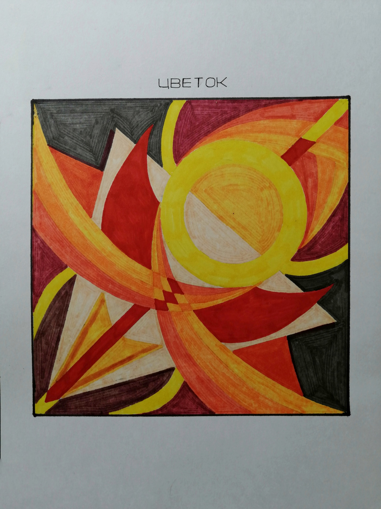

# Каранина Ирина Дмитриевна

Дата рождения: Апрель 1999  
Место рождения: Красноуральск  
Подпись: Rina Noise  
Страница ВКонтакте: [rinsun2033](https://vk.com/rinsun2033)  

## Каталог работ

[В начало](rinasun.md) [Предыдущая](rinasun.md) *Страница 2 из 5* [Следующая](rinasun3.md) [В конец](rinasun5.md)

Однажды в солнечный день улыбался ты, 2023. Бумага, гуашь

<https://vk.com/wall-4891369?offset=340&own=1&z=photo-4891369_457261464%2Fwall-4891369_7851>

Тип: Картина  
Жанр: Портрет

История:  
- 2023: Участвовала в выставке [Выставка студенческих работ "60 мгновений лета"](https://vk.com/wall-4891369_7782); Место: ФХО НТГСПИ

Нет роднее места, 2023. Бумага, линер

<https://vk.com/wall-4891369?offset=340&own=1&z=photo-4891369_457261465%2Fwall-4891369_7851>

Тип: Рисунок  
Жанр: Архитектурный пейзаж

История:  
- 2023: Участвовала в выставке [Выставка студенческих работ "60 мгновений лета"](https://vk.com/wall-4891369_7782); Место: ФХО НТГСПИ

Одиночество, 2023. Бумага, пастель

<https://vk.com/wall-4891369?offset=340&own=1&z=photo-4891369_457261466%2Fwall-4891369_7851>

Жанр: Архитектурный пейзаж

История:  
- 2023: Участвовала в выставке [Выставка студенческих работ "60 мгновений лета"](https://vk.com/wall-4891369_7782); Место: ФХО НТГСПИ

У дома, 2023. Черная ручка

<https://vk.com/albums-218867577?z=photo-218867577_457239205%2Fphotos-218867577>

Тип: Рисунок

История:  
- 2023: Выставлялась в ArtSpaceDepo

Старый завод, 2023. Черная ручка, А4

<https://vk.com/albums-218867577?z=photo-218867577_457239204%2Fphotos-218867577>

Тип: Рисунок  
Жанр: Архитектурный пейзаж

История:  
- 2023: Выставлялась в ArtSpaceDepo

(Дерево), 2023. Акварель, белая ручка, А4

<https://vk.com/albums-218867577?z=photo-218867577_457239190%2Fphotos-218867577>

Тип: Картина  
Жанр: Пейзаж

История:  
- 2023: Выставлялась в ArtSpaceDepo

Два Влюбленных, 2023. Акварель, маркеры, белая ручка, А4

<https://vk.com/albums-218867577?z=photo-218867577_457239089%2Fphotos-218867577>

Тип: Картина

История:  
- 2023: Выставлялась в ArtSpaceDepo

Сильнее судьбы, 2023. Холст без подрамника, акрил, контур, 35х50 см

<https://vk.com/albums-218867577?z=photo-218867577_457239085%2Fphotos-218867577>

Тип: Картина

История:  
- 2023: Выставлялась в ArtSpaceDepo

**Надпись**

*Содержание работы:* Пока человек не сдается / он сильнее своей судьбы

Взгляд вселенной, 2023. Акрил, поталь, 15х15 см

<https://vk.com/albums-218867577?z=photo-218867577_457239084%2Fphotos-218867577>

Тип: Картина

История:  
- 2023: Выставлялась в ArtSpaceDepo и была продана

Возлюбленный, 2022. Холст в багете, А4

<https://vk.com/albums-218867577?z=photo-218867577_457239147%2Fphotos-218867577>

Тип: Картина  
Жанр: Портрет

История:  
- 2022: Участвовала в выставке [Выставка студенческих работ ФХО](https://vk.com/album-4891369_289481614); Место: Центральная библиотека г. Нижний Тагил
- 2023: Выставлялась в ArtSpaceDepo (не продавалась)
- 2024: Участвовала в выставке [Вдохновляйся! Действуй!](https://vk.com/wall-4891369_8180); Место: Дом художника

Учитель, 2022. Холст в багете, А4

<https://vk.com/albums-218867577?z=photo-218867577_457239147%2Fphotos-218867577>

Тип: Картина  
Жанр: Портрет

История:  
- 2022: Участвовала в выставке [Выставка студенческих работ ФХО](https://vk.com/album-4891369_289481614); Место: Центральная библиотека г. Нижний Тагил
- 2023: Выставлялась в ArtSpaceDepo (не продавалась)
- 2024: Участвовала в выставке [Вдохновляйся! Действуй!](https://vk.com/wall-4891369_8180); Место: Дом художника

(Деревья на фоне неба), 2022

<https://vk.com/anarho_punk8grop?z=photo-79794560_457243097%2Fwall-79794560_6976>

Жанр: Пейзаж

(Женщина с синими волосами), 2022. Цифровой рисунок

<https://vk.com/anarho_punk8grop?z=photo-79794560_457243089%2Fwall-79794560_6969>

Тип: Цифровой рисунок

Нелёгкий путь, 2022

<https://vk.com/anarho_punk8grop?z=photo-79794560_457243086%2Fbd30159e8797cc6556>

Нелёгкий путь, самому стать для кого-то чем-то большим, чем просто звездой в небе...
Однако, несмотря на трудный путь, это все равно становится большим счастьем.

Надежда умирает последней, 2022

<https://vk.com/anarho_punk8grop?z=photo-79794560_457243020%2Ff0404e33066d3e20a8>

Цветок, 2022

<https://vk.com/anarho_punk8grop?z=photo-79794560_457243007%2Fwall-79794560_6899>

Дева солнца, 2022. Холст, акрил, А4

<https://vk.com/wall-79794560?offset=160&own=1&z=photo-79794560_457242995%2Fb8411333c6a8e1bb44>

Тип: Картина

От составителя: Картина триплекс. Первоначальное название: "Между нами пламя маяка".

История:  
- 2023: Выставлялась в ArtSpaceDepo

Скованные, 2022. Акрил, поталь, 35х50 см

<https://vk.com/wall-79794560?offset=160&own=1&z=photo-79794560_457242977%2F710ce06659795d5ac4>

Тип: Картина

История:  
- 2023: Выставлялась в ArtSpaceDepo
- 2024: Участвовала в выставке [Вдохновляйся! Действуй!](https://vk.com/wall-4891369_8180); Место: Дом художника

Дочь Солнца, 2022. Холст без подрамника, акрил, 21х30 см

<https://vk.com/wall-79794560?offset=160&own=1&z=photo-79794560_457242966%2Fa5146b2495f5cf8503>

Тип: Картина

История:  
- 2024: Участвовала в выставке [Вдохновляйся! Действуй!](https://vk.com/wall-4891369_8180); Место: Дом художника

Усталость, 2022

<https://vk.com/wall-79794560?offset=160&own=1&z=photo-79794560_457242938%2F7037549ccea58e8be0>

Тип: Рисунок

[В начало](rinasun.md) [Предыдущая](rinasun.md) *Страница 2 из 5* [Следующая](rinasun3.md) [В конец](rinasun5.md)

## См. также

- [Черновик биографии](bio.md)

