# Каранина Ирина Дмитриевна

Дата рождения: Апрель 1999  
Место рождения: Красноуральск  
Подпись: Rina Noise  
Страница ВКонтакте: [rinsun2033](https://vk.com/rinsun2033)  

## Каталог работ

[В начало](rinasun.md) [Предыдущая](rinasun.md) *Страница 2 из 4* [Следующая](rinasun3.md) [В конец](rinasun4.md)

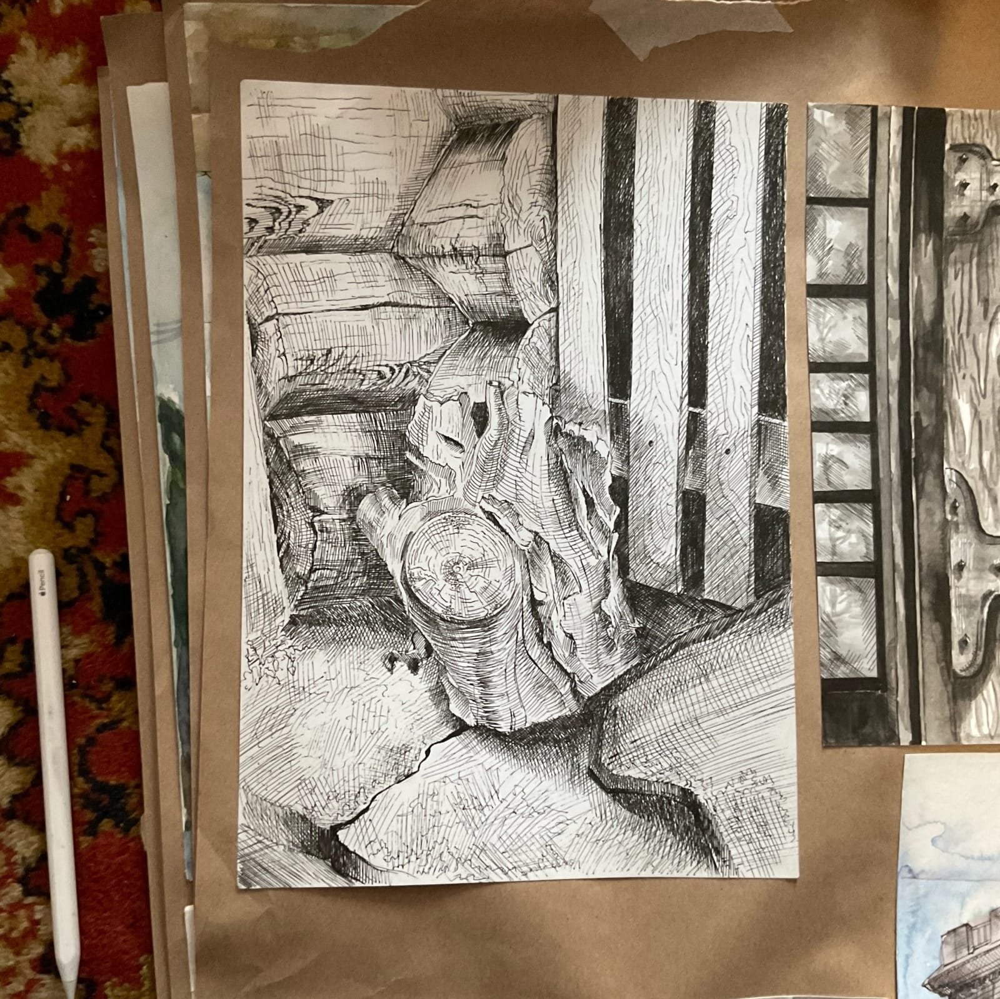

У дома, 2023. Черная ручка

<https://vk.com/albums-218867577?z=photo-218867577_457239205%2Fphotos-218867577>

Тип: Рисунок

История:  
- 2023: Выставлялась в ArtSpaceDepo

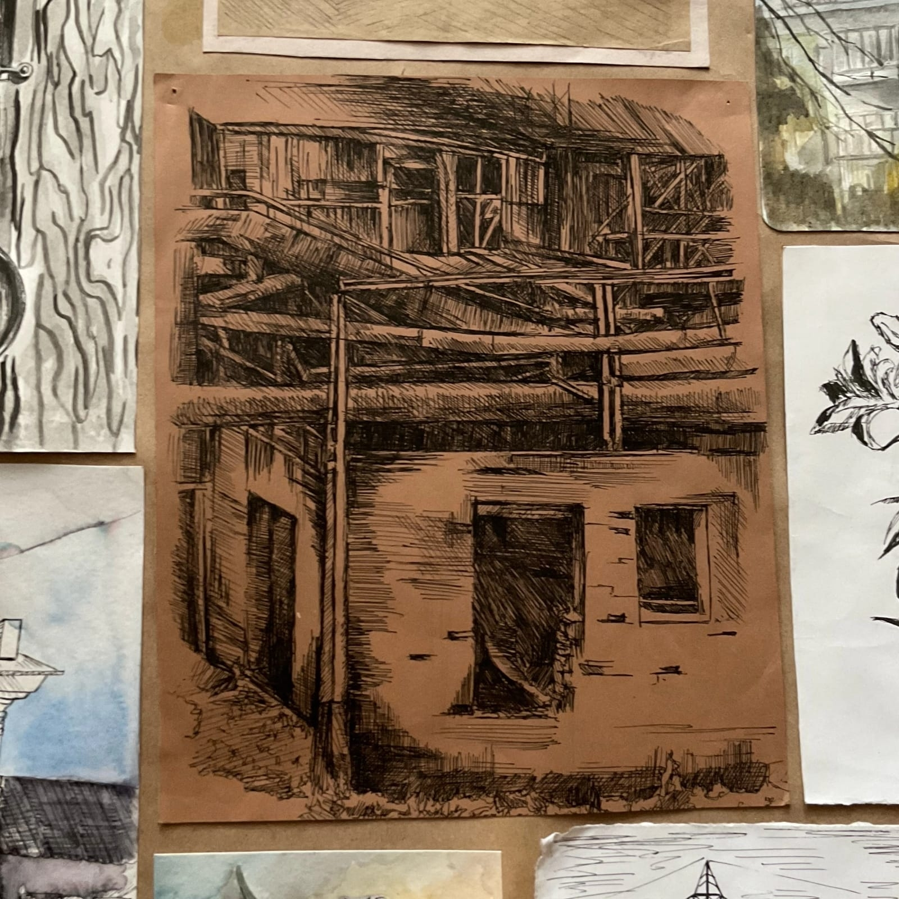

Старый завод, 2023. Черная ручка, А4

<https://vk.com/albums-218867577?z=photo-218867577_457239204%2Fphotos-218867577>

Тип: Рисунок  
Жанр: Архитектурный пейзаж

История:  
- 2023: Выставлялась в ArtSpaceDepo

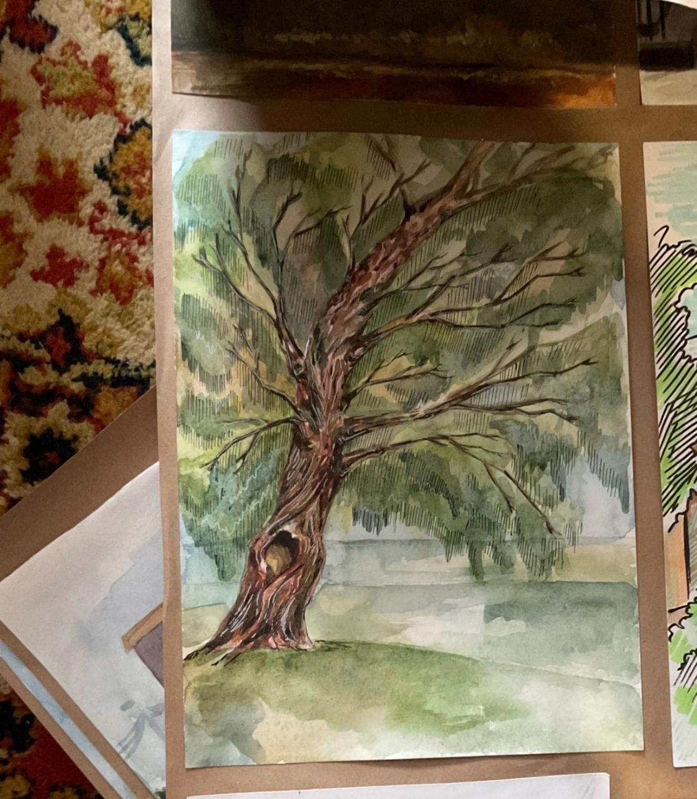

(Дерево), 2023. Акварель, белая ручка, А4

<https://vk.com/albums-218867577?z=photo-218867577_457239190%2Fphotos-218867577>

Тип: Картина  
Жанр: Пейзаж

История:  
- 2023: Выставлялась в ArtSpaceDepo

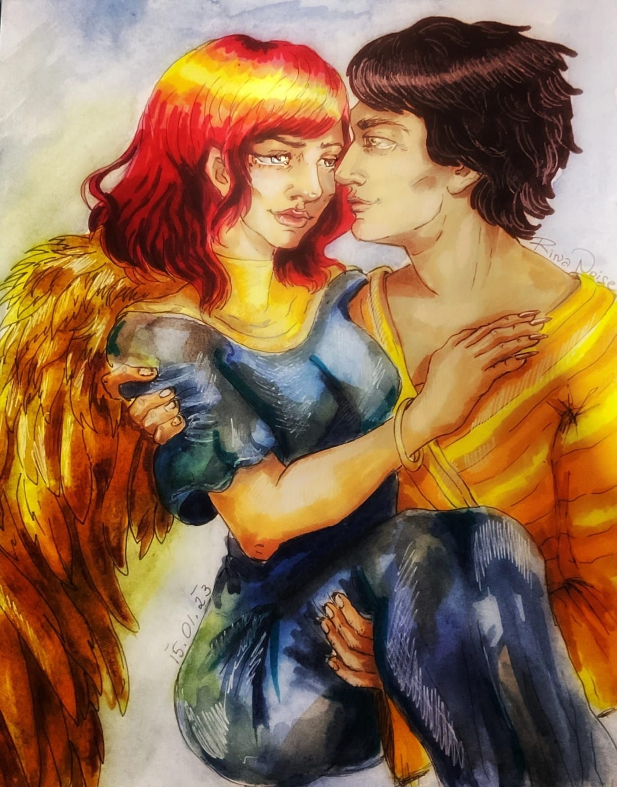

Два Влюбленных, 2023. Акварель, маркеры, белая ручка, А4

<https://vk.com/albums-218867577?z=photo-218867577_457239089%2Fphotos-218867577>

Тип: Картина

История:  
- 2023: Выставлялась в ArtSpaceDepo

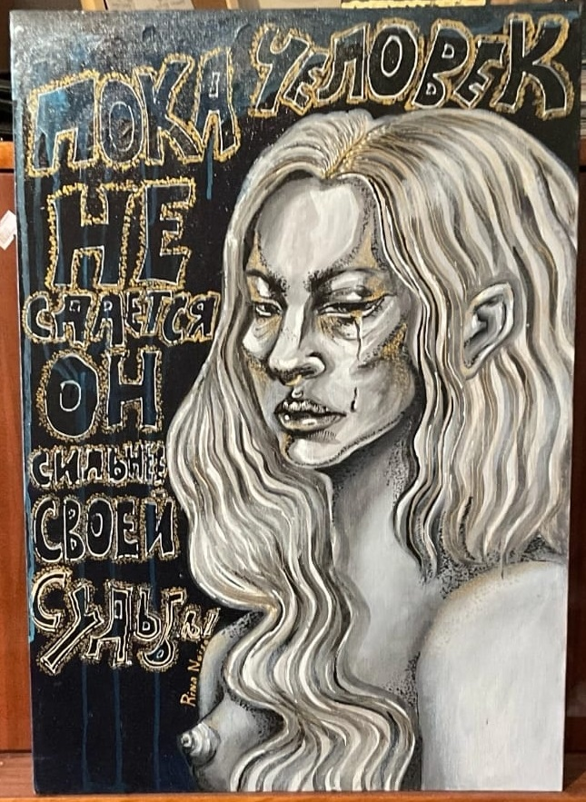

Сильнее судьбы, 2023. Холст без подрамника, акрил, контур, 35х50 см

<https://vk.com/albums-218867577?z=photo-218867577_457239085%2Fphotos-218867577>

Тип: Картина

История:  
- 2023: Выставлялась в ArtSpaceDepo

**Надпись**

*Содержание работы:* Пока человек не сдается / он сильнее своей судьбы

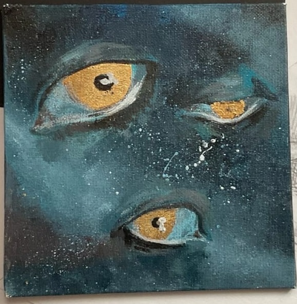

Взгляд вселенной, 2023. Акрил, поталь, 15х15 см

<https://vk.com/albums-218867577?z=photo-218867577_457239084%2Fphotos-218867577>

Тип: Картина

История:  
- 2023: Выставлялась в ArtSpaceDepo и была продана

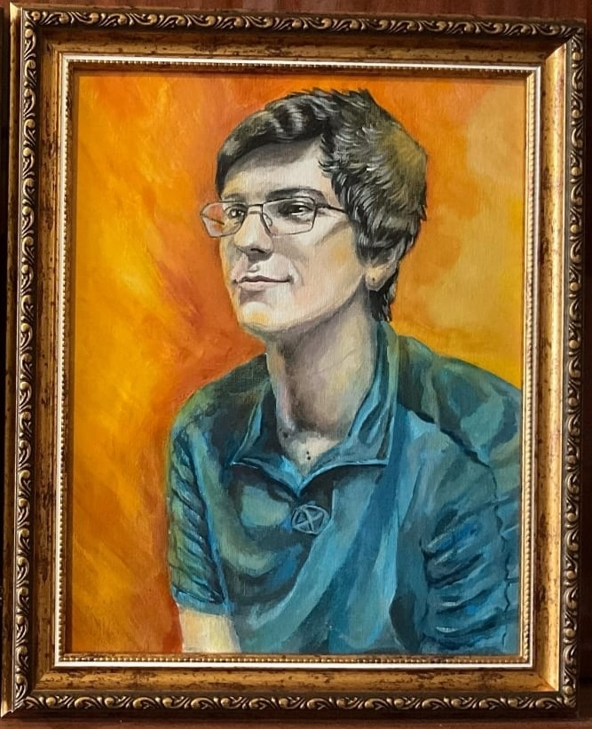

Возлюбленный, 2022. Холст в багете, А4

<https://vk.com/albums-218867577?z=photo-218867577_457239147%2Fphotos-218867577>

Тип: Картина  
Жанр: Портрет

История:  
- 2022: Участвовала в выставке [Выставка студенческих работ ФХО](https://vk.com/album-4891369_289481614); Место: Центральная библиотека г. Нижний Тагил
- 2023: Выставлялась в ArtSpaceDepo (не продавалась)
- 2024: Участвовала в выставке [Вдохновляйся! Действуй!](https://vk.com/wall-4891369_8180); Место: Дом художника

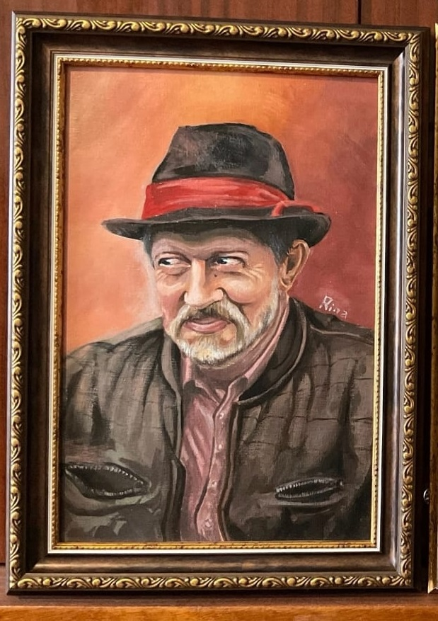

Учитель, 2022. Холст в багете, А4

<https://vk.com/albums-218867577?z=photo-218867577_457239147%2Fphotos-218867577>

Тип: Картина  
Жанр: Портрет

История:  
- 2022: Участвовала в выставке [Выставка студенческих работ ФХО](https://vk.com/album-4891369_289481614); Место: Центральная библиотека г. Нижний Тагил
- 2023: Выставлялась в ArtSpaceDepo (не продавалась)
- 2024: Участвовала в выставке [Вдохновляйся! Действуй!](https://vk.com/wall-4891369_8180); Место: Дом художника

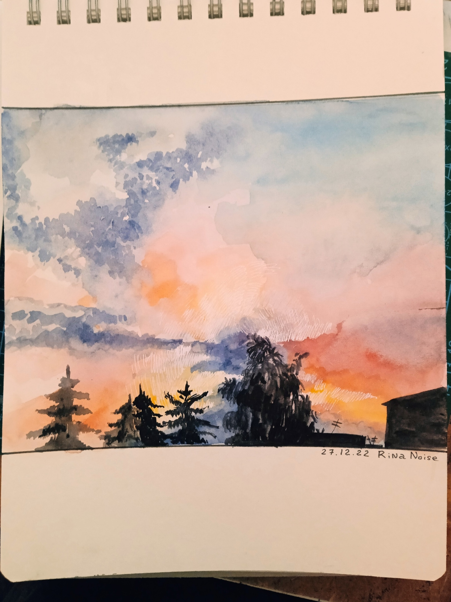

(Деревья на фоне неба), 2022

<https://vk.com/anarho_punk8grop?z=photo-79794560_457243097%2Fwall-79794560_6976>

Жанр: Пейзаж

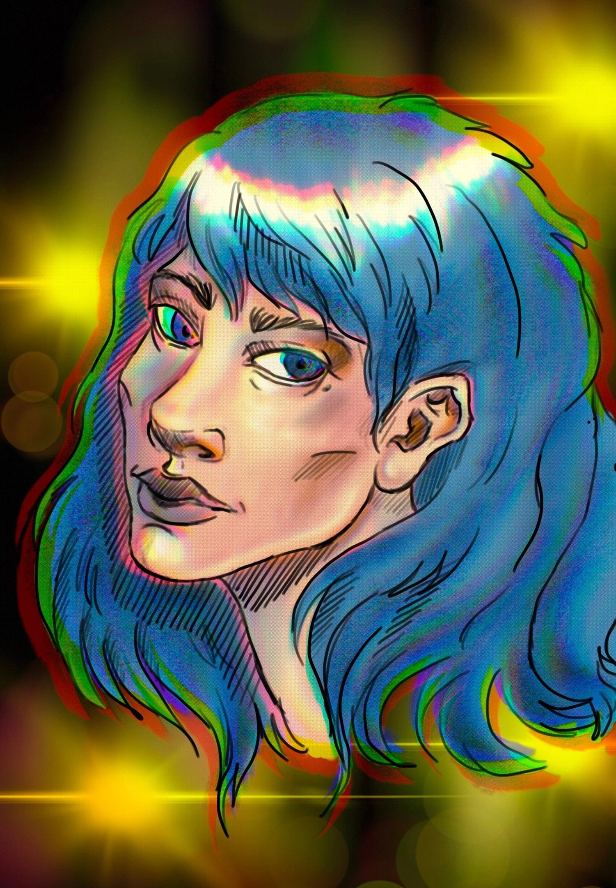

(Женщина с синими волосами), 2022. Цифровой рисунок

<https://vk.com/anarho_punk8grop?z=photo-79794560_457243089%2Fwall-79794560_6969>

Тип: Цифровой рисунок

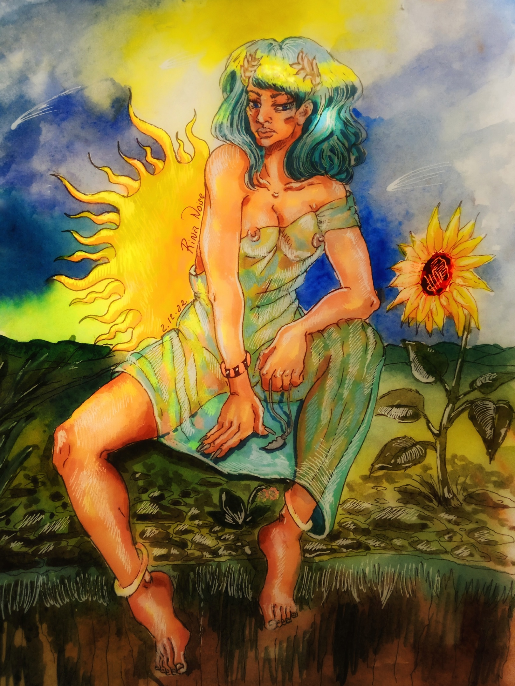

Нелёгкий путь, 2022

<https://vk.com/anarho_punk8grop?z=photo-79794560_457243086%2Fbd30159e8797cc6556>

Нелёгкий путь, самому стать для кого-то чем-то большим, чем просто звездой в небе...
Однако, несмотря на трудный путь, это все равно становится большим счастьем.

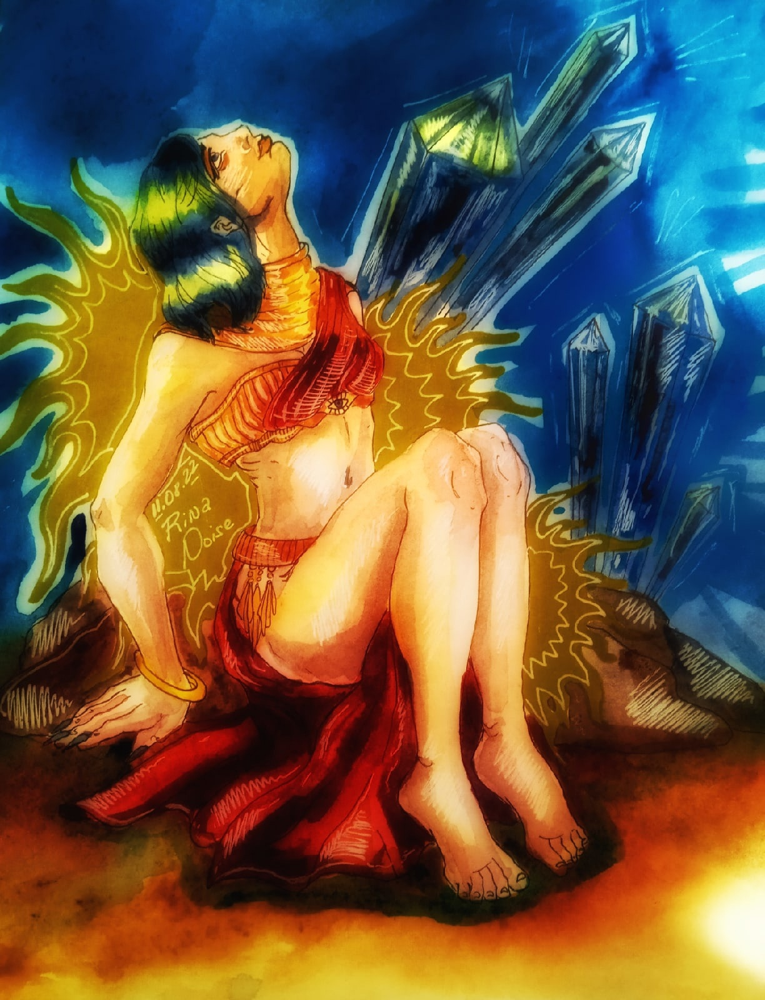

Надежда умирает последней, 2022

<https://vk.com/anarho_punk8grop?z=photo-79794560_457243020%2Ff0404e33066d3e20a8>

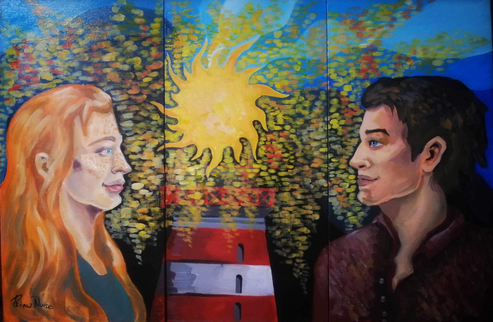

Дева солнца, 2022. Холст, акрил, А4

<https://vk.com/wall-79794560?offset=160&own=1&z=photo-79794560_457242995%2Fb8411333c6a8e1bb44>

Тип: Картина

От составителя: Картина триплекс. Первоначальное название: "Между нами пламя маяка".

История:  
- 2023: Выставлялась в ArtSpaceDepo

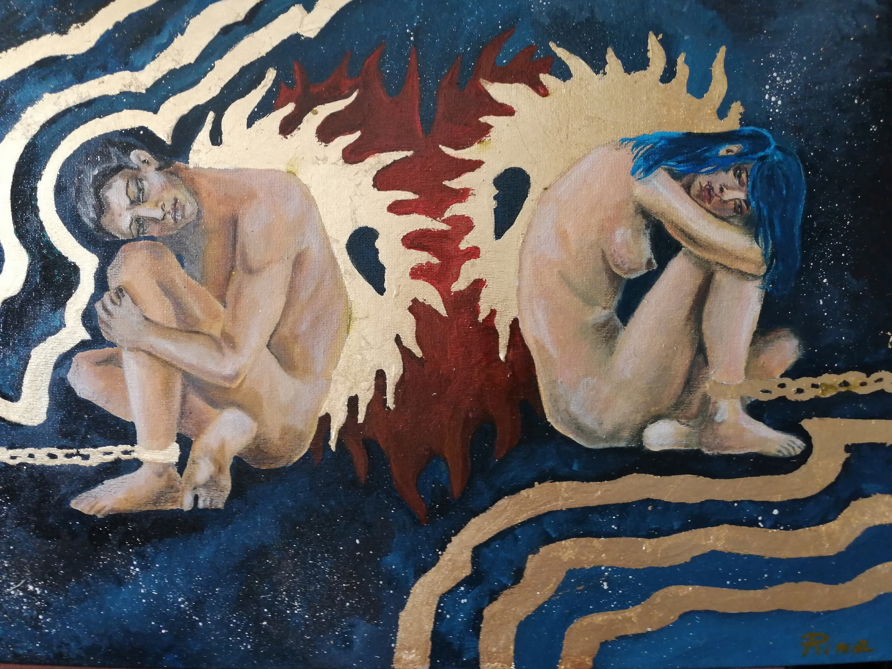

Скованные, 2022. Акрил, поталь, 35х50 см

<https://vk.com/wall-79794560?offset=160&own=1&z=photo-79794560_457242977%2F710ce06659795d5ac4>

Тип: Картина

История:  
- 2023: Выставлялась в ArtSpaceDepo
- 2024: Участвовала в выставке [Вдохновляйся! Действуй!](https://vk.com/wall-4891369_8180); Место: Дом художника

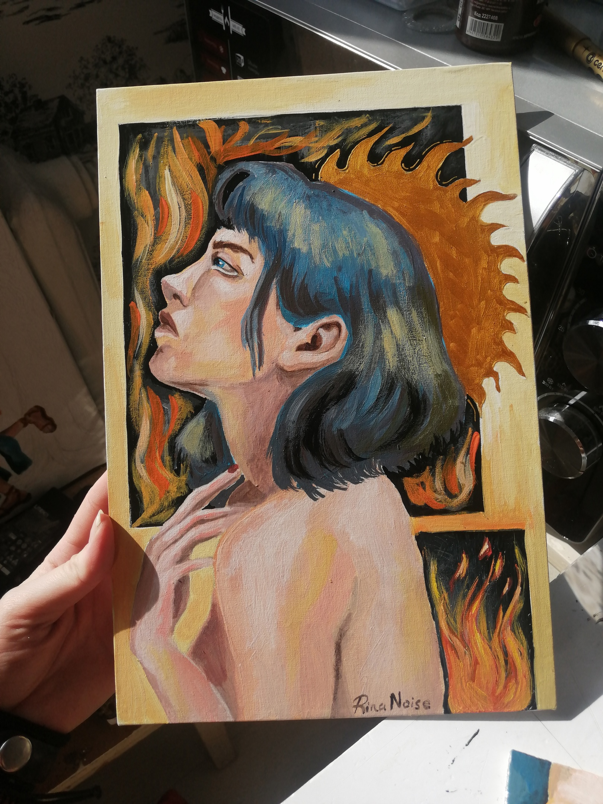

Дочь Солнца, 2022. Холст без подрамника, акрил, 21х30 см

<https://vk.com/wall-79794560?offset=160&own=1&z=photo-79794560_457242966%2Fa5146b2495f5cf8503>

Тип: Картина

История:  
- 2024: Участвовала в выставке [Вдохновляйся! Действуй!](https://vk.com/wall-4891369_8180); Место: Дом художника

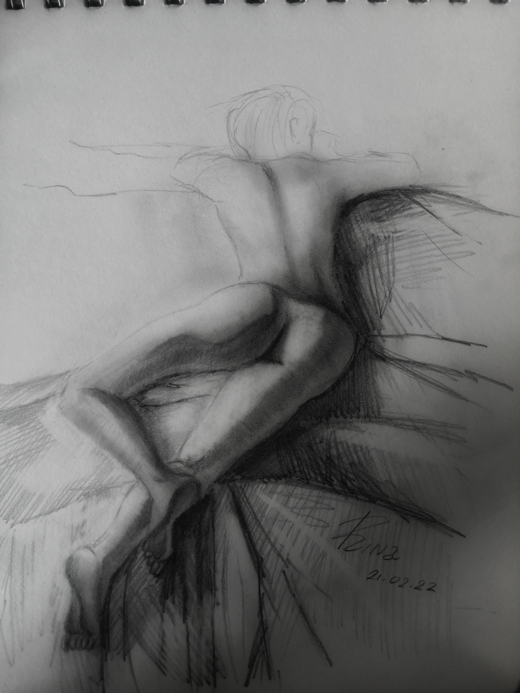

Усталость, 2022

<https://vk.com/wall-79794560?offset=160&own=1&z=photo-79794560_457242938%2F7037549ccea58e8be0>

Тип: Рисунок

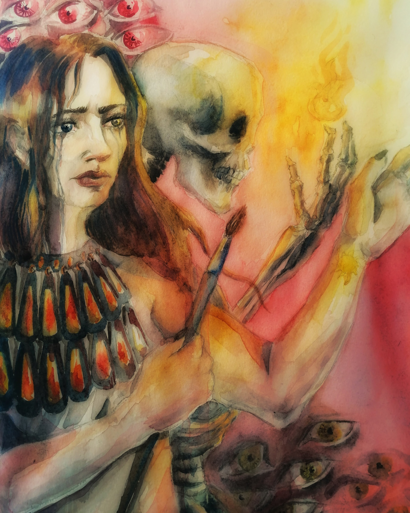

Скоротечность жизни, 2022. Бумага, акварель, 29.5х40 см

<https://vk.com/wall-79794560?offset=200&own=1&z=photo-79794560_457242923%2Fa53df018f7f9ed1374>

Тип: Картина

От составителя: Первоначальное название: "В глубине души".

История:  
- 2023: Выставлялась в ArtSpaceDepo

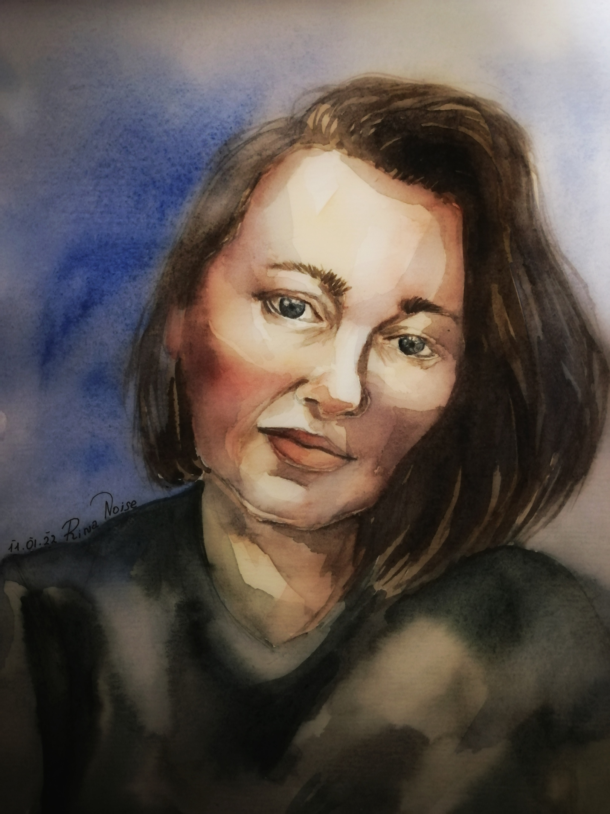

Портрет Натальи Запояско, 2022

<https://vk.com/wall-79794560?offset=200&own=1&z=photo-79794560_457242919%2Fwall-79794560_6816>

Жанр: Портрет

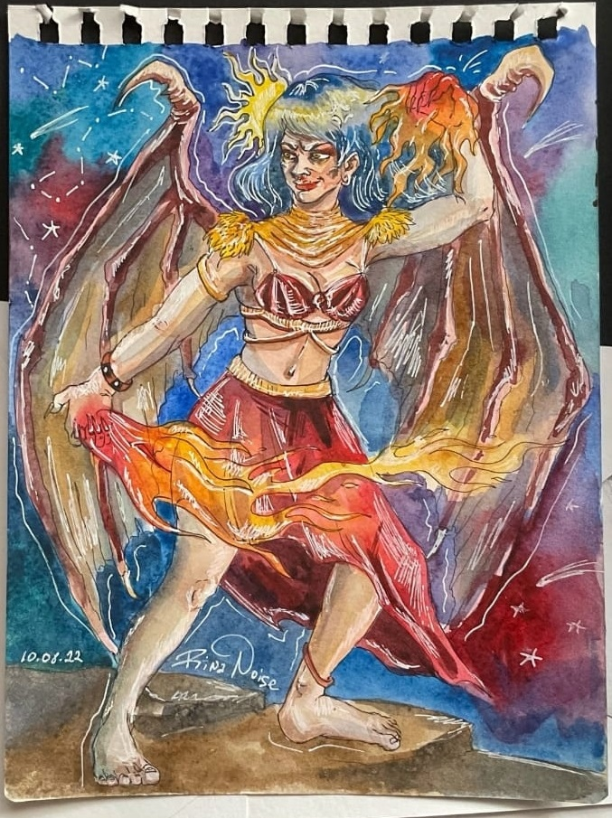

Агония, 2022. Акварель, белая ручка, А4

<https://vk.com/albums-218867577?z=photo-218867577_457239088%2Fphotos-218867577>

Тип: Картина

История:  
- 2023: Выставлялась в ArtSpaceDepo

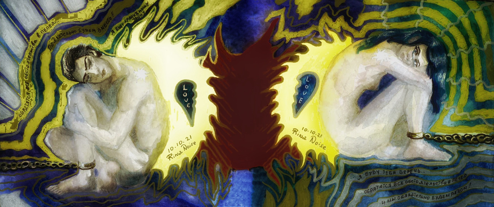

Два сердца, что удерживаются цепями обстоятельств, 2021

<https://vk.com/wall-79794560?offset=160&own=1&z=photo-79794560_457242975%2Fdb9d9264c2cca9a93b>

**Надпись**

*Содержание работы:* Обратятся все обстаятельства в пепел... Обязательно будем вместе! Я буду хранить нашу тайну
Love

Я буду тебя беречь... Обратятся все обстоятельства в пепел и мы обязательно будем рядом!

**Надпись**

*Подпись; Снизу в центре:* 10.10.21 Rina Noise

[В начало](rinasun.md) [Предыдущая](rinasun.md) *Страница 2 из 4* [Следующая](rinasun3.md) [В конец](rinasun4.md)

## См. также

- [Черновик биографии](bio.md)

