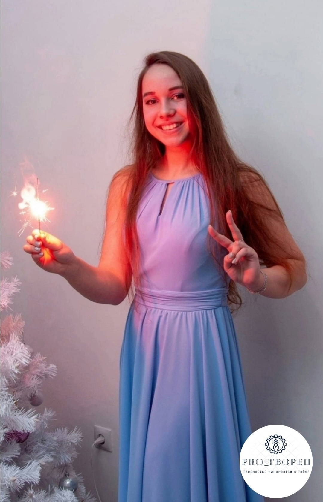

# Чуракова Виталина Вячеславовна

## Черновик биографии

Дата рождения: Сентябрь 2004  
Место рождения: Нижний Тагил  
Страница в интернете: <https://vk.com/club224151515>  
Страница на You Do: <https://nizhnij-tagil.youdo.com/m13094685>

Училась в МБОУ СОШ № 44. Уже в школе показывала выдающиеся способности к рисованию и музыке, участвовала в нескольких конкурсах.

- 2017 - Выставка-конкурс [Красота природы](https://m.ok.ru/group/51975271874744/topic/67203250351032), художественная студия "Цветные сны" (рисунки животных)
- 2019 - Премия 2 степени в международном музыкальном конкурсе TOP MUSIC, песня «Я летаю» (<https://vk.com/topic-21960412_39799884>)
- Февраль 2022 - участие в конкурсе "Любимый сюжет", рисунок к произведению Милены Завойчинской «Высшая школа библиотекарей. Хроники книгоходцев» (<https://vk.com/wall-153734812_1479>)
- Апрель 2022 - 1 место в конкурсе рисунка [Домовой воробей - птица года 2022](https://рекачусовая.рф/articles/post/itogi-konkursa-risunka-domovoj-vorobej-ptica-goda-2022-1), работа «Спасем воробьев!»
- Май 2022 - Специальный приз конкурса [Самый лучший город на земле](https://turizmnt.ru/news/34849/) в креативном кластере «Samoro.doc»

В 2022 г. поступила на ФХО НТГСПИ (Изобразительное искусство и дизайн).

2023 - Исполняла обязанности заместителя студенческого декана на ФХО. Была главным художником творческого объединения PRO_Творец (https://vk.com/wall-216487547_116), где она занималась рисованием плакатов для праздников и мероприятий. Вот как ее охарактеризовали в группе объединения:

> Плакаты, фотозоны, и необычный взгляд на мир - её конёк! Раскрасит как плакат, так и вашу жизнь. Наполняет объединение самыми яркими красками!
> 
> Виталина отзывчивая и добрая, придет на помощь с лучшей идеей к любому мероприятию. А еще, может выступить на сцене в роли ведущей или актера!
> 
> Озаряйте мир своей улыбкой также, как Виталина [...]

Январь 2023 - I место в номинации «Живопись» конкурса-выставки учебно-творческих работ студентов ФХО (https://old.ntspi.ru/about_academy/academy_news/70012/)

Летом 2023 ездила на пленэрную практику в поселок Баранчинский с Анастасией Арнаутовой и другими одногруппницами. Подробнее эта поездка описана в [разделе об Анастасии](../arnaut/bio.html).

В 2023 и в 2024 участвовала в конкурсе учебно-творческих работ студентов [Искусство реальности](https://vk.com/wall-4891369_7515). Это всероссийский конкурс, организуемый НТГСПИ, в котором участвуют студенты различных учебных заведений. Результаты:

2023

- Диплом участника в номинации "Живопись. Натюрморт. Пейзаж" (работа *На закате*)
- Диплом участника в номинации "Уникальная графика. Натюрморт" (работа *Gloriam mosaic*)

2024

- Диплом участника в номинации "Живопись. Натюрморт" (работа *Череп в снегу*)
- Диплом участника в номинации "Уникальная графика" (работа *Проекция*)
- 3 место в номинации "ДПИ. Стекло" (работа *Тукан*)
- Диплом участника в номинации "Вокальное искусство"
- Диплом I степени в номинации "Ассоциативная живопись"

Согласно отчету НТГСПИ, также участвовала в выставке лучших студенческих работ за период сентябрь - декабрь 2023.

Январь 2024 - Позировала в качестве модели для фотосессии Ангелины Новоположской в японском стиле (https://vk.com/wall-216017454?offset=0&w=wall-216017454_101). Эти фотографии в марте Ангелина представила на выставке [Не художник, а творец](https://vk.com/fho_tho?w=wall-4891369_8055).

Из видео Ангелины (<https://www.youtube.com/watch?v=PcvPEKJ9z7I&t=25s>):

> В воскресенье произошла долгожданная фотосессия, как для меня, так и для моей подруги Виталины. Мы задумывали ее еще с осени, настолько все капитально было построено. Я невероятно счастлива, что это произошло. На днях уже начала с воскресенья, как мы отсняли, отбирать фотографии и редактировать их, хочется подойти к этому как-то по особенному, смаковать этот момент; опыт, который мы получили, он бесценен, конечно [Смеется].
> 
> Вся задумка заключалась именно в красном кимоно, атмосфере вот этого Китая - Японии, да, на фоне белого снега. Еще было бы идеально, если бы пошел снегопад, но нам как всегда повезло с погодой, это просто... [Показывает палец вверх] Вместо нулевых градусов, то есть мы думали, что будет безумно тепло, подбирали день. В итоге минус 6 с ветром, да плюсом мы еще снимали около пруда. К сожалению, самого процесса съемки я не смогла заснять, потому что мы очень торопились, чтобы не замерзнуть. Виталина, как настоящий герой и морж [Смеется] фотографировалась в полную силу, все что нужно было, я безумно этому счастлива, что у нас получилось воплотить эту идею. Поэтому там надо было видеть, как мы по сугробам прыгали, особенно я. Я вся тоже извалялась, я вся была мокрая, у меня вообще тоже уже начали стучать зубы от холода, у Виталины тем более...

Февраль 2024 - Участвовала в выставке-конкурсе [Арт-Дуэль](https://uole-museum.ru/smiabout/art-duel-v-kraevedcheskom-muzee-informatsionno-prosvetitelskaya-gazeta-vremya/) в Екатеринбурге. На подведение итогов в Екатеринбург Виталина, видимо, не ездила. На конкурс были выставлены ее графические работы, какие именно - неизвестно. Подробнее см. в [разделе об Анастасии Арнаутовой](../arnaut/bio.html).

Июнь 2025 - Поездка в Санкт-Петербург, посетила Эрмитаж, Михайловский оперный театр (https://vk.com/id384086272?w=wall384086272_226)

Август 2025 - Работы Виталины были выставлены в фойе Нижнетагильского Драматического Театра (https://vk.com/tagildrama?w=wall-1766548_52565)

Февраль 2026 - Выступала на Всероссийской научно-практической конференция «Наука – Творчество – Образование» с докладом на тему мозаики (<https://vk.com/fho_tho?w=wall-4891369_8971>)

Апрель 2026 - Участвовала в выставке детского технического и декоративно-прикладного творчества детей и учащейся молодежи во Дворце детского и юношеского творчества. В [статье газеты "Тагильский рабочий"](https://tagilka.ru/116567-kover-mikrovolnovka-ili-kosmos.html) приводятся ее слова об обучении детей трехгранной резьбе по дереву:

> Сначала освоили теоретическую часть и познакомились с инструментами. Потом мальчики тренировались: с помощью резаков сделали ромбы, кружочки и квадраты. Подготовив эскизы, ребята вырезали фигурки лошадок, после чего нанесли акварель и ошкурили свои изделия.

Анна Франт, директор ArtSpaceDepo, положительно отзывалась о работах Виталины, называя ее "звездочкой".

**Интересы**

Помимо живописи, поет и играет на гитаре. В 2023 и в 2025 участвовала в театральном проекте «Точка опоры» (<https://vk.com/wall-119656322_1595>, <https://vk.com/proekt_teatr?w=wall-202306952_3283>). В 2023 году Виталина играет роль завуча в форуме-спектакле "Я НЕ ПОЙДУ БОЛЬШЕ В ЭТУ ШКОЛУ!", посвященном теме взаимоотношений подростков, родителей и школы.

Выступления:

- 28.09.2023 - Конкурс "Алло, мы ищем таланты", вокал, 1 место (https://vk.com/photo-4407886_457250964, https://vk.com/wall-4891369_7710)
- 04.11.2023 - Поздравление с Днём народного единства, вокал (https://vk.com/fsbznt?w=wall-4407886_5344)
- 09.01.2024 - Финальный концерт смены психолого-педагогических классов «Творцы будущего»: песня «Наше время пришло», вокал (https://vk.com/wall-18120153_5012)
- 02.09.2024 - Линейка на День знаний, вокал, в составе ансамбля «Новая нота» (https://vk.com/wall-18120153_5369)
- 27.02.2025 - Проект «Созвездие – 2025», вокал, в составе ансамбля «Новая нота» (https://vk.com/wall-18120153_5758)
- 25.04.2025 - Всероссийский молодежный форум «МИР» на СГФ НТГСПИ: песня «Прекрасное далеко», вокал, в составе ансамбля «Новая нота» (https://vk.com/wall-18120153_5918)
- 01.09.2025 - Линейка на День знаний, вокал, в составе ансамбля «Новая нота» (https://www.ntspi.ru/news/den-znanii-v-pervom-ucitelskom-v-niznem-tagile-pedagogiceskii-most-institut-skola)

**Публикации**

1. Статья [МЕТОДИКА ВЫПОЛНЕНИЯ УЧЕБНЫХ ЗАДАНИЙ ПО ДИСЦИПЛИНЕ "ТЕХНОЛОГИИ ЖИВОПИСНЫХ МАТЕРИАЛОВ. МОЗАИКА"](https://www.elibrary.ru/item.asp?id=64001227). [Художественное образование: история и современность. Материалы IV Всероссийской научно-практической конференции.](https://art-inschool.ru/sites/default/files/hudozhestvennoe_obrazovanie.pdf) Екатеринбург, 2024. – С. 131-136. Соавтор: Мартыненко В.Г.
2. Статья [ОСОБЕННОСТИ ВЫПУСКНЫХ КВАЛИФИКАЦИОННЫХ РАБОТ В ТЕХНИКЕ ОЛОВЯННОЕ ЛИТЬЕ](https://kpfu.ru/staff_files/F_2048322175/Pedagogicheskij_vestnik._Vypusk_39.pdf). Педагогический вестник. Новосибирск-Ялта: Изд. АНС «СибАК», 2025. – Вып. 39. Соавторы: Гольденберг О.А., Толкачев И.Б.
3. Статья [МЕТОД КОПИРОВАНИЯ В ОСВОЕНИИ МОНУМЕНТАЛЬНОЙ ЖИВОПИСИ СТУДЕНТАМИ](https://cyberleninka.ru/article/n/metod-kopirovaniya-v-osvoenii-monumentalnoy-zhivopisi-studentami). Педагогический вестник. Новосибирск-Ялта: Изд. АНС «СибАК», 2025. – Вып. 39. Соавтор: Гольденберг О.А.
4. Статья [МЕТОДИКА ВЫПОЛНЕНИЯ ВИЗАНТИЙСКОЙ МОЗАИКИ СТУДЕНТАМИ ФАКУЛЬТЕТА ХУДОЖЕСТВЕННОГО ОБРАЗОВАНИЯ](https://www.elibrary.ru/item.asp?id=82432003). [Гуманитарный научный журнал.](https://hsjournal.ru/n5-2025/) 2025. – № 5-1. С. 469-478. Соавтор: Гольденберг О.А.

В статье №1 есть забавный недочет: в английском названии слово "Мозаика" переведено как "Stuttering", т.е. "Заикание". Зато в ней раскрываются интересные подробности истории ФХО:

> За годы существования факультета мозаики, фрески, витражи не раз появлялись в качестве курсовых и дипломных проектов. Появлялись и исчезали, поскольку  выполнялись  
> из «суррогатных  материалов» (имитаций). Вуз не мог позволить себе использовать в учебном процессе необходимые для этого материалы в силу их дороговизны. 
> Настенные росписи курсовых работ выполнялись масляными красками, а любой специалист по монументальному искусству знает, что масло со стеной несовместимы. 
> Витражное цветное стекло в советский период подменяли краской на лаке. Мозаики выполнялись подкрашенным гипсом, в ход пускались и осенние листья. О смальте для 
> мозаики не смели даже мечтать. Время изменилось. Сегодня никого не удивляет применение в студенческих композициях профессиональных материалов. А использование 
> суррогатных считается признаком дурного тона.
> 
> В настоящее время  материалы  и  инструментарий появились в свободной продаже, стали доступнее. Широкий ассортимент мозаичных материалов зарубежного производства, 
> имеющийся в наличии на полках супермаркетов, не носит случайный характер. А является скорее следствием деятельности Международной ассоциации современных мозаичистов, 
> в которую входит Россия, с центром в Санкт-Петербурге.

Статья о копировании (№3) хорошо раскрывает тему и написана грамотно, без орфографических ошибок, но есть незначительные замечания по содержанию и стилю. Например, авторы пишут о копировании работ в изобразительном искусстве, но затем перескакивают на плагиат при копировании текстов: "Чтобы избежать плагиата, важно не просто переписывать текст, а глубоко понимать суть оригинала." Также присутствует излишняя для научного стиля парцелляция: "... А.В. Андреева, отмечает. Что копирование работ мастеров...". В статье отмечается проблема интеллектуальной собственности при копировании работ. Но сама Виталина, похоже, не очень заботится об этом, так как часть ее работ является копиями чужих произведений с pinterest или сайтов онлайн-галерей, но при публикации в своей группе она не приводила ссылку на оригинал. На pinterest, впрочем, изображения выкладываются специально как идеи для других работ, так что это может и не очень важно. Так или иначе, Виталина делом доказала, что не зря выступила соавтором этой статьи, так как ее копии картин Боттичелли понравились зрителям, а "Мадонна с младенцем" стала лицом выставки "Учимся у мастеров".

Источники:

- https://vk.com/club224151515
- https://m.ok.ru/group/51975271874744/topic/67203250351032
- https://tribuna-urala.ru/?module=articles&action=view&id=19168
- https://lit-country.1sept.ru/chitatel-80071
- https://нт.66.мвд.рф/управление/общественный-совет/общественный-совет-в-сми/новости-общественного-совета/item/30386618

*Составление каталога начато 01.06.2025. Радует, что на этот раз у почти каждой картины есть название и выходные данные. Выглядит так, будто я составляю каталог работ состоявшейся художницы, а не непонятное нечто.*
