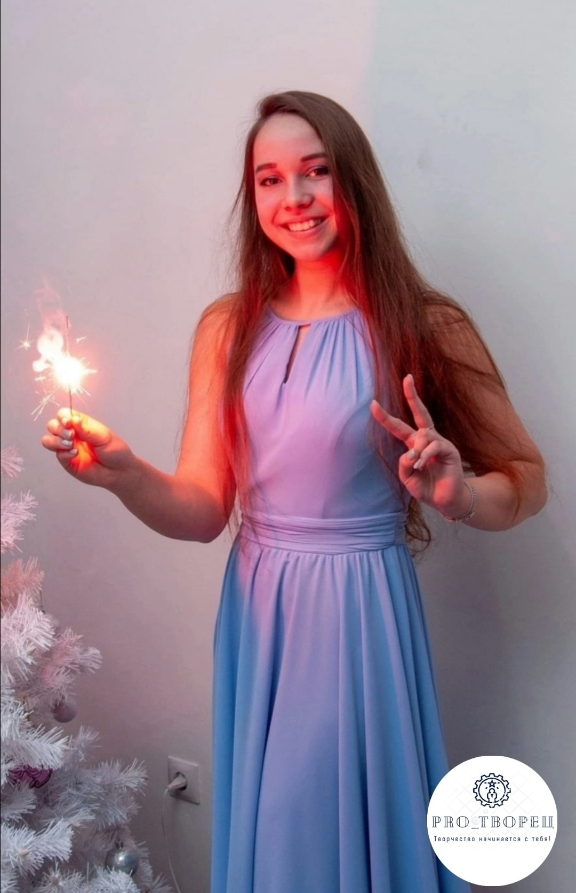

# Чуракова Виталина Вячеславовна

## Краткая биография

Дата рождения: Сентябрь 2004  
Место рождения: Нижний Тагил  
Страница в интернете: https://vk.com/club224151515  
Страница на You Do: https://nizhnij-tagil.youdo.com/m13094685

Училась в МБОУ СОШ № 44, в 2022 г. поступила на ФХО НТГСПИ (Изобразительное искусство и дизайн).

2022 - 1 место в конкурсе рисунка «Домовой воробей - птица года 2022», работа «Спасем воробьев!» (https://рекачусовая.рф/articles/post/itogi-konkursa-risunka-domovoj-vorobej-ptica-goda-2022-1)

2023 - исполняла обязанности заместителя студенческого декана на ФХО.

Январь 2023 - I место в номинации «Живопись» конкурса-выставки учебно-творческих работ студентов ФХО (https://www.ntspi.ru/about_academy/academy_news/70012/)

Анна Франт, директор ArtSpaceDepo, положительно отзывалась о работах Виталины, называя ее "звездочкой".

**Интересы**

Помимо живописи, поет и играет на гитаре. В 2023 и в 2025 участвовала в театральном проекте «Точка опоры» (https://vk.com/proekt_teatr?w=wall-202306952_3283).

Выступления:

- 28.09.2023 - Конкурс "Алло, мы ищем таланты", вокал, 1 место (https://vk.com/photo-4407886_457250964, https://vk.com/wall-4891369_7710)
- 04.11.2023 - Поздравление с Днём народного единства, вокал (https://vk.com/fsbznt?w=wall-4407886_5344)
- 09.01.2024 - Финальный концерт смены психолого-педагогических классов «Творцы будущего»: песня «Наше время пришло», вокал (https://vk.com/wall-18120153_5012)
- 02.09.2024 - Линейка на День знаний, вокал, в составе ансамбля «Новая нота» (https://vk.com/wall-18120153_5369)
- 27.02.2025 - Проект «Созвездие – 2025», вокал, в составе ансамбля «Новая нота» (https://vk.com/wall-18120153_5758)
- 25.04.2025 - Всероссийский молодежный форум «МИР» на СГФ НТГСПИ: песня «Прекрасное далеко», вокал, в составе ансамбля «Новая нота» (https://vk.com/wall-18120153_5918)
- 01.09.2025 - Линейка на День знаний, вокал, в составе ансамбля «Новая нота» (https://www.ntspi.ru/news/den-znanii-v-pervom-ucitelskom-v-niznem-tagile-pedagogiceskii-most-institut-skola)

**Публикации**

- Статья [МЕТОДИКА ВЫПОЛНЕНИЯ УЧЕБНЫХ ЗАДАНИЙ ПО ДИСЦИПЛИНЕ "ТЕХНОЛОГИИ ЖИВОПИСНЫХ МАТЕРИАЛОВ. МОЗАИКА"](https://www.elibrary.ru/item.asp?id=64001227). [Художественное образование: история и современность. Материалы IV Всероссийской научно-практической конференции.](https://art-inschool.ru/sites/default/files/hudozhestvennoe_obrazovanie.pdf) Екатеринбург, 2024. – С. 131-136. Соавтор: Мартыненко В.Г.
- Статья [ОСОБЕННОСТИ ВЫПУСКНЫХ КВАЛИФИКАЦИОННЫХ РАБОТ В ТЕХНИКЕ ОЛОВЯННОЕ ЛИТЬЕ](https://kpfu.ru/staff_files/F_2048322175/Pedagogicheskij_vestnik._Vypusk_39.pdf). Педагогический вестник. Новосибирск-Ялта: Изд. АНС «СибАК», 2025. – Вып. 39. Соавторы: Гольденберг О.А., Толкачев И.Б.
- Статья [МЕТОД КОПИРОВАНИЯ В ОСВОЕНИИ МОНУМЕНТАЛЬНОЙ ЖИВОПИСИ СТУДЕНТАМИ](https://cyberleninka.ru/article/n/metod-kopirovaniya-v-osvoenii-monumentalnoy-zhivopisi-studentami). Педагогический вестник. Новосибирск-Ялта: Изд. АНС «СибАК», 2025. – Вып. 39. Соавтор: Гольденберг О.А.
- Статья [МЕТОДИКА ВЫПОЛНЕНИЯ ВИЗАНТИЙСКОЙ МОЗАИКИ СТУДЕНТАМИ ФАКУЛЬТЕТА ХУДОЖЕСТВЕННОГО ОБРАЗОВАНИЯ](https://www.elibrary.ru/item.asp?id=82432003). [Гуманитарный научный журнал.](https://hsjournal.ru/n5-2025/) 2025. – № 5-1. С. 469-478. Соавтор: Гольденберг О.А.

Статья о копировании хорошо раскрывает тему и написана грамотно, без орфографических ошибок, но есть незначительные замечания по содержанию и стилю. Например, авторы пишут о копировании работ в изобразительном искусстве, но затем перескакивают на плагиат при копировании текстов: "Чтобы избежать плагиата, важно не просто переписывать текст, а глубоко понимать суть оригинала." Также присутствует излишняя для научного стиля парцелляция: "... А.В. Андреева, отмечает. Что копирование работ мастеров...". В статье отмечается проблема интеллектуальной собственности при копировании работ. Но сама Виталина, похоже, не очень заботится об этом, так как часть ее работ является копиями чужих произведений с pinterest или сайтов онлайн-галерей, но при публикации в своей группе она не приводила ссылку на оригинал. На pinterest, впрочем, изображения выкладываются специально как идеи для других работ, так что это может и не очень важно. Так или иначе, Виталина делом доказала, что не зря выступила соавтором этой статьи, так как ее копии картин Боттичелли понравились зрителям, а "Мадонна с младенцем" стала лицом выставки "Учимся у мастеров".

Источники:

- https://vk.com/club224151515
- https://m.ok.ru/group/51975271874744/topic/67203250351032
- https://turizmnt.ru/news/34849/
- https://tribuna-urala.ru/?module=articles&action=view&id=19168

*Составление каталога начато 01.06.2025. Радует, что на этот раз у почти каждой картины есть название и выходные данные. Выглядит так, будто я составляю каталог работ состоявшейся художницы, а не непонятное нечто.*
