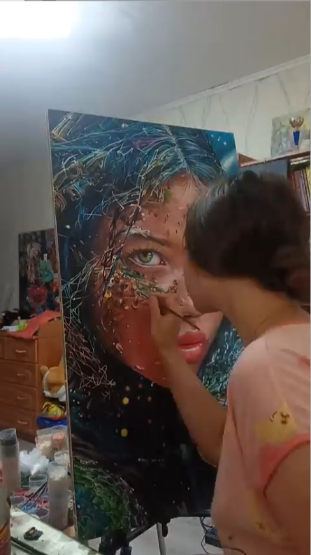

# Чуракова Виталина Вячеславовна

Дата рождения: Сентябрь 2004  
Место рождения: Нижний Тагил  
Страница в интернете: <https://vk.com/club224151515>  

## Каталог работ

Пылающий взлëт, 2025. Холст на картоне, акрил, 30×40 см

<https://vk.com/club224151515?from=groups&w=wall-224151515_70>

Оригинал: [Пылающий взлёт (kibart.ru)](https://kibart.ru/zhivopis-kartiny/giperrealizm-fotorealizm/kartina-pylayuschij-vzlyot_7677)

Зеркало души, 2025. Холст на картоне, акрил, 30×40 см

<https://vk.com/club224151515?from=groups&z=photo-224151515_457239119%2Fddf309973a3592276c>

(Девушка со змеей), 2025. Холст на картоне, акрил, 50×90 см

<https://vk.com/club224151515?from=groups&z=photo-224151515_457239113%2Fwall-224151515_53>

История:  
- 2025: [Заняла 1 место в конкурсе АРТ-БОМБА-Я](https://vk.com/arononoreschool?w=wall-186925653_69172)

Оригинал: [Девушка-змея (shedevrum.ai)](https://shedevrum.ai/post/3a1fc57a72d111ef948bc29ccd14b578/?utm_medium=organic&utm_source=yandexsmartcamera)

Котик, 2025. Холст на подрамнике, акрил, 30×40 см

<https://vk.com/club224151515?from=groups&z=photo-224151515_457239118%2F4036e5c1b6a8af21df>

От составителя: Написана на заказ

Тигр в воде, 2025. 30×40 см

<https://vk.com/club224151515?from=groups&z=photo-224151515_457239112%2F3f434a4f1408976491>

Пионы, 2025

<https://vk.com/id384086272?z=photo384086272_457243840%2F3880ea669a14e5f717>

Портрет Наталии Соничкиной, 2025. Бумага, уголь, Формат А2

<https://vk.com/club224151515?from=groups&z=photo-224151515_457239103%2Fwall-224151515_47>

От составителя: Написана на заказ

Портрет Сергея Зырянова, 2024. Бумага, уголь, Формат А2

<https://vk.com/club224151515?from=groups&z=photo-224151515_457239105%2Fwall-224151515_48>

От составителя: Написана на заказ

Портрет Василия Мещангина, 2024. Бумага, уголь, Формат А2

<https://vk.com/club224151515?from=groups&z=photo-224151515_457239101%2Fwall-224151515_46>

От составителя: Написана на заказ

Полуфигура, 2024. Бумага для пастели, уголь, мел, 50×60 см

<https://vk.com/club224151515?from=groups&z=photo-224151515_457239094%2F7e2c1cc564188c9d46>

Шарж на Владимира Лангольфа, 2024. Холст на картоне, акрил, 24×30 см

<https://vk.com/club224151515?from=groups&z=photo-224151515_457239091%2Fwall-224151515_40>

От составителя: Написана на заказ

Лис Мафиози, 2024. Холст на картоне, акрил, 40×60 см

<https://vk.com/club224151515?from=groups&z=photo-224151515_457239090%2F90c3dcf6019100beab>

От составителя: Написана на заказ

(Портрет женщины), 2024. Холст на картоне, акрил, 35×25 см

<https://vk.com/club224151515?from=groups&z=photo-224151515_457239084%2Fe391dcb185673480a9>

Интерес, 2024. Холст на картоне, акрил, 30×40 см

<https://vk.com/club224151515?from=groups&z=photo-224151515_457239070%2Fwall-224151515_37>

(Женщина в синем), 2024. Холст, акрил, поталь, 25×30 см

<https://vk.com/club224151515?from=groups&z=photo-224151515_457239066%2F124a3d05ab7c1330cd>

От составителя: Написана на заказ

Брутальный лис, 2024. Холст, акрил, 40×60 см

<https://vk.com/club224151515?from=groups&z=photo-224151515_457239062%2Fwall-224151515_31>

Счастье, 2024. Холст, масло, 30×30 см

<https://vk.com/club224151515?from=groups&z=photo-224151515_457239060%2F91b2b792fde06a9e1a>

От составителя: Является вариантом популярного тиражируемого сюжета "Рыжий кот с цветами", например: https://au.pinterest.com/pin/165648092538666347/

Белое чудо, 2024. Холст, акрил, 40×30 см

<https://vk.com/club224151515?from=groups&z=photo-224151515_457239057%2Fwall-224151515_29>

От составителя: Написана на заказ

Лисичка огненная, 2024. Холст, акрил, 35×45 см

<https://vk.com/club224151515?from=groups&z=photo-224151515_457239052%2Fwall-224151515_28>

Фрагментарная копия картины Сандро Боттичелли "Мадонна с младенцем", 2024. Византийская мозаика, смальта, 60×40 см

<https://vk.com/club224151515?from=groups&z=photo-224151515_457239048%2Fwall-224151515_24>

История:  
- 2025: Участвовала в выставке [Выставка учебно-творческих работ "Учимся у мастеров"](https://vk.com/fho_tho?w=wall-4891369_8448); Место: ФХО НТГСПИ

Оригинал: [Sandro Botticelli. The Virgin and Child](https://hvrd.art/o/230460); Harvard Art Museums; 1943.105

Копия картины Боттичелли "Портрет молодой женщины", 2024. Темпера, 40×30 см

<https://vk.com/wall-224151515?own=1&z=photo-224151515_457239038%2Fwall-224151515_16>

История:  
- 2025: Участвовала в выставке [Выставка учебно-творческих работ "Учимся у мастеров"](https://vk.com/fho_tho?w=wall-4891369_8448); Место: ФХО НТГСПИ

Оригинал: [Sandro Botticelli. Idealised Portrait of a Lady (Portrait of Simonetta Vespucci as Nymph)](https://sammlung.staedelmuseum.de/en/work/idealised-portrait-of-a-lady)

Ярмарка, 2024. Холст, масло, 100×75 см

<https://vk.com/wall-224151515?own=1&z=photo-224151515_457239044%2Fwall-224151515_23>

Волшебство, 2024. Холст, акрил, 30×40 см

<https://vk.com/wall-224151515?own=1&z=photo-224151515_457239043%2Fc29be5ed678cc4a969>

Лисëнок, 2024. Холст на картоне, акрил, 30×40 см

<https://vk.com/wall-224151515?own=1&z=photo-224151515_457239031%2Fwall-224151515_11>

Картина-коллаж, 2023. Бумага, акрил, 60×84 см

<https://vk.com/wall-224151515?own=1&z=photo-224151515_457239017%2F0b610f8df9611baf65>

Афиша к фильму "Битлджус", 2023. Бумага, акрил, Формат А4

<https://vk.com/wall-224151515?own=1&z=photo-224151515_457239036%2Fwall-224151515_14>

Натюрморт, 2023. Масло, 60×60 см

<https://vk.com/wall-224151515?own=1&z=photo-224151515_457239033%2Fwall-224151515_12>

Любопытство, 2023. Акрил, поталь, 30х30 см

<https://vk.com/wall-224151515?own=1&z=photo-224151515_457239024%2F0a132d4b3efc49bbf2>

История:  
- 2023: Выставлялась в ArtSpaceDepo (не продавалась)

Зайчик, 2023. Акрил, 60×85 см

<https://vk.com/wall-224151515?own=1&z=photo-224151515_457239020%2F9e74b094cabe302e3b>

Сиреневые сумерки, 2023. Холст, акрил, 40×40 см

<https://vk.com/albums-218867577?z=photo-218867577_457239481%2Fphotos-218867577>

История:  
- 2023: Выставлялась в ArtSpaceDepo

Фонарь желаний, 2023. Холст, акрил, 40×30 см

<https://vk.com/albums-218867577?z=photo-218867577_457239309%2Fphotos-218867577>

История:  
- 2023: Выставлялась в ArtSpaceDepo

На закате, 2023. Холст, акрил, 40×60 см

<https://vk.com/albums-218867577?z=photo-218867577_457239306%2Fphotos-218867577>

От составителя: Сюжет является уникальным; изображений звездного неба, соборов или закатных городских пейзажей с крышами в интернете навалом, а вот совмещающих все это одновременно найти не удалось. Изображенная постойка напоминает Исаакиевский Собор в Санкт-Петербурге, но окружение на картине не соответствует виду местности вокруг этого собора; он окружен пустым пространством площади, а не плотной застройкой домов с двускатными крышами. Созвездие в левом верхнем углу сложно сопоставить с каким-либо реальным созвездием, видимым на закате в восточной части неба. Похоже на фрагмент созвездия Геркулес, но его положение на небе несколько иное. Кроме того, на закате, когда солнце еще не скрылось за горизонтом, редко видны целые созвездия - обычно видны лишь наиболее яркие объекты, вроде Венеры или пояса Ориона. Поэтому изображение звездного неба здесь вряд ли реалистично. Зато жизненно переданы облака, заходящее солнце и внешний вид зданий. В некоторых облаках видятся силуэты лошадей, вряд ли это случайность. Сидящая на крыше героиня - видимо, художница; в лежащем рядом с нею листе угадывается этюд собора. Судя по цвету и длине волос, это может быть сама Виталина.

В целом работа представляется скорее "фантазией", чем реалистичной зарисовкой с натуры. В плане интерпретации, работа кажется близкой к картине "Странник над морем тумана" Каспара, основной темой можно назвать размышления о жизненном пути или "эстетское бегство от мира" (выражение Кирхмана о вышеупомянутой работе Каспара).

История:  
- 2023: Выставлялась в ArtSpaceDepo

Черноисточинск, 2023. Бумага, акрил

<https://vk.com/wall-4891369_7853?z=photo-4891369_457261469%2Fwall-4891369_7853>

История:  
- 2023: Участвовала в выставке [Выставка студенческих работ "60 мгновений лета"](https://vk.com/wall-4891369_7782); Место: ФХО НТГСПИ

Карьер, 2023. Бумага, акрил

<https://vk.com/wall-4891369_7853?z=photo-4891369_457261470%2Fwall-4891369_7853>

История:  
- 2023: Участвовала в выставке [Выставка студенческих работ "60 мгновений лета"](https://vk.com/wall-4891369_7782); Место: ФХО НТГСПИ

Блики на белом, 2023. Бумага, акрил

<https://vk.com/wall-4891369_7853?z=photo-4891369_457261472%2Fwall-4891369_7853>

История:  
- 2023: Участвовала в выставке [Выставка студенческих работ "60 мгновений лета"](https://vk.com/wall-4891369_7782); Место: ФХО НТГСПИ

Вдохновение, 2022. Картон, акрил, 21×30 см

<https://vk.com/wall-224151515?own=1&z=photo-224151515_457239023%2F4acc264039295932d7>

Виталина: "Работа участвовала во многих выставках и конкурсах и до сих пор она остался одной из моих самых любимых картин"

От составителя: Сюжет является уникальным; хоть в интернете и есть похожие поп-арт картины с кошкой и пузырями, но такой композиции со смотрящей вверх кошкой и бабочкой найти не удалось. Почему именно она у художницы является выражением вдохновения, неизвестно.

История:  
- 2022: Участвовала в выставке [Выставка студенческих работ ФХО](https://vk.com/photo-4891369_457257333); Место: Центральная библиотека г. Нижний Тагил
- 2023: Выставлялась в ArtSpaceDepo, было продано 2 копии этой картины (оригинал не продавался)

(Лебеди), 2017

<https://ok.ru/group/51975271874744/album/51975278362808/858835289016>

История:  
- 2017: Участвовала в выставке [Красота природы](https://m.ok.ru/group/51975271874744/topic/67203250351032); Место: Художественная студия «Цветные сны», г. Нижний Тагил

## Галерея

На концерте, 2021

На пленэре, 2023

С Анастасией Арнаутовой в Краснотурьинске, 2024

За работой, 2025

## См. также

- [Краткая биография](bio.md)

