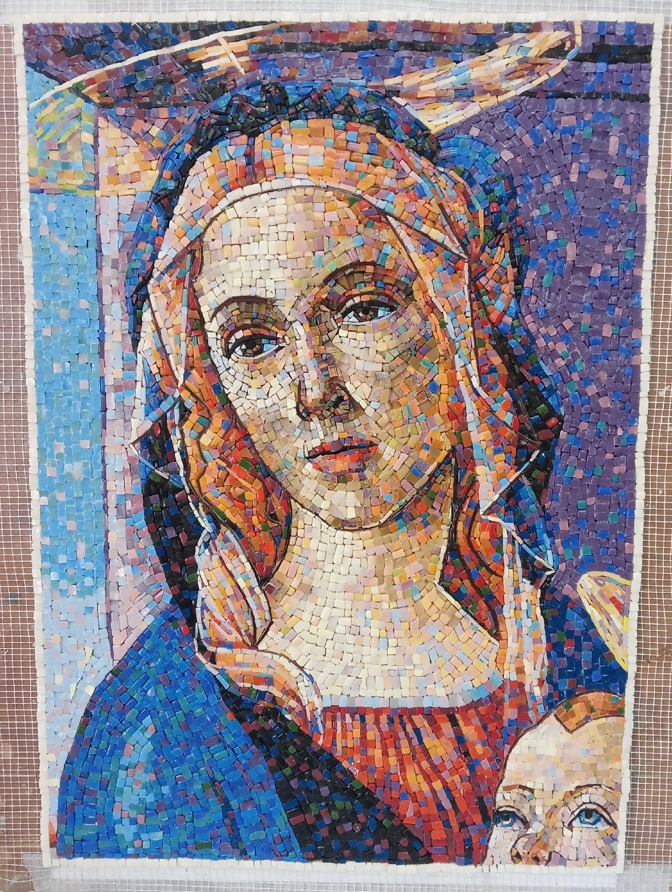
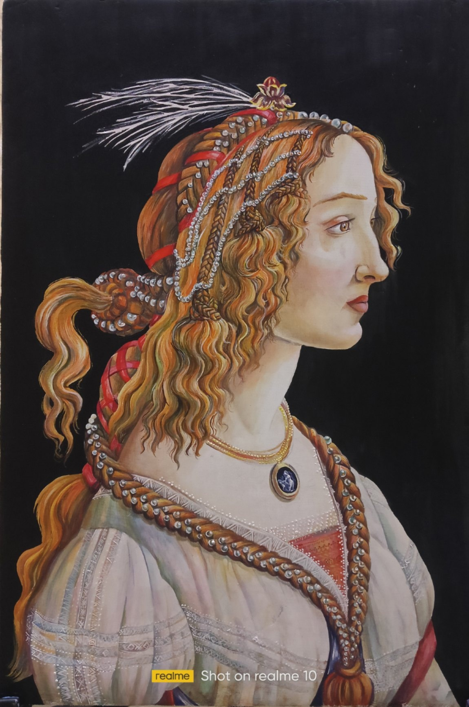
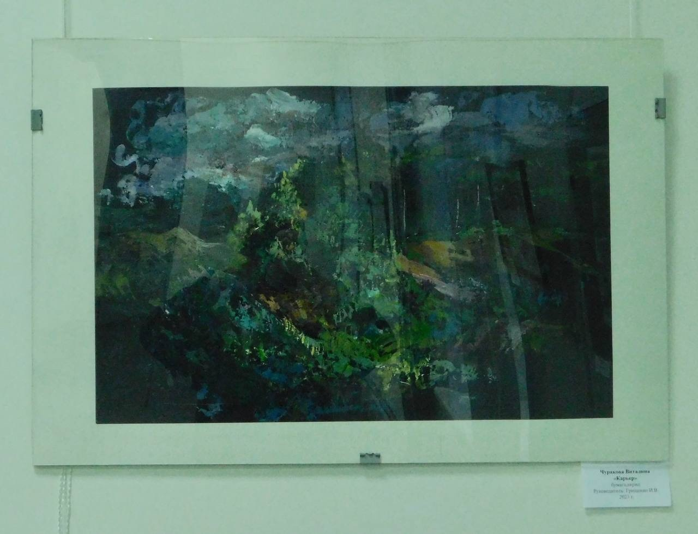
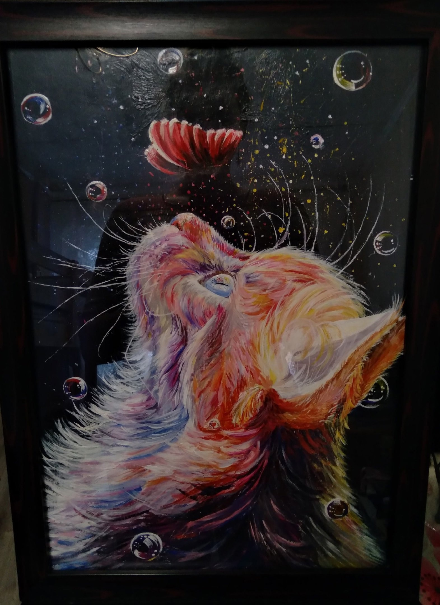

# Чуракова Виталина Вячеславовна

Дата рождения: Сентябрь 2004  
Место рождения: Нижний Тагил  
Страница ВКонтакте: [club224151515](https://vk.com/club224151515)  

## Каталог работ

[В начало](vitalina.md) [Предыдущая](vitalina.md) *Страница 2 из 2* 

Фрагментарная копия картины Сандро Боттичелли "Мадонна с младенцем", 2024. Византийская мозаика, смальта, 60×40 см

<https://vk.com/club224151515?from=groups&z=photo-224151515_457239048%2Fwall-224151515_24>

Тип: Мозаика

История:  
- 2025: Участвовала в выставке [Выставка учебно-творческих работ "Учимся у мастеров"](https://vk.com/fho_tho?w=wall-4891369_8448); Место: ФХО НТГСПИ

Оригинал: [Sandro Botticelli. The Virgin and Child](https://hvrd.art/o/230460); Harvard Art Museums; 1943.105

Копия картины Боттичелли "Портрет молодой женщины", 2024. Темпера, 40×30 см

<https://vk.com/wall-224151515?own=1&z=photo-224151515_457239038%2Fwall-224151515_16>

Тип: Картина

История:  
- 2025: Участвовала в выставке [Выставка учебно-творческих работ "Учимся у мастеров"](https://vk.com/fho_tho?w=wall-4891369_8448); Место: ФХО НТГСПИ

Оригинал: [Sandro Botticelli. Idealised Portrait of a Lady (Portrait of Simonetta Vespucci as Nymph)](https://sammlung.staedelmuseum.de/en/work/idealised-portrait-of-a-lady)

Ярмарка, 2024. Холст, масло, 100×75 см

<https://vk.com/wall-224151515?own=1&z=photo-224151515_457239044%2Fwall-224151515_23>

Тип: Картина

Волшебство, 2024. Холст, акрил, 30×40 см

<https://vk.com/wall-224151515?own=1&z=photo-224151515_457239043%2Fc29be5ed678cc4a969>

Тип: Картина

Лисëнок, 2024. Холст на картоне, акрил, 30×40 см

<https://vk.com/wall-224151515?own=1&z=photo-224151515_457239031%2Fwall-224151515_11>

Тип: Картина

Картина-коллаж, 2023. Бумага, акрил, 60×84 см

<https://vk.com/wall-224151515?own=1&z=photo-224151515_457239017%2F0b610f8df9611baf65>

Афиша к фильму "Битлджус", 2023. Бумага, акрил, Формат А4

<https://vk.com/wall-224151515?own=1&z=photo-224151515_457239036%2Fwall-224151515_14>

Натюрморт, 2023. Масло, 60×60 см

<https://vk.com/wall-224151515?own=1&z=photo-224151515_457239033%2Fwall-224151515_12>

Тип: Картина

Любопытство, 2023. Акрил, поталь, 30х30 см

<https://vk.com/wall-224151515?own=1&z=photo-224151515_457239024%2F0a132d4b3efc49bbf2>

Тип: Картина

История:  
- 2023: Выставлялась в ArtSpaceDepo (не продавалась)

Зайчик, 2023. Акрил, 60×85 см

<https://vk.com/wall-224151515?own=1&z=photo-224151515_457239020%2F9e74b094cabe302e3b>

Тип: Картина

Сиреневые сумерки, 2023. Холст, акрил, 40×40 см

<https://vk.com/albums-218867577?z=photo-218867577_457239481%2Fphotos-218867577>

Тип: Картина

История:  
- 2023: Выставлялась в ArtSpaceDepo

Фонарь желаний, 2023. Холст, акрил, 40×30 см

<https://vk.com/albums-218867577?z=photo-218867577_457239309%2Fphotos-218867577>

Тип: Картина

История:  
- 2023: Выставлялась в ArtSpaceDepo

На закате, 2023. Холст, акрил, 40×60 см

<https://vk.com/albums-218867577?z=photo-218867577_457239306%2Fphotos-218867577>

Тип: Картина

От составителя: Сюжет является уникальным; изображений звездного неба, соборов или закатных городских пейзажей с крышами в интернете навалом, а вот совмещающих все это одновременно найти не удалось. Изображенная постойка напоминает Исаакиевский Собор в Санкт-Петербурге, но окружение на картине не соответствует виду местности вокруг этого собора; он окружен пустым пространством площади, а не плотной застройкой домов с двускатными крышами. Созвездие в левом верхнем углу сложно сопоставить с каким-либо реальным созвездием, видимым на закате в восточной части неба. Похоже на фрагмент созвездия Геркулес, но его положение на небе несколько иное. Кроме того, на закате, когда солнце еще не скрылось за горизонтом, редко видны целые созвездия - обычно видны лишь наиболее яркие объекты, вроде Венеры или пояса Ориона. Поэтому изображение звездного неба здесь вряд ли реалистично. Зато жизненно переданы облака, заходящее солнце и внешний вид зданий. В некоторых облаках видятся силуэты лошадей, вряд ли это случайность. Сидящая на крыше героиня - видимо, художница; в лежащем рядом с нею листе угадывается этюд собора. Судя по цвету и длине волос, это может быть сама Виталина.

В целом работа представляется скорее "фантазией", чем реалистичной зарисовкой с натуры. В плане интерпретации, работа кажется близкой к картине "Странник над морем тумана" Каспара, основной темой можно назвать размышления о жизненном пути или "эстетское бегство от мира" (выражение Кирхмана о вышеупомянутой работе Каспара).

История:  
- 2023: Выставлялась в ArtSpaceDepo
- 2023: Участвовала в конкурсе [Искусство реальности](https://vk.com/wall-4891369_7515)

Черноисточинск, 2023. Бумага, акрил

<https://vk.com/wall-4891369_7853?z=photo-4891369_457261469%2Fwall-4891369_7853>

Тип: Картина

История:  
- 2023: Участвовала в выставке [Выставка студенческих работ "60 мгновений лета"](https://vk.com/wall-4891369_7782); Место: ФХО НТГСПИ

Карьер, 2023. Бумага, акрил

<https://vk.com/wall-4891369_7853?z=photo-4891369_457261470%2Fwall-4891369_7853>

Тип: Картина

История:  
- 2023: Участвовала в выставке [Выставка студенческих работ "60 мгновений лета"](https://vk.com/wall-4891369_7782); Место: ФХО НТГСПИ

Блики на белом, 2023. Бумага, акрил

<https://vk.com/wall-4891369_7853?z=photo-4891369_457261472%2Fwall-4891369_7853>

Тип: Картина

История:  
- 2023: Участвовала в выставке [Выставка студенческих работ "60 мгновений лета"](https://vk.com/wall-4891369_7782); Место: ФХО НТГСПИ

Тукан, 2023. Стекло

<https://disk.yandex.ru/i/VXklez3N33W_Sw>

Тип: Декоративное изделие

История:  
- 2024: [Заняла 3 место на II всероссийском конкурсе учебно-творческих работ студентов "Искусство реальности"](https://vk.com/wall-4891369_8045)

Вдохновение, 2022. Картон, акрил, 21×30 см

<https://vk.com/wall-224151515?own=1&z=photo-224151515_457239023%2F4acc264039295932d7>

Тип: Картина

Виталина: "Работа участвовала во многих выставках и конкурсах и до сих пор она остался одной из моих самых любимых картин"

От составителя: Сюжет является уникальным; хоть в интернете и есть похожие поп-арт картины с кошкой и пузырями, но такой композиции со смотрящей вверх кошкой и бабочкой найти не удалось. Почему именно она у художницы является выражением вдохновения, неизвестно.

История:  
- 2022: Участвовала в выставке [Выставка студенческих работ ФХО](https://vk.com/photo-4891369_457257333); Место: Центральная библиотека г. Нижний Тагил
- 2023: Выставлялась в ArtSpaceDepo, было продано 2 копии этой картины (оригинал не продавался)

(Лебеди), 2017

<https://ok.ru/group/51975271874744/album/51975278362808/858835289016>

История:  
- 2017: Участвовала в выставке [Красота природы](https://m.ok.ru/group/51975271874744/topic/67203250351032); Место: Художественная студия «Цветные сны», г. Нижний Тагил

[В начало](vitalina.md) [Предыдущая](vitalina.md) *Страница 2 из 2* 

## См. также

- [Черновик биографии](bio.md)

