# Чуракова Виталина Вячеславовна

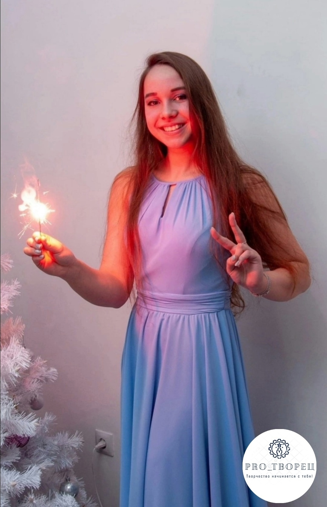

Дата рождения: Сентябрь 2004  
Место рождения: Нижний Тагил  
Страница ВКонтакте: [club224151515](https://vk.com/club224151515)  

## Каталог работ

[В начало](vitalina.md) [Предыдущая](vitalina.md) *Страница 2 из 2* 

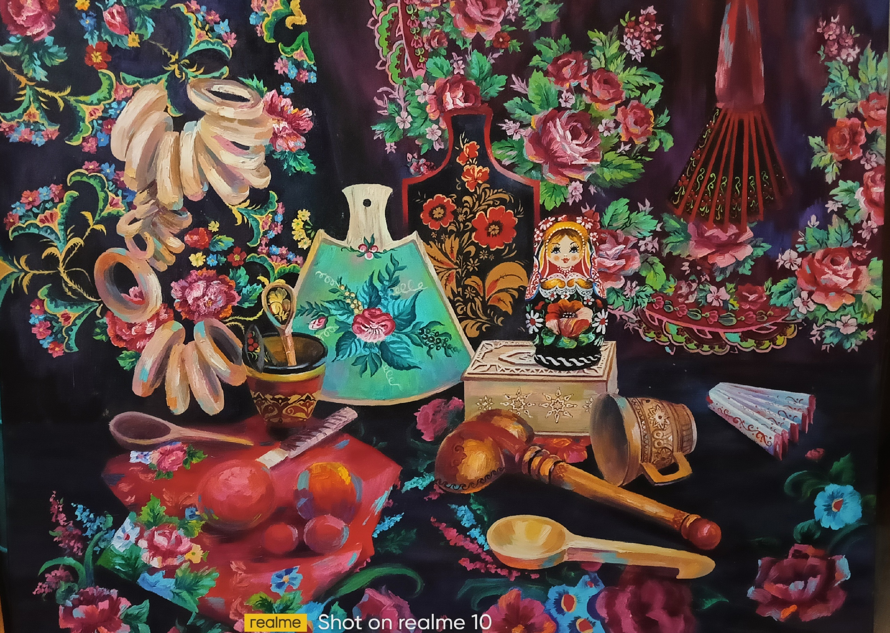

Ярмарка, 2024. Холст, масло, 100×75 см

<https://vk.com/wall-224151515?own=1&z=photo-224151515_457239044%2Fwall-224151515_23>

Тип: Картина  
Жанр: Натюрморт

От составителя: Вариант сюжета декоративного натюрморта, часто используемый на ФХО НТГСПИ при обучении живописи. От типичной студенческой работы (например https://vk.ru/wall-4891369_8754?z=photo-4891369_457267101%2Fwall-4891369_8754) работу Виталины отличает большая прорисованность деталей.

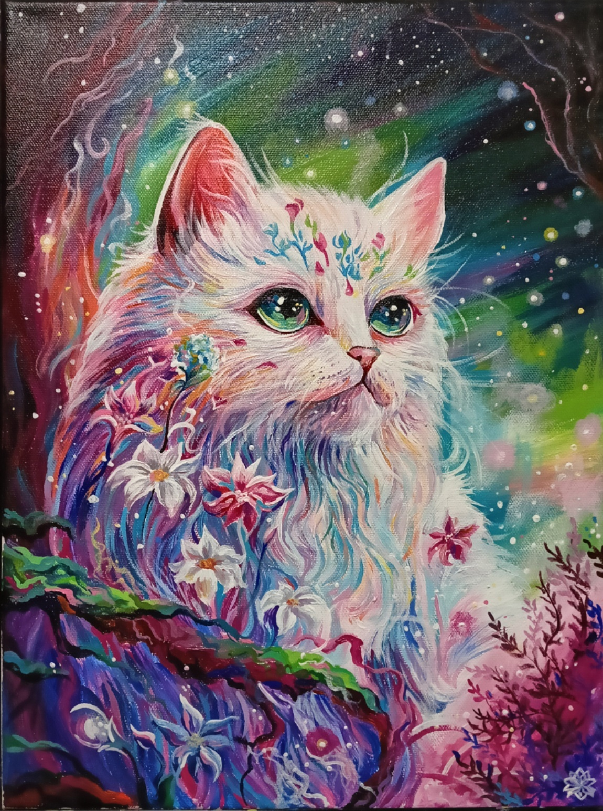

Волшебство, 2024. Холст, акрил, 30×40 см

<https://vk.com/wall-224151515?own=1&z=photo-224151515_457239043%2Fc29be5ed678cc4a969>

Тип: Картина  
Жанр: Анималистика

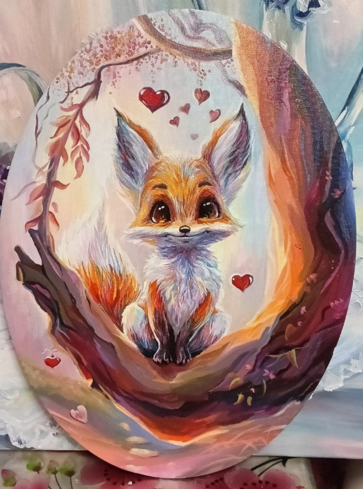

Лисëнок, 2024. Холст на картоне, акрил, 30×40 см

<https://vk.com/wall-224151515?own=1&z=photo-224151515_457239031%2Fwall-224151515_11>

Тип: Картина  
Жанр: Анималистика

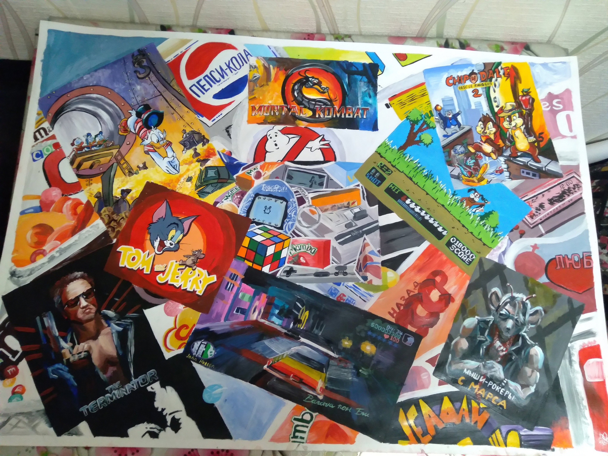

Картина-коллаж, 2023. Бумага, акрил, 60×84 см

<https://vk.com/wall-224151515?own=1&z=photo-224151515_457239017%2F0b610f8df9611baf65>

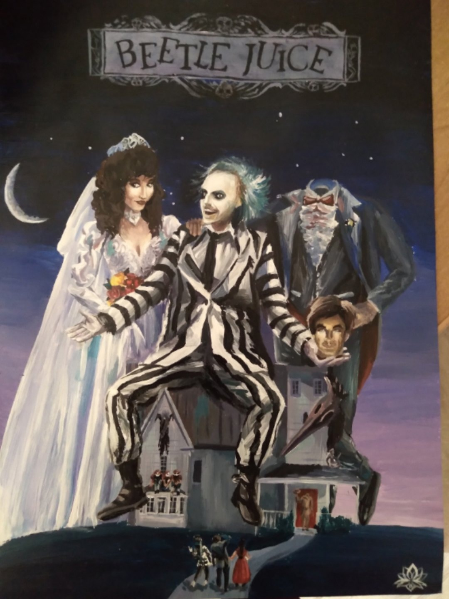

Афиша к фильму "Битлджус", 2023. Бумага, акрил, Формат А4

<https://vk.com/wall-224151515?own=1&z=photo-224151515_457239036%2Fwall-224151515_14>

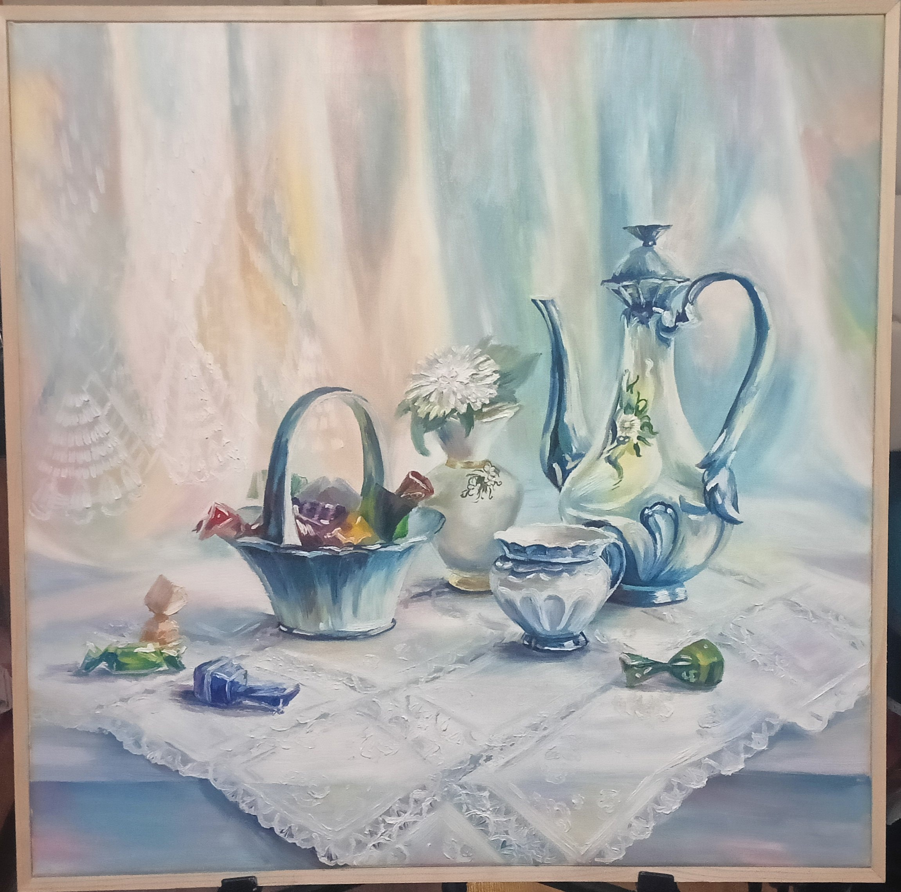

Натюрморт, 2023. Масло, 60×60 см

<https://vk.com/wall-224151515?own=1&z=photo-224151515_457239033%2Fwall-224151515_12>

Тип: Картина  
Жанр: Натюрморт

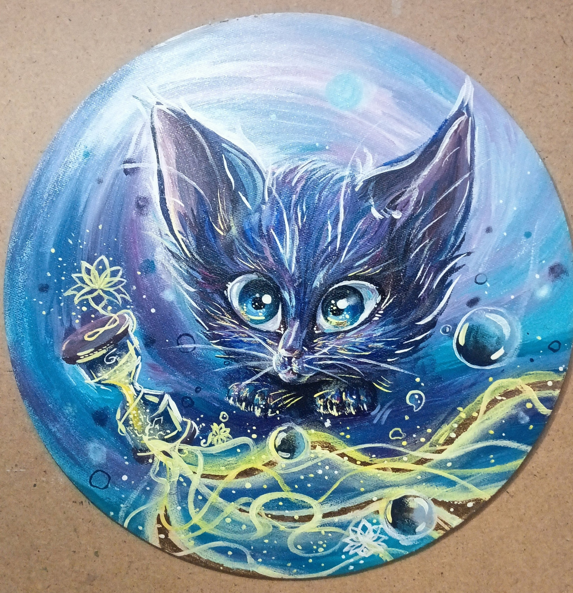

Любопытство, 2023. Акрил, поталь, 30х30 см

<https://vk.com/wall-224151515?own=1&z=photo-224151515_457239024%2F0a132d4b3efc49bbf2>

Тип: Картина  
Жанр: Анималистика

История  
- 2023: **Выставка**. Комментарий: Выставлялась в ArtSpaceDepo (не продавалась) 

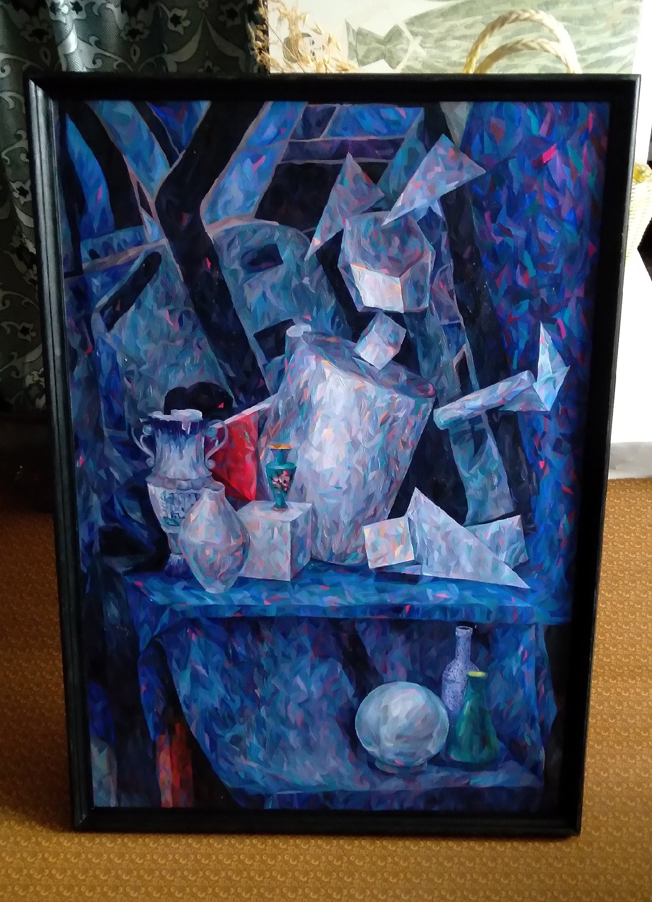

Зайчик, 2023. Акрил, 60×85 см

<https://vk.com/wall-224151515?own=1&z=photo-224151515_457239020%2F9e74b094cabe302e3b>

Тип: Картина

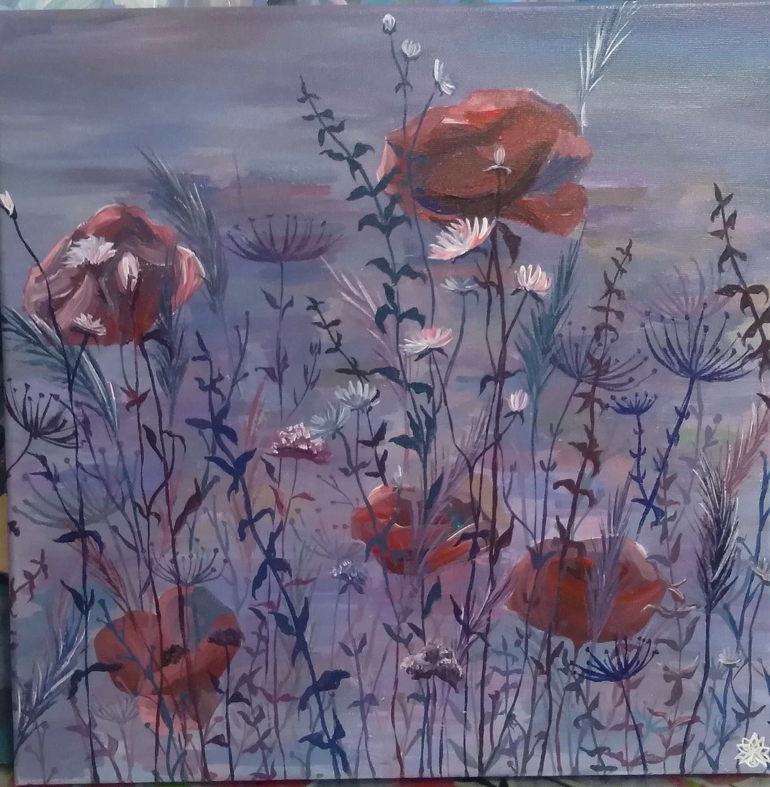

Сиреневые сумерки, 2023. Холст, акрил, 40×40 см

<https://vk.com/albums-218867577?z=photo-218867577_457239481%2Fphotos-218867577>

Тип: Картина

История  
- 2023: **Выставка**. Комментарий: Выставлялась в ArtSpaceDepo 

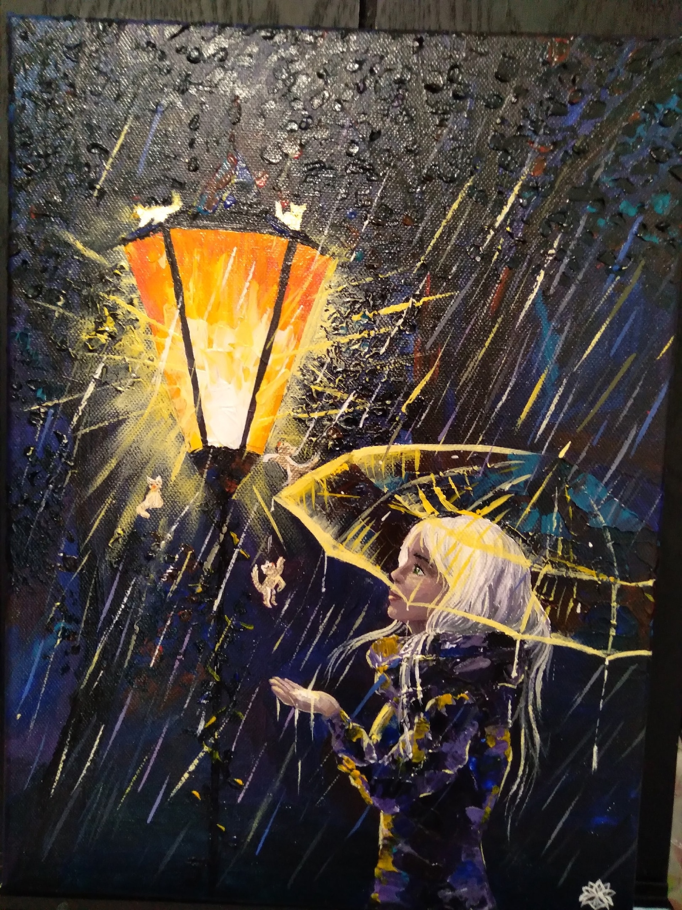

Фонарь желаний, 2023. Холст, акрил, 40×30 см

<https://vk.com/albums-218867577?z=photo-218867577_457239309%2Fphotos-218867577>

Тип: Картина

История  
- 2023: **Выставка**. Комментарий: Выставлялась в ArtSpaceDepo 

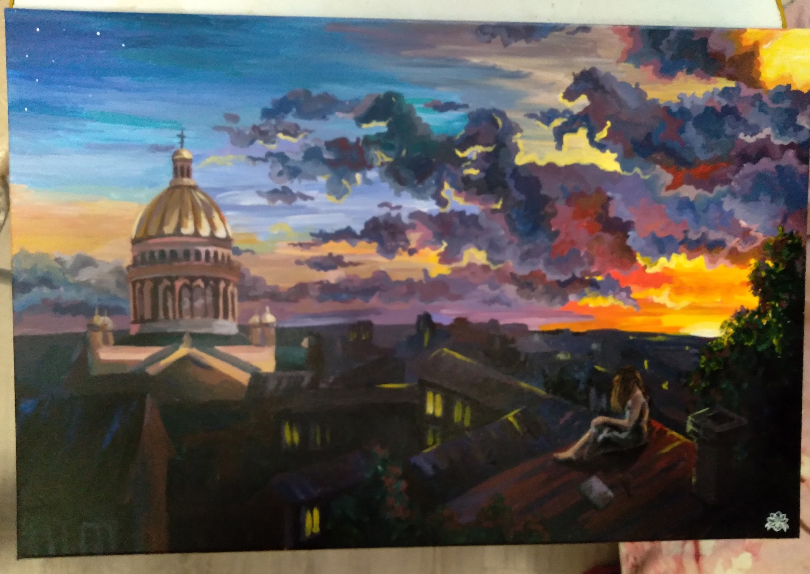

На закате, 2023. Холст, акрил, 40×60 см

<https://vk.com/albums-218867577?z=photo-218867577_457239306%2Fphotos-218867577>

Тип: Картина  
Жанр: Городской пейзаж

От составителя: Сюжет является уникальным; изображений звездного неба, соборов или закатных городских пейзажей с крышами в интернете навалом, а вот совмещающих все это одновременно найти не удалось. Изображенная постойка напоминает Исаакиевский Собор в Санкт-Петербурге, но окружение на картине не соответствует виду местности вокруг этого собора; он окружен пустым пространством площади, а не плотной застройкой домов с двускатными крышами. Созвездие в левом верхнем углу сложно сопоставить с каким-либо реальным созвездием, видимым на закате в восточной части неба. Похоже на фрагмент созвездия Геркулес, но его положение на небе несколько иное. Кроме того, на закате, когда солнце еще не скрылось за горизонтом, редко видны целые созвездия - обычно видны лишь наиболее яркие объекты, вроде Венеры или пояса Ориона. Поэтому изображение звездного неба здесь вряд ли реалистично. Зато жизненно переданы облака, заходящее солнце и внешний вид зданий. В некоторых облаках видятся силуэты лошадей, вряд ли это случайность. Сидящая на крыше героиня - видимо, художница; в лежащем рядом с нею листе угадывается этюд собора. Судя по цвету и длине волос, это может быть сама Виталина.

В целом работа представляется скорее "фантазией", чем реалистичной зарисовкой с натуры. В плане интерпретации, работа кажется близкой к картине "Странник над морем тумана" Каспара, основной темой можно назвать размышления о жизненном пути или "эстетское бегство от мира" (выражение Кирхмана о вышеупомянутой работе Каспара).

История  
- 2023: **Выставка**. Комментарий: Выставлялась в ArtSpaceDepo 
- 2023: **Конкурс** [Искусство реальности](https://vk.com/wall-4891369_7515). 

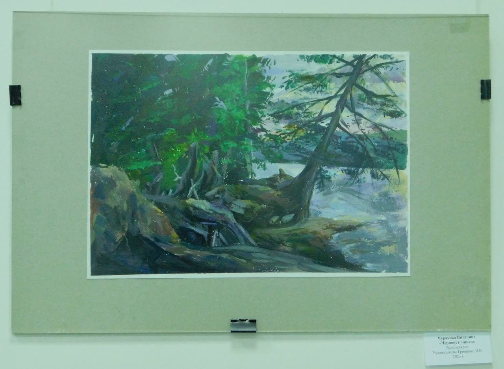

Черноисточинск, 2023. Бумага, акрил

<https://vk.com/wall-4891369_7853?z=photo-4891369_457261469%2Fwall-4891369_7853>

Тип: Картина  
Жанр: Пейзаж

История  
- 2023: **Выставка** [Выставка студенческих работ "60 мгновений лета"](https://vk.com/wall-4891369_7782). Место: ФХО НТГСПИ. 

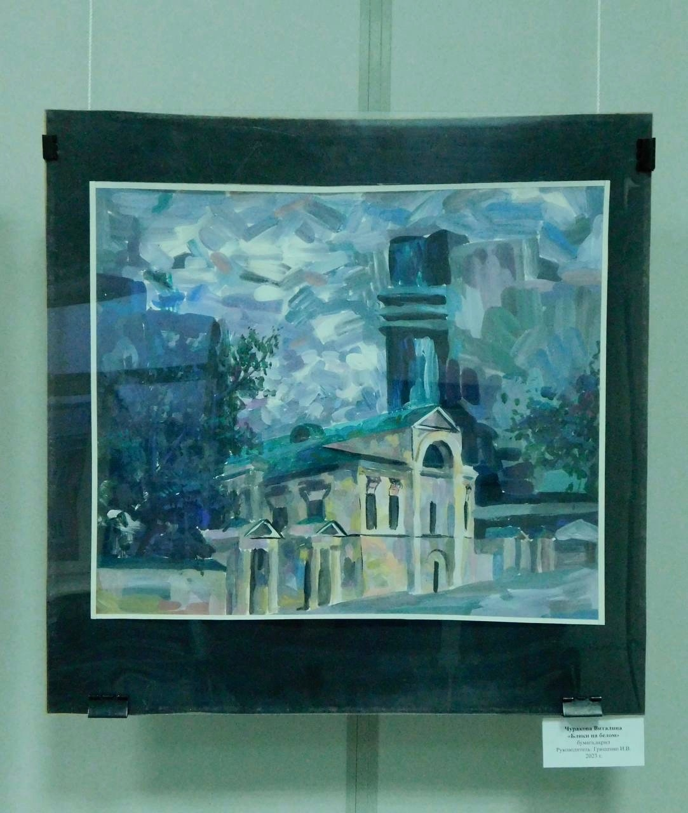

Блики на белом, 2023. Бумага, акрил

<https://vk.com/wall-4891369_7853?z=photo-4891369_457261472%2Fwall-4891369_7853>

Тип: Картина  
Жанр: Городской пейзаж

История  
- 2023: **Выставка** [Выставка студенческих работ "60 мгновений лета"](https://vk.com/wall-4891369_7782). Место: ФХО НТГСПИ. 

Череп в снегу, 2023. Холст, масло, 40×30 см

<https://vk.ru/wall-224151515_10>

Тип: Картина  
Жанр: Натюрморт

История  
- 2024: **Конкурс** [Искусство реальности](https://vk.com/wall-4891369_8045). 
- 2024: **Выставка** [Вдохновляйся! Действуй!](https://vk.ru/album79689262_00?z=photo79689262_457278789%2Falbum79689262_00%2Frev). Место: Дом художника. 

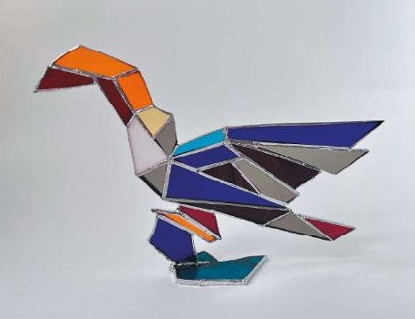

Тукан, 2023. Стекло

<https://disk.yandex.ru/i/VXklez3N33W_Sw>

Тип: Декоративное изделие

История  
- 2024: **Конкурс** [Искусство реальности](https://vk.com/wall-4891369_8045). Комментарий: Заняла 3 место на II всероссийском конкурсе учебно-творческих работ студентов "Искусство реальности" 

Вдохновение, 2022. Картон, акрил, 21×30 см

<https://vk.ru/photo-4891369_457257331>

Тип: Картина  
Жанр: Анималистика

Виталина: "Работа участвовала во многих выставках и конкурсах и до сих пор она остался одной из моих самых любимых картин"

От составителя: Сюжет является уникальным; хоть в интернете и есть похожие картины с кошкой и пузырями, но такой композиции со смотрящей вверх кошкой и бабочкой найти не удалось. Почему именно она у художницы является выражением вдохновения, неизвестно.

История  
- 2022: **Выставка** [Выставка студенческих работ ФХО](https://vk.com/photo-4891369_457257333). Место: Центральная библиотека г. Нижний Тагил. 
- 2023: **Выставка**. Комментарий: Выставлялась в ArtSpaceDepo, было продано 2 авторских повторения (оригинал не продавался) 

Gloriam mosaic, 2022. Бумага, акварель, 42×60 см

<https://vk.ru/wall-224151515_9>

Тип: Картина  
Жанр: Натюрморт

История  
- 2022: **Выставка** [Выставка студенческих работ ФХО](https://vk.ru/photo-4891369_457257329). Место: Центральная библиотека г. Нижний Тагил. 
- 2023: **Конкурс** [Искусство реальности](https://vk.com/wall-4891369_7515). 

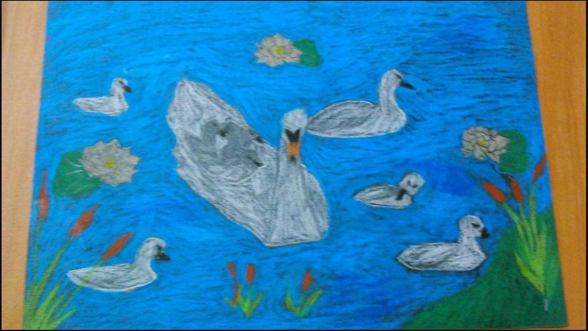

(Лебеди), 2017

<https://ok.ru/group/51975271874744/album/51975278362808/858835289016>

Жанр: Анималистика

История  
- 2017: **Выставка** [Красота природы](https://m.ok.ru/group/51975271874744/topic/67203250351032). Место: Художественная студия «Цветные сны», г. Нижний Тагил. 

[В начало](vitalina.md) [Предыдущая](vitalina.md) *Страница 2 из 2* 

## См. также

- [Черновик биографии](bio.md)

